# 10. MoveIt & Gazebo Simulation

<p id="anchor_10_1"></p>

## 10.1 Virtual Machine Configuration and File Import

### 10.1.1 Virtual Machine Installation and Import

* **Virtual Machine Software Installation**

**1. VMware Installation**

In simple terms, a virtual machine (VM) allows you to run another operating system within your current operating system. In this example, VMware Workstation is used for demonstration, and the installation steps are as follows:

(1) Extract the virtual machine software archive located at **Configuration Files -\> VMware**.

(2) Locate the extracted virtual machine folder, then double-click the virtual machine executable file with the .exe extension


(3) Follow the instructions below to complete the installation.


(4) If this is your first time starting the virtual machine, you need to enter a product key. Use any key from the **VMware16 Activation Key** file located in the virtual machine folder, then click **Continue**.


**2. VirtualBox Installation**

(1) Open the software installation package in the same directory and click **Next**.


(2) Modify the installation path as needed, then click **Next**.


(3) Leave the settings unchanged and click **Next**.


(4) Confirm the installation and click **Install** to begin.


(5) After the installation is complete, click "**Finish**."


* **Configuration Tasks**

The first startup of the virtual machine may take a longer time than usual, which is normal.

After starting the virtual machine, the interface will appear as shown below:


**1. Preparations**

(1) Power on the robot and click  to open a terminal on the desktop.

(2) Enter the following command to navigate to the corresponding directory.

```
cd ros2_ws
```

(3) Enter the following command to copy files to the target directory.

```
cp .typerc ~/shared
```

(4) Following the [10.1.3 Using the Transfer Tool](#anchor_10_1_3) tutorial in the same directory as this document, transfer the **.typerc** file to a directory on your computer.

**2. Importing Feature Packages**

(1) Start the virtual machine. Click the icon  to open the command-line terminal.

(2) Click **Home** on the desktop.

(3) Locate the **driver.zip, hiwonder_moveit_config.zip, robot_gazebo.zip**, and **landerpi_description.zip** archives in [Feature Package Files](https://drive.google.com/drive/folders/1mX8eoHW54l2WStXcokgtzwm6WoCi7inR?usp=sharing), along with the **.typerc** file previously transferred to your computer. Drag all these files into the Home directory of the virtual machine.

> [!NOTE]
>
> **Drag one file at a time.**

(4) Right-click in the "**Home**" directory and select "**Open in Terminal**" to launch the terminal.


(5) Enter the following command to create a directory.

```
mkdir -p ~/ros2_ws/src
```

(6) Enter the following commands in sequence to unzip and navigate to the source code directory, then move the **.typerc** file to this path:

```
unzip  ~/driver.zip -d ~/ros2_ws/src

unzip  ~/hiwonder_moveit_config.zip -d ~/ros2_ws/src

unzip  ~/robot_gazebo.zip -d ~/ros2_ws/src

unzip ~/landerpi_description.zip -d ~/ros2_ws/src
```

If the prompt below appears, type **A** and press **Enter**.


(7) Enter the following command to compile the feature package, then wait patiently.

```
cd ~/ros2_ws && colcon build --symlink-install
```

(8) Enter the command to replace the **.typerc** file.

```
mv /home/ubuntu/.typerc ~/ros2_ws/.typerc
```

(9) Enter the command below to check whether the file was moved successfully.

```
cd ~/ros2_ws/ && ls -a
```


(10) Modify the **.bashrc** file by entering the following command:

```
gedit ~/.bashrc
```

Copy and add the following content into the **.bashrc** file:

```
source /home/ubuntu/ros2_ws/.typerc

source /home/ubuntu/ros2_ws/install/setup.bash
```


11) After editing, save and exit by pressing **Ctrl + S** or by clicking the **Save**.


12) Enter the command below to reload the configuration file and update the settings.

```
source ~/.bashrc
```

**3. Network Configuration on Robot**

To ensure proper communication between the virtual machine and the robot for subsequent coordinated operations, we need to configure the device network first.

(1) Power on the robot and click to open a terminal on the desktop.

(2) Enter the following command to configure the Wi-Fi file:

```
cd ~/wifi_manager && gedit wifi_conf.py
```

(3) Change the configuration to LAN mode and enter the Wi-Fi name and password. You may need to prepare a Wi-Fi router or mobile hotspot for subsequent connections.

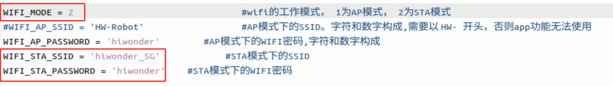

(4) Press **Ctrl + S** to save and close.

(5) For subsequent connections, ensure that the device and the virtual machine are on the same network segment. You can check this by entering the following command in the terminal:

```
ifconfig
```


As shown in the above figure, the virtual machine and the robot are both on the 192.168.11 network segment, allowing normal communication.

**The following are several common connection methods:**

(1) **Connection via router**: Connect both the computer and the Raspberry Pi board to the same router using Ethernet cables. (Recommended)

(2) **Connection via LAN**: Configure the STA LAN according to the tutorial, then connect both the robot and the computer to the same Wi-Fi network or mobile hotspot. (Recommended)

(3) **Direct connection**: Set the robot to AP mode for direct connection, then connect the computer to the robot's Wi-Fi. (Not recommended)

**4. Device ID Configuration in Virtual Machine**

In the previous section, the network environment has been configured. However, on the same network, the virtual machine and the robot must have matching ID numbers to communicate with each other. The following is the configuration method.

(1) Power on the robot and click 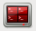to open a terminal on the desktop.

(2) The terminal will display the device's `DOMAIN_ID`, as shown in the figure below:


In this example, 23 is used to demonstrate the configuration of the virtual machine.

(3) Start the virtual machine. Click  to open the command-line terminal.。

(4) Enter the following command to open the configuration file:

```
gedit ~/ros2_ws/.typerc
```


(5) Change the ID shown in the figure below to `23`:


(6) Press **Ctrl + S** to save and close the file.

(7) Close the current terminal and open a new one. You should see that the ID has been changed to 23:


<p id="anchor_10_1_2"></p>

### 10.1.2 Remote File Transfer Tool Installation

* **Installing the WinSCP Remote Tool**

WinSCP is an open-source graphical SFTP client for Windows that uses SSH and also supports the SCP protocol. It is primarily designed to securely transfer files between a local and remote computer, and also allows direct file editing. The installation steps are as follows:

1)  First, double-click the installer "**WinSCP-5.15.3-Setup.exe**" located in the [05 File Transmitting Tool](https://drive.google.com/drive/folders/1IlUyU4vpAsuT-lCUE9aQ9RP48G6mWv0D?usp=sharing), and then click the **Accept** button.

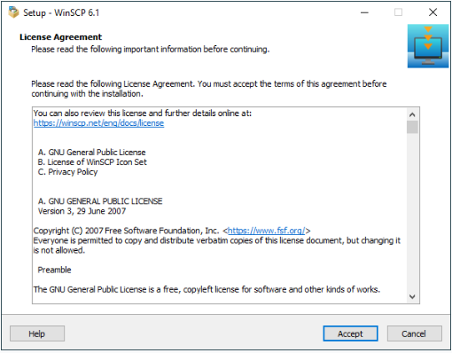

2)  Click the **Next** button.


3)  Click the **Next** button again.


4)  Keep the default installation location, and click the **Install** button.


5)  Wait a moment until the installation completes, then click the **Finish** button.


6)  The installation is complete, click the icon to open WinSCP.

<p id="anchor_10_1_3"></p>

### 10.1.3 Using the Transfer Tool

1. Following the instructions in [10.1.2 Remote File Transfer Tool Installation](#anchor_10_1_2), install and launch the WinSCP tool.

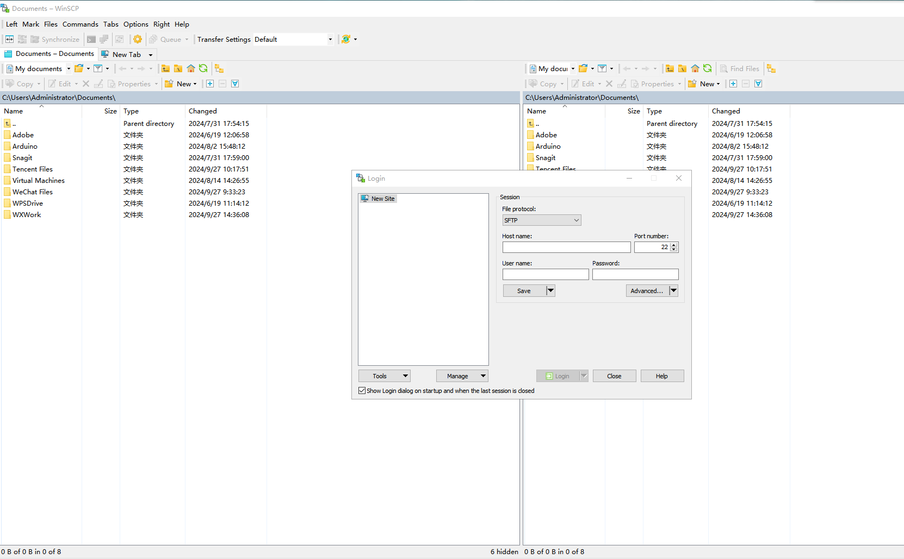

2. In direct connection mode, enter the Raspberry Pi's IP address (192.168.149.1), username (pi), and password (raspberrypi), then click **Login**.


3. In the pop-up window, click **Accept** to continue.


4. As shown below, the left pane displays the computer's directory, and the right pane displays the Raspberry Pi's home directory.


5. Select the folder **docker-\>tmp** to open the folder shared with **docker**.


6. You can drag target files from the computer directory on the left to the **tmp** directory on the right to transfer them. Similarly, files in the **tmp** directory can be dragged back to the computer directory for reverse transfer.


7. Close the WinSCP tool and use VNC to remotely connect to the Raspberry Pi. Open the red terminal , use the **cd** command to navigate to the correct directory

```
cd share
```

8. Use the `mv` command to move the target file to the desired directory.

<p id="anchor_10_2"></p>

## 10.2 Getting Started with URDF Model

### 10.2.1 Introduction and Getting Started with URDF Model

> [!NOTE]
>
> **This tutorial is based on configuration and simulation within a virtual machine. If the virtual machine is not yet installed, please first refer to the folder named 1 Virtual Machine Installation and Import to complete the installation.**

* **URDF Model Introduction**

URDF is a format based on the XML specification, designed for describing the structure of robots. Its purpose is to provide a robot description standard that is as general and widely applicable as possible.

Robots are typically composed of multiple links and joints. A link is defined as a rigid object with certain physical properties, while a joint connects two links and constrains their relative motion.

By connecting links with joints and imposing motion restrictions, a kinematic model is formed. The URDF file specifies the relationships between joints and links, their inertial properties, geometric characteristics, and collision models.

**1. Comparison between Xacro and URDF Model**

The URDF model serves as a description file for simple robot models, offering a clear and easily understandable structure. However, when it comes to describing complex robot structures, using URDF alone can result in lengthy and unclear descriptions.

To address this limitation, the xacro model extends the capabilities of URDF while maintaining its core features. The Xacro format provides a more advanced approach to describe robot structures. It greatly improves code reusability and helps avoid excessive description length.

For instance, when describing the two legs of a humanoid robot, the URDF model would require separate descriptions for each leg. On the other hand, the Xacro model allows for describing a single leg and reusing that description for the other leg, resulting in a more concise and efficient representation.

**2. Install URDF Dependency**

> [!NOTE]
>
> **The URDF and Xacro models are already pre-installed in the virtual machine, so there is no need for you to reinstall them. This section is for informational purposes only.**

(1) Run the following command and press Enter to update the package information:

```
sudo apt update
```


(2) Run the following command and press Enter to install the URDF dependencies:

```
sudo apt-get install ros-humble-urdf
```

When the output matches the image below, the installation is successful:


(3) Run the following command and press Enter to install the Xacro model extension for URDF:

```
sudo apt-get install ros-humble-xacro
```

When the output matches the image below, the installation is successful:


<p id="anchor_10_2_1_1_3"></p>

**3. URDF Model Basic Syntax**

**(1) XML Basic Syntax**

Since URDF models are written based on the XML specification, it is necessary to understand the basic structure of the XML format.

**Elements:**

An element can be defined as desired using the following formula:

**\<element\>**

**\</element\>**

**Properties:**

Properties are included within elements to define characteristics and parameters. Please refer to the following formula to define an element with properties:

**\<element property_1="property value1" property_2="property value2"\>**

**\</element\>**

**Comments:**

Comments have no impact on the definition of other properties and elements. Please use the following formula to define a comment:

\<**！** -- comment content --\>

**(2) Link**

The Link element describes the visual and physical properties of the robot's rigid component. The following tags are commonly used to define the motion of a link:


\<visual\>: Describe the appearance of the `link`, such as size, color and shape.

\<inertial\>: Describe the inertia parameters of the `link`, which will used in dynamics calculation.

\<collision\>: Describe the collision inertia property of the `link`.

Each tag contains the corresponding child tag. The functions of the tags are listed below.

| **Tag**  |                         **Function**                         |
| :------: | :----------------------------------------------------------: |
|  origin  | Describe the pose of the link. It contains two parameters, including xyz and rpy. xyz describes the pose of the link in the simulated map. rpy describes the pose of the link in the simulated map. |
|   mess   |                Describe the mass of the link.                |
| inertia  | Describe the inertia of the link. As the inertia matrix is symmetrical, these six parameters need to be input, `ixx`, `ixy`, `ixz`, `iyy`, `iyz` and `izz`, as properties. These parameters can be calculated. |
| geometry | Describe the shape of the link. It uses `mesh` parameter to load texture file, and employs `filename` parameters to load the path for texture file. It has three child tags, namely `box`, `cylinder` and `sphere`, representing rectangles, cylinders and spheres. |
| material | Describe the material of the link. The parameter `name` is the required filed. The tag `color` can be used to change the color and transparency of the link. |

**(3) Joint**

In a URDF model, joints are defined using the `joint` tag. They describe the kinematic and dynamic properties of the robot's joints, as well as constraints on motion such as position and velocity limits. According to the type of motion, joints in a URDF model can be categorized into six types:

| **Type and Explanation**                                     |  **Tag**   |
| ------------------------------------------------------------ | :--------: |
| Rotational joint: can rotate infinitely around a single axis | continuous |
| Rotational joint: similar to continuous, but with rotation angle limits |  revolute  |
| Prismatic joint: allows translation along an axis, with position limits | prismatic  |
| Planar joint: allows translation or rotation in orthogonal directions within a plane |   planar   |
| Floating joint: allows both translation and rotation         |  floating  |
| Fixed joint: a special joint that does not allow any motion  |   fixed    |

When defining joint behavior, the following tags are commonly used:


\<parent_link\>: Specifies the parent link.

\<child_link\>: Specifies the child link.

\<calibration\>: Used to calibrate the joint angle.

\<dynamics\>: Describes certain physical properties of the motion.

\<limit\>: Defines motion constraints.

Each tag contains the corresponding child tag. The functions of the tags are listed below.

|      **Tag**      |                         **Function**                         |
| :---------------: | :----------------------------------------------------------: |
|      origin       | Describes the pose of the parent link. It contains two parameters, including xyz and rpy. xyz describes the pose of the link in the simulated map. rpy describes the pose of the link in the simulated map. |
|       axis        | Specifies the axis of rotation or translation along the parent link's X, Y, or Z axis. |
|       limit       | Defines motion constraints for the child link. lower and upper attributes specify the range of motion in radians for revolute joints, while the effort attribute specifies the force/torque limit during motion, with both positive and negative values measured in newtons (N). The velocity attribute limits the rotational speed, measured in meters per second (m/s). |
|       mimic       | Indicates that this joint's motion is dependent on another joint. |
| safety_controller | Defines safety parameters that protect the joint from exceeding safe motion limits. |

**(4) robot Tag**

The complete top tags of a robot, including the \<link\> and \<joint\> tags, must be enclosed within the \<robot\> tag. The format is as follows:


**(5) gazebo Tag**

This tag is used in conjunction with the Gazebo simulator. Within this tag, you can define simulation parameters and import Gazebo plugins, as well as specify Gazebo's physical properties, and more.


**(6) Write Simple URDF Model**

**Name the model of the robot**

To start writing the URDF model, we need to set the name of the robot following this format: "\<robot name="robot model name"\>". Lastly, input "\</robot\>" at the end to represent that the model is written successfully.


**Set links**

① To write the first link and use indentation to indicate that it is part of the currently set model. Set the name of the link using the following format: \<link name="link name"\>. Finally, conclude with "\</link\>" to indicate the successful completion of the link definition.

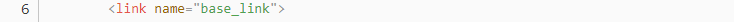


② When writing the link description, use indentation to indicate that the description belongs to the current link. Start the description with \<visual\> and end it with \</visual\>.

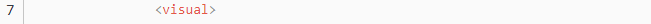


③ The "\<geometry\>" tag is employed to define the shape of a link. Once the description is complete, include "\</geometry\>". Within the "\<geometry\>" tag, indentation is used to specify the detailed description of the link's shape. The following example demonstrates a link with a cylindrical shape: "\<cylinder length="0.01" radius="0.2"/\>". In this instance, "length="0.01" signifies a length of 0.01 meters for the link, while "radius="0.2" denotes a radius of 0.2 meters, resulting in a cylindrical shape.


④ The "\<origin\>" tag is utilized to specify the position of a link, with indentation used to indicate the detailed description of the link's position. The following example demonstrates the position of a link: "\<origin rpy="0 0 0" xyz="0 0 0" /\>". In this example, "rpy" represents the angles of the link, while "xyz" represents the coordinates of the link's position. This particular example indicates that the link is positioned at the origin of the coordinate system.

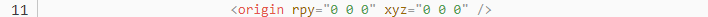

⑤ The "\<material\>" tag is used to define the visual appearance of a link, with indentation used to specify the detailed description of the link's color. To start describing the color, include "\<material\>", and end with "\</material\>" when the description is complete. The following example demonstrates setting a link color to yellow: "\<color rgba="1 1 0 1" /\>". In this example, "rgba="1 1 0 1"" represents the color threshold for achieving a yellow color.


**Set Joint**

① To write the first joint, use indentation to indicate that the joint belongs to the current model being set. Then, specify the name and type of the joint as follows: "\<joint name="joint name" type="joint type"\>". Finally, include "\</joint\>" to indicate the completion of the joint definition.

> [!NOTE]
>
> **To learn about the type of the joint, please refer to the section "Joint" in this document.**

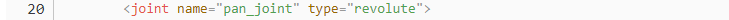


② Write the description section for the connection between the link and the joint. Use indentation to indicate that it is part of the currently defined joint. The parent parameter and child parameter should be set using the following format: "\<parent link="parent link"/\>", and "\<child link="child link" /\>". With the parent link serving as the pivot, the joint rotates the child link.


③ "\<origin\>" describes the position of the joint, with indentation used to specify the detailed coordinates of the joint. The image below describes the position of the joint: "\<origin xyz="0 0 0.1" /\>". xyz is the coordinate of the joint, indicating that the joint is located at x=0, y=0, z=0.1 in the coordinate system.

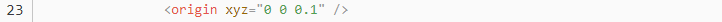

④ "\<axis\>" describes the orientation of the joint, with indentation used to specify its precise posture. The figure below shows the posture of a joint \<axis xyz="0 0 1" /\>, where xyz defines the orientation of the joint.

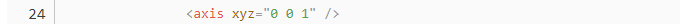

⑤ \<limit\> is used to restrict joint motion, with indentation applied to specify detailed angle constraints. The figure below shows a joint whose maximum torque does not exceed 300 N, with an upper rotation limit of 3.14 radians and a lower limit of -3.14 radians. These limits are defined according to the following formula: effort = joint torque (N), velocity = joint speed, lower = lower bound of the rotation angle (radians), upper = upper bound of the rotation angle (radians).


⑥ \<dynamics\> describes the dynamic properties of the joint, with indentation used to specify detailed motion parameters. The figure below shows an example of a joint's dynamics parameters: \<dynamics damping="50" friction="1" /\>  
where damping specifies the damping value, and friction specifies the friction coefficient.


**The complete code is shown as follows:**


### 10.2.2 ROS Robot URDF Model Instructions

* **Preparation**

To understand the URDF model, you can refer to the [3. URDF Model Basic Syntax](#anchor_10_2_1_1_3). This section provides a brief analysis of the robot model code and component models.

* **Viewing the Robot Model Code**

1. Launch the virtual machine,

2. Click the terminal icon  in the left of system desktop to open a command-line window.

3. Enter the following command and press Enter to go to the startup program directory.

```
cd ros2_ws/src/landerpi_description/urdf/
```

4. Enter the following command to open the robot simulation model file.

```
vim landerpi.xacro
```

5)  Find the code section shown in the image below:


Multiple URDF models are called to form the complete robot.

|  **File Name**  |    **Device**    |
| :-------------: | :--------------: |
| inertial_matrix | Inertial matrix  |
|     mecanum     | Mecanum chassis  |
|      tank       |   Tank chassis   |
|       ack       | Ackerman chassis |
|       arm       |    Robot arm     |
|     gripper     |     Gripper      |

* **Brief Analysis of the Robot's Main Model**

The LanderPi robot supports three types of chassis configurations: Mecanum chassis, Tank chassis, and Ackerman chassis. In this section, we'll use the Mecanum chassis as an example. The Ackerman and Tank chassis share most of the same model files, with their differences explained later in this document.

Open a new command line, and enter the command to load the robot model file, which contains descriptions of the various components of the robot model.

```
vim mecanum.xacro
```

This is the beginning of the URDF file. It specifies the XML version and encoding, and defines a robot model named **mecanum**. The `xmlns:xacro` namespace is used here to enable the use of Xacro macros for generating the URDF.

This line of code defines a Xacro property named `mesh_dir`, which specifies the directory where the 3D mesh files used in the robot model are stored.


Within the file, you'll find a link definition named `base_footprint`, which represents the robot's chassis.


The following code defines key reference links and fixed joints in the robot model. First, \<link name="base_footprint"/\> creates a link named `base_footprint`.

Next, \<joint name="base_footprint_to_base_link" type="fixed"\> defines a fixed joint named `base_footprint_to_base_link`, which uses `base_footprint` as the parent link and `base_link` as the child link.

The pose of base_link relative to base_footprint is specified by \<origin xyz="0 0 0.054" rpy="0 0 0"/\>, which places base_link 0.054 meters directly above base_footprint with no rotation.


The following code is an XML fragment that defines a link in the robot model. Let us break down and analyze its structure and purpose.


The code begins with a \<link\> tag, which defines a link in the robot model. The name of this link is "base_link". Inside the \<link\> tag, there are three main components: \<inertial\>, \<visual\>, and \<collision\>.

\<inertial\> section defines the inertial properties of the link, such as mass and inertia. The \<origin\> tag specifies the position and orientation of the inertial frame relative to the link frame. The \<mass\> tag defines the mass of the link, while the \<inertia\> tag specifies the inertia matrix of the link around its principal axes.

\<visual\> section defines the visual representation of the link. The \<origin\> tag specifies the position and orientation of the visual frame relative to the link frame. The \<geometry\> tag defines the shape of the visual representation, which in this case is a mesh. The \<mesh\> tag specifies the file name of the mesh used to represent the visual appearance of the link. Finally, the \<material\> tag defines the color or texture of the visual representation. In this example, a material named "**green**" is used.

The \<collision\> section defines the collision properties of the link. It is similar to the \<visual\> section, but it is used for collision detection rather than visualization. This section contains \<origin\> and \<geometry\> tags that specify the position, orientation, and shape of the collision representation.

Overall, this code snippet defines a link in the robot model, including its inertial properties, visual representation, and collision properties. In simulation or visualization environments, the mesh files specified in the \<visual\> and \<collision\> sections are used for rendering the link and detecting collisions.

Next section shows the link description.


The code above describes a link named "**back_shell_middle_link**". The link includes information about inertial, visual, and collision properties.

Inertial (\<inertial\>): Describes the mass and inertia matrix of the link. The mass is 0.0327390228163219, and the inertia matrix has specific values for each component.

Visual (\<visual\>): Describes the appearance of the link. The visual representation is defined by a 3D mesh with the file name "**back_shell_middle_link.STL**".

Collision (\<collision\>): Describes the collision shape of the link. The collision shape is also defined by a 3D mesh, using the same file as in the visual section.


The code above is an XML fragment used to define a joint and a link in a robot model. Joint Definition

Name: back_shell_middle_joint

Type: fixed, indicating a fixed joint.

Origin: Specifies the position and orientation of the joint relative to the parent link base_link.

Parent Link: Specifies the parent link of the joint.

Child Link: Specifies the child link of the joint.

Axis: Specifies the rotation axis of the joint. In this case, the axis is set to (0, 0, 0), indicating a fixed joint that does not rotate.

Link Definition

Name: back_shell_middle_link

Inertial: Specifies the inertial properties of the link, including mass, center of mass, and inertia matrix.

Visual: Specifies the visual representation of the link, including its position, orientation, geometry (mesh), and material.

Collision: Specifies the collision properties of the link, including its position, orientation, and geometry (mesh).


The link defined in the code above is named: `back_shell_black_link`

Inertial: Specifies the inertial properties of the link, including mass, center of mass, and inertia matrix.

Visual: Specifies the visual representation of the link, including its position, orientation, geometry (mesh), and material.

Collision: Specifies the collision properties of the link, including its position, orientation, and geometry (mesh).

Specifically, the inertial properties \<inertial\> define the mass and inertia matrix of the link. In this example, the link has a mass of 0.0362085392306972, and each component of the inertia matrix, including ixx, ixy, ixz, iyy, iyz, and izz, is assigned a specific value.

Visual Properties (\<visual\>): Define the visual representation of the link. In this case, the link uses a mesh file named **back_shell_black_link.STL** for its appearance.

Collision Properties (\<collision\>): Define the collision characteristics of the link. The collision properties are the same as the visual representation, using the same mesh.


The description above refers to a link named wheel_left_front_link, which includes inertial, visual, and collision properties. The link's geometry is represented by a mesh file.

1. name="wheel_left_front_link": Specifies the name of the link.

2. \<inertial\>: Defines the inertial properties, including mass and inertia matrix.

3. \<origin\> (inertial): Specifies the position and rotation of the link's inertial frame. In this example, the xyz coordinates are 3.88969803044453E-05 -0.00231155374534464 3.49803495641177E-05 and the rpy rotation angles are 0 0 0.

4. \<mass\>: Defines the mass of the link, specifically 0.0379481315569691.

5. \<inertia\>: Defines the components of the inertia matrix, including ixx,ixy, ixz, iyy, iyz, and izz.

6. \<visual\>: Defines the visual properties of the link, including appearance and material.

7. \<origin\> (visual): Specifies the position and rotation of the visual frame. In this case, xyz coordinates are 0 0 0 and rpy rotation angles are 0 0 0.

8. \<geometry\>: Defines the geometry of the link, which in this case is represented by a mesh file.

9. \<mesh\>: Specifies the mesh file used for the link's geometry, specifically "**wheel_left_front_link.STL**".


The following code also describes a joint. The name of this joint is "**wheel_left_front_joint**".

\<joint\> is the opening tag for a joint element. `name="wheel_left_front_join`t"

`type="continuous"`: Indicates that this is a continuous joint, meaning it can rotate indefinitely.

\<origin\>: Defines the origin of the joint, including its position and orientation.

`xyz="0.066774 0.073754 -0.021099"`: The position of the joint origin in 3D space.

`rpy="0 0 0"`: Specifies the orientation of the joint origin using Euler angles, where roll, pitch, and yaw are all set to 0.

\<parent\>: The opening tag for the parent link element, used to specify the parent link of the joint.

link="base_link": Specifies that the parent link of this joint is "base_link".

\<child\>: The opening tag for the child link element, used to specify the child link of the joint.

`link="wheel_left_front_link":`

The child link of this joint is "**wheel_left_front_link**".

\<axis\>: The opening tag for the axis element, used to define the rotation axis of the joint.

`xyz="0 1 0"`: Specifies that the rotation axis of the joint is (0, 1, 0).

\</joint\>: The closing tag of the joint element.

## 10.3 MoveIt2 Simulation

### 10.3.1 MoveIt2 Kinematics Design

* **Kinematics Introduction**

Kinematics is a branch of mechanics that describes and studies the changes in the position of an object over time from a geometric perspective, without involving the physical properties of the object or the forces applied to it. In robotics, forward kinematics and inverse kinematics are two methods used to solve the motion of robots.

Forward Kinematics involves determining the position and orientation of the end effector by knowing the values of the joint variables. In other words, it calculates the final position and orientation of the robot based on the angles of the servos.

Inverse Kinematics involves determining the required joint variables to achieve a desired position and orientation of the end effector. In this case, it calculates the angles that the servos need to rotate to achieve the final position and orientation of the robot.

* **Inverse Kinematics Analysis**

**1. Geometry**

For a robotic arm, inverse kinematics involves determining the rotation angles of each joint given the position and orientation of the gripper. The three-dimensional motion of a robotic arm can be quite complex. To simplify the model, we eliminate the rotation joint at the base, allowing us to perform kinematic analysis in a two-dimensional plane.

Inverse kinematic analysis typically involves extensive matrix computations, and the process is complex with significant computational requirements, making implementation challenging. To better suit our needs, we use a geometric approach to analyze the robotic arm.


We simplify the model of the robotic arm by removing the base pan-tilt and the end effector, focusing on the main body of the arm. From the diagram, we can see the coordinates (x, y) of the endpoint P of the robotic arm. Ultimately, it is composed of three parts (x1 + x2 + x3, y1 + y2 + y3).

In the diagram, θ1, θ2, and θ3 are the angles of the servos that we need to solve, and α is the angle between the gripper and the horizontal plane. From the diagram, it's evident that the top-down angle of the gripper α = θ1 + θ2 + θ3. Based on this observation, we can formulate the following equation:


The values of x and y are provided by the user, while l1, l2, and l3 represent the inherent mechanical properties of the robotic arm's structure.

For ease of calculation, we will preprocess the known components for a holistic consideration:


Substituting m and n into the existing equation and simplifying further, we can obtain:


Through calculation, we have:


We observe that the above expression is the quadratic formula for a single variable, where:


With this information, we can determine the angles θ1 and, similarly, calculate θ2. Consequently, we can determine the angles for all three servos. By controlling the servos based on these angles, we can achieve control over the coordinate position.

**2. DH Modeling**

**(1) Introduction**

The DH Parameter Table (Denavit-Hartenberg Parameter Table) is a standardized method used to describe the relative position and orientation of robotic arm joints and links. It uses four parameters to represent the relationship between each pair of adjacent joints. These four DH parameters have very clear physical meanings, as described below:

① Link Length: The length of the common normal between the axes of two adjacent joints, the rotation axis for rotational joints, and the translation axis for prismatic joints.

② Link Twist: The angle by which the axis of one joint is rotated around the common normal relative to the axis of the adjacent joint.

③ Link Offset: The distance along the axis of a joint between the common normal of the current joint and the common normal of the next joint.

④ Joint Angle: The angle of rotation around the joint axis between the common normal of the current joint and the common normal of the next joint.

While these definitions might seem complex, they become much clearer when viewed in the context of coordinate systems.

First, you should focus on the two most important "lines": - The axis of a joint (axis). - The common normal between the axis of one joint and the axis of the adjacent joint.

In the DH parameter system, we define the axis as the z-axis, and the common normal as the x-axis, where the direction of the x-axis is from the current joint to the next joint.

However, these two rules alone are not enough to fully determine the coordinate system of each joint. Let's now go over the detailed steps for determining the coordinate system.

In applications such as robotic arm simulations, we may use other methods to establish coordinate systems. However, understanding the method described here is crucial for grasping the mathematical expressions of robotic arms and for understanding the subsequent analyses.

The diagram below shows two typical robot joints. Although these joints and links may not resemble any specific joints or links from real robots, they are quite common and can easily represent any joint in a real robot.


**(2) Determine Coordinate System**

There are generally several steps involved in determining the coordinate system:

To model a robot using the DH notation, the first step is to assign a reference coordinate system to each joint. For each joint, both the Z-axis and the X-axis must be specified.

Defining the Z-axis: For a rotational joint, the Z-axis is aligned with the direction of rotation according to the right-hand rule. The joint variable is the rotation angle around the Z-axis. For a prismatic joint (sliding joint), the Z-axis aligns with the direction of linear motion. The link length d along the Z-axis is the joint variable.

Defining the X-axis: When two joints are neither parallel nor intersecting, the Z-axes are usually skew lines, but there always exists a common perpendicular that is the shortest distance between them. This perpendicular is orthogonal to both skew lines. Define the local reference frame's X-axis along the direction of the common perpendicular. If a n represents the common normal between the Z-axes of joint n and joint n+1, then the direction of the X-axis,  Xn, will be along an.

Special Cases: When the Z-axes of two joints are parallel, there are infinitely many common normal lines. In this case, one can choose the common normal that is collinear with the common normal of the previous joint, simplifying the model. When the Z-axes of two joints intersect, there is no common normal. In this case, the X-axis can be defined along the line perpendicular to the plane formed by the two axes, simplifying the model.

Once the coordinate system is assigned to each joint, the model can be represented as shown in the diagram below:


After determining the coordinate system, we can represent the four parameters more simply:

Link Length l<sub>i</sub>: Defined as the distance along the positive X<sub>i - 1</sub> axis from Z<sub>i - 1</sub> axis to Z<sub>i</sub> axis.

Link Twist α<sub>i</sub>: Defined as the angle of rotation along the positive direction X<sub>i - 1</sub> using the left-hand or right-hand rule between Z<sub>i - 1</sub> axis and Z<sub>i</sub> axis.

Joint distance d<sub>i</sub>: Defined as the distance measured along the positive direction of Z<sub>i - 1</sub>, from the X<sub>i - 1</sub> axis to the X<sub>i</sub> axis.

Joint angle θ<sub>i</sub>: Defined as the rotation angle measured around the positive direction of Z<sub>i - 1</sub>, from the X<sub>i - 1</sub> axis to the X<sub>i</sub> axis.

**(3) Base Coordinate Frame**

The base coordinate frame is located at the base of the robotic arm. In the diagram below, the origin is at the bottom servo, with the green axis representing X, the red axis representing Y, and the blue axis representing Z.


**(4) Joint Coordinate Frames**

The robot arm consists of two main components: rotary joints and links. In the diagram of the arm model below, each joint's coordinate frame is shown. The origin is represented by the pink cone, with the green axis as X, the red axis as Y, and the blue axis as Z.


**(5) Tool Coordinate Frame**

Tools can be attached to the end of the robot arm to perform different tasks. The default tool for the arm is the gripper. In the diagram of the arm model, the tool coordinate frame of the gripper has its origin at the pink cone, with the green axis as X, the red axis as Y, and the blue axis as Z.


> [!NOTE]
>
> **This tutorial uses a virtual machine as an example for configuration and learning. If the virtual machine is not yet installed, please follow the instructions in the [10.1 Virtual Machine Configuration and File Import](#anchor_10_1) to install it before proceeding with the tutorial.**

### 10.3.2 MoveIt2 Configuration

* **MoveIt2 Introduction**

MoveIt2 is an open-source robotic motion planning framework specifically designed for ROS 2. It enables complex motion control and path planning for robots and serves as the ROS 2 version of MoveIt, a highly popular motion planning framework in ROS.

Compared to MoveIt1, MoveIt2 offers enhanced support for real-time control, thanks to improvements in ROS 2. These advancements allow for more precise and reliable robot motion control. By adopting DDS (Data Distribution Service) as its communication middleware, ROS 2 enables MoveIt2 to achieve more flexible and efficient data transmission.

MoveIt2 provides a user-friendly platform for developing advanced robotic applications, evaluating new robot designs, and integrating robotic solutions into various architectures. It is widely applied across industries, commercial ventures, research, and other fields, making it one of the most popular open-source robotic software solutions available today.

Additionally, MoveIt2 offers a suite of robust plugins and tools for the quick configuration of robotic arm control. It also provides a wealth of APIs, enabling users to easily perform secondary development on MoveIt2 modules and create innovative applications.

* **Launch Configuration Program**

> [!NOTE]
>
> **When entering commands, be sure to use correct case and spacing. You can use the Tab key to auto-complete keywords.**

1. Launch the virtual machine. Click the terminal icon  in the system desktop to open a command-line window.

2. Entering the following command to launch the MoveIt2 configuration tool.

```
ros2 launch moveit_setup_assistant setup_assistant.launch.py
```

3. Click **Edit Existing MoveIt2 Configuration Package** to begin editing an existing configuration package.


4. Click **Browse** and navigate to the following directory: **home/ubuntu/ros2_ws/src/hiwonder_moveIt_config**, then select the folder and click **Open**.


5. Click **Load Files** and wait for the files to load.


Once the progress reaches 100%, the robot model will appear on the right side, indicating a successful load.


6. Adjust settings for options such as **Virtual Joints** and **Robot Pose** in the left-hand menu.

> [!NOTE]
>
> **Reconfiguring will overwrite previous settings. Errors during this process may result in functionality issues.**

* **Configuration Introduction**

**1. Self-Collisions**

Generate a custom collision matrix. The default collision matrix generator scans all joints of the robot. This custom collision matrix can safely disable specific collision checks, thereby reducing the processing time for motion planning.

Sampling density refers to the number of random joint configurations sampled to check for collisions. Higher density increases computation time. The default value is 10,000 collision checks.


**2. Virtual joints**

Add virtual joints, which are primarily used to connect the robot to a simulation environment. In this step, a virtual joint is defined to link the **base_footprint** frame to the **world_frame**.


**3. Planning Groups**

Add joint groups, which are used to define the various joint components required to assemble the robot.


**4. Robot Poses**

Define robot pose and custom pose names for the robot and specify the joint groups involved in achieving each pose.


**5. Passive Joints**

Define unused joints, specify which joints are available and which are disabled.


**6. ROS2 Controllers**

Using the ROS2 Controllers panel, you can add simulated controllers for the joints. This enables MoveIt2 to simulate the motion of the robotic arm.


**7. ros2_control URDF Modifications**

Configure the URDF file required for the simulation.


**8. Author Information**

Provide the author's details.


**9. Configuration Files**

The factory settings are already configured, so **no reconfiguration is required**. If reconfiguration is needed, be sure to save a copy of the original program and compare it before making any modifications.

Generate configuration files, after confirming the file path, click **Generate Package** to generate the configuration package.


### 10.3.3 MoveIt2 Control

In this section, MoveIt2 will be used to plan the path and control the simulation model and robotic arm to move along the path to the specified position.

* **Start MoveIt2 Tool**

1. Start a new command-line terminal, and run the following command to launch the MoveIt2 tool.

   ```
   ros2 launch hiwonder_moveit_config demo.launch.py
   ```

The program interface is shown in the image below:

Position 1: RViz Toolbar. Position 2: MoveIt Debugging Area. Position 3: Simulation Model Adjustment Area.


* **Control Instructions**

1. In the MoveIt2 Debugging Area, find and click the **Planning** section.

   

2. In the Simulation Model Adjustment Area, you will see arrows in red, green, and blue colors. Click and drag the arrows to adjust the robotic arm's pose. In the robot's first-person view: Green represents the X-axis, with the positive direction pointing to the robot's left. Red represents the Y-axis, with the positive direction pointing to the robot's front. Blue represents the Z-axis, with the positive direction pointing upwards from the robot.

   

3. Besides adjusting the pose using the arrows, you can also adjust individual joints directly. Click the triangle icon on the right, then locate and open the **Joints** panel.

   

4. Drag the sliders for the corresponding joints to adjust their angles individually.

   

5. After successfully planning the robotic arm's motion path, the new position will be highlighted in orange. If the new position causes a collision with other parts of the robot, it will be marked in red. You must adjust the configuration to avoid collisions. Otherwise, the motion cannot be executed.

   Orange Executable State is shown in the following image.

   

For example, if the robotic arm is planned to be in the position shown in the image, it will collide with the depth camera. Turn the state red to non-executable, as shown in the figure below:


6. After planning the path, return to the **Planning** section and click the **Plan** option. The simulation model will display the motion path from the original position to the newly planned position.

   

7. Then, click the **Execute** option to make both the simulation model and robotic arm follow the planned motion path.

   

   

8. Alternatively, you can click **Plan & Execute**, where the robotic arm will first display the new planned motion path and then execute the movement.


9)  To exit the feature, press **Ctrl+C** in the terminal. If the program does not close successfully, try pressing **Ctrl + C** again.


### 10.3.4 MoveIt2 Random Movement

In this section, MoveIt2 will be used to plan a path and control the simulation model and the real robotic arm to move to random positions.

* **Start MoveIt2 Tool**

1. On the virtual machine, click the desktop icon  to open a terminal.

2. Enter the command to launch MoveIt2 tool.

   ```
   ros2 launch hiwonder_moveit_config demo.launch.py
   ```

The program interface is shown in the image below:

Position 1: RViz Toolbar. Position 2: MoveIt Debugging Area. Position 3: Simulation Model Adjustment Area.


* **Control Instructions**

1. In the MoveIt2 Debugging Area, find and click the **Planning** section.

   

2. In the simulation model adjustment area, there are arrows in red, green, and blue colors. In the robot's first-person view: Green represents the X-axis, with the positive direction pointing to the robot's left. Red represents the Y-axis, with the positive direction pointing to the robot's front. Blue represents the Z-axis, with the positive direction pointing upwards from the robot.

   

3. In the **Query** category, click the dropdown menu under **Planning Group** and select the joint group, which is also servo group, you wish to control. For example, the default selection is the **arm** group.

   

4. Click the dropdown menu under **Goal State** and choose the desired target position.

   

5. The parameter list in the dropdown menu is as follows:

   

   The description of the parameters are as follows:

   **random valid**: A valid random position where no collisions will occur.

   **random**: A random position that may potentially result in a collision.

   **current**: The current position.

   **same as start**: The same as the starting position.

   **previous**: The previous target position.

   The positions **home** and **p1** are the default preset positions in the program.

6. To avoid the possibility of collisions, select **random valid** to randomly generate a valid target position. Each time you click this option, a new target position will be randomly generated and displayed in the simulation model.

   

7. Click **Plan & Execute**, and both the simulation model and robotic arm will perform the motion simultaneously. The simulation model will show the newly planned movement path, and the robotic arm will execute the motion.

   

8. To exit the feature, press **Ctrl + C** in the terminal. If the program does not close successfully, try pressing **Ctrl + C** again.

   

### 10.3.5 MoveIt2 Cartesian Path

* **Overview of MoveIt2 Cartesian Path**

Cartesian path planning is a method of trajectory planning where the robot's end effector moves within Cartesian space.

In MoveIt2, Cartesian path planning allows you to specify the starting and target positions of the robot's end effector, and generates a smooth path for the end effector to move from the starting position to the target position.

**1. Cartesian Coordinate System**

The Cartesian coordinate system is a general term for both orthogonal and skewed coordinate systems. It consists of two axes intersecting at the origin, forming a planar affine coordinate system. If the measurement units along both axes are equal, it is called a Cartesian coordinate system. If the two axes are perpendicular to each other, it is known as a Cartesian orthogonal coordinate system. Otherwise, it is called a Cartesian skew coordinate system.

In most cases when describing spatial position, velocity, and acceleration, we use the Cartesian coordinate system. When referring to rotations around an axis, the positive direction is determined by the right-hand rule, as shown in the diagram below:


**2. Cartesian Path Analysis**

Cartesian path planning can be divided into point-to-point Cartesian path planning and continuous Cartesian path planning based on the nature of the path. This involves predefining the robot's target points or target paths and using kinematic calculations to determine the joint-level trajectory, allowing the robot to follow the desired path.

In joint space, the space composed of all joint vectors, the movement of the robot's axes is controlled individually. Each axis moves independently through interpolation, without affecting the other axes. The trajectory between two points taken by the robot's end effector is an arbitrary curve.

However, in some cases, the shape of the end effector's trajectory needs to be a straight line or arc, for example. In these cases, Cartesian path planning is used to add constraints on the shape of the trajectory.

> [!NOTE]
>
> **Before starting, make sure there is enough space around the robot. Keep a safe distance during operation to prevent the robotic arm from colliding with your body and causing injury.**

This section will add Cartesian path constraints to the path planning, restricting both the simulation model and the real robotic arm to perform linear motion.

**3. Cartesian Path Planning Steps**

(1) Set Up the Motion Group: First, specify the motion group in MoveIt2. A motion group is a set of robot joints used to define the robot's degrees of freedom and controllable parts. By defining the motion group, you can limit the degrees of freedom in the planning process, allowing for better control over the robot's movement.

(2) Set Path Constraints (Optional): If you need to constrain the robot's motion path, such as keeping a specific joint's orientation fixed, you can set path constraints. These constraints ensure that certain conditions are met during the planning process.

(3) Specify the Start and Target Poses: Define the robot's motion target by specifying the start and target poses of the robot's end effector. These poses can be described using the robot's coordinate system.

(4) Perform Path Planning: By calling MoveIt2's path planning interface, the robot's Cartesian path can be generated. MoveIt2 will plan the path based on the robot model, constraints, and target poses, resulting in a smooth trajectory.

(5) Execute the Path: Finally, the generated path can be sent to the robot controller to execute the motion. The robot will move step-by-step along the planned path to reach the target pose.

* **Start MoveIt2 Tool**

1. Launch the virtual machine. Click the terminal icon  in the system desktop to open a command-line window.

2. Start a new command-line terminal, and run the following command to launch the MoveIt2 tool.

   ```
   ros2 launch hiwonder_moveit_config demo.launch.py
   ```

   The program interface is shown in the image below:

Position 1: RViz Toolbar. Position 2: MoveIt Debugging Area. Position 3: Simulation Model Adjustment Area.


3. Locate the **Planning** section, and tick **Use Cartesian Path** to enable Cartesian path planning.

   

4. Next, use the mouse to drag the arrows in the "Simulation Model Adjustment Area" to plan the robotic arm's path. In the robot's first-person view: Green represents the X-axis, with the positive direction pointing to the robot's left. Red represents the Y-axis, with the positive direction pointing to the robot's front. Blue represents the Z-axis, with the positive direction pointing upwards from the robot.

   

5. Once the planning is complete, click **Plan & Execute**. The simulation model will execute the action and attempt to linearly move the end effector in Cartesian space. If the action cannot be performed within the Cartesian path constraints, it will display a failure message.

6. To exit the feature, press **Ctrl + C** in the terminal. If the program does not close successfully, try pressing **Ctrl + C** again.

### 10.3.6 MoveIt2 Collision Detection

* **MoveIt2 Collision Detection Explanation**

MoveIt2's collision detection is a critical feature that uses the robot's motion planning path and information about surrounding objects to detect potential collisions. This ensures that the robot does not collide with any objects in its environment while performing its movements.

**1. Collision Detection Configuration Overview**

In MoveIt2, collision detection is configured using the CollisionWorld object in the planning scene. The collision detection in this configuration primarily uses the FCL (Flexible Collision Library) package, which is a key CC library in MoveIt2.

**2. Collision Object Introduction**

MoveIt2 supports collision detection for various types of objects, including:

(1) Meshes.

(2) Basic Shapes – such as cuboids, cylinders, cones, spheres, and planes.

(3) Octomap – Octomap objects can be directly used for collision detection.

**3. Allowed Collision Matrix (ACM)**

The Allowed Collision Matrix (ACM) encodes a binary value indicating whether collision detection is required between objects, which may be on the robot or in the robot's environment.

If the value corresponding to two objects in the ACM is set to 1, it means collision detection between these objects is not required. Otherwise, collision detection will be performed.

> [!NOTE]
>
> **In this section, a collision model will be added to demonstrate collision detection between the simulated model and the real robot arm.**

**4. Collision Detection Steps**

(1) Robot Description: First, provide a geometric and kinematic description of the robot, typically using a URDF (Unified Robot Description Format) file to describe the robot's structure and connectivity. This description includes information about the robot's joints, links, collision bodies, and sensors.

(2) Environment Modeling: Model the environment surrounding the robot, including the geometric shape and location of obstacles. These obstacles can be either static or dynamic.

(3) Motion Planning: Using MoveIt2's motion planner, specify the robot's starting and target poses, and generate the robot's motion trajectory.

(4) Collision Detection: MoveIt2 will perform collision detection for each pose along the generated trajectory. It uses both the robot model and the environment model to check for potential collisions between the robot and obstacles.

(5) Collision Avoidance: If collisions are detected, MoveIt2 will adjust the robot's pose or path to avoid them. The system will re-plan the robot's motion trajectory until it finds a collision-free path.

* **Start MoveIt2 Tool**

1. Launch the virtual machine. Click the terminal icon  in the system desktop to open a command-line window.

2. Enter the command to launch MoveIt2 tool.

   ```
   ros2 launch hiwonder_moveit_config demo.launch.py
   ```

The program interface is shown in the image below:

Position 1: RViz Toolbar. Position 2: MoveIt Debugging Area. Position 3: Simulation Model Adjustment Area.


3. In the Simulation Model Adjustment Area, you will see arrows in red, green, and blue colors. Click and drag the arrows to adjust the robotic arm's pose. In the robot's first-person view: Green represents the X-axis, with the positive direction pointing to the robot's left. Red represents the Y-axis, with the positive direction pointing to the robot's front. Blue represents the Z-axis, with the positive direction pointing upwards from the robot.

   After planning the path, the new position will be highlighted in orange, as shown in the image below:

   

4. Once the robotic arm's path is planned, click the **Scene Objects** section to add a collision model.

   

5. The section is divided into 4 areas, as described below:

   

6. Click the **Box** dropdown menu and select a collision model. Here, we will use the **Sphere** model as an example.

   

   

7. Click the plus icon to add the currently selected collision model.

   

   The model will be placed at the robot's base by default, as shown in the image below:

   

8. Use the slider to adjust the size of the collision model. It is recommended to shrink it to about 50% of the original size.

   

9. Drag the 3D arrows on the sphere to move the collision model between the start and target positions to test the collision detection effect.

   

10. Click the **Planning** section and check the **Collision-aware IK** option to enable the collision detection for the model.

    

11. Next, click **Plan & Execute** to begin moving along the planned path. When the following prompt appears, select **Yes**.

    

12. After confirming, the robot arm will plan the movement path, avoiding any obstacles along the way to prevent collisions.

13. To exit the feature, press **Ctrl+C** in the terminal. If the program does not close successfully, try pressing **Ctrl + C** again.

    

### 10.3.7 MoveIt2 Scene Design

When using MoveIt2 for scene design, you can create a virtual environment that includes the robot, obstacles, and target positions. This scene can be used for tasks such as motion planning, collision detection, and path optimization.

* **Scene Design Steps**

1.  Robot Description: The robot's structure, connections, and joint limits are typically defined using a URDF (Unified Robot Description Format) file. This description includes the robot's geometry, kinematic parameters, and sensor information.

2.  Obstacle Modeling: During scene design, obstacles can be added to simulate the robot's environment. These obstacles can be static, such as walls, tables, or boxes, or dynamic, such as moving objects or other robots.

3.  Target Position Setup: You can specify the robot's target position or desired pose within the scene. These target positions could be specific locations the robot needs to reach or tasks to perform, such as grasping an object or completing a specific action.

4.  Motion Planning: Using MoveIt2's motion planner, you can plan the robot's path. By defining the robot's starting and target positions, MoveIt2 calculates a smooth trajectory to move the robot from the start to the target.

5.  Collision Detection: During motion planning, MoveIt2 performs collision detection to ensure the robot does not collide with obstacles during movement. If a collision is detected, MoveIt2 will replan the path to avoid the obstacle and find a viable route.

* **Introduction to the Rviz Plugin**

Rviz is a 3D visualization platform in the ROS system and one of the key plugins for MoveIt2. It enables the graphical display of external information and allows the publishing of control messages to the monitored objects.

Using the MoveIt2 Rviz plugin, users can set up a virtual environment (scene), interactively configure the robot's starting and target states, test various motion planning algorithms, and visualize the results.

In this section, we will explain how to add object models to the scene.

* **Start MoveIt2 Tool**

1. Launch the virtual machine. Click the terminal icon  in the system desktop to open a command-line window.

2. Start a new command-line terminal, and run the following command to launch the MoveIt2 tool.

```
ros2 launch hiwonder_moveit_config demo.launch.py
```

The program interface is shown in the image below:

Position 1: RViz Toolbar. Position 2: MoveIt Debugging Area. Position 3: Simulation Model Adjustment Area.


After planning the path, the new position will be highlighted in orange, as shown in the image below:


3. In the debugging area, locate the **Scene Objects** section to add scene object models.


4. The section is divided into 4 areas, as described below:


5. In the **Custom Model** section, select the required basic model. Here, we use the cube model as an example.


6. Above the model selection, adjust the initial size of the object model in meters. As shown below:


7. After adjusting, click the "+" button to add the currently configured object model to the scene.


8. Once added, the model list will be updated with the newly added model, which will appear at the center of the scene, which is the robot's center.


9. In the Simulation Model Adjustment Area, you will see arrows in red, green, and blue colors. Click and drag the arrows to adjust the robotic arm's pose. In the robot's first-person view: Green represents the X-axis, with the positive direction pointing to the robot's left. Red represents the Y-axis, with the positive direction pointing to the robot's front. Blue represents the Z-axis, with the positive direction pointing upwards from the robot.


10. In addition to using arrow dragging, you can also make adjustments in the position and scale adjustment area.


**Position**: Adjust the object's position on the X, Y, and Z axes.

**Rotation**: Adjust the object's angle along the X, Y, and Z axes. 

**Scale**: Adjust the object's size by dragging the slider.

11. After making adjustments, click **Publish** to send the model's topic message. MoveIt2 will automatically subscribe to this message.


12. To prevent object models from colliding, go to the **Planning** section and check the **Collision-aware IK** box to enable collision detection for the model.


13. To exit the feature, press **Ctrl+C** in the terminal. If the program does not close successfully, try pressing **Ctrl + C** again.

### 10.3.8 MoveIt2 Trajectory Planning

* **Introduction to the Trajectory Planner**

**1. Open-Source Motion Planning Library (OMPL)**

OMPL is an open-source motion planning library based on sampling methods and written in C++. Most of the algorithms in OMPL are derived from RRT and RPM, such as RRTStar and RRT-Connect.

Due to its modular design, support for front-end GUIs, and stable updates, OMPL has become the most widely used motion planning software. OMPL is the default for ROS.

The sampling-based planning method does not consider the dimensionality of the planning target, avoiding the dimensional explosion. This makes it highly effective for path planning in high-dimensional spaces and complex constraint environments, which is a key reason OMPL is applicable to MoveIt2 robotic arm control.

For an N-degree-of-freedom robotic arm motion planning problem, OMPL can plan a trajectory for the end effector within the robot's joint space. This trajectory consists of M arrays, with M control points. Each with N dimensions represents the joint sequence for each control point. The robotic arm will follow this trajectory without colliding with obstacles in the environment.

**2. Industrial Motion Planner (Pilz)**

The Pilz industrial motion planner is a deterministic generator designed for circular and linear motion. It also supports combining multiple motion segments using MoveIt2 functionality.

**3. Stochastic Trajectory Optimization for Motion Planning (STOMP)**

STOMP is an optimization-based motion planner built upon the PI^2 algorithm. It is capable of planning smooth trajectories for robotic arms, avoiding obstacles, and optimizing constraints. This algorithm does not require gradients, allowing it to optimize any terms in the cost function.

**4. Search-Based Planning Library (SBPL)**

The SBPL is a collection of general-purpose motion planners that use search-based methods to discretize space.

**5. Covariant Hamiltonian Optimization for Motion Planning (CHOMP)**

CHOMP is an innovative gradient-based trajectory optimization program that simplifies many common motion planning problems and makes them trainable.

Most high-dimensional motion planners divide the trajectory generation process into two distinct stages: planning and optimization. In contrast, CHOMP uses covariant gradients and function gradients during the optimization stage to design a motion planning algorithm entirely based on trajectory optimization.

Given an infeasible initial trajectory, CHOMP quickly responds to the surrounding environment to avoid collisions while optimizing dynamic parameters like joint velocity and acceleration. This algorithm can rapidly converge to a smooth, collision-free trajectory, allowing the robot to efficiently execute the path.

> [!NOTE]
>
> **Before starting, make sure there is enough space around the robot. Keep a safe distance during operation to prevent the robotic arm from colliding with your body and causing injury.**

This section integrates the OMPL and CHOMP planners. By default, the OMPL planner is used. Below, we will demonstrate how to switch to and use the CHOMP planner.

* **Start MoveIt2 Tool**

1. Launch the virtual machine. Click the terminal icon  in the system desktop to open a command-line window.

2. Enter the command to launch MoveIt2 tool.

```
ros2 launch hiwonder_moveit_config demo.launch.py
```

The program interface is shown in the image below:

Position 1: RViz Toolbar. Position 2: MoveIt Debugging Area. Position 3: Simulation Model Adjustment Area.


3. In the Simulation Model Adjustment Area, you will see arrows in red, green, and blue colors. Click and drag the arrows to adjust the robotic arm's pose. In the robot's first-person view: Green represents the X-axis, with the positive direction pointing to the robot's left. Red represents the Y-axis, with the positive direction pointing to the robot's front. Blue represents the Z-axis, with the positive direction pointing upwards from the robot.


4. Besides adjusting the pose using the arrows, you can also adjust individual joints directly. Find and click the **Joints** panel.


5. Drag the sliders for the corresponding joints to adjust their angles individually.


6. After successfully planning the robotic arm's motion path, the new position will be highlighted in orange. If the new position causes a collision with other parts of the robot, it will be marked in red. You must adjust the configuration to avoid collisions. Otherwise, the motion cannot be executed.

Orange Executable State is shown in the following image.


7. In the RVIZ toolbar, click **Motion Planning** and **Planned Path**, then check the **Show Trail** option. This will display the visual trail of each frame of the robotic arm's movement.


8. Return to the **Planning** section and click the **Plan** option. The simulation model will display the motion path from the original position to the newly planned position.


9. After observing the demonstration, uncheck the **Show Trail** option. Then, click the **Execute** button. The simulation model and the robot will simultaneously execute the planned motion.


10. To exit the feature, press **Ctrl + C** in the terminal. If the program does not close successfully, try pressing **Ctrl + C** again.

### 10.3.9 Simulation and Robotic Arm Synchronization

In this section, we will plan a motion trajectory in the simulation and execute it to synchronize the real robotic arm's movements.

> [!NOTE]
>
> * **The virtual machine and the robot must be on the same network segment and able to communicate with each other in order to control the robot. Otherwise, only simulation is possible, and the robot will not execute the planned movements.**
>
> * **Before starting, make sure there is enough space around the robot. Keep a safe distance during operation to prevent the robotic arm from colliding with your body and causing injury.**

* **Starting Robot Services**

1. First to power on the robot. Click the terminal icon  in the system desktop to open a command-line window, then enter the command to disable the auto-start service.

```
~/.stop_ros.sh
```

2. Start the robot chassis control node, which is used for linkage between simulation and the real robotic arm.

```
ros2 launch ros_robot_controller ros_robot_controller.launch.py
```

* **Starting Services on Virtual Machine**

1. Launch the virtual machine. Click the terminal icon  in the system desktop to open a command-line window.

2. Enter the following command in the terminal to launch the servo control node, which enables coordination between the simulation and the real robot arm.

```
ros2 launch servo_controller servo_controller.launch.py
```

3. Start a new command-line terminal, and run the following command to launch the MoveIt2 tool.

```
ros2 launch hiwonder_moveit_config demo.launch.py
```

4. Use the slider to adjust the motion planning for the robotic arm, then click **Plan & Execute**. The simulated robotic arm and the real robotic arm will execute the action synchronously.


> [!NOTE]
>
> **In practice, the actions may execute slightly slower in the software, which is normal.**

## 10.4 Gazebo Simulation

> [!NOTE]
>
> **This tutorial uses a virtual machine as an example for configuration and learning. If the virtual machine is not yet installed, please follow the instructions in the folder 1 Virtual Machine Installation and Import to install it before proceeding with the tutorial.**

### 10.4.1 Introduction to Gazebo

To simulate a realistic virtual physical environment where robots can perform tasks more effectively, a simulation software named Gazebo can be used.

Gazebo is standalone software and is the most commonly used simulation tool in the ROS ecosystem. It provides high-fidelity physical simulation conditions, a comprehensive set of sensor models, a user-friendly interactive interface, enabling robots to function effectively even in complex environments.

Gazebo supports URDF and SDF file formats for describing simulation environments. The robot models use the URDF format. Additionally, Gazebo provides many pre-built model modules that can be used directly.

* **Gazebo GUI Introduction**

The simulation software interface is as below:


The specific functions of each position are detailed in the table below:

|    **Name**    |                         **Function**                         |
| :------------: | :----------------------------------------------------------: |
|  Tool bar (1)  | Provides commonly used options for interacting with the simulator. |
|  Menu bar (2)  | Configures or modifies simulation parameters and offers interaction features. |
| Action Bar (3) | Allows manipulation of models and adjustment of parameters.  |
| Timestamp (4)  |        Controls the time in the virtual environment.         |
|   Scene (5)    | The main part of the simulator where the simulation models are displayed. |

For more information about Gazebo, please visit the official website: [http://gazebosim.org/](http://gazebosim.org/)

* **Gazebo Learning Resources**

Gazebo Official Website: <https://gazebosim.org/>

Gazebo Tutorials: [https://gazebosim.org/tutorials](https://gazebosim.org/tutorials)

Gazebo GitHub Repository: [https://github.com/osrf/gazebo](https://github.com/osrf/gazebo)

Gazebo Answers Forum: [http://answers.gazebosim.org/](http://answers.gazebosim.org/)

### 10.4.2 Gazebo xacro Model Visualization

To better understand the robot's model and structure, you can use Gazebo for visualization. Follow these steps:

* **Start the Simulation**

> [!NOTE]
>
> **When entering commands, be sure to use correct case and spacing. You can use the Tab key to auto-complete keywords.**

1. Launch the virtual machine. Click the terminal icon  in the system desktop to open a command-line window.

2. Enter the following command to open the Gazebo simulation model:

```
ros2 launch robot_gazebo worlds.launch.py moveit_unite:=true
```

If the interface shown below appears, the tool has launched successfully:


3)  To close the currently running program in the terminal window, press the shortcut **Ctrl + C**.

* **Introduction to Shortcuts and Tools**

This section introduces some commonly used shortcuts and tools in Gazebo, using mouse controls as examples:

1. Left Mouse Button: In Gazebo simulation, the left mouse button is used for dragging the map and selecting objects. Long-pressing the left mouse button on the map allows you to drag it, while a single click on a model selects it accordingly.

2. Middle Mouse Button or Shift + Left Mouse Button:  
   Press and hold while moving the mouse to rotate the view around the current target position.

3. Right Mouse Button or Mouse Wheel: Hold the right mouse button or scroll the wheel to zoom in and out, focusing on the point under the cursor.

Next to explain a few tools from the toolbar using the following example:

4. Selection tool : It is Gazebo's default tool, used to select models.


5. Move Tool : Use this tool to select a model and drag the three axes to control its movement.


6. Rotate Tool : Use this tool to select a model and drag the three axes to control its rotation.


For more information about Gazebo, please visit the official website: [http://gazebosim.org/](http://gazebosim.org/)

### 10.4.3 Gazebo Hardware Simulation

To understand the simulation models of various extended devices on the robot, it is necessary to read and understand the corresponding model code.

* **Lidar Simulation**

> [!NOTE]
>
> **When entering commands, be sure to use correct case and spacing. You can use the Tab key to auto-complete keywords.**

1. Launch the VMware virtual machine.

2. Click the terminal icon  in the system desktop to open a command-line window.

3. Enter the following command and press Enter to go to the startup program directory.

```
cd /home/ubuntu/ros2_ws/src/robot_gazebo/urdf
```

4. Open the Lidar simulation model file with:

```
vim lidar.gazebo.xacro
```

This file describes the Lidar simulation model, including its name, detection range, position, noise reduction settings, topic messages, and other properties. To fully understand this file, you can refer to [10.2 Getting Started with URDF Model](#anchor_10_2) to learn the relevant syntax.


* **IMU Simulation**

> [!NOTE]
>
> **When entering commands, be sure to use correct case and spacing. You can use the Tab key to auto-complete keywords.**

1. Launch the virtual machine. Click the terminal icon  in the system desktop to open a command-line window.

2. Enter the following command and press Enter to go to the startup program directory.

```
cd /home/ubuntu/ros2_ws/src/robot_gazebo/urdf
```

3. Open the Lidar simulation model file with:

```
vim imu.gazebo.xacro
```

This file describes the IMU simulation model, including its name, offset settings, noise reduction settings, acceleration settings, topic messages, and other properties. To fully understand this file, refer to [10.2 Getting Started with URDF Model](#anchor_10_2) for the relevant syntax.


### 10.4.4 Gazebo Mapping Simulation

* **Operation Steps**

> [!NOTE]
>
> **When entering commands, be sure to use correct case and spacing. You can use the Tab key to auto-complete keywords.**

If you want to perform mapping in an ideal environment but cannot build it in the real world, you can instead create the desired scene in Gazebo and carry out mapping simulation there.

1)  Launch the virtual machine. Click the terminal icon  in the system desktop to open a command-line window.

> [!NOTE]
>
> **The following commands should be executed only after each service has fully started. Starting the next service too early may cause the simulation to fail.**

1. Enter the command to launch the Gazebo simulation.

```
ros2 launch robot_gazebo room_worlds.launch.py
```


2. Open a new terminal. Enter the following command to start the mapping service.

```
ros2 launch robot_gazebo slam.launch.py
```


* **Mapping Operation**

1. Enter the following command to enable keyboard-controlled mapping:

```
ros2 run robot_gazebo teleop_key_control
```

After the following window appears, click **anywhere inside the window with your mouse** to start controlling the robot. The specific key controls are as follows:

| **Button** |            **Function**            | **Description** |
| :--------: | :--------------------------------: | :-------------: |
|     w      | Robot moves forward continuously.  |      Press      |
|     s      | Robot moves backward continuously. |      Press      |
|     a      |             Turn left              |   Long press    |
|     d      |             Turn right             |   Long press    |


2. Control the robot to explore and build the simulation map. The mapping progress will be displayed simultaneously in RViz, as shown below:


Once the map has been scanned to the approximate state shown below,


3. enter the following command to navigate to the map storage directory and save the map:

```
cd ~/ros2_ws/src/robot_gazebo/maps && ros2 run nav2_map_server map_saver_cli -f "map_01" --ros-args -p map_subscribe_transient_local:=true
```

In this command, **map_01** is the map name, which can be renamed as needed. If the following prompt appears, it means the map has been saved successfully.


4. To close the currently running program in each terminal window, press **Ctrl + C**.

* **FAQ**

**Q:** After opening the RViz simulation tool, no map is displayed, only the robot model.

**A:** This issue usually occurs when multiple services are launched at the same time, causing congestion in the robot processes. We recommend closing all processes in the terminal with **Ctrl + C**, then restarting the services in order. Make sure each service is fully started before entering the next command.

> [!NOTE]
>
> **To forcefully terminate all processes, use the following commands:**<br><br>
>
> `ps aux | grep ign | grep -v grep | awk '{ print "sudo kill -9", $2 }' | sh`
> 
> `ps aux | grep ros | grep -v grep | awk '{ print "sudo kill -9", $2 }' | sh`

### 10.4.5 Gazebo Navigation Simulation

Once the mapping process has been completed in Gazebo, you can also perform navigation directly within the simulation environment. This allows the robot to navigate through the virtual scene, achieving realistic navigation effects in a fully simulated setup.

* **Operation Steps**

> [!NOTE]
>
> **When entering commands, be sure to use correct case and spacing. You can use the Tab key to auto-complete keywords.**

1. Launch the virtual machine. Click the terminal icon  in the system desktop to open a command-line window.

> [!NOTE]
>
> **The following commands should be executed only after each service has fully started. Starting the next service too early may cause the simulation to fail.**

1. Enter the following command to launch the simulation map:

```
ros2 launch robot_gazebo room_worlds.launch.py nav:=true
```

2. Open a new terminal.

3. Enter the following command to load the map for navigation and start the navigation process:

```
ros2 launch robot_gazebo navigation.launch.py map:=map_01
```

The **map_01** at the end of the command is the map name and can be modified according to your needs. The map is stored at the directory of `/home/ubuntu/ros2_ws/src/robot_gazebo/maps`.


* **Starting Navigation**

The software menu bar provides three tools: 2D Pose Estimate, 2D Goal Pose, and Nav2 Goal.


**2D Pose Estimate** is used to set the robot's initial position, **2D Goal Pose** is used to set a single target point, and **Nav2 Goal** is used to set multiple target points.

1. Click **2D Goal Pose** in the menu bar, then click once to select a target point on the map interface. If you click and drag the mouse, you can also define the robot's orientation at the target point. The robot will automatically generate a path and move to the selected point.


2. After confirming the goal point, the map will display the planned path, and the simulated robot model will move accordingly.


3. To use the multi-point navigation function, first click the button in the lower-left corner of the interface.


4. Then click the icon , and on the map, left-click and drag to set a goal point with an orientation. Repeat this step to add multiple goal points.


5. Click the button in the lower-left corner again to start navigation.

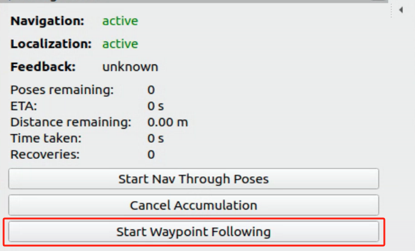

6. To end navigation, return to the terminal window and press **Ctrl + C** in each terminal to close the running programs.

### 10.4.6 Gazebo and MoveIt2 Simulation Integration

* **Enable Service**

1. Launch the virtual machine. Click the terminal icon  in the system desktop to open a command-line window.

2. Execute the following command to initiate the integration of the Gazebo and MoveIt2.

```
ros2 launch robot_gazebo worlds.launch.py moveit_unite:=true
```

3. Enter the following command to start the MoveIt2.

```
ros2 launch hiwonder_moveit_config demo.launch.py use_sim_time:=true use_gazebo:=true
```

* **Operating Instructions**

**1. Arm Control**

The MoveIt2 interface is shown below:

Position 1: RViz Toolbar. Position 2: MoveIt Debugging Area. Position 3: Simulation Model Adjustment Area.


(1) In the MoveIt2 Debugging Area, find and click the **Planning** section.


(2) In the Simulation Model Adjustment Area, you will see arrows in red, green, and blue colors. Click and drag the arrows to adjust the robotic arm's pose. In the robot's first-person view: Green represents the X-axis, with the positive direction pointing to the robot's left. Red represents the Y-axis, with the positive direction pointing to the robot's front. Blue represents the Z-axis, with the positive direction pointing upwards from the robot.


(3) After successfully planning the robotic arm's motion path, the new position will be highlighted in orange. If the new position causes a collision with other parts of the robot, it will be marked in red. You must adjust the configuration to avoid collisions. Otherwise, the motion cannot be executed.

Orange Executable State is shown in the following image.


For example, if the robotic arm is planned to be in the position shown in the image, it will collide with the depth camera. Turn the state red to non-executable, as shown in the figure below:


(4) After planning the path, return to the **Planning** section and click the **Plan** option. The simulation model will display the motion path from the original position to the newly planned position.


(5) Then, click the **Execute** option to make both the simulation model and robotic arm follow the planned motion path.


(6) Alternatively, you can click **Plan & Execute**, where the robotic arm will first display the new planned motion path and then execute the movement.


(7) You can also observe that the path planned in MoveIt2 is synchronized with the Gazebo interface.


**2. Gripper Control**

(1) To control the gripper movement, select **gripper** in the **Planning Group**.


(2) Drag the **r joint** to control the gripper's rotation.


(3) Once the motion trajectory is planned, return to **Planning** and click **Plan & Execute** to execute the movement.

