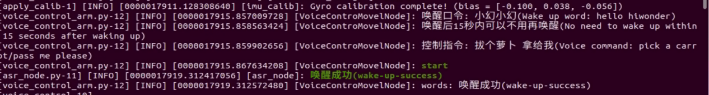
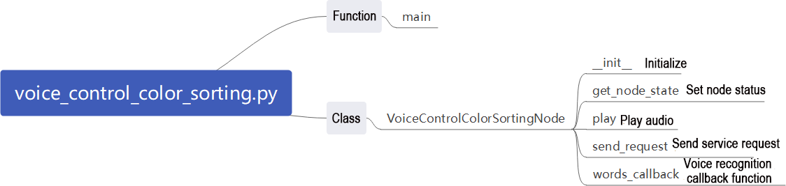
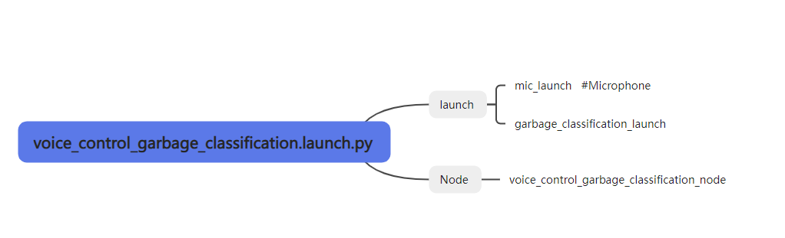

# 11. Voice Control Course

[TOC]


## 11.1 Introduction to WonderEcho Pro

### 11.1.1 Overview

WonderEcho Pro, also known as the AI Voice Interaction Box, is equipped with a high-performance noise-canceling microphone and a high-fidelity speaker. It uses a USB-to-audio module that is plug-and-play and requires no driver installation, and supports both playback and recording across multiple operating systems.

By integrating various voice processing modules, the voice recognition module uses advanced noise suppression algorithms to effectively filter background noise. It supports the entire voice interaction process—from wake word detection to speech recognition and response. Thanks to its modular design, each component can be independently developed and tested, such as wake word detection, voice activity detection, speech recognition, and synthesis.

### 11.1.2 Key Features & Specifications

* Built-in microphone and speaker interface, supporting both audio input and output

* Plug-and-play functionality with driver-free operation. Compatible with multiple operating systems: Windows, macOS, Linux, Android

* USB 2.0 standard interface

* Control interface: USB

* Voice processing chip: CL1302

* Speaker output: 3.0W per channel (4Ω BTL)

* Power supply: 5V DC

### 11.1.3 Recording and Playback Test

**Here’s how to test recording and playback using a Raspberry Pi 5. The same steps also apply to compatible devices like the robots with Jetson controller.**

* **Connection Setup & Detection**


If you're using a Raspberry Pi as the controller, you can use a remote desktop tool to access the Raspberry Pi desktop, such as VNC, see [4.1 Remote Control Tool Introduction and Installation]() in the user manual. Check the top-right corner of the screen for microphone and speaker icons. If these icons are present, the device has been successfully connected.


If you're using a Jetson device, you can connect via NoMachine and check the top-right corner of the desktop for a speaker icon to confirm the audio output is recognized.


* **Recording Test**

1. Open a terminal window. Run the following command to list available recording devices and find the card number 0. 

   > [!NOTE]
   >
   > **`-l` is a lowercase L. This number may vary by device, so use the actual number listed.**

   ```
   arecord -l
   ```


2. Start recording with the following command, replacing the first `0` with the correct card number:

```
arecord -D hw:0,0 -f S16_LE -r 16000 -c 2 test.wav
```

3)  This will create a **test.wav** file in the current directory.


4)  You can try to speak into the microphone for around 5 seconds, then press **Ctrl + C** to stop recording.

* **Playback Test**

1)  In the same terminal, run the command below to check if the **test.wav** file exists:

    ```
    ls
    ```

2)  If you see `test.wav` in the list, the recording was successful. Play the audio using the command:

```
aplay test.wav
```


## 11.2 WonderEcho Pro Installation

> [!NOTE]
>
> **When installing the WonderEcho Pro, ensure that the front of the robot is facing forward, and the USB port of the WonderEcho Pro is facing to the left, which is the direction of the Raspberry Pi's USB port.**


## 11.3 Voice Interaction

### 11.3.1 Voice Control for Robot Movement

* **Overview**

In this section, the robot’s built-in speech recognition capabilities are used to control its movements through voice commands, such as moving forward or backward.

From a programming perspective, the system subscribes to the voice recognition service to process the incoming voice data through localization, noise reduction, and recognition, and then retrieve the recognized sentence and the angle of the sound source. Once the robot is successfully awakened and a specific command is spoken, it will respond with voice feedback and execute corresponding actions, such as moving forward, backward, turning left, or right, based on the voice command issued to the robot.

To complete this feature, refer to the [Preparation]() section below, followed by the [Operation Steps]() section to proceed with the setup and usage.

* **Preparation**

Before starting this section, you need to follow the section [11.2 WonderEcho Pro Installation]() to install it on the robot. If already installed, you may skip this step. After installation, connect it to the USB **port 4** of the Raspberry Pi.

* **Operation Steps**

> [!NOTE]
>
> **When entering commands, be sure to use correct case and spacing. You can use the Tab key to auto-complete keywords.**

1. Power on the robot and connect it to a remote control tool like VNC. For detail informations, please refer to [4. Development Environment Setup and Configuration]() in the user manual.

2. By default, the system uses the English wake word Hello Hiwonder to activate the robot. If you wish to change the language to Chinese or modify the wake word, please refer to the section [Switching Wake Words Between Chinese and English]() for guidance.

3. Click the terminal icon  in the system desktop to open a command-line window.

4. Enter the command to disable the app auto-start service.

   ```
   ~/.stop_ros.sh
   ```

5. Enter the following command and press Enter to launch the feature.

   ```
   ros2 launch xf_mic_asr_offline voice_control_move.launch.py
   ```

6. To disable this feature, open a new command-line terminal and enter the following command:

   ```
   ~/.stop_ros.sh
   ```

7. Next, simply close all the open terminals.

* **Program Outcome**

Once the program has loaded successfully, say the wake word Hello Hiwonder. When the device responds with “I’m here”, you may issue your command to it. For example, saying **Move Forward** will trigger the robot to recognize the voice command, after which the voice box will reply with **Copy that, starting to move forward**, and the robot will proceed with the corresponding movement.

The command phrases and their corresponding actions are as follows:

| **Command Phrase** |      **Corresponding Action**       |
| :----------------: | :---------------------------------: |
|    Move forward    | Control the robot to move forward.  |
|   Move backward    | Control the robot to move backward. |
|     Turn Left      |   Control the robot to turn left.   |
|     Turn Right     |  Control the robot to turn right.   |

> [!NOTE]
>
> * **To ensure a good experience, please perform the experiment in a relatively quiet environment.**
>
> * **Before giving any voice command, it is recommended to say the wake word first.**
>
> * **When speaking the voice command, make sure your voice is loud and clear.**
>
> * **Provide one command at a time, and wait for the robot to finish executing and responding before giving the next command.**

* **Program Brief Analysis**

Voice control for robot movement involves establishing a connection between the voice control node and the robot’s low-level driver node. Through voice commands, the robot is controlled to execute the corresponding actions.

**1. launch File**

The launch file is located at:

[/home/ubuntu/ros2_ws/src/xf_mic_asr_offline/launch/voice_control_move.launch.py](/home/ubuntu/ros2_ws/src/xf_mic_asr_offline/launch/voice_control_move.launch.py)


**launch File**


`controller_launch`: Used to start the chassis control node. After launching, it allows control of the servo motors.

`lidar_launch`: Starts the lidar node, which will publish lidar data.

`mic_launch`: Starts the microphone functionality.

**Start Nodes**


`voice_control_move_node`: Used to invoke the voice control move source code and start the program.

**2. Python Launch File**


The source code for this program is located at:

[/home/ubuntu/ros2_ws/src/xf_mic_asr_offline/scripts/voice_control_move.py](/home/ubuntu/ros2_ws/src/xf_mic_asr_offline/scripts/voice_control_move.py)

**Functions**

`Main`:


Starts the voice control movement.

**Class:**

VoicecontroMovelNode:

`Init`:


Initializes various parameters, calls chassis node, buzzer node, lidar node, and voice recognition node, and finally starts the `main` function.

`get_node_state`:


Initializes the node state.

`Play`:


Plays audio.

`words_callback`:


The voice recognition callback function, which reads the data sent back by the microphone through the node.

`angle_callback`:


The sound source recognition callback function, which reads the angle of the sound source based on the direction of the wake word. The angle is detected by the microphone’s sound source localization.

`lidar_callback`:


The lidar callback function processes lidar data. The robot follows the detected sound source angle and uses PID to compute the angular velocity. It then tracks the nearest object by combining the radar’s scan data, and adjusts the linear and angular velocities according to the radar’s location of the object.

`Main`:


The execution strategy after receiving a command involves publishing different linear and angular velocities based on the command, used to control the robot's movement in various directions.


### 11.3.2 Voice Control for Robot Arm

* **Overview**

This experiment uses the robot's voice recognition system in combination with a visual robot arm to control the arm's movements based on voice commands.

From a programming perspective, the system subscribes to the voice recognition service to process the incoming voice data through localization, noise reduction, and recognition, and then retrieve the recognized sentence and the angle of the sound source. Once the robot is successfully awakened and a specific command is given, it will respond with a corresponding voice feedback. At the same time, the robot will execute the commanded action with the robot arm based on the voice instructions provided.

To complete this feature, refer to the [Preparation]() section below, followed by the [Operation Steps section]() to proceed with the setup and usage.

* **Preparation**

Before starting this section, you need to follow the secion [11.2 WonderEcho Pro Installation]() to install it on the robot. If already installed, you may skip this step. After installation, connect it to the USB **port 4** of the Raspberry Pi.

* **Operation Steps**

> [!NOTE]
>
> **When entering commands, be sure to use correct case and spacing. You can use the Tab key to auto-complete keywords.**

1. Power on the robot and connect it to a remote control tool like VNC. For detail informations, please refer to [4. Development Environment Setup and Configuration]() in the user manual.

2. By default, the system uses the English wake word Hello Hiwonder to activate the robot. If you wish to change the language to Chinese or modify the wake word, please refer to the section on [Switching Wake Words Between Chinese and English]() for guidance.

3. Click the terminal icon  in the system desktop to open a command-line window.

4. Enter the command to disable the app auto-start service.

   ```
   ~/.stop_ros.sh
   ```

5. Enter the following command and press Enter to launch the feature.

   ```
   ros2 launch xf_mic_asr_offline voice_control_arm.launch.py
   ```

6. To disable this feature, open a new command-line terminal and enter the following command:

   ```
   ~/.stop_ros.sh
   ```

7. Next, simply close all the open terminals.

* **Program Outcome**

Once the program has loaded successfully, say the wake word Hello Hiwonder and wait for the device to respond **I’m here**.

Next, issuing the command **Pick a carrot** will make the robotic arm grasp the object directly in front. Saying **Pass me please** will prompt the arm to deliver the grasped object to the user from the side.



> [!NOTE]
>
> * **To ensure a good experience, please perform the experiment in a relatively quiet environment.**
>
> * **Before giving any voice command, it is recommended to say the wake word first.**
>
> * **When speaking the voice command, make sure your voice is loud and clear.**
>
> * **Provide one command at a time, and wait for the robot to finish executing and responding before giving the next command.**

* **Program Brief Analysis**

Voice control for robot arm involves establishing a connection between the voice control node and the robot’s low-level driver node. Through voice commands, the robot arm is controlled to execute the corresponding actions.

**1. launch File**

The launch file is located at:

[/home/ubuntu/ros2_ws/src/xf_mic_asr_offline/launch/voice_control_arm.launch.py](/home/ubuntu/ros2_ws/src/xf_mic_asr_offline/launch/voice_control_arm.launch.py)


**launch File**


`controller_launch`: Used to start the chassis control node. After launching, it allows control of the servo motors.

`mic_launch`: Starts the microphone functionality

**Start Nodes**


`voice_control_move_node`: Used to invoke the voice control move source code and start the program.

**2. Python Launch File**


The source code for this program is located at:

[/home/ubuntu/ros2_ws/src/xf_mic_asr_offline/scripts/voice_control_arm.py](/home/ubuntu/ros2_ws/src/xf_mic_asr_offline/scripts/voice_control_arm.py)

**Functions**

`Main`:


Starts the voice control movement.

**Class:**

`VoiceControlColorDetectNode`:

`Init`:


Initializes various parameters, calls servo node, buzzer node, and voice recognition node, and finally starts the `main` function.

`get_node_state`:


Initializes the node state.

`Play`:


Plays audio.

`words_callback`:


The speech recognition callback function reads the data returned by the microphone through the node and executes the corresponding action group based on the recognized speech.


### 11.3.3 Voice Control for Color Recognition

* **Overview**

This experiment uses the robot's built-in speech recognition in combination with the vision-equipped robotic arm to identify objects in three different colors: red, green, and blue.

From a programming perspective, the system subscribes to the voice recognition service to process the incoming voice data through localization, noise reduction, and recognition, and then retrieve the recognized sentence and the angle of the sound source. Once the robot is successfully awakened and a specific voice command is issued, it provides corresponding voice feedback. At the same time, the onboard camera detects objects in red, green, and blue.

To complete this feature, refer to the [Preparation]() section below, followed by the [Operation Steps]() section to proceed with the setup and usage.

* **Preparation**

Before starting this section, you need to follow the section [11.2 WonderEcho Pro Installation]() to install it on the robot. If already installed, you may skip this step. After installation, connect it to the USB **port 4** of the Raspberry Pi.

* **Operation Steps**

> [!NOTE]
>
> * **Ensure that no objects with similar or identical colors to the target block appear in the background, as this may cause interference during recognition.**
>
> * **If the color detection is inaccurate, the color thresholds can be adjusted in the [7. ROS+OpenCV Course]().**

1. Power on the robot and connect it to a remote control tool like VNC. For detail informations, please refer to [4. Development Environment Setup and Configuration]() in the user manual.

2. By default, the system uses the English wake word Hello Hiwonder to activate the robot. If you wish to change the language to Chinese or modify the wake word, please refer to the section on [Switching Wake Words Between Chinese and English]() for guidance.

3. Click the terminal icon  in the system desktop to open a command-line window.

4. Enter the command to disable the app auto-start service.

   ```
   ~/.stop_ros.sh
   ```

5. Enter the following command and press **Enter** to launch the feature.

   ```
   ros2 launch xf_mic_asr_offline voice_control_color_detect.launch.py
   ```

6. To disable this feature, open a new command-line terminal and enter the following command:

   ```
   ~/.stop_ros.sh
   ```

7. Next, simply close all the open terminals.

* **Program Outcome**

After starting the program, first say the wake-up phrase Hello Hiwonder, then say the command **Start color recognition** to make the robot begin detecting colors. The robot will identify the color and announce its name. For example, place a red block within the camera’s field of view. When the red object is detected, the robot will announce **Red**.

To stop the feature, say the wake word Hello Hiwonder followed by the command **Stop color recognition**.

> [!NOTE]
>
> * **To ensure a good experience, please perform the experiment in a relatively quiet environment.**
>
> * **Before giving any voice command, it is recommended to say the wake word first.**
>
> * **When speaking the voice command, make sure your voice is loud and clear.**
>
> * **Provide one command at a time, and wait for the robot to finish executing and responding before giving the next command.**

* **Program Brief Analysis**

Voice control allows the voice recognition node to interact with the robot's underlying driving nodes and camera nodes. By issuing voice commands, the robot can identify color blocks and respond accordingly.

**1. launch File**


The launch file is located at:

[/home/ubuntu/ros2_ws/src/xf_mic_asr_offline/launch/voice_control_color_detect.launch.py](/home/ubuntu/ros2_ws/src/xf_mic_asr_offline/launch/voice_control_color_detect.launch.py)

**launch File**


`controller_launch`: Used to start the chassis control node. After launching, it allows control of the servo motors.

`color_detect_launch`: Starts the color recognition node.

`mic_launch`: Starts the microphone functionality.

`init_pose_launch`: Initializes the robot’s actions.

**Start Nodes**


`voice_control_color_detect_node`: Used to call the source code for voice-controlled color detection and launch the program.

**2. Python Program**


The source code for this program is located at:

[/home/ubuntu/ros2_ws/src/xf_mic_asr_offline/scripts/voice_control_color_detect.py](/home/ubuntu/ros2_ws/src/xf_mic_asr_offline/scripts/voice_control_color_detect.py)

**Functions**

`Main`:


Starts the voice-controlled color detection.

**Class:**

`VoiceControlColorDetectNode`:

`Init`:


Initializes various parameters and calls the chassis node, buzzer node, lidar node, voice recognition node, and color recognition node. Finally, the `main` function is launched.

`get_node_state`:


Sets the current node state.

`Play`:


Plays audio.

`Shutdown`:


Callback function when the program shuts down. It sets the `running` parameter to `False`, stopping the program.

`get_color_callback`:


Receives information from the color recognition node and provides the current color recognition result.

`send_request`:


Publishes a service request.

`words_callback`:


Voice recognition callback function that controls whether color recognition should be started based on the recognized voice. If started, it will respond according to the color recognition node’s information.

`Main`:


Based on the recognized color, it announces the corresponding color name.


### 11.3.4 Voice Control for Color Tracking

* **Overview**

This experiment uses the robot's built-in speech recognition in combination with the vision-equipped robotic arm to identify blocks in three different colors: red, green, and blue.

From a programming perspective, the system subscribes to the voice recognition service to process the incoming voice data through localization, noise reduction, and recognition, and then retrieve the recognized sentence and the angle of the sound source. After successfully waking up the robot and saying a specific command, the robot will provide a corresponding voice feedback. Once a particular color is recognized, the robot’s pan-tilt camera will follow the target color object.

To complete this feature, refer to the [Preparation]() section below, followed by the [Operation Steps]() section to proceed with the setup and usage.

* **Preparation**

Before starting this section, you need to follow the section [11.2 WonderEcho Pro Installation]() to install it on the robot. If already installed, you may skip this step. After installation, connect it to the USB **port 4** of the Raspberry Pi.

* **Operation Steps**

> [!NOTE]
>
> * **Ensure that no objects with similar or identical colors to the target block appear in the background, as this may cause interference during recognition.**
>
> * **If the color detection is inaccurate, the color thresholds can be adjusted in the [7. ROS+OpenCV Course]().**

1. Power on the robot and connect it to a remote control tool like VNC. For detail informations, please refer to [4. Development Environment Setup and Configuration]() in the user manual.

2. By default, the system uses the English wake word Hello Hiwonder to activate the robot. If you wish to change the language to Chinese or modify the wake word, please refer to section [Switching Wake Words Between Chinese and English]() for guidance.

3. Click the terminal icon  in the system desktop to open a command-line window.

4. Enter the command to disable the app auto-start service.

   ```
   ~/.stop_ros.sh
   ```

5. Enter the following command and press **Enter** to launch the voice controlled color tracking feature.

   ```
   ros2 launch xf_mic_asr_offline voice_control_color_track.launch.py
   ```

6. To disable this feature, open a new command-line terminal and enter the following command:

   ```
   ~/.stop_ros.sh
   ```

7. Next, simply close all the open terminals.

* **Program Outcome**

Once the program stars, commands can be issued. The program recognizes three colors, including red, green, and blue. For example, place a red object within the camera’s field of view. First, say the wake word **Hello Hiwonder**, then give the tracking command **Track red object**. For blue, say **Track blue object**, and for green, say **Track green object**. When the robot detects the red color matching the voice command, the robot arm’s camera will follow the target color in real-time, aligning the depth camera with the red object. As the color block moves, the pan-tilt camera will adjust accordingly.

> [!NOTE]
>
> * **To ensure a good experience, please perform the experiment in a relatively quiet environment.**
>
> * **Before giving any voice command, it is recommended to say the wake word first.**
>
> * **When speaking the voice command, make sure your voice is loud and clear.**
>
> * **Provide one command at a time, and wait for the robot to finish executing and responding before giving the next command.**

* **Program Brief Analysis**

Voice control connects the voice command node with the camera node, allowing the robot to recognize and track color blocks based on spoken commands.

**1. launch File**


The launch file is located at:

[/home/ubuntu/ros2_ws/src/xf_mic_asr_offline/launch/voice_control_color_track.launch.py](/home/ubuntu/ros2_ws/src/xf_mic_asr_offline/launch/voice_control_color_track.launch.py)

**launch File**


`color_track_launch`: Starts the color tracking node.

`mic_launch`: Starts the microphone functionality.

**Start Nodes**


`voice_control_color_track_node`: Used to call the source code for voice-controlled color tracking and launch the program.

**2. Python Program**


The source code for this program is located at:

[/home/ubuntu/ros2_ws/src/xf_mic_asr_offline/scripts/voice_control_color_track.py](/home/ubuntu/ros2_ws/src/xf_mic_asr_offline/scripts/voice_control_color_track.py)

**Functions**

`Main`:


Launches the voice control color tracking.

**Class:**

`VoiceControlColorTrackNode`:

`Init`:


Initializes various parameters, calls the buzzer node, voice recognition node, and color tracking node, then initializes the actions.

`init_process`:


Starts the color tracking feature and provides command prompts and node initialization markers.

`get_node_state`:


Sets the current node state.

`Play`:


Plays audio.

`send_request`:


Publishes a service request.

`words_callback`:


Voice recognition callback function that controls whether to start color tracking based on the recognized speech. It reports the corresponding audio based on the recognition result, passes the color to be tracked to the color tracking node, and the tracking logic is implemented within the color tracking node.


### 11.3.5 Voice Control for Color Sorting

* **Overview**

This section of the experiment uses the robot's built-in voice recognition functionality combined with a vision-enabled robot arm to identify three different colored blocks: red, green, and blue. The robot then performs the corresponding actions of grasping and sorting based on the detected colors.

From a programming perspective, the system subscribes to the voice recognition service to process the incoming voice data through localization, noise reduction, and recognition, and then retrieve the recognized sentence and the angle of the sound source. After successfully waking up the robot and saying a specific command, the robot will respond with corresponding voice feedback. Upon recognizing a specific color, the robot arm will descend to the designated position, pick up the color block, and then place it at the specified location.

To complete this feature, refer to the [Preparation]() section below, followed by the [Operation Steps]() section to proceed with the setup and usage.

* **Preparation**

1)  Before starting this section, you need to follow the section [11.2 WonderEcho Pro Installation]() to install it on the robot. If already installed, you may skip this step. After installation, connect it to the USB **port 4** of the Raspberry Pi.

2)  Prepare three color blocks in advance, including red, green, and blue.

* **Operation Steps**

> [!NOTE]
>
> * **Ensure that no objects with similar or identical colors to the target block appear in the background, as this may cause interference during recognition.**
>
> * **If the color detection is inaccurate, the color thresholds can be adjusted in the [7. ROS+OpenCV Course]().**

1. Power on the robot and connect it to a remote control tool like VNC. For detail informations, please refer to [4. Development Environment Setup and Configuration]() in the user manual.

2. By default, the system uses the English wake word Hello Hiwonder to activate the robot. If you wish to change the language to Chinese or modify the wake word, please refer to the section [Switching Wake Words Between Chinese and English]() for guidance.

3. Click the terminal icon  in the system desktop to open a command-line window.

4. Enter the command to disable the app auto-start service.

   ```
   ~/.stop_ros.sh
   ```

5. Enter the following command and press **Enter** to launch the voice controlled color sorting feature.

   ```
   ros2 launch xf_mic_asr_offline voice_control_color_sorting.launch.py debug:=true
   ```

6. Once started, the robot arm with vision will adjust to the calibration posture. You need to place the color block to be recognized in the center of the gripper, as shown below.

   

   Wait for about 10 seconds, and the robot arm will automatically lift upwards, entering the ready-to-recognize state. During this process, there is no need to move the color block.

7. To disable this feature, open a new command-line terminal and enter the following command:

   ```
   ~/.stop_ros.sh
   ```

8. Next, simply close all the open terminals.

* **Program Outcome**

1. Say the wake-up word Hello Hiwonder, followed by the command **Start color sorting**, and the robot will begin the color sorting action. The robot arm will then grasp the color block.

2. Once the program identifies the position of the color block at its current location, the camera feed will display a yellow box around the recognized area. This position will be used as the reference for subsequent recognition and gripping actions.

3. Next, the robot will place the color block into the corresponding color area which can be replaced, as shown below.

   

4. After placing the block, the robot arm will return to the ready-to-recognize posture. As in step 6, you only need to place the color block within the yellow box on the camera feed for it to be recognized again, and the sorting function can be executed again.

5. To stop the color sorting, say the wake-up word **Hello Hiwonder**, followed by the command **Stop color sorting**, and the vision-controlled robot arm will cease color sorting.

* **Program Brief Analysis**

Voice control connects the voice control node with the camera node, allowing the robot to start or stop the color tracking feature based on voice commands.

**1. launch File**


The launch file is located at:

[/home/ubuntu/ros2_ws/src/xf_mic_asr_offline/launch/voice_control_color_track.launch.py](/home/ubuntu/ros2_ws/src/xf_mic_asr_offline/launch/voice_control_color_track.launch.py)

**launch File**


`color_sorting_launch`: Starts the color sorting node.

`mic_launch`: Starts the microphone functionality.

**Start Nodes**


`voice_control_color_track_node`: Used to call the source code for voice-controlled color sorting and launch the program.

* **Python Program**



The source code for this program is located at:

[/home/ubuntu/ros2_ws/src/xf_mic_asr_offline/scripts/voice_control_color_sorting.py](/home/ubuntu/ros2_ws/src/xf_mic_asr_offline/scripts/voice_control_color_sorting.py)

**Functions**

`Main`:


Starts the voice control for color sorting.

**Class:**

`VoiceControlColorSortingNode`:

`Init`:


Initializes parameters and calls the voice recognition and color sorting nodes.

`get_node_state`:


Sets the current node state.

`Play`:


Plays audio.

`send_request`:


Publishes a service request.

`words_callback`:


Voice recognition callback function that controls whether to start sorting and announces the corresponding result based on the recognized speech. The sorting is implemented within the color sorting node.


### 11.3.6Voice Control for Waste Classification

This section introduces how to use voice commands to control the robot for recognizing and sorting waste cards.

* **Overview**

First, the system subscribes to the voice recognition service published by the voice box node. It processes the incoming voice data through localization, noise reduction, and recognition, and then retrieves the recognized sentence and the angle of the sound source.

After successfully waking up the robot and issuing a command, the robot responds with a voice confirmation.

Finally, based on voice command matching, the robot will perform the corresponding actions.

* **Preparation**

Before starting this section, you need to follow the section [11.2 WonderEcho Pro Installation]() to install it on the robot. If already installed, you may skip this step. After installation, connect it to the USB **port 4** of the Raspberry Pi.

* **Operation Steps**

> [!NOTE]
>
> **When entering commands, be sure to use correct case and spacing. You can use the Tab key to auto-complete keywords.**

1. Power on the robot and connect it to a remote control tool like VNC. For detail informations, please refer to [4. Development Environment Setup and Configuration]() in the user manual.

2. By default, the system uses the English wake word Hello Hiwonder to activate the robot. If you wish to change the language to Chinese or modify the wake word, please refer to the section [Switching Wake Words Between Chinese and English]() for guidance.

3. Click the terminal icon  in the system desktop to open a command-line window.

4. Enter the command to disable the app auto-start service.

   ```
   ~/.stop_ros.sh
   ```

5. Enter the following command and press **Enter** to start the waste sorting feature.

   ```
   ros2 launch xf_mic_asr_offline voice_control_garbage_classification.launch.py debug:=true
   ```

6. Before the pick-and-place operation, the robot arm enters a calibration stage. During this stage, it performs a downward grasping motion with its gripper fully open. At this time, the waste block should be placed in the center of the gripper.

   

7. To disable this feature, open a new command-line terminal and enter the following command:

   ```
   ~/.stop_ros.sh
   ```

8. Next, simply close all the open terminals.

* **Program Outcome**

1. The robot arm will then lift up, entering the ready-to-recognize state. Say the wake word **Hello Hiwonder**, and then issue the command **Sort waste**. On the remote interface, a red bounding box will appear on the software screen indicating the calibration recognition area.

   

2. Once the calibration and recognition are successful, the red frame in the image turns yellow, indicating the recognition area. Only the block with waste card placed within this yellow area will be detected and picked up by the robot arm.

   

   The program uses colored bounding boxes to indicate detected objects. Next to each object name is a number between 0 and 1 representing the confidence score. For example, oralliquidBotte 0.91 means the model is 91% confident that the detected object belongs to the oralliquidBotte category. Better lighting conditions generally result in higher recognition accuracy.

4. Next, the robot will place the waste block into the corresponding color area which can be replaced, as shown below.

   

<table>
<colgroup>
<col style="width: 49%" />
<col style="width: 50%" />
</colgroup>
<tbody>
<tr>
<td style="text-align: center;">Name</td>
<td style="text-align: center;">Category</td>
</tr>
<tr>
<td style="text-align: center;">Food Waste (food_waste)</td>
<td style="text-align: center;"><p>Banana Peel (BananaPeel)</p>
<p>Broken Bones (BrokenBones)</p>
<p>Ketchup (Ketchup)</p></td>
</tr>
<tr>
<td style="text-align: center;">Hazardous Waste (hazardous_waste)</td>
<td style="text-align: center;"><p>Marker (Marker)</p>
<p>Oral Liquid Bottle (OralLiquidBottle)</p>
<p>Storage Battery (StorageBattery)</p></td>
</tr>
<tr>
<td style="text-align: center;">Recyclable Waste (recyclable_waste)</td>
<td style="text-align: center;"><p>Plastic Bottle (PlasticBottle)</p>
<p>Tooth Brush (Toothbrush)</p>
<p>Umbrella (Umbrella)</p></td>
</tr>
<tr>
<td style="text-align: center;">Residual Waste (residual_waste)</td>
<td style="text-align: center;"><p>Plate (Plate)</p>
<p>Cigarette End (CigaretteEnd)</p>
<p>Disposable Chopsticks (DisposableChopsticks)</p></td>
</tr>
</tbody>
</table>


* **Program Brief Analysis**

**1. launch File**

Voice-controlled waste sorting allows the voice control node to establish a connection with the camera node. By issuing voice commands, the robot can either enable or disable the sorting feature. Once the robot successfully grabs the corresponding waste card, it will report its classification via voice feedback.

The launch file is located at:

[/home/ubuntu/ros2_ws/src/xf_mic_asr_offline/launch/voice_control_garbage_classification.launch.py](/home/ubuntu/ros2_ws/src/xf_mic_asr_offline/launch/voice_control_garbage_classification.launch.py)



**launch File**


`garbage_classification_launch`: Starts the waste classification node.

`mic_launch`: Starts the microphone functionality.

**Start Nodes**


`voice_control_garbage_classification_node`: Used to call the source code for voice-controlled color sorting and launch the program.

**2. Python Program**


The source code for this program is located at:

[/home/ubuntu/ros2_ws/src/xf_mic_asr_offline/scripts/voice_control_garbage_classification.py](/home/ubuntu/ros2_ws/src/xf_mic_asr_offline/scripts/voice_control_garbage_classification.py)

**Functions**

`Main`:


Starts the voice control for waste classification.

**Class:**

`VoiceControlColorSortingNode`:

`Init`:


Initializes all parameters, calling the buzzer node, voice recognition node, and waste sorting node.

`get_node_state`:


Sets the current node state.

`Play`:


Plays audio.

`send_request`:


Publishes a service request.

`words_callback`:


Voice recognition callback function that controls whether to start waste classification and announces the corresponding result based on the recognized speech. The sorting is implemented within the waste classification node.


### 11.3.7 Voice Control for Multi-Point Navigation

In this section, voice control will be used to navigate the robot on a pre-built map.

* **Overview**

First, open the robot's navigation service and load the map, then start the multi-point navigation service.

Next, subscribe to the voice recognition service published by the voice box node, performing operations such as source localization, noise reduction, and speech recognition, to obtain the recognized command and sound source angle.

Afterward, the microphone will recognize the spoken commands. Once the wake-up word and control commands are detected and the recognition threshold is met, the robot will respond with the corresponding voice feedback.

Finally, based on the recognized language, the robot will navigate to the corresponding location on the map. Navigation will first perform global planning, and during movement, local planning will be applied when encountering obstacles.

* **Preparation**

1)  Before starting this section, you need to follow the section [11.2 WonderEcho Pro Installation]() to install it on the robot. If already installed, you may skip this step. After installation, connect it to the USB **port 4** of the Raspberry Pi.

2)  Create a map of the current area where the robot is located. For instructions on how to build a map, refer to the tutorials under [6. Mapping & Navigation Course]().

3)  Place the robot on an open platform, ensuring that there is enough space for movement, with at least 3 meters around the robot.

* **Operation Steps**

> [!NOTE]
>
> **When entering commands, be sure to use correct case and spacing. You can use the Tab key to auto-complete keywords.**

1. Power on the robot and connect it to a remote control tool like VNC. For detail informations, please refer to [4. Development Environment Setup and Configuration]() in the user manual.

2. By default, the system uses the English wake word Hello Hiwonder to activate the robot. If you wish to change the language to Chinese or modify the wake word, please refer to the section [Switching Wake Words Between Chinese and English](/home/ubuntu/ros2_ws/src/xf_mic_asr_offline/launch/voice_control_garbage_classification.launch.py) for guidance.

3. Click the terminal icon  in the system desktop to open a command-line window.

4. Enter the command to disable the app auto-start service.

   ```
   ~/.stop_ros.sh
   ```

5. Enter the following command and press **Enter** to launch the feature.

```
ros2 launch xf_mic_asr_offline voice_control_navigation_transport.launch.py map:=map_01
```

The `map_01` at the end of the command is the map name and can be modified according to your needs. The map is stored at the directory of [/home/ubuntu/ros2_ws/src/slam/maps](/home/ubuntu/ros2_ws/src/slam/maps).

6. To disable this feature, open a new command-line terminal and enter the following command:

   ```
   ~/.stop_ros.sh
   ```

7. Next, simply close all the open terminals.

* **Program Outcome**

After launching the feature, say the wake word **Hello Hiwonder**, then issue a command to control the robot’s movement.

For example, first say **Hello Hiwonder**, and the robot will reply with **I’m here**. Next, you can say **Go to A point**, and the robot will move to the top-right of the starting position.

The command phrases and their corresponding functions are as follows. From the robot’s first-person perspective:

|  **Command Phrase**  |                         **Function**                         |
| :------------------: | :----------------------------------------------------------: |
|    Go to A point     | Move the robot to point A, top-right of the starting position. |
|    Go to B point     | Move the robot to point B, top-left of the starting position. |
|    Go to C point     |      Move the robot to point C, directly below point A.      |
| Go back to the start |        Move the robot back to the starting position.         |

* **Program Brief Analysis**

**1. launch File**


The launch file is located at:

[/home/ubuntu/ros2_ws/src/xf_mic_asr_offline/launch/voice_control_navigation.launch.py](/home/ubuntu/ros2_ws/src/xf_mic_asr_offline/launch/voice_control_navigation.launch.py)

**launch File**


`navigation_launch`: Starts the navigation system.

`mic_launch`: Starts the microphone functionality.

**Start Nodes**


`voice_control_navigation_node`: Used to invoke the voice control multi-point navigation source code and start the program.

* **Python Program**


The source code for this program is located at:

[/home/ubuntu/ros2_ws/src/xf_mic_asr_offline/scripts/voice_control_navigation.py](/home/ubuntu/ros2_ws/src/xf_mic_asr_offline/scripts/voice_control_navigation.py)

**Functions**

`Main`:


Starts the voice control for multi-point navigation.

**Class:**

`VoiceControlNavNode`:

`Init`:


Initialize various parameters, set the navigation parameters, call the voice recognition node, the buzzer node, and then start the main function.

`get_node_state`:


Sets the current node state.

`Play`:


Plays audio.

`words_callback`:


Voice recognition callback function that controls whether to start waste classification and announces the corresponding result based on the recognized speech. The sorting is implemented within the waste classification node.

`angle_callback`:


The sound source recognition callback function, which reads the angle of the sound source relative to the microphone after waking up.

`Main`:


Based on the node recognized by the speech, publish the navigation points to the navigation node and provide voice feedback.

* **Feature Extension**

The default position of Point A is at the top-right corner of the robot’s starting position on the map, with coordinates (1, -1) in meters. To change the location of Point A, modify the coordinate values. For example, to **place Point A at the bottom-right corner of the starting position**, follow these steps:

> [!NOTE]
>
> * **You can refer to this process to modify the locations of Points B and C.**
>
> * **The input command should be case sensitive, and the keywords can be complemented by “Tab” key.**

1. Power on the robot and connect it to a remote control tool like VNC.

2. Click the terminal icon  in the system desktop to open a command-line window.

3. Enter the command to disable the app auto-start service.

   ```
   ~/.stop_ros.sh
   ```

4. Open the program file by entering the command.

```
vim ./ros2_ws/src/xf_mic_asr_offline/scripts/voice_control_navigation.py
```

5)  In the opened file, locate the APPID section as shown in the reference image.


6)  Press the key **i** to enter edit mode, change the value `1` to `-1`.


The positive direction of the X-axis is considered the front, while the positive direction of the Y-axis is to the left. To place Point A in the bottom-right corner of the robot’s starting position, change the X-axis coordinate of Point A from positive to negative.

7)  Once the modification is complete, press the **Esc** key, type `:wq`, and press **Enter** to save and exit the file.

8)  Refer to [Operation Steps]() to restart the feature and observe the effect of the modified setup.


### 11.3.8 Voice Control for Navigation and Transport

In this section, voice control will be used to navigate the robot on a pre-built map for transportation tasks.

* **Overview**

First, open the robot's navigation service and load the map, then start the multi-point navigation service.

Next, subscribe to the voice recognition service published by the voice box node, performing operations such as source localization, noise reduction, and speech recognition, to obtain the recognized command and sound source angle.

Afterward, the microphone will recognize the spoken commands. Once the wake-up word and control commands are detected and the recognition threshold is met, the robot will respond with the corresponding voice feedback.

Finally, based on the recognized language, the robot will navigate to the corresponding location on the map. Navigation will first perform global planning, and during movement, local planning will be applied when encountering obstacles. When the robot reaches the first point, it will call the alignment and grasping service. Upon reaching the second point, it will call the placement service.

* **Preparation**

1)  Before starting this section, you need to follow the section [11.2 WonderEcho Pro Installation]() to install it on the robot. If already installed, you may skip this step. After installation, connect it to the USB **port 4** of the Raspberry Pi.

2)  Create a map of the current area where the robot is located. For instructions on how to build a map, refer to the document under [6. Mapping & Navigation Course]().

3)  Place the robot on an open platform, ensuring that there is enough space for movement, with at least 3 meters around the robot.

* **Operation Steps**

> [!NOTE]
>
> **When entering commands, be sure to use correct case and spacing. You can use the Tab key to auto-complete keywords.**

1. Power on the robot and connect it to a remote control tool like VNC. For detail informations, please refer to [4. Development Environment Setup and Configuration]() in the user manual.

2. By default, the system uses the English wake word Hello Hiwonder to activate the robot. If you wish to change the language to Chinese or modify the wake word, please refer to the section [Switching Wake Words Between Chinese and English]() for guidance.

3. Click the terminal icon  in the system desktop to open a command-line window.

4. Enter the command to disable the app auto-start service.

   ```
   ~/.stop_ros.sh
   ```

5. Enter the following command and press **Enter** to launch the feature.

```
ros2 launch xf_mic_asr_offline voice_control_navigation_transport.launch.py map:=map_01
```

The `map_01` at the end of the command is the map name and can be modified according to your needs. The map is stored at the directory of [/home/ubuntu/ros2_ws/src/slam/maps](/home/ubuntu/ros2_ws/src/slam/maps).

6. To disable this feature, open a new command-line terminal and enter the following command:

   ```
   ~/.stop_ros.sh
   ```

7. Next, simply close all the open terminals.

* **Program Outcome**

After launching the feature, say the wake word **Hello Hiwonder**, then issue a command to control the robot’s movement.

For example, first say **Hello Hiwonder**, and the robot will reply with **I’m here**. Next, you can give the command **Navigate and transport**, and the robot will move to the position (0, 0.5, 0) on the map to grasp the object. After grasping, it will then proceed to the position (1.5, 0, 0) to place the object.

* **Program Brief Analysis**

**1. launch File**


The launch file is located at:

[/home/ubuntu/ros2_ws/src/xf_mic_asr_offline/launch/voice_control_navigation_transport.launch.py](/home/ubuntu/ros2_ws/src/xf_mic_asr_offline/launch/voice_control_navigation_transport.launch.py)

**launch File**


`navigation_transport_launch`: Starts the navigation and transport feature.

`mic_launch`: Starts the microphone functionality

**Start Nodes**


`voice_control_navigation_node`: Used to invoke the voice control multi-point navigation source code and start the program.

**2. Python Program**


The source code for this program is located at:

[/home/ubuntu/ros2_ws/src/xf_mic_asr_offline/scripts/voice_control_navigation_transport.py](/home/ubuntu/ros2_ws/src/xf_mic_asr_offline/scripts/voice_control_navigation_transport.py)

**Functions**

`Main`:


Starts the voice control for multi-point navigation.

**Class:**

`VoiceControlNavigationTransportNode`:

`Init`:


Initialize all parameters, set the necessary parameters for navigation and transportation, call the voice recognition node and the navigation transport node, and start the main function.

`get_node_state`:


Sets the current node state.

`send_request`:


Publishes a service request.

`Play`:


Plays audio.

`words_callback`:


Voice recognition callback function that controls whether navigation should be started based on the recognized voice.

* **Grasp Calibration**

The program defaults to recognizing and gripping objects in the center of the screen, so normally no adjustments are needed. However, if during feature the robot arm fails to grip the object, you can adjust the gripping area by using program instructions. The specific steps are as follows:

1. Power on the robot and connect it to a remote control tool like VNC.

2. Click the terminal icon  in the system desktop to open a command-line window.

3. Enter the command to disable the app auto-start service.

   ```
   ~/.stop_ros.sh
   ```

4. To begin grasp calibration, enter the following command:

   ```
   ros2 launch example automatic_pick.launch.py debug:=true
   ```

5. Wait for the robot arm to reach the gripping position, then place the color block in the center of the gripper. Wait for the arm to reset and grab the block again to complete the calibration. Once calibrated, the terminal will display the pixel coordinates of the color block in the camera view along with a completion message.

   

6. After calibration, follow the steps in section [Operation Steps]() to operate the feature again.


## 11.4 Switching Wake Words Between Chinese and English

The system’s default wake word is **Hello Hiwonder**. To switch to a Chinese wake word or modify the wake word, follow the steps below.

1. First, burn the corresponding language firmware. For detailed instructions, refer to the section [Voice Module Introduction and Installation]() in 12. Large AI Model Course for burning the Chinese firmware. If you need to modify the wake word, you can refer to [12.2.4 Firmware Creation]() to create and burn the desired firmware.

   

   WonderEcho Pro

2. Connect to the robot via VNC, use the configuration tool on the desktop to set and save, and double-click the Tool icon  on the system desktop.

3. Set the language to Chinese, then click **Save** \> **Apply** \> **Quit**.

   
