# 12. Large AI Model Course

## 12.1 Large Models Basic Courses

### 12.1.1 Large Language Model Courses

* **Overview of Large Language Model**

A Large Language Model (LLM) is an advanced artificial intelligence model developed to comprehend and generate human language.


(1) Basic Concept

A Large Language Model (LLM) is a deep learning model trained on extensive text data, designed to either generate natural language text or comprehend the meaning of language. LLM is capable of performing various natural language tasks, such as text classification, question answering, and dialogue, making them a crucial step toward achieving advanced artificial intelligence. Unlike smaller models, LLM leverages a similar Transformer architecture and pretraining objectives (like Language Modeling), but are distinguished by their larger model size, greater training data, and enhanced computational resources.

(2) Features

**Massive Scale:** LLM are characterized by their vast parameter sizes, often reaching billions or even trillions of parameters. This immense scale allows them to capture a wealth of linguistic knowledge and complex syntactic structures.

**Pretraining and Fine-tuning:** LLM utilize a two-stage learning process: pretraining and fine-tuning. Initially, they are pretrained on large-scale, unlabeled text data, learning general language representations and knowledge. Subsequently, they are fine-tuned using labeled data to specialize in specific tasks, allowing them to excel across a wide range of NLP applications.

**Contextual Awareness:** LLM demonstrate exceptional contextual awareness, with their ability to understand and generate language deeply dependent on preceding text. This enables them to perform exceptionally well in tasks like dialogue, article generation, and contextual comprehension.

**Multilingual Capabilities:** LLM support multiple languages, extending beyond just English. This multilingual proficiency enables them to power cross-lingual and cross-cultural applications, enhancing their versatility and global reach.

**Multimodal Support:** Some LLMs have expanded to handle multimodal data, including text, images, and speech. This capability allows them to understand and generate content across various media types, opening up more diverse application possibilities.

**Emergent Properties:** LLM exhibit remarkable emergent properties, where performance improvements become apparent in large models but are absent in smaller ones. This makes them adept at handling more complex tasks and challenges.

**Cross-domain Applications:** LLM have been widely adopted across numerous fields, including text generation, machine translation, information retrieval, summarization, chatbots, and virtual assistants. Their influence is profound, impacting both daily life and work in significant ways.

**Ethical and Risk Considerations:** While LLM showcase impressive capabilities, they also raise important ethical and risk-related concerns, such as the potential generation of harmful content, privacy violations, and cognitive biases. As such, the development and deployment of LLM must be approached with careful consideration and caution.

(3) Working Principle

Large Language Model (LLM) are built on deep learning principles and are trained using massive datasets and substantial computational resources to develop neural networks with billions of parameters. Through iterative training and parameter optimization, these models learn to perform a wide range of tasks with high accuracy. The "**large**" in LLM reflects their immense scale—encompassing a vast number of parameters, extensive training data, and significant computational demands. This scale enables advanced models to achieve superior generalization capabilities and deliver increasingly accurate results, even in highly specialized domains.

Today, some of the most popular applications revolve around generative AI, such as language generation tools (e.g., ChatGPT) and image generation platforms (e.g., Midjourney). At the core of these applications is the concept of generation—the model's ability to predict and produce coherent content based on a given input.

(4) Application Scenarios

① Text Generation

Large Language Models are capable of generating diverse types of text, including news articles, stories, poems, and more. These capabilities make them well-suited for applications in content creation, creative writing, and automated storytelling.

② Text Classification

Large Language Models can classify text into various categories, such as sentiment analysis and topic identification. These capabilities are especially valuable in scenarios like public opinion analysis, information retrieval, and content moderation.

③  Machine Translation

Large Language Models excel at machine translation, enabling the conversion of text from one language to another. These capabilities are essential for cross-language communication, localization, and global collaboration.

④ Question-Answering Systems

Large Language Models can be used to build question-answering systems that respond to user queries. These applications are particularly valuable in areas such as intelligent customer support, knowledge retrieval, and information lookup.

<p id="anchor_12_1_1_2"></p>

* **Large Language Model Deployment**

> [!NOTE]
>
>This section outlines the steps to register on the official OpenAI website and obtain the API key for the Large Language Model.

(1) OpenAI Account Registration and Setup

① Copy the following URL: <https://platform.openai.com/docs/overvie>

Open the OpenAI website and click on the "**Sign Up**" button in the top right corner.


② Follow the prompts to register and log in using your Google, Microsoft, or Apple account.


③ Click on the settings icon, then select Billing, followed by Payment Methods, to link your payment method. Recharge your account to purchase tokens.


④ After completing the setup, click on API Keys, then select Create New Secret Key. Follow the prompts to fill in the required information. Once the key is created, make sure to save it for future use.


⑤ With these steps, the large model has been successfully created and deployed. You can now use the API in the upcoming lessons.

(2) OpenRouter Account Registration and Setup

① Copy the following URL: <https://openrouter.ai/>

Open the webpage in your browser and click "**Sign In**". Register using your Google account or another available login option.


② After logging in, click the icon in the top-right corner and select **"Credits"** to link your payment method.


③ To create an API key, go to **"API Keys"**, then click **"Create Key"**. Follow the prompts to complete the process. Once the key is generated, make sure to save it for future use.


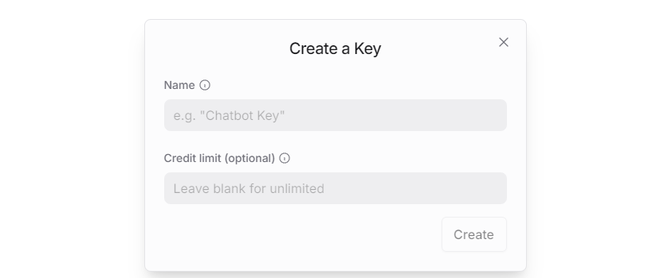

④ At this point, the large model is successfully created and deployed. You can now use the API in the upcoming lessons.

<p id="anchor_12_1_1_3"></p>

* **Large Language Model Accessing**

> [!NOTE]
>
>To proceed with this section, you will need to register on the appropriate website and obtain the API key for the large model (please refer to the file ["**12.1.1 Large Language Model Courses -> Large Language Model Deployment**"](#anchor_12_1_1_2)).

It is important to ensure a stable network connection for the development board. For optimal performance, we also recommend connecting the main controller to a wired network for enhanced stability.


(1) Environment Configuration

> [!NOTE]
>
>If you have purchased a robot from our company with built-in large model functionality, the environment is already pre-configured in the robot's image. You can directly proceed to Section 3 of this document to configure the API key.

Install Vim and Gedit by running the corresponding commands. Install the necessary software packages and audio libraries required for PyAudio.

```
sudo apt update
```

```
sudo apt install vim
```

```
sudo apt install gedit
```

```
sudo apt install python3 python3-pip python3-all-dev python3-pyaudio portaudio11-dev libsndfile1
```


(2) Importing the Large Model Program Directory

① In this section, locate the '[Appendix -> Source Code](https://drive.google.com/drive/folders/1Na86By9er9Jj1_1YXz3sxAwePrIgSUcN?usp=sharing)' folder within the same directory as this tutorial document.


② Using the MobaXterm remote connection tool (as outlined in the '5.5 Remote Access and File Transfer' tutorial), drag the folder into the root directory of the main controller. The software installation package can be found in the '[Appendix -\> Remote Access and File Transfer](https://drive.google.com/drive/folders/17mfRH9lmP9OYO4_LAyzkRnHfytqRYldJ?usp=sharing)' directory.


③ Next, execute the command to navigate to the **'speech_pkg' directory**.

```
cd ~/large_models/speech_pkg/
```

④ Execute the following commands to install the necessary third-party libraries.

```
pip3 install -r requirements.txt --break-system-packages
```

```
pip3 install dashscope --break-system-packages
```

```
pip3 install opencv-python --break-system-packages
```

```
pip3 install sympy==1.13.1 --break-system-packages
```

```
pip3 install torch --break-system-packages
```

⑤ Then, use the command in the terminal to navigate to the **'speech'** directory.

```
cd ~/large_models/speech_pkg/speech
```

⑥ Run the command to list the files in the **'speech'** directory.

```
ls
```


⑦ Depending on the type of main controller and Python version you're using, switch to the appropriate folder for packaging and distribution. This tutorial uses the Jetson Orin controller as an example.

| **Type of main controller** | **Python version** |
| --------------------------- | ------------------ |
| jetson_nano                 | 3.6                |
| jetson_orin                 | 3.10               |
| rpi5                        | 3.11               |
| rpi5_docker                 | 3.8                |

⑧ Execute the following command to navigate to the Jetson Orin folder.

```
cd jetson_orin/
```

⑨ Enter the command to copy the 'speech.so' file to the parent directory.

```
cp -r speech.so ..
```

⑩ Enter the command to navigate to the parent directory.

```
cd ../..
```

⑪ Execute the command to package the speech file for the Python environment.

```
pip3 install .
```

⑫ Enter the command to install and update the OpenAI Python library.

```
pip3 install openai -U
```

(3) Key Configuration

① Open the terminal and enter the following command to navigate to the directory for configuring the large model keys:

```
cd ~/large_models
```

② Then, open the configuration file by running:

```
vim config.py
```

③ Once the file is open, configure the OpenAI and OpenRouter keys by filling in the llm_api_key and vllm_api_key parameters, respectively (you can obtain these keys from the '[12.1.1 Large Language Model Courses -> Large Language Model Deployment](#anchor_12_1_1_2)' course).


For instance, copy the key created in Section 1.2 of this chapter and paste it into the appropriate field. To paste the key, place the cursor between the quotation marks, hold the **"Shift"** key, right-click, and select **"Paste"** .

> [!NOTE]
>
>Do not mix keys from different models, as this may cause the functionality to malfunction

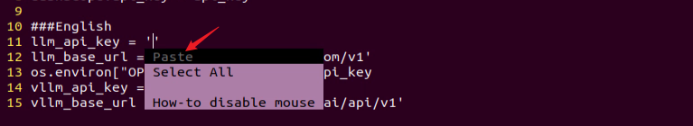

④  After pasting, press the **'Esc'** key, then type the following command and press Enter to save the file:

```
:wq
```

(4) Running the Demo Program

Once the keys are configured, you can run the demo program (openai_llm_demo.py) to experience the text generation capabilities of the large model. For example, the program's prompt might be: 'Write a 50-word article about how technology is changing life.'


① To run the demo, enter the following command in the terminal:

```
python3 openai_llm_demo.py
```

② After running the program, the output will appear as shown in the image below.


* **Semantic Understanding with Large Language Model**

Before starting this section, make sure you have completed the API key configuration outlined in the file [12.1.1 Large Language Model Courses -\> Large Language Model Accessing](#anchor_12_1_1_3).

In this lesson, we'll use a large language model to analyze and summarize short passages of text.

(1) Start by opening a new terminal window, then navigate to the large model project directory:

```
cd large_models/
```

(2) Next, run the demo program with the following command:

```
python3 openai_llm_nlu_demo.py
```

(3) As shown in the output, the model demonstrates strong summarization abilities.


(4) The result matches the prompt defined in the program — where a passage of text is provided to the model, and it generates a concise summary.


* **Emotional Perception with Large Language Model**

To proceed with this section, ensure that you have completed the API key configuration as described in the file [12.1.1 Language Model Courses -> Large Language Model Accessing](#anchor_12_1_1_3).

In this lesson, we will use a large language model to assess its ability to perceive emotions based on descriptive words. We'll provide the model with emotional expressions and evaluate its response.

(1) Start by opening a new terminal window, then navigate to the large model project directory:

```
cd large_models/
```

(2) Next, run the demo program with the following command:

```
python3 openai_llm_er_demo.py
```

(3) From the output, you will see that the model successfully identifies and understands the emotions conveyed, providing a text-based response accordingly.


(4) In this program, we send two emotional expressions to the model: the first is an expression of sadness, **"So Sad"**. After the model responds, we then send an expression of happiness, "**Ha Ha**", and observe how the model reacts.


### 12.1.2 Large Speech Model Courses

* **Overview of Large Speech Model**

(1) What is a Large Speech Model?

A Speech Large Model (LSM) refers to a machine learning model that uses deep learning techniques to process and understand speech data. These models can be applied in a variety of tasks, such as speech recognition, speech synthesis, speech translation, and emotional analysis of speech. The design and training of these models typically require large amounts of speech data and substantial computational resources, which is why they are referred to as "**large models**".

(2) Why Do We Need Large Speech Model?

With the advancement of artificial intelligence and deep learning, traditional speech processing methods face many limitations. Large models leverage vast amounts of data and deep neural networks to learn and understand the complex features within speech, thereby improving the accuracy and naturalness of speech recognition and generation.

Their advantages include:

① High Accuracy: They maintain a high recognition rate even in noisy environments and with various accents.

② Naturalness: Speech generated by synthesis models is more natural, closely resembling human speech.

③ Versatility: These models support a wide range of languages and tasks, such as multilingual speech recognition, speech-to-text (STT), text-to-speech (TTS), and emotion recognition.

(3) Development of Speech Recognition Technology

Word-Level Speech Recognition: At this stage, speech recognition systems could only recognize individual words

Phrase-Level Speech Recognition: With the expansion of data and advancements in algorithms, speech recognition systems gradually gained the ability to recognize longer phrases, such as "**Please turn on my computer**".

Sentence-Level Speech Recognition: In recent years, with the emergence of AI large models, speech recognition systems have become capable of recognizing entire sentences and understanding their underlying meaning.

(4) Differences Between Large Speech Model and Traditional Speech Processing Technologies

① Processing Methods

Traditional Speech Processing Technologies: These typically rely on manual feature extraction and shallow models, such as Gaussian Mixture Models (GMM) and Hidden Markov Models (HMM), to process speech signals.

Large Speech Model: These use end-to-end learning, directly mapping raw speech waveforms to target outputs (such as text or another speech signal), reducing the reliance on manual feature extraction. They are typically based on deep learning architectures, such as Convolutional Neural Networks (CNN), Recurrent Neural Networks (RNN), and Transformers.

② Model Complexity

Traditional Speech Processing Technologies: These models are relatively simple, with fewer parameters.

Large Speech Model: These models have complex structures and a large number of parameters, enabling them to capture more subtle speech features and contextual information.

③ Recognition Capability

Traditional Speech Processing Technologies: These are highly adaptable to specific scenarios and conditions, but their recognition capability is limited when encountering new, unseen data.

Large Speech Model: Due to their large number of parameters and powerful learning ability, they offer superior recognition capabilities and can adapt to a wider variety of speech data and environments.

④Training Data Requirements

Traditional Speech Processing Technologies: These typically require less data for training, but the data must be highly annotated and of high quality.

Large Speech Model: These require vast amounts of training data to fully learn the complexities of speech, often necessitating large quantities of annotated data or the use of unsupervised/self-supervised learning methods.

(5) Core Technologies of Speech Large Model

① Automatic Speech Recognition (ASR)

ASR is the technology that converts human speech into text. The core steps of a speech recognition system include feature extraction, acoustic modeling, and language modeling.

② Text-to-Speech (TTS)

TTS is the technology that converts text into speech. Common speech synthesis models include the Tacotron series, FastSpeech, and VITS.

③ Speech Enhancement and Noise Reduction

Speech enhancement techniques are used to improve the quality of speech signals, typically for eliminating background noise and echoes. This is crucial for speech recognition applications in noisy environments.

(6) Applications of Speech Large Model

Intelligent Voice Assistants: For instance, Amazon Alexa and Google Home, which engage with users through voice interactions.

Customer Service Chatbots: In the customer service sector, speech large models assist businesses in enhancing service efficiency by swiftly processing customer inquiries through speech recognition technology, enabling 24/7 support.

Healthcare: Helping doctors with medical record-keeping, thus improving work efficiency.

Speech-to-Text: Speech large models excel in converting speech to text, offering accurate recognition and transcription in a variety of contexts. They are widely used in applications such as meeting transcription and subtitle generation.

* **Voice Device Introduction and Testing**

(1) Device Overview

① 6-Microphone Circular Array

Introduction：

The 6-Microphone Circular Array is a high-sensitivity, high signal-to-noise ratio microphone board. It features six analog silicon microphones arranged in a circular pattern. When paired with a main control board, it supports high-performance Acoustic Echo Cancellation (AEC), environmental noise reduction, and factory-level voice pickup from up to 10 meters.


Features and Specifications：

**Operating Voltage:** 3.3V (typical)

**Operating Current:** 0.8mA (typical)

**Operating Temperature:** -20°C (min), 25°C (typical), 70°C (max)

**Operating Humidity:** Up to 95% relative humidity (max)

(1) Recording and Playback Test

The following demonstration uses the Raspberry Pi 5 as an example. The connection and testing steps are also applicable to other compatible devices such as the Jetson series:

① Connection Illustration and Detection


If the main controller is a Raspberry Pi, you can use VNC remote desktop access (refer to the appendix: Remote Access and File Transfer) to log into the Raspberry Pi system. Once connected, check the upper right corner of the desktop for microphone and speaker icons. As shown in the image below, the presence of these icons indicates a successful connection.


If you're using a NVIDIA Jetson device, you can connect via the NoMachine remote access tool. After logging in, check the upper right corner of the system interface for the speaker icon to confirm successful detection.


② Recording Test

Next, open a new terminal window and enter the following command to check the available recording devices. Note that the -l option is a lowercase "**L**". You should see the card number (card) listed—for example, card 0. This is just an example; please refer to your actual query result.

```
arecord -l
```


Then, use the following command to start recording. Replace the red-marked card number (hw:0,0) with the actual number you found in the previous step:

```
arecord -D hw:0,0 -f S16_LE -r 16000 -c 2 test.wav
```

This will create a test.wav audio file in the current directory.

You can record a short 5-second sample, then press Ctrl + C to stop the recording.

③ Playback Test

After the recording is complete, you can check whether the audio file was successfully created by listing the contents of the current directory:

```
ls
```


If test.wav appears in the list, the recording was successful. To play back the recording, use the following command:

```
aplay test.wav
```

* **Voice Wake-Up**

In this lesson, we'll learn how to use a large speech model to activate the voice device by speaking a predefined wake word through a program.

(1) WonderEcho Pro Wake-Up

Device Check：

To proceed, we need to identify the USB device name assigned to the connected WonderEcho Pro or voice device (hereafter referred to as the voice device). Please follow the steps below carefully. 

> [!NOTE]
> 
>Do not connect any other USB devices during this process to avoid confusion.

① First, disconnect the voice device, then open a terminal and run the following command:

```
ll /dev | grep USB
```

② Next, reconnect the voice device to the USB port on your main board and run the same command again:

```
ll /dev | grep USB
```

③ You should now see a newly listed USB port, such as ttyCH341USB1.  

Please take note of this device name—it may vary depending on the main controller being used.


Wake-Up Test：

① To begin, update the port number used in the program by editing the script. You'll also need to uncomment the line for the port you're using and comment out any unused ports.

```
vim wakeup_demo.py
```

Press i to enter edit mode and make the necessary changes as shown below (update the port number accordingly and adjust comments as needed).


Once the changes are complete, press ESC, then type :wq and press Enter to save and exit the editor.

② Next, return to the system interface and run the wake-up demo using the command below. Speak the wake word **"HELLO HIWONDER"** clearly toward the WonderEcho Pro voice device.  

If the output includes **"keyword detect"**, it indicates that the firmware has been successfully flashed and the wake word is functioning correctly.

```
python3 ~/large_models/wakeup_demo.py
```


(2) 6-Microphone Circular Array

As with the WonderEcho Pro, you can connect the 6-Microphone Circular Array to your main board (Raspberry Pi or NVIDIA Jetson) using a Type-C to USB cable.

Device Check:

For Jetson users, connect to the Jetson system using the NoMachine remote access tool. Once connected, check the desktop interface.  

If the 6-Microphone Circular Array icon appears on the left side of the desktop, it indicates the device has been successfully recognized.

Wake-Up Test:

① Open a new terminal window and run the following command to edit the wakeup_demo.py script:

```
vim ~/large_models/wakeup_demo.py
```

② Press i to enter edit mode.

③ Update the port to match the device port number you previously identified. Comment out the WonderEcho Pro configuration (add \# at the beginning of the corresponding line), and uncomment the line using the voice device on line 11 as the input device (see red box in the referenced image).

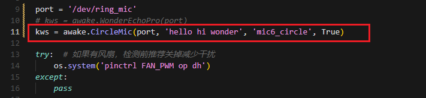

④ Press ESC to return to command mode, then type :wq and press Enter to save and exit.


⑤ In the terminal, run the wake-up program with the following command:

```
python3 ~/large_models/wakeup_demo.py
```

⑥ After about 30 seconds of initialization, speak the wake word **"hello hiwonder"** to test the device.


(3) Brief Program Overview

This is a Python-based wake word detection script that utilizes the speech module to process audio input and detect a specific wake word (e.g., "**HELLO_HIWONDER**").

Source Code Path: `/home/ubuntu/large_models/wakeup_demo.py`

Importing Required Modules

{lineno-start=5}

```
import os
import time
from speech import awake
```

`os`: Used for handling file paths and executing system-level commands.

`time`: Provides delay functions to prevent overly frequent detection attempts.

`speech`: The core module responsible for processing audio input and detecting the wake word.

Initializing the wonderecho Class

{lineno-start=9}

```
port = '/dev/ttyUSB0'
kws = awake.WonderEchoPro(port)
```

Attempts to Turn Off the Cooling Fan on Raspberry Pi 5

{lineno-start=13}

```
try:  # If a fan is present, it's recommended to turn it off before detection to reduce interference
    os.system('pinctrl FAN_PWM op dh')
except:
    pass
```

Purpose: Attempts to turn off the cooling fan by executing the system command `pinctrl FAN_PWM op dh`. This helps minimize background noise from the fan that could interfere with wake word detection.

Error Handling: If the command fails (e.g., due to unsupported hardware), the program catches the exception and continues running without interruption.

Main Wake Word Detection Loop

{lineno-start=18}

```
kws.start() # Start detection(开始检测)
print('start...')
```

The program starts the wake word detection thread using kws.start().

It prints start... to indicate that detection has been successfully initiated.

Main Program Logic

{lineno-start=20}

```
while True:
    try:
        if kws.wakeup(): # Wake-up detected(检测到唤醒)
            print('hello hiwonder')
        time.sleep(0.02)
    except KeyboardInterrupt:
        kws.exit() # Cancel processing (关闭处理)
        try:
            os.system('pinctrl FAN_PWM a0')
        except:
            pass
        break
```

During each iteration, the program checks whether the wake word has been detected. If the wake word is detected, it prints keyword detected.

The detection frequency is controlled using time.sleep(0.02) to prevent excessive CPU usage.

Pressing Ctrl+C triggers a KeyboardInterrupt, which gracefully exits the detection loop.

Upon exit, the program calls kws.exit() to stop the wake word detection process.

The fan is then restored to its original state (if applicable).

(4) Extended Functionality

Modifying the Wake-Up Response Text

In this section, you'll learn how to change the message that appears after a successful wake word detection.

① For example, if the wake word "**HELLO_HIWONDER**" is detected, and you'd like the program to print "**hello**" instead of the default message, follow the steps below. Navigate to the large_models directory and open the script with:

```
vim wakeup_demo.py
```

② Press i to enter INSERT mode (you'll see -- INSERT -- at the bottom of the screen). Locate the line '**print('hello hiwonder')**', and modify it to 'print('hello')'

```
i
```


③ Press ESC, then type **:wq** and press Enter to save and exit.

```
:wq
```

④ Finally, run the program with:

```
python3 wakeup_demo.py
```

(5) Creating Custom Firmware for WonderEchoPro

If you'd like to create more advanced or customized wake words and voice commands, please refer to the document titled:  

"[**Appendix →  Firmware Flashing Tool → Creating Firmware for WonderEchoPro**](https://drive.google.com/drive/folders/1Na86By9er9Jj1_1YXz3sxAwePrIgSUcN?usp=sharing)".

* **Speech Recognition**

(1) What is Speech Recognition?

Speech Recognition (Speech-to-Text, STT) is a technology that converts human speech signals into text or executable commands. In this course, we will implement speech recognition functionality using Alibaba OpenAI's Speech Recognition API.

(2) How It Works

The wave library is used to extract audio data. The extracted audio is then sent to OpenAI's ASR (Automatic Speech Recognition) model. The recognized text returned by the ASR model is stored in speech_result for use in subsequent processes.

(3) Preparation Before the Experiment

Before proceeding, refer to the course "[**12.1.1 Large Speech Model Courses -> Large Language Model Deployment**](#anchor_12_1_1_2)" to obtain your API key, and make sure to add it into the configuration file (config).

(4) Experiment Steps

① Power on the device and connect to it using MobaXterm.  

(For detailed instructions, please refer to [Appendix ->Remote Connection Tools and Instructions](https://drive.google.com/drive/folders/17mfRH9lmP9OYO4_LAyzkRnHfytqRYldJ?usp=sharing).)

② Navigate to the program directory by entering the following command:

```
cd large_models/
```

③ Open the configuration file to input your API Key by entering the command below. Press i to enter INSERT mode and enter your API Key. Once finished, press Esc, type :wq, and hit Enter to save and exit.

```
vim config.py
```


④ Run the speech recognition program with:

```
python3 openai_asr_demo.py
```

(5) Function Realization

After the program starts, the microphone will recognize the recorded audio content from the user and print the converted text output.


(6) Brief Program Analysis

This program implements a speech recognition system by calling OpenAI's Speech-to-Text API to convert audio files into text.

The program source code is located at: `/home/ubuntu/large_models/openai_asr_demo.py`

① Module Import

{lineno-start=6}

```
from speech import speech
```

The speech module encapsulates ASR (Automatic Speech Recognition) functionalities, such as connecting to an external ASR service.

② Define ASR Class

{lineno-start=11}

```
asr = speech.RealTimeOpenAIASR()
```

asr = speech.RealTimeOpenAIASR()

This line creates a real-time speech recognition object named asr. The RealTimeOpenAIASR class is used to interact with the speech recognition service.

③ Speech Recognition Functionality

{lineno-start=13}

```
asr.update_session(model='whisper-1', language='en', threshold=0.2, prefix_padding_ms=300, silence_duration_ms=800) 
```

An ASR client object is created to prepare for invoking the speech recognition service.

The asr.asr() method is called to send the audio file (wav) to the ASR service for recognition.

The recognized result (typically text) is printed to the console.

(7) Function Extension

You can modify the model name to enable speech recognition in various languages, such as Chinese, English, Japanese, and Korean.

① Enter the following command to edit the script:

```
vim openai_asr_demo.py
```

② Press the i key to enter INSERT mode, and update the model setting. For example, modify it to use the gpt-4o-transcribe model.

```
i
```

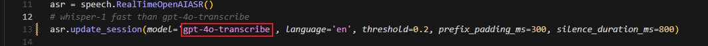

③ Then, run the program with the command:

```
python3 openai_asr_demo.py
```

④ Record a sample sentence such as "**Hello, can you hear me clearly?**", and the recognized text will be printed on the console.


* **Speech Synthesis**

(1) What is Speech Synthesis?

Speech synthesis (SS) is a technology that converts written text into intelligible spoken audio. It enables computers to generate natural, human-like speech for communication or information delivery.

In this course, we will run a program that processes text using a large language model and generates corresponding audio.

(2) How It Works

The program first sends the text to the OpenAI TTS (Text-to-Speech) model. The model returns the generated audio data, which is saved as a file named tts_audio.wav for playback or storage.

(3) Preparation Before the Experiment

Refer to the course "[**12. Large AI Model Course -> Large Language Model Deployment**](#anchor_12_1_1_2)" to obtain your API key, and update the configuration file accordingly.

(4) Experiment Steps

① Power on the device and connect to it using MobaXterm "(**refer to the [appendix -> Remote Connection Tools and Instructions](https://drive.google.com/drive/folders/17mfRH9lmP9OYO4_LAyzkRnHfytqRYldJ?usp=sharing) for detailed guidance**)".

② Navigate to the program directory by entering the following command:

```
cd large_models/
```

③ Open the configuration file to enter your API Key. After editing, press Esc, type :wq, and hit Enter to save and exit:

```
vim config.py
```


④ Finally, run the program with the following command:

```
python3 openai_tts_demo.py
```

(5) Function Realization

Upon running the program, it will play an audio message saying "**Hello, Can I Help You**", and simultaneously save the audio file with the same content to the following directory:  

`/home/ubuntu/large_models/resources/audio/`


(6) Brief Program Analysis

This program is a speech synthesis system based on OpenAI's Text-to-Speech (TTS) API, capable of converting text into audio files. It supports input text and outputs audio in formats like PCM, WAV, FLAC, AAC, Opus, and MP3. By specifying the desired text, the program sends the request to the API and returns the synthesized audio, which can be played or saved locally.

The source code for this program is located at:  `/home/ubuntu/large_models/openai_tts_demo.py`

① Module Import

{lineno-start=5}

```
from config import *
from speech import speech  
```

speech: This module encapsulates the TTS functionalities.

② Definition for TTS Class

{lineno-start=8}

```
tts = speech.RealTimeOpenAITTS()
tts.tts("Hello, Can I help you?") # https://platform.openai.com/docs/guides/text-to-speech
tts.tts("Hello, Can I help you?", model="tts-1", voice="onyx", speed=1.0, instructions='Speak in a cheerful and positive tone.')
tts.save_audio("Hello, Can I help you?", model="gpt-4o-mini-tts", voice="onyx", speed=1.0, instructions='Speak in a cheerful and positive tone.', audio_format='wav', save_path="./resources/audio/tts_audio.wav")
```

`speed`: Specifies the playback speed; the default value is 1.

For intelligent real-time applications, it is recommended to use the gpt-4o-mini-tts model. 

Other available models include tts-1 and tts-1-hd. tts-1 offers lower latency but with slightly reduced quality compared to tts-1-hd.

Voice Options: nova, shimmer, echo, onyx, fable, alloy, ash, sage, coral.

For more details, you can refer to the OpenAI documentation:

<https://platform.openai.com/docs/guides/text-to-speech>

③ Function Extension

To change the voice, follow these steps:

Step1 : Open the program by entering the command:

```
vim openai_tts_demo.py
```

Step2 : Press i on your keyboard to enter INSERT mode. Locate the line voice="**onyx**" and modify it to voice="**nova**".

```
i
```


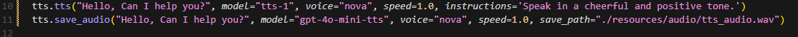

Step3 : Press Esc, then type :wq and hit Enter to save and exit.

```
:wq
```


Step4 : Execute the program with the following command:

```
python3 openai_tts_demo.py
```


Once the program starts, the speaker will play the synthesized audio using the newly selected voice style.

* **Voice Interaction**

(1) What is Voice Interaction?

Voice Interaction (VI) refers to a method of communication between humans and computers or devices through spoken language. It integrates speech recognition and speech synthesis, enabling devices to both understand user commands and respond naturally, creating true two-way voice communication. To achieve natural voice interaction, factors such as semantic understanding and sentiment analysis must also be considered, allowing the system to accurately interpret user intent and provide appropriate responses.

This approach can be used as the foundation for developing our own AI assistant features.

(2) How It Works

First, the wake word detection module listens for a specific wake-up word. Once detected, it initiates audio recording. After recording, Automatic Speech Recognition (ASR) converts the audio into text, which is then sent to a Large Language Model (LLM) to generate an appropriate response. The generated text is subsequently converted into speech through a Text-to-Speech (TTS) module and played back to the user. This entire process enables seamless and natural interaction between the user and the voice assistant.

(3) Experiment Steps

① Power on the device and connect to it via MobaXterm (refer to Appendix "**5.1 Remote Connection Tools and Instructions**" for connection guidance).

② To check the microphone's port number, first disconnect the microphone and run the command. Then reconnect the microphone and run the command again to determine the port number (Note: do not connect any other USB devices during this process).

```
ll /dev | grep USB
```

After disconnecting the microphone, no USB device should appear.


Upon reconnecting the microphone, a USB port (e.g., ttyCH341USB1) will be listed (make sure to note this device name). The device name may vary depending on the main controller.

③ Navigate to the program directory:

```
cd large_models/
```

④ Open the configuration file to enter your API Key. After editing, press Esc, then type :wq and hit Enter to save and exit:

```
vim config.py
```


⑤ Enter the port number you obtained and modify the corresponding microphone port settings for either WonderEcho Pro or the six-microphone setup. Uncomment the configuration for the port you intend to use and comment out the settings for any unused ports.

```
vim openai_interaciton_demo.py
```

If you are using the WonderEcho Pro, modify the corresponding section:

If you are using the 6-Microphone Array, modify the relevant section:


⑥ Run the program:

```
python3 openai_interaciton_demo.py
```

⑦ To stop the program at any time, simply press Ctrl+C.

(4) Function Realization

After successful execution, the voice device will announce 'I'm ready.' Then, upon hearing the wake-up word 'HELLO_HIWONDER,' the device will respond with 'I'm here,' indicating that the assistant has been successfully awakened. You can now ask the AI assistant any questions:

For example: 'What are some fun places to visit in New York?'


(5) Brief Program Analysis

The program integrates voice recognition, speech synthesis, and intelligent response functionalities to create a voice assistant. Interaction is initiated through the wake-up word (HELLO_HIWONDER). Users can converse with the assistant via voice commands, and the assistant will respond using text-to-speech technology. The overall structure is clear, with distinct modules that are easy to expand and maintain.

The source code for this program is located at: `/home/ubuntu/large_models/openai_interaction_demo.py`

(1) Module Import

{lineno-start=5}

```
import os
import time
from config import *
from speech import awake
from speech import speech
```

time: Used to control the interval between program executions.

speech: The core module, integrating wake-up word detection, speech activity detection, speech recognition, TTS, and LLM.

(2) Definition of Audio File Paths

{lineno-start=11}

```
wakeup_audio_path = './resources/audio/en/wakeup.wav'
start_audio_path = './resources/audio/en/start_audio.wav'
no_voice_audio_path = './resources/audio/en/no_voice.wav'
```

This section configures the audio file paths used by various functional modules, such as wake-up sounds, recording storage paths, and prompt sounds.

The text-to-speech (TTS) module is initialized to convert LLM responses into speech.

(3) Main Functional Logic

{lineno-start=33}

```
def main():
    kws.start()
    while True:
        try:
            if kws.wakeup(): # Wake word detected(检测到唤醒词)
                speech.play_audio(wakeup_audio_path)  # Play wake-up sound(唤醒播放)
                asr_result = asr.asr() # Start voice recognition(开启录音识别)
                print('asr_result:', asr_result)
                if asr_result:
                    # Send the recognition result to the agent for a response(将识别结果传给智能体让他来回答)
                    response = client.llm(asr_result, model='gpt-4o-mini')
                    print('llm response:', response)
                    tts.tts(response)
                else:
                    speech.play_audio(no_voice_audio_path)
            time.sleep(0.02)
        except KeyboardInterrupt:
            kws.exit() 
            try:
                os.system('pinctrl FAN_PWM a0')
            except:
                pass
            break
        except BaseException as e:
            print(e)
```

Wake-up Detection: Continuously monitors for the wake-up word. Once detected, it stops the wake-up detection and plays the wake-up prompt sound.

Voice Processing: Records and recognizes the user's speech, uses the language model to generate a response, and then converts the response into speech for playback.

Error Handling: Catches exit signals and runtime errors to ensure the program exits safely and releases resources.

### 12.1.3 Vision Language Model Courses

* **Overview of Vision Language Model**

Vision Language Model (VLM) integrate visual recognition capabilities into traditional Language Model (LLM), enabling more powerful interactions between vision and language through multimodal inputs.

(1) Basic Concept

Vision Language Model (VLM) are a type of artificial intelligence model that leverages deep learning techniques to learn from and process large-scale visual data. These models often adopt convolutional neural network (CNN) architectures, enabling them to extract rich visual features from images or video streams and perform various tasks such as image classification, object detection, and facial recognition. In theory, VLM possess powerful capabilities in feature extraction and pattern recognition, making them widely applicable in fields like autonomous driving, facial recognition, and medical imaging analysis.

(2) Features

**Multimodal Input and Output**: VLM can process both images and text as input and generate various forms of output, including text, images, charts, and more.

**Powerful Visual-Semantic Understanding**: With extensive knowledge accumulated from large-scale visual datasets, VLMsexcel at tasks such as object detection, classification, and image captioning.

**Visual Question Answering (VQA):** VLM can engage in natural language conversations based on the content of input images, accurately answering vision-related questions.

**Image Generation:** Some advanced VLM are capable of generating simple image content based on given conditions.

**Deep Visual Understanding:** These models can recognize intricate details within images and explain underlying logical and causal relationships.

**Cross-Modal Reasoning:** VLM can leverage visual and linguistic information together, enabling reasoning across modalities, such as inferring from language to vision and vice versa.

**Unified Visual and Language Representation Space:** By applying attention mechanisms, VLM establish deep connections between visual and semantic information, achieving unified multimodal representations.

**Open Knowledge Integration:** VLM can integrate both structured and unstructured knowledge, enhancing their understanding of image content.

(3) How It Works

The working principle of Vision Language Model is primarily based on deep learning techniques, particularly Convolutional Neural Networks (CNNs) and Transformer architectures. Through multiple layers of neurons, these models perform feature extraction and information processing, enabling them to automatically recognize and understand complex patterns within images.

In a VLM, the input image first passes through several convolutional layers, where local features such as edges, textures, and shapes are extracted. Each convolutional layer is typically followed by an activation function (e.g., ReLU) to introduce non-linearity, allowing the model to learn more complex representations. Pooling layers are often used to reduce the dimensionality of the data while preserving important information, helping to optimize computational efficiency.

As the network deepens, it gradually transitions from extracting low-level features (like edges and corners) to higher-level features (such as objects and scenes). For classification tasks, the final feature vector is passed through fully connected layers to predict the probability of different target categories. For tasks like object detection and segmentation, the model outputs bounding boxes or masks to indicate the location and shape of objects within the image.

Transformer-based VLM divide images into small patches, treating them as sequential data, and apply self-attention mechanisms to capture global relationships within the image. This approach is particularly effective at modeling long-range dependencies, enabling VLM to excel at understanding complex visual scenes.

Training VLM typically requires large-scale labeled datasets. Through backpropagation, the model optimizes its parameters to minimize the loss between predictions and ground-truth labels. Pretraining on massive datasets allows the model to acquire general-purpose visual features, while fine-tuning on specific tasks further improves performance for specialized applications.

Thanks to this design, Visual Language Models are able to process and understand visual data effectively, and are widely used in applications like image classification, object detection, and image segmentation, driving rapid progress in the field of computer vision.

(4) Application Scenarios

① Image Captioning

VLM can automatically generate textual descriptions based on input images. This capability is particularly valuable for social media platforms, e-commerce websites, and accessibility technologies, such as providing visual content descriptions for visually impaired users.

② Visual Question Answering

Users can ask questions related to an image, such as "**What is in this picture?**" or "**What color is the car?**" The model analyzes the image content and provides accurate, natural-language responses, making it highly applicable in fields such as education, customer support, and information services.

③ Image Retrieval

In image search engines, users can perform searches using text descriptions, and Vision Language Model (VLM) can understand the descriptions and return relevant images. This capability is especially important on e-commerce platforms, where it allows users to find desired products more intuitively.

④ Augmented Reality (AR)

Vision Language Model (VLM) can provide real-time visual feedback and language-based explanations in augmented reality applications. When users view real-world scenes through a device's camera, the system can overlay relevant information or guidance, enhancing the overall user experience.

⑤ Content Creation and Editing

In design and creative tools, Vision Language Model (VLM) can generate relevant text content or suggestions based on a user's visual input (such as sketches or images), helping users complete creative work more efficiently.

⑥ Social Media Interaction

On social media platforms, VLM can generate appropriate comments or tags based on user-uploaded images, enhancing engagement and interaction.

⑦ Medical Imaging Analysis

In the healthcare field, VLM can be used to analyze medical images (such as X-rays and CT scans) and generate diagnostic reports or recommendations, assisting doctors in making more accurate decisions.

<p id="anchor_12_1_3_2"></p>

* **Vision Language Model Accessing**

> [!NOTE]
>
>* This section requires the configuration of the API key in "[**12.1.3 Vision Language Model Accessing -> Vision Language Model Accessing**](#anchor_12_1_3_2)" before proceeding. Additionally, ensure that the images to be used in this section are imported.

>* This experiment requires either an Ethernet cable or Wi-Fi connection to ensure the main control device can access the network properly.

(1) Experiment Steps

Execute the following command to navigate to the directory of Large Model.

```
cd large_models/
```

Run the program:

```
python3 openai_vllm_understand.py
```

(2) Function Realization

After running the program, the output printed matches our request of "**Describe the image**".


* **Vision Language Model: Object Detection**

> [!NOTE]
>
>* This section requires the configuration of the API key in "[**12.1.3 Vision Language Module Courses -> Vision Language Model Accessing**](#anchor_12_1_3_2)" before proceeding. Additionally, ensure that the images to be used in this section are imported.

>* This experiment requires either an Ethernet cable or Wi-Fi connection to ensure the main control device can access the network properly.

>* In this course, we will use a program to transmit an image to the large model for recognition, which will then identify and locate the objects within the image by drawing bounding boxes around them.

(1) Experiment Steps

① Execute the following command to navigate to the directory of Large Model.

```
cd large_models/
```

② Run the program:

```
python3 qwen_vllm_detect_demo.py
```

(2) Function Realization

After running the program, the positions of the fruits in the image will be circled.


(3) Function Expansion

We can switch the image and change the large model to experience different functionalities of various models.

Change Pictures:

① Click on the path box to navigate to the following directory: `/home/ubuntu/large_models/resources/pictures/`

Here, you can drag in other images, for example, in the apples.png format.


② Then, input the command:

```
vim large_models/qwen_vllm_detect_demo.py
```

③ Press the "**i**" key on your keyboard, which will display **"INSERT"** at the bottom.

```
i
```


④ Change the image recognition path from: `./resources/pictures/test_image_understand.jpeg`

To: image = cv2.imread('./resources/pictures/apples.png')


⑤ Next, input the following command and execute the program again to see the results

```
python3 qwen_vllm_detect_demo.py
```


* **Vision Language Model: Scene Understanding**

> [!NOTE]
>
>* This section requires the configuration of the API key in "[**Vision Language Model Accessing**](#anchor_12_1_3_2)" before proceeding. Additionally, ensure that the images to be used in this section are imported.
>
>* This experiment requires either an Ethernet cable or Wi-Fi connection to ensure the main control device can access the network properly.
>
>* In this course, we will use a program to send an image to the large model for recognition and generate a description of the content within the image.

(1) Experiment Steps

① Execute the following command to navigate to the directory of Large Model.

```
cd large_models/
```

② Run the program:

```
python3 openai_vllm_understand.py
```

(2) Function Realization

After running the program, the output printed matches our request of "**Describe the image**".


(3) Function Expansion

If you need to recognize your own image, you should place the image in the corresponding path and modify the image path in the program.

① First, drag your image directly into the ~/large_models/resources/pictures/ path using MobaXterm, and rename the image to test.png.


② Then, open the scene understanding script by entering the following command in the terminal:

```
vim ~/large_models/vllm_understand.py
```

③ Change the image path in the code to reflect the name of your image (e.g., test.png).


④ Run the program:

```
python3 ~/large_models/openai_vllm_understand.py
```


* **Vision Language Model: Optical Character Recognition** 

> [!NOTE]
>
>* This section requires the configuration of the API key in "**[1.3.2 Vision Language Model Accessing](#anchor_12_1_3_2)**" before proceeding. Additionally, ensure that the images to be used in this section are imported.
>
>* This experiment requires either an Ethernet cable or Wi-Fi connection to ensure the main control device can access the network properly.
>
>* In this course, we use a program to transmit an image to the large model for recognition, extracting and identifying the text within the image.

(1) Experiment Steps

① Execute the following command to navigate to the directory of Large Model.

```
cd large_models/
```

② Run the program:

```
python3 openai_vllm_ocr.py
```

(2) Function Realization

After running the program, the output printed will be consistent with the content of the image sent.


(3) Function Expansion

We can switch the image and change the large model to experience different functionalities of various models.

Change Pictures：

① Drag the image directly into the `~/large_models/resources/pictures/` path using MobaXterm. Here, we can drag in the image named 'ocr1.png' as an example, and let the program recognize the text 'COME ON'.


② Then, input the command:

```
vim ~/large_models/openai_vllm_ocr.py
```

③ Press the **"i"** key on your keyboard, which will display **"INSERT"** at the bottom.

```
i
```

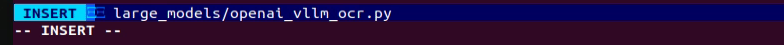

④ Change the image recognition path from: ./resources/pictures/ocr.jpeg

To: image = cv2.imread('./resources/pictures/ocr1.png')

```
image = cv2.imread('./resources/pictures/ocr1.png)
```

⑤ Run the program:

```
python3 ~/large_models/openai_vllm_ocr.py
```


### 12.1.4 Multimodal Model Basic Courses

* **Overview of Multimodal Model**

The emergence of Multimodal Model is built upon continuous advancements in the fields of Large Language Model (LLM) and Vision Language Model (VLM).

(1) Basic Concept

As LLM continue to improve in language understanding and reasoning capabilities, techniques such as instruction tuning, in-context learning, and chain-of-thought prompting have become increasingly widespread. However, despite their strong performance on language tasks, LLM still exhibit notable limitations in perceiving and understanding visual information such as images. At the same time, VLM have made significant strides in visual tasks such as image segmentation and object detection, and can now be guided by language instructions to perform these tasks, though their reasoning abilities still require further enhancement.

(2) Features

The core strength of Multimodal Model lies in their ability to understand and manipulate visual content through language instructions. Through pretraining and fine-tuning, these models learn the associations between different modalities—such as how to generate descriptions from images or how to identify and classify objects in visual data. Leveraging self-attention mechanisms from deep learning, Multimodal Model can effectively capture relationships across modalities, allowing them to synthesize information from multiple sources during reasoning and decision-making processes.

**Multimodal Fusion Capability:** Multimodal Model can process and understand multiple types of data simultaneously, including text, images, and audio. This fusion ability enables the models to build connections across modalities, leading to a more comprehensive understanding of information. For instance, a model can generate natural language descriptions based on an image or identify specific objects within an image based on a text query.

**Enhanced Contextual Understanding:** By integrating information from different modalities, Multimodal Model excel at contextual understanding. They can not only recognize content within a single modality but also combine clues from multiple sources to make more accurate judgments and decisions in complex tasks.

**Flexible Interaction Methods:** Users can interact with Multimodal Model through natural language instructions, making communication with the models more intuitive without requiring knowledge of complex programming or operations. For example, users can simply ask about details in an image, and the model can provide relevant answers.

**Scalability:** The architecture and training methods of Multimodal Model allow them to adapt to new modalities and tasks. As technology evolves, additional types of data—such as videos or sensor readings—can be incorporated, expanding their range of applications and capabilities.

**Strong Generative Capabilities:** Similar to large language models, Multimodal Model perform exceptionally well in generating both textual and visual content. They can produce natural language descriptions, summaries, and even create novel visual outputs, meeting a wide variety of application needs.

**Improved Reasoning Abilities:** Although challenges remain, Multimodal Model demonstrate significantly enhanced reasoning capabilities compared to traditional single-modality models. By integrating multimodal information, they can reason effectively in more complex scenarios, supporting advanced tasks such as logical reasoning and sentiment analysis.

**Adaptability and Personalization:** Multimodal Model can be fine-tuned to meet user-specific needs and preferences, enabling highly personalized services. This adaptability offers great potential for applications in fields such as education, entertainment, and customer service.

(3) How It Works

The working principle of Multimodal Model is built upon advanced deep learning and neural network technologies, with a core focus on fusing data from different modalities to understand and tackle complex tasks. At the foundation, Multimodal Model often adopt architectures similar to Transformers, which are highly effective at capturing relationships between different parts of input data. During training, these models are exposed to massive amounts of multimodal data—such as images, text, and audio—and leverage large-scale unsupervised learning for pretraining. Through this process, the models learn the commonalities and differences across modalities, enabling them to grasp the intrinsic connections between various types of information.

In practice, incoming text and visual data are first embedded into a shared representation space. Text inputs are transformed into vectors using word embedding techniques, while images are processed through methods like Convolutional Neural Networks (CNNs) to extract visual features. These vectors are then fed into the model's encoder, where self-attention mechanisms analyze the relationships across modalities, identifying and focusing on the most relevant information.

After encoding, the model generates a multimodal contextual representation that blends both the semantic information of the text and the visual features of the image. When a user provides a natural language instruction, the MLLM parses the input and interprets the intent by leveraging the contextual representation. This process involves reasoning and generation capabilities, allowing the model to produce appropriate responses based on its learned knowledge, or to perform specific actions in visual tasks.

Finally, the Multimodal Model's decoder translates the processed information into outputs that users can easily understand—such as generating textual descriptions or executing targeted visual operations. Throughout this process, the emphasis is on the fusion and interaction of information across different modalities, enabling Multimodal Model to excel at handling complex combinations of natural language and visual content. This integrated working mechanism empowers Multimodal Model with powerful functionality and flexibility across a wide range of application scenarios.

(4) Application Scenarios

① Education

Multimodal Model can be used to create personalized learning experiences. By combining text and visual content, the model can provide students with rich learning materials—for example, explaining scientific concepts through a mix of images and text to enhance understanding. Additionally, in online courses, the model can dynamically adjust content based on the learner's performance, offering customized learning suggestions in real time.

② Healthcare

Multimodal Model can assist doctors in diagnosis and treatment decisions. By analyzing medical images (such as X-rays or MRIs) alongside relevant medical literature, the model helps doctors access information more quickly and provides evidence-based recommendations. This application improves diagnostic accuracy and efficiency.

③ Entertainment

Multimodal Model can be used for content generation, such as automatically creating stories, scripts, or in-game dialogues. By incorporating visual elements, the model can provide rich scene descriptions for game developers, enhancing immersion. Additionally, on social media platforms, Multimodal Model can analyze user-generated images and text to help recommend suitable content.

④ Advertising and Marketing

Multimodal Model can analyze consumer behavior and preferences to generate personalized advertising content. By combining text and images, ads can better capture the attention of target audiences and improve conversion rates.

Finally, Multimodal Model also play a role in scientific research. By processing large volumes of literature and image data, the model can help researchers identify trends, generate hypotheses, or summarize findings, accelerating scientific discovery.

* **Agent Behavior Orchestration**

> [!NOTE]
>
>* This section requires the configuration of the API key in "[**Vision Language Model Accessing**](#anchor_12_1_3_2)" before proceeding. Additionally, ensure that the images to be used in this section are imported.
>
>* This experiment requires either an Ethernet cable or Wi-Fi connection to ensure the main control device can access the network properly.
>
>* The purpose of this course experiment is to obtain data in a specified format returned by the large model based on the prompt words set in the model. During development, you can use the returned data for further tasks.

(1) Experiment Steps

① To check the microphone's port number, first disconnect the microphone and run the command. Then reconnect the microphone and run the command again to determine the port number (Note: do not connect any other USB devices during this process).

```
ll /dev | grep USB
```

After disconnecting the microphone, no USB device should appear.


Upon reconnecting the microphone, a USB port (e.g., ttyCH341USB1) will be listed (make sure to note this device name). The device name may vary depending on the main controller.

② Execute the following command to navigate to the directory of Large Model.

```
cd large_models/
```

③ Open the configuration file to enter your API Key. After editing, press Esc, then type :wq and hit Enter to save and exit:

```
vim config.py
```


④ Fill in the detected port number and update the corresponding microphone port settings for either the WonderEcho Pro or the Six-channel Microphone.  

Uncomment the port you wish to use and comment out the settings for any unused ports.

```
vim openai_agent_demo.py
```

Modify the settings as follows. For WonderEcho Pro, update the corresponding configuration


For 6-channel Microphone, update the respective settings:


⑤ Run the program:

```
python3 openai_agent_demo.py
```

⑥ The program will print the prompts configured for the large model. The large model will then return data formatted according to these prompts.


(2) Function Realization

① After running the program, the voice device will announce, **"I'm ready".** At this point, say **"HELLO_HIWONDER"** to the device to activate the agent.  

When the device responds with "**I'm here**", it indicates that the agent has been successfully awakened. To modify the wake word. For the Six-channel Microphone, refer to Section 2.3 Voice Wake-Up – 2. 6-Microphone Circular Array for instructions on customizing the wake word. For WonderEcho Pro, refer to Section "[**Firmware Flashing Tool->WonderEchoPro Firmware Generation**](https://drive.google.com/drive/folders/1Na86By9er9Jj1_1YXz3sxAwePrIgSUcN?usp=sharing)".

② After updating the wake word, you can say: "Take two steps forward, turn left and take one step back". The agent will respond according to the format we have defined.


<p id="anchor_12_2"></p>

## 12.2 Voice Module Introduction and Installation

### 12.2.1 Introduction to WonderEcho Pro

* **Overview**

WonderEcho Pro, also known as the AI Voice Interaction Box, is equipped with a high-performance noise-canceling microphone and a high-fidelity speaker. It uses a USB-to-audio module that is plug-and-play and requires no driver installation, and supports both playback and recording across multiple operating systems.

By integrating various voice processing modules, the voice recognition module uses advanced noise suppression algorithms to effectively filter background noise. It supports the entire voice interaction process—from wake word detection to speech recognition and response. Thanks to its modular design, each component can be independently developed and tested, such as wake word detection, voice activity detection, speech recognition, and synthesis.

* **Key Features & Specifications**

1.  Built-in microphone and speaker interface, supporting both audio input and output

2.  Plug-and-play functionality with driver-free operation. Compatible with multiple operating systems: Windows, macOS, Linux, Android

3.  USB 2.0 standard interface

4.  Control interface: USB

5.  Voice processing chip: CL1302

6.  Speaker output: 3.0W per channel (4Ω BTL)

7.  Power supply: 5V DC

* **Recording and Playback Test**

**Here's how to test recording and playback using a Raspberry Pi 5. The same steps also apply to compatible devices like the robots with Jetson controller.**

**1. Connection Setup & Detection**


If you're using a Raspberry Pi as the controller, you can use a remote desktop tool to access the Raspberry Pi desktop, such as VNC, see [4.1 Remote Control Tool Introduction and Installation](https://wiki.hiwonder.com/projects/LanderPi/en/latest/docs/1_LanderPi_User_Manual.html#development-environment-setup-and-configuration) in the user manual. Check the top-right corner of the screen for microphone and speaker icons. If these icons are present, the device has been successfully connected.


If you're using a Jetson device, you can connect via NoMachine and check the top-right corner of the desktop for a speaker icon to confirm the audio output is recognized.


**2. Recording Test**

(1) Open a terminal window. Run the following command to list available recording devices and find the card number 0. 

> [!NOTE]
>
> **`-l` is a lowercase L. This number may vary by device, so use the actual number listed.**

```
arecord -l
```


(2) Start recording with the following command, replacing the first `0` with the correct card number:

```
arecord -D hw:0,0 -f S16_LE -r 16000 -c 2 test.wav
```

(3) This will create a **test.wav** file in the current directory.


(4) You can try to speak into the microphone for around 5 seconds, then press **Ctrl + C** to stop recording.

**3. Playback Test**

(1) In the same terminal, run the command below to check if the test.wav file exists:

```
ls
```


(2) If you see **test.wav** in the list, the recording was successful. Play the audio using the command:

```
aplay test.wav
```

### 12.2.2 WonderEchoPro Installation

> [!NOTE]
>
> **When installing the WonderEcho Pro, ensure that the front of the robot is facing forward, and the USB port of the WonderEcho Pro is facing to the left, which is the direction of the Raspberry Pi's USB port.**


### 12.2.3 Firmware Flashing

In this lesson, we will learn how to flash firmware for WonderEcho Pro.

* **Firmware Flashing**

1. Connect the WonderEcho Pro to your computer using a Type-C data cable.

   

2. Open the file under the same folder of this document: [Appendix\Firmware Flashing Tool\PACK_UPDATE_TOOL.exe](https://drive.google.com/drive/folders/1Na86By9er9Jj1_1YXz3sxAwePrIgSUcN?usp=sharing), select the **CI1302** chip, and then click **Update**.


As an example, we will flash the **CI1302_English_SingleMic_V00916_UART0_115200_2M**. The same steps apply for flashing other wake word versions in Chinese.

3. Click the button to select firmware, then locate and choose the firmware file: [CI1302_English_SingleMic_V00916_UART0_115200_2M.bin](https://drive.google.com/drive/folders/1Na86By9er9Jj1_1YXz3sxAwePrIgSUcN?usp=sharing) under the folder **Appendix**.
   


4. Locate and select the appropriate serial port.


5. Press the **RST** button on the voice interaction module to enter flashing mode. Then, wait for the flashing process to complete successfully.


* **Wake Word Test**

After flashing the firmware, refer to [Serial Port Debugging Tool](https://drive.google.com/drive/folders/1Na86By9er9Jj1_1YXz3sxAwePrIgSUcN?usp=sharing) in the folder **Appendix** to install the serial debugging software. Then follow the steps below to test whether the microphone is working properly:

1. Connect the WonderEcho Pro to your computer's USB port using a Type-C to USB cable.


2. Open Serial Port Utility, select the detected COM port usually labeled with CH340, and set the baud rate to 115200, as shown in the figure.


3. Then, say the wake word **Hello Hiwonder**. If the recognition is successful, the right side will display **AA 55 03 00 FB**.


### 12.2.4 Firmware Creation

In this lesson, we will learn how to create firmware for WonderEcho Pro.

* **Wake Word Firmware Creation**

We will use the wake word **HELLO-HIWONDER** as an example to demonstrate firmware creation. The process is also applicable for creating firmware with Chinese wake words. 

> [!NOTE]
>
> **For English wake words to be effective, they must be in uppercase.**

1. First, open the following link to access the firmware creation website ChipIntelli Voice AI Platform (chipintelli.com).

Website: <https://aiplatform.chipintelli.com/home/index.html>

2. Click the **Platform Features** tab in the menu bar, then navigate to **In-depth development of Product Firmware & SDK** under the **Product Development** section.


3. The system will prompt you to log in. If you do not have an account yet, please complete the registration first. For international users, we provide a shared account:  

Username: 18033085495  
Password: hiwonder

Once logged in, click **In-depth development of Product Firmware & SDK** again.


4)  When the page redirects, click the option  on the left panel to create a new product as shown in the image below. Product name and description can be customized. Other fields must be selected according to the red boxes in the example. Product type needs to select **Select General Smart Control Hub**, then click **Create** to complete.

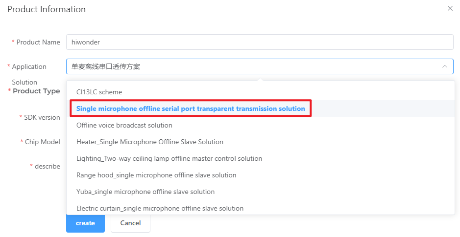

5. Now fill in the basic project information. Since we're recognizing English in this example, set Language Type to **English**. If you're recognizing Chinese, select Chinese as the Speech Type and set the Acoustic Model to Chinese. Configure the rest of the parameters as shown in the illustration, then click **Continue**.


6. Once you've entered the firmware configuration interface, we will focus on the steps for modifying key parameters. First, in the Algorithm Parameters section, enable the **Echo Cancellation** feature.


7. In the **Hardware Parameters** section, set the **Crystal vibration source** to Internal RC and disable **Baud Rate Calibration**.

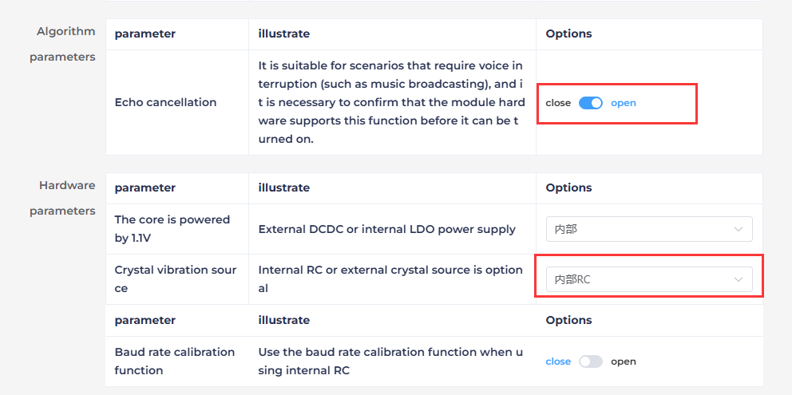

8. In the UART Print Settings, configure UART1 to Open-Drain Mode, supporting external 5V pull-up.


9. For Communication UART Settings, set the Baud Rate to 115200 and configure UART0 to Open-Drain Mode, also supporting external 5V pull-up. After adjusting these settings, click **Continue** to move forward.


10. The next step involves configuring the command words. You will need to choose a voice output for the wake-up command. For this example, select **Dane – English Male Voice** as the output voice. If you're using Chinese as the language, you may choose the voice option **Chengcheng – Standard Boy Voice**. The selection between Chinese and English voices is determined by the language settings configured in Step 5.


11. Then, upload the command word file named **Command Word Broadcast Protocol English Template** by dragging the corresponding spreadsheet into the webpage.

> [!NOTE]
>
> **If you wish to change the wake word, open the spreadsheet and replace the default wake word HELLO-HIWONDER with your preferred word. Keep in mind that the English version of the firmware only supports English wake words, and mixed-language wake words are not allowed. Additionally, English wake words must be written in uppercase letters to function properly.**


12. After uploading the file, you will see the command data populated in the table below.

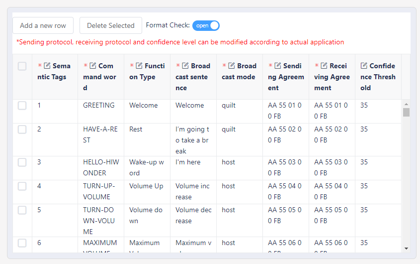

13. Click **Submit Now** and wait a few minutes for the firmware generation process to complete. Once finished, click **Download File** to obtain your customized firmware.


## 12.3 Multimodal Large Model Applications

<p id="anchor_12_3_1"></p>

### 12.3.1 Obtain and Configure the Large Model API Key

> [!NOTE]
>
> **This section requires registering on the official OpenAI website and obtaining an API key for accessing large language models.**

* **Register and Deploy OpenAI Account** 

1)  Copy and open the following URL: [https://platform.openai.com/docs/overview](https://platform.openai.com/docs/overview) to click the **Sign Up** button in the upper-right corner.


2)  Register and log in using a Google, Microsoft, or Apple account, as prompted.


3)  After logging in, click the **Settings** button, then go to **Billing**, and click **Payment Methods** to add a payment method. Recharge your account to purchase tokens as needed.


4)  Once your account is set up, go to the **API Keys** section and click **Create new key**. Follow the instructions to generate a new API key and save it securely for later use.


5)  The creation and deployment of the large model have been completed, and this API will be used in the following lessons.

* **Register and Deploy OpenRouter Account** 

1)  In the website [https://openrouter.ai/](https://openrouter.ai/), click **Sign In**, and register or sign in using Google or another available account.


2)  After logging in, click the icon in the top-right corner, then select **Credits** to add a payment method.


3)  To create an API key, go to **API Keys**, then click **Create Key**. Follow the prompts to generate a key and save the API key securely for later use.


4)  The creation and deployment of the large model have been completed, and this API will be used in the following lessons.

* **API Configuration**

1)  In the command-line terminal, enter the following command to navigate to the directory where the large model keys are configured.

```
cd /home/ubuntu/ros2_ws/src/large_models/large_models/large_models
```

2. Next, open the configuration file with the following command.

```
vim config.py
```

3)  Once the file is open, you need to configure the OpenAI and OpenRouter keys by filling them into the parameters `llm_api_key` and `vllm_api_key`, respectively.

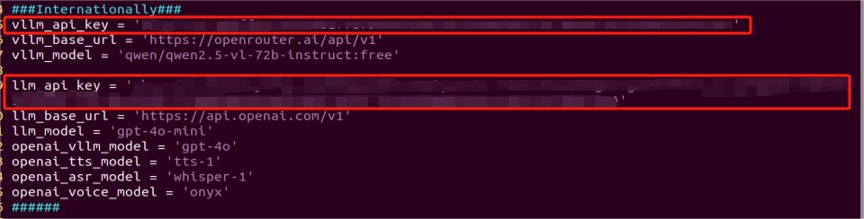

For example, copy the keys you created in this chapter and paste them into the corresponding fields. Place the cursor between the quotation marks, right-click, and select **Paste**. 

> [!NOTE]
>
> **Keys from different large models cannot be mixed, otherwise the functions may fail to work properly.**

4. After pasting, press **Esc**, then enter the following command and press **Enter** to save the file:

```
:wq
```

### 12.3.2 Voice Control with Multimodal Large Model

* **Overview**

When the program starts running, WonderEcho Pro will announce **I'm ready** and begin monitoring the environment.

Say the wake word to activate WonderEcho Pro, and it will respond with **I'm here**. By default, the firmware uses the wake word **Hello Hiwonder**, please confirm the firmware version to use the correct wake word.

Then, you can control the robot using voice commands, for example, by saying **Hello, please move forward two steps**. The robot will use the OpenAI API to convert the voice into text and input it to the large model for processing. Once the model completes its reasoning, the result will be broadcast using the API and the corresponding action will be executed.

* **Preparation**

**1. Confirm WonderEcho Pro Firmware**

The factory default wake-up word for the WonderEcho Pro is **Hello Hiwonder** in the English firmware. If you want to change the wake-up word to Xiaohuan Xiaohuan in Chinese, you can refer to the tutorial in the [12.2 Voice Module Introduction and Installation](#anchor_12_2) to flash the Chinese firmware.

If you have previously flashed a different firmware, such as the one using the wake word "**Xiaohuan Xiaohuan,**" you must use the corresponding wake word.

The examples in this course will assume the default factory wake word: "**Hello, Hiwonder**."

**2. Configuring the Large Model API-KEY**

By default, the program does not include the configuration of the Large Model-related API keys. Before activating features related to the Large AI Model, please refer to the section [12.3.1 Obtain and Configure the Large Model API Key](#anchor_12_3_1) to configure the necessary keys. This step is mandatory and cannot be skipped, as it is crucial for the proper functioning and experience of the large model features.

**3. Network Configuration**

> [!NOTE]
>
> **The large model used in this lesson is an online model, so network access is required before getting started. Please prepare an Ethernet cable to connect the robot to the network, or switch the robot to LAN mode.**

The robot must be connected to the Internet during this feature, either in STA (LAN) mode or AP (direct connection) mode via Ethernet. There are two methods available for configuring the network:

(1) To configure the network using the mobile app, you may refer to the tutorial of

[LAN Mode Connection (Optional)](https://wiki.hiwonder.com/projects/LanderPi/en/latest/docs/1_LanderPi_User_Manual.html#anchor_1_3_3_4) in the LanderPi User Manual.

(2) Connect to the robot via VNC and modify the network configuration files as described in

LAN Mode Connection in the section [1.4 Development Environment Setup and Configuration](https://wiki.hiwonder.com/projects/LanderPi/en/latest/docs/1_LanderPi_User_Manual.html#development-environment-setup-and-configuration) of the LanderPi User Manual.

* **Operation Steps**

> [!NOTE]
>
> * **Command input is case-sensitive and space-sensitive.**
>
> * **The robot must be connected to the Internet, either in STA (LAN) mode or AP (direct connection) mode via Ethernet.**

1)  Power on the robot and connect it to a remote control tool like VNC. For detail informations, please refer to [1.4 Development Environment Setup and Configuration](https://wiki.hiwonder.com/projects/LanderPi/en/latest/docs/1_LanderPi_User_Manual.html#development-environment-setup-and-configuration) in the user manual.

2)  On the Raspberry Pi desktop, double-click the icon  to open the terminal, and enter the ROS2 development environment.

3)  Enter the command to disable the auto-start service.

```
~/.stop_ros.sh
```

4)  Entering the following command to start the feature.

```
ros2 launch large_models_examples llm_control_move.launch.py
```

5)  When the terminal displays output shown in the figure, the device has completed initialization. Then, you can say the wake words: **Hello, Hiwonder**.


6)  When the terminal displays the corresponding output shown in the figure and the device responds with **I'm here**, it indicates successful activation. The system will begin recording your voice command.


7)  You can give commands to control the robot's movement, such as saying **Move forward**.


8)  Upon successful recognition by the speech recognition service of cloud-based large speech model, the parsed command will be displayed under the **publish asr result** output in the terminal.


9. Upon receiving user input shown in the figure, the terminal will display output indicating that the cloud-based large language model has been successfully invoked. The model will interpret the command, generate a language response, and an action sequence `action` that aligns with the intent of the command.

Then the robot will execute the actions defined in the `action` sequence.

> [!NOTE]
>
> **The response is automatically generated by the model. While the semantic content is accurate, the wording and structure may vary due to randomness in language generation.**


10. When the terminal shows the output as shown in the following figure, it indicates that the Raspberry Pi has successfully invoked the voice synthesis service of the cloud-based voice large model. WonderEcho Pro will broadcast the audio synthesized by `response` in Step 9.


11) When the terminal shows the output shown in the figure indicating the end of one interaction cycle, the system is ready for the next round. To initiate another interaction, repeat step 1 by speaking the wake words again.


12) To exit the feature, press **Ctrl+C** in the terminal. If the feature does not exit immediately, press **Ctrl+C** multiple times.

* **Project Outcome**

Once the feature is activated, you can phrase your commands as you desire to control the robot to perform actions such as moving forward, backward, turning left, right, while the Mecanum version robot can slide left/right or rotate clockwise/counterclockwise.

> [!NOTE]
>
> **The actions used in this feature is preset in the program library and the quantity is limited. The robot's movement is controlled by calling functions corresponding to the action strings designed by the large model. If the instruction involves unpreset actions, the program will not be able to execute, but the large model will recognize the instruction and give a response.**

* **Program Brief Analysis**

The program file is located at: `/home/ubuntu/ros2_ws/src/large_models_examples/large_models_examples/llm_control_move.launch.py`


**Reading Chassis Type**

Based on the selected chassis, corresponding prompt words are sent to the large model.

**Motion Control**

The `controller` activates the motion control node to control the motor, servo, buzzer, etc. of the expansion board.

**Large Model Control Node**

`start` activates the large model control node, which can achieve functions such as language detection, semantic understanding node, function execution, and response broadcast.

**(1) Program Brief Analysis**

The source code for this program is located at: 

`/home/ubuntu/ros2_ws/src/large_models_examples/large_models_examplesllm_control_move.py`


**Language and Chassis Type Detection**


**Import Libraries**

The program has imported the following modules and libraries to implement functions such as the creation of ROS2 nodes, message publishing, service invocation, thread handling, and voice playback.

**Initialization of ROS 2 node**

Call `rclpy.init()` to initialize the ROS2 environment and inherit the `Node` class to create a node instance.


**Variable Initialization**

Define `action` (action list), `llm_result` (the result string returned by the large model), `running` (running flag), and `result` (the parsed result).


**Publication and Subscriber Initialization**

① `tts_text_pub`: This publisher publishes the text message to the topic `tts_node/tts_text`. Send text to the speech synthesis module and let the robot give feedback to the user through voice

② `mecanum_pub`: This publisher publishes `Twist` messages to the `/controller/cmd_vel` topic. The `Twist` message contains the robot's linear velocity (x, y) and angular velocity (z), controlling the robot's movement.

③ `servo_state_pub`: This publisher publishes `SetPWMServoState` messages to the `ros_robot_controller/pwm_servo/set_state` topic to control the state of the servos.

④ `llm_result_callback`: Subscribe to messages from the `agent_process/result` topic. This topic contains instructions generated from LLMS (Large Language Models)

⑤ `play_audio_finish_callback`: Subscribe to messages from the topic `tts_node/play_finish`. This topic tells the program whether the voice playback is completed.


**Processing action process**

When instructions are received from the LLM, the script parses the JSON data to obtain the actions that need to be performed, such as moving forward, rotating, etc.


### 12.3.3 Autonomous Patrolling with Multimodal Large Model

* **Overview**

When the program starts running, WonderEcho Pro will announce **I'm ready** and begin monitoring the environment.

Say the wake word to activate WonderEcho Pro, and it will respond with **I'm here**. By default, the firmware uses the wake word **Hello Hiwonder**, please confirm the firmware version to use the correct wake word.

Then, the robot can be controlled via voice to follow a line, for example, by saying **Follow the black line**. The robot will use the OpenAI API to convert the speech into text and send it to the large model for processing. After the processing is complete, the OpenAI API is called again to broadcast the response generated from the model's reasoning, and the corresponding line-following program will be executed.

* **Preparation**

**1. Confirm WonderEcho Pro Firmware**

The factory default wake-up word for the WonderEcho Pro is **Hello Hiwonder** in the English firmware. If you want to change the wake-up word to 'Xiaohuan Xiaohuan in Chinese, you can refer to the tutorial in the [12.2 Voice Module Introduction and Installation](#anchor_12_2) to flash the Chinese firmware.

If you have previously flashed a different firmware, such as the one using the wake word "Xiaohuan Xiaohuan," you must use the corresponding wake word.

The examples in this course will assume the default factory wake word: **Hello, Hiwonder**.

**2. Configuring the Large Model API-KEY**

By default, the program does not include the configuration of the Large Model-related API keys. Before activating features related to the Large AI Model, please refer to the section [12.3.1 Obtain and Configure the Large Model API Key](#anchor_12_3_1) to configure the necessary keys. This step is mandatory and cannot be skipped, as it is crucial for the proper functioning and experience of the large model features.

**3. Network Configuration**

> [!NOTE]
>
> **The large model used in this lesson is an online model, so network access is required before getting started. Please prepare an Ethernet cable to connect the robot to the network, or switch the robot to LAN mode.**

The robot must be connected to the Internet during this feature, either in STA (LAN) mode or AP (direct connection) mode via Ethernet. There are two methods available for configuring the network:

(1) To configure the network using the mobile app, you may refer to the tutorial of

[LAN Mode Connection (Optional)](https://wiki.hiwonder.com/projects/LanderPi/en/latest/docs/1_LanderPi_User_Manual.html#anchor_1_3_3_4) in the LanderPi User Manual.

(2) Connect to the robot via VNC and modify the network configuration files as described in

[LAN Mode Connection](https://wiki.hiwonder.com/projects/LanderPi/en/latest/docs/1_LanderPi_User_Manual.html#anchor_1_4_2_2) in the section 4. Development Environment Setup and Configuration of the LanderPi User Manual.

* **Operation Steps**

> [!NOTE]
>
> * **Command input is case-sensitive and space-sensitive.**
>
> * **The robot must be connected to the Internet, either in STA (LAN) mode or AP (direct connection) mode via Ethernet.**

1)  Power on the robot and connect it to a remote control tool like VNC. For detail informations, please refer to [1.4 Development Environment Setup and Configuration](https://wiki.hiwonder.com/projects/LanderPi/en/latest/docs/1_LanderPi_User_Manual.html#development-environment-setup-and-configuration) in user manual.

2)  On the Raspberry Pi desktop, double-click the icon  to open the terminal, and enter the ROS2 development environment.

3)  Enter the command to disable the app auto-start service.

```
~/.stop_ros.sh
```

4)  Entering the following command to start the feature.

```
ros2 launch large_models_examples llm_visual_patrol.launch.py
```

5)  When the terminal displays output shown in the figure, the device has completed initialization. Then, you can say the wake words: **Hello, Hiwonder**.


6)  When the terminal displays the corresponding output shown in the figure and the device responds with **I'm here**, it indicates successful activation. The system will begin recording your voice command.

7)  You can phrase your commands to control the LanderPi for autonomous patrolling, for example, **Follow the black line**.


8)  Upon successful recognition by the speech recognition service of cloud-based large speech model, the parsed command will be displayed under the **publish asr result** output in the terminal.


9. Upon receiving user input shown in the figure, the terminal will display output indicating that the cloud-based large language model has been successfully invoked. The model will interpret the command, generate a language response, and parse the command to enable autonomous line following.

Then, the robot sends a client request to the **Autonomous line following** node to set the color and activate the feature.

> [!NOTE]
>
> **The response is automatically generated by the model. While the semantic content is accurate, the wording and structure may vary due to randomness in language generation.**


10. When the terminal shows the output as shown in the following figure, it indicates that the Raspberry Pi has successfully invoked the voice synthesis service of the cloud-based voice large model. WonderEcho Pro will broadcast the audio synthesized by `response` in Step 9.

> [!NOTE]
>
> **Once the "Autonomous Line Following" mode is activated, the feature will continue running. To stop it, press Ctrl+C in the command-line terminal.**

11. When the terminal shows the output shown in the figure indicating the end of one interaction cycle, the system is ready for the next round. To initiate another interaction, repeat step 5 by speaking the wake words again.


12) To exit the feature, press **Ctrl+C** in the terminal. If the feature does not exit immediately, press **Ctrl+C** multiple times.

* **Project Outcome**

Once this feature is enabled, you can control the robot with voice commands. For example, saying **Go along the black line** will activate autonomous patrolling. In this feature, the robot will follow a black line as it moves. If the black line is not detected for more than 5 seconds, or if you wake the system again manually, the robot will exit the autonomous patrol task and return to standby mode.

> [!NOTE]
>
> **The actions used in this feature is preset in the program library and the quantity is limited. The robot's movement is controlled by calling functions corresponding to the action strings designed by the large model. If the instruction involves unpreset actions, the program will not be able to execute, but the large model will recognize the instruction and give a response.**

* **Program Brief Analysis**

The launch file is located at the directory:

`/home/ubuntu/ros2_ws/src/large_models_examples/large_models_examples/llm_visual_patrol.launch.py`


**Line Following Node**

`line_following_node` is responsible for enabling the robot to follow lines.

**Large Model Control Node**

`start` activates the large model control node, which can achieve functions such as language detection, semantic understanding node, function execution, and response broadcasting.

**1. Program Brief Analysis**

The source code for this program is located at: 

`/home/ubuntu/ros2_ws/src/large_models_examples/large_models_examples/llm_visual_patrol.py`


**Import Libraries**

The program has imported the following modules and libraries to implement functions such as the creation of ROS2 nodes, message publishing, service invocation, thread handling, and voice playback.

**Initialization of ROS 2 node**

Call `rclpy.init()` to initialize the ROS2 environment and inherit the Node class to create a node instance.


**Variable Initialization**

Define `action` (action list), `llm_result` (the result string returned by the large model), `running` (running flag), and `result` (the parsed result).


**Publication and Subscriber Initialization**

① `tts_text_pub`: This publisher publishes the text message to the topic `tts_node/tts_text`. Send text to the speech synthesis module and let the robot give feedback to the user through voice

② `mecanum_pub`: This publisher publishes `Twist` messages to the `/controller/cmd_vel` topic. The `Twist` message contains the robot's linear velocity (x, y) and angular velocity (z), controlling the robot's movement.

③ `llm_result_callback`: Subscribe to messages from the `agent_process/result` topic. This topic contains instructions generated from LLMS (Large Language Models)

④ `play_audio_finish_callback`: Subscribe to messages from the topic `tts_node/play_finish`. This topic tells the program whether the voice playback is completed.


**Check if it's Chinese**


**Send the PROMPT**

The `PROMPT` variable defines the prompt message sent to the LLM. The LLM parse user input and generate output in JSON format containing actions and responses.


**init_process Method**

① It sets the `Prompt` for the LLM and stops the Mecanum-wheel robot's movement, plays Startup Audio, starts a new thread to run the `process` method, and creates a ROS 2 service `~/init_finish` as a signal to indicate that the node has finished initialization.

② It loops through the list of actions and calls the appropriate ROS 2 services based on the action type.

③ If an action is `line_following`, it extracts the required color information and calls the corresponding `line-following` service to begin tracking the line.

④ After all actions are executed, the `interrupt` flag is reset, the `llm_result` variable is cleared, and the voice wake-up functionality is re-enabled.


**main Function**

The main function runs.


**2. Large Model Line Following Logic Analysis**

**Large Model Interaction Logic Analysis**

The source code for this demo is located at `/home/ubuntu/ros2_ws/src/app/app/line_following.py`

This script receives the target line color information from the large model. The large model sends the target color name to this node by calling the `~/set_large_model_target_color` service.


**image_callback Callback Function**

① Target Loss Detection: When `deflection_angle` is `None`, it means the target line is not detected. In this case, the `follower.lost_target_count` counter is incremented. If `large_model_tracking` is `True` and the lost count exceeds a predefined threshold, the system considers the target lost. A timer is then triggered to stop the robot after a short delay.

② Target Reacquisition Detection: When `deflection_angle` is not `None`, the system detects the target line again. The `follower.lost_target_count` counter is reset, and the loss timer is canceled if active.

③ Motion Control The robot's movement is adjusted based on the output of the PID controller only when `deflection_angle` is not `None`, `is_running` is `True`, and no obstacles are detected.


**Auto-Stop Mechanism**

① The `start_stop_timer` method starts a timer that waits 5 seconds before calling `stop_after_lose`.

② The `stop_after_lose` method stops the robot's movement and sets the `is_running` flag to `False` to end the line-following.


**Voice Wake-Up Stop Handling**

When a voice wake-up signal is detected, the system may stop the robot—but only if `large_model_tracking` is set to `True`. This ensures that the voice wake-up signal is only responded to when the autonomous line following was initiated by the large language model.


### 12.3.4 Color Tracking with Multimodal Large Model

* **Overview**

When the program starts running, WonderEcho Pro will announce **I'm ready** and begin monitoring the environment.

Say the wake word to activate WonderEcho Pro, and it will respond with **I'm here**. By default, the firmware uses the wake word Hello Hiwonder, please confirm the firmware version to use the correct wake word.

Then, you can control the robot by voice commands, such as saying **Follow the red block**. The robot will convert the voice command into text through the OpenAI API and send it to the large model for processing. After the processing is complete, the OpenAI API is called again to broadcast the response generated from the model's reasoning, and the corresponding line-following program will be executed.

* **Preparation**

**1. Confirm WonderEcho Pro Firmware**

The factory default wake-up word for the WonderEcho Pro is **Hello Hiwonder** in the English firmware. If you want to change the wake-up word to 'Xiaohuan Xiaohuan in Chinese, you can refer to the tutorial in the section [12.2 Voice Module Introduction and Installation](#anchor_12_2) to flash the Chinese firmware.

If you have previously flashed a different firmware, such as the one using the wake word "Xiaohuan Xiaohuan," you must use the corresponding wake word.

The examples in this course will assume the default factory wake word: **Hello, Hiwonder**.

**2. Configuring the Large Model API-KEY**

By default, the program does not include the configuration of the Large Model-related API keys. Before activating features related to the Large AI Model, please refer to the section [12.3.1 Obtain and Configure the Large Model API Key](#anchor_12_3_1) to configure the necessary keys. This step is mandatory and cannot be skipped, as it is crucial for the proper functioning and experience of the large model features.

**3. Network Configuration**

> [!NOTE]
>
> The large model used in this lesson is an online model, so network access is required before getting started. Please prepare an Ethernet cable to connect the robot to the network, or switch the robot to LAN mode.
>

The robot must be connected to the Internet during this feature, either in STA (LAN) mode or AP (direct connection) mode via Ethernet. There are two methods available for configuring the network:

(1) To configure the network using the mobile app, you may refer to the tutorial of

[LAN Mode Connection (Optional)](https://wiki.hiwonder.com/projects/LanderPi/en/latest/docs/1_LanderPi_User_Manual.html#anchor_1_3_3_4) in the LanderPi User Manual.

(2) Connect to the robot via VNC and modify the network configuration files as described in

[LAN Mode Connection](https://wiki.hiwonder.com/projects/LanderPi/en/latest/docs/1_LanderPi_User_Manual.html#anchor_1_4_2_2) in the section 4. Development Environment Setup and Configuration of the LanderPi User Manual.

* **Operation Steps**

> [!NOTE]
>
> * **Command input is case-sensitive and space-sensitive.**
>
> * **The robot must be connected to the Internet, either in STA (LAN) mode or AP (direct connection) mode via Ethernet.**

1)  Power on the robot and connect it to a remote control tool like VNC. For detail informations, please refer to [1.4 Development Environment Setup and Configuration](https://wiki.hiwonder.com/projects/LanderPi/en/latest/docs/1_LanderPi_User_Manual.html#development-environment-setup-and-configuration) in the user manual.

2)  On the Raspberry Pi desktop, double-click the icon  to open the terminal, and enter the ROS2 development environment.

3)  Enter the command to disable the app auto-start service.

```
~/.stop_ros.sh
```

4)  Entering the following command to start the feature.

```
ros2 launch large_models_examples llm_color_track.launch.py
```

5)  When the terminal displays output shown in the figure, the device has completed initialization. Then, you can say the wake word **Hello Hiwonder**.


6)  When the terminal displays the corresponding output shown in the figure and the device responds with **I'm here**, it indicates successful activation. The system will begin recording your voice command.

7)  Then, you can give commands to enable the color tracking feature, such as saying **Track the red color**.


8)  Upon successful recognition by the speech recognition service of cloud-based large speech model, the parsed command will be displayed under the **publish asr result** output in the terminal.

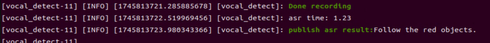

9. Upon receiving user input shown in the figure, the terminal will display output indicating that the cloud-based large language model has been successfully invoked. The model will interpret the command, generate a language response, and parse the command to enable autonomous line following.

Then, the robot sends a client request to the **color tracking** node to set the color and activate the feature.

> [!NOTE]
>
> **The response is automatically generated by the model. While the semantic content is accurate, the wording and structure may vary due to randomness in language generation.**


10) When the terminal shows the output as shown in the following figure, it indicates that the Raspberry Pi has successfully invoked the voice synthesis service of the cloud-based voice large model. WonderEcho Pro will broadcast the audio synthesized by `response` in Step 9.


> [!NOTE]
>
> **Once the "color tracking" mode is activated, the feature will continue running. To stop it, press Ctrl+C in the command-line terminal.**

11) When the terminal shows the output shown in the figure indicating the end of one interaction cycle, the system is ready for the next round. To initiate another interaction, repeat step 5 by speaking the wake words again.


12) To exit the feature, press **Ctrl+C** in the terminal. If the feature does not exit immediately, press **Ctrl+C** multiple times.

* **Project Outcome**

Once the feature is activated, you can phrase commands, such as **Track the red block**, to control the robot for autonomous navigation. In autonomous navigation mode, the robot tracks the red block. If the red block is not detected for more than 5 seconds, or if the robot is re-awakened, the color tracking task will be exited, and the robot will return to the re-awakened state.

> [!NOTE]
>
> **The actions used in this feature is preset in the program library and the quantity is limited. The robot's movement is controlled by calling functions corresponding to the action strings designed by the large model. If the instruction involves unpreset actions, the program will not be able to execute, but the large model will recognize the instruction and give a response.**

* **Program Brief Analysis**

The launch file is located at the directory:

`/home/ubuntu/ros2_ws/src/large_models_examples/large_models_examples/llm_color_track.launch.py`


**Color Tracking Control**

`object_tracking_node` handles object color tracking.

**Large Model Control Node**

`start` activates the large model control node, which can achieve functions such as language detection, semantic understanding node, function execution, and response broadcasting.

**1. Program Brief Analysis**

The source code for this program is located at:

`/home/ubuntu/ros2_ws/src/large_models_examples/large_models_examples/llm_color_track.py`


**Import Libraries**

The program has imported the following modules and libraries to implement functions such as the creation of ROS2 nodes, message publishing, service invocation, thread handling, and voice playback.

**Initialization of ROS 2 node**

Call `rclpy.init()` to initialize the ROS2 environment and inherit the `Node` class to create a node instance.


**Variable Initialization**

Define `action` (action list), `llm_result` (the result string returned by the large model), `running` (running flag), and `result` (the parsed result).


**Publication and Subscriber Initialization**

(1) `tts_text_pub`: This publisher publishes the text message to the topic `tts_node/tts_text`. Send text to the speech synthesis module and let the robot give feedback to the user through voice

(2) `llm_result_callback`: Subscribe to messages from the `agent_process/result` topic. This topic contains instructions generated from LLMS (Large Language Models)

(3) `play_audio_finish_callback`: Subscribe to messages from the topic `tts_node/play_finish`. This topic tells the program whether the voice playback is completed.


**Check if it's Chinese**


**Send the PROMPT**

The `PROMPT` variable defines the prompt message sent to the LLM. The LLM parse user input and generate output in JSON format containing actions and responses.


**init_process Method**

(1) It sets the `Prompt` for the LLM and stops the Mecanum-wheel robot's movement, plays Startup Audio, starts a new thread to run the `process` method, and creates a ROS 2 service `~/init_finish` as a signal to indicate that the node has finished initialization.

(2) It loops through the list of actions and calls the appropriate ROS 2 services based on the action type.

(3) If an action is `line_following`, it extracts the required color information and calls the corresponding `line-following` service to begin tracking the line.

(4) After all actions are executed, the `interrupt` flag is reset, the `llm_result` variable is cleared, and the voice wake-up functionality is re-enabled.


**main Function**

The main function executes.


**2. Large Model Line Following Logic Analysis**

**(1) Large Model Interaction Logic Analysis**

The source code for this demo is located at `/home/ubuntu/ros2_ws/src/app/app/object_tracking.py`.

Function This script receives the target line color information from the large model. The large model sends the target color name to this node by calling the `~/set_large_model_target_color` service.


**image_callback Callback Function**

① If the `tracker` exists, it calls the tracker's `__call__` method to process the image and publishes motion control commands based on the results.

② If `is_running` is `True`, the motion control commands are published. Otherwise, the PID controller's output is cleared (reset).


**Set Target Color Service Request**

Based on the coordinates provided in the request:

① If the coordinates are (-1, -1), reset the color selector and tracker.

② If the coordinates are valid, initialize the color selector and publish a `Twist` message.


**Handle Target Color Service Request**

This function is used to retrieve the current tracked target color. If a valid `tracker` object exists, it returns its `target_rgb` value.


## 12.4 Embodied AI Applications

### 12.4.1 Obtain and Configure the Large Model API Key

> [!NOTE]
>
> **This section requires registering on the official OpenAI website and obtaining an API key for accessing large language models.**

* **Register and Deploy OpenAI Account** 

1. Copy and open the following URL: [https://platform.openai.com/docs/overview](https://platform.openai.com/docs/overview)

   

2. Register and log in using a Google, Microsoft, or Apple account, as prompted.

   

3. After logging in, click the Settings button, then go to **Billing**, and click **Payment Methods** to add a payment method. Recharge your account to purchase tokens as needed.

   

   

4. Once your account is set up, go to the **API Keys** section and click **Create new key**. Follow the instructions to generate a new API key and save it securely for later use.

   

   

   

5. The creation and deployment of the large model have been completed, and this API will be used in the following lessons.

* **Register and Deploy OpenRouter Account** 

1. Copy and open the following URL: [https://openrouter.ai/](https://openrouter.ai/) and click **Sign in**, and register or sign in using Google or another available account.

   

   

2. After logging in, click the icon in the top-right corner, then select **Credits** to add a payment method.

   

   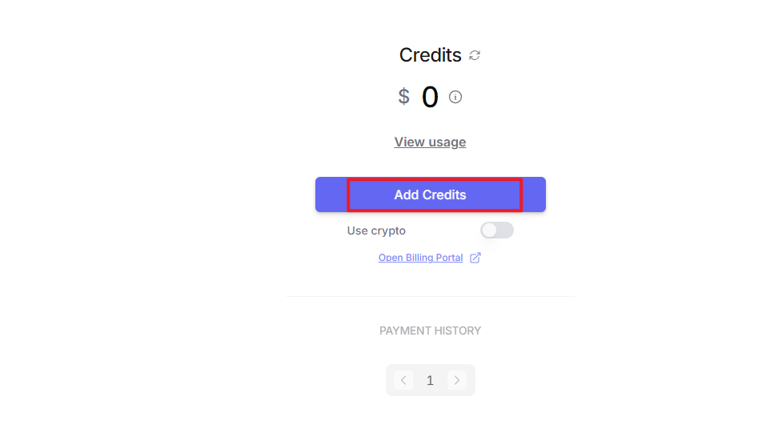

3. To create an API key, go to **API Keys**, then click **Create Key**. Follow the prompts to generate a key and save the API key securely for later use.

   

   

4. The creation and deployment of the large model have been completed, and this API will be used in the following lessons.

* **API Configuration**

1)  In the command-line terminal, enter the following command to navigate to the directory where the large model keys are configured.

   ```
   cd /home/ubuntu/ros2_ws/src/large_models/large_models/large_models
   ```

2. Next, open the configuration file with the following command.

   ```
   vim config.py
   ```

3. Once the file is open, you need to configure the OpenAI and OpenRouter keys by filling them into the parameters `llm_api_key` and `vllm_api_key`, respectively.

   

   For example, copy the keys you created in this chapter and paste them into the corresponding fields. Place the cursor between the quotation marks, right-click, and select Paste. 

   > [!NOTE]
   >
   > **Keys from different large models cannot be mixed, otherwise the functions may fail to work properly.**

4. After pasting, press **Esc**, then enter the following command and press **Enter** to save the file:

   ```
   :wq
   ```


### 12.4.2 Overview of Embodied Intelligence

* **Overview of Embodied Intelligence**

Embodied Intelligence represents a key branch of artificial intelligence that emphasizes learning and decision-making through the interaction between a physical entity and its environment. At its core lies the principle that intelligence emerges from the dynamic interplay between an agent's physical embodiment and its environment. This approach moves beyond the limitations of traditional AI, which often relies solely on static data. Embodied intelligence has found broad applications across industries such as manufacturing, healthcare, service, education, and military.

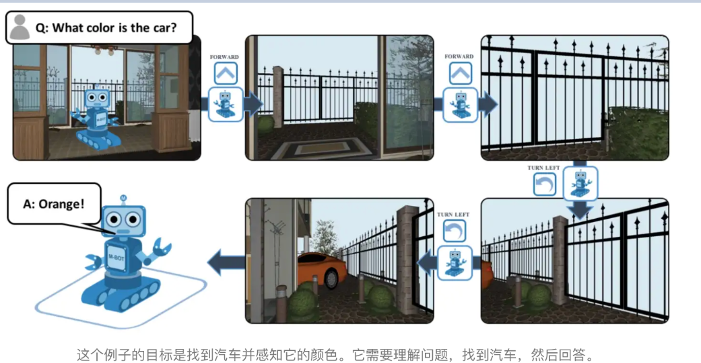

* **Multimodal Information Fusion**

An important branch of embodied intelligence is multimodal information fusion, which refers to the effective integration of data from different modalities—such as text, images, and speech—to produce a more comprehensive and accurate representation of information. This process is especially critical in artificial intelligence, as real-world data is inherently multimodal. Relying on a single modality often fails to provide sufficient context or detail. Multimodal fusion aims to enhance model performance and robustness by leveraging the complementary strengths of multiple data sources.

Several common approaches to multimodal information fusion include the following:

**Early Fusion:** Combines data from different modalities at an early stage of processing. This typically occurs at the input level, where raw data is aligned and transformed into a shared space to create a richer, more expressive representation. For example, image and speech data can be concatenated directly and fed into a neural network.


**Late Fusion:** Integrates data from multiple modalities at intermediate or output stages of the model. This approach allows each modality to be processed independently using specialized algorithms, making it easier to add or replace modalities in the future. For instance, results from image recognition and text analysis can be combined to support final decision-making.


**Hybrid Fusion:** Leverages both early and late fusion techniques by performing integration at multiple stages. This method takes advantage of modality complementarity and can improve both performance and model robustness.

**Feature-Level Fusion:** Involves extracting features from each modality and mapping them into a unified feature vector, which is then passed to a classifier for decision-making. Fusion occurs during the feature extraction phase, enabling the model to learn correlations across modalities.

**Decision-Level Fusion:** Merges outputs from individual modality-specific decisions to produce the final outcome. This technique offers strong noise resistance and places fewer demands on sensor types or quality, though it may result in some loss of information.

**Deep Fusion:** Takes place during feature extraction, where multimodal data is blended in the feature space to generate fused features that can compensate for missing or weak signals from any single modality. These fused features are then used for classification or regression tasks during prediction.

Multimodal information fusion holds not only theoretical significance but also substantial practical value. It has been widely applied in fields such as autonomous driving, medical image analysis, and human-computer interaction, where it has significantly improved system performance and reliability.


### 12.4.3 Real-Time Detection in Embodied AI Applications

* **Overview**

In this lesson, you will learn how to use a large language model to analyze real-time scenes and implement a real-time detection feature. The large model used in this lesson is an online model, so network access is required before getting started. Please prepare an Ethernet cable to connect the robot to the network, or switch the robot to LAN mode.

Say the wake word to activate WonderEcho Pro, and it will respond with **I'm here**. By default, the firmware uses the wake word **Hello Hiwonder**, please confirm the firmware version to use the correct wake word.

By activating this feature, you can freely give voice commands, and the robot will recognize the current scene, analyze it, and verbally report its analysis results.

* **Preparation**

**1. Confirm WonderEcho Pro Firmware**

The factory default wake-up word for the WonderEcho Pro is Hello HiWonder in the English firmware. If you want to change the wake-up word to 'Xiaohuan Xiaohuan in Chinese, you can refer to the tutorial in the section [12.2 Voice Module Introduction and Installation](#anchor_12_2) to flash the Chinese firmware.

If you have previously flashed a different firmware, such as the one using the wake word "Xiaohuan Xiaohuan," you must use the corresponding wake word.

The examples in this course will assume the default factory wake word: **Hello, Hiwonder**.

**2. Configuring the Large Model API-KEY**

By default, the program does not include the configuration of the Large Model-related API keys. Before activating features related to the Large AI Model, please refer to the section [12.3.1 Obtain and Configure the Large Model API Key](#anchor_12_3_1) to configure the necessary keys. This step is mandatory and cannot be skipped, as it is crucial for the proper functioning and experience of the large model features.

**3. Network Configuration**

> [!NOTE]
>
> **The large model used in this lesson is an online model, so network access is required before getting started. Please prepare an Ethernet cable to connect the robot to the network, or switch the robot to LAN mode.**

The robot must be connected to the Internet during this feature, either in STA (LAN) mode or AP (direct connection) mode via Ethernet. There are two methods available for configuring the network:

- To configure the network using the mobile app, you may refer to the tutorial of

[LAN Mode Connection (Optional)](https://wiki.hiwonder.com/projects/LanderPi/en/latest/docs/1_LanderPi_User_Manual.html#anchor_1_3_3_4) in the LanderPi User Manual.

- Connect to the robot via VNC and modify the network configuration files as described in

[LAN Mode Connection](https://wiki.hiwonder.com/projects/LanderPi/en/latest/docs/1_LanderPi_User_Manual.html#anchor_1_4_2_2) in the section 4. Development Environment Setup and Configuration of the LanderPi User Manual.

* **Operation Steps**

> [!NOTE]
>
> **Command input is case-sensitive and space-sensitive.**
>
> **The robot must be connected to the Internet, either in STA (LAN) mode or AP (direct connection) mode via Ethernet.**

1)  Power on the robot and connect it to a remote control tool like VNC. For detail informations, please refer to [1.4 Development Environment Setup and Configuration](https://wiki.hiwonder.com/projects/LanderPi/en/latest/docs/1_LanderPi_User_Manual.html#development-environment-setup-and-configuration) in the user manual.

2)  On the Raspberry Pi desktop, double-click the icon  to open the terminal, and enter the ROS2 development environment.

3)  Enter the command to disable the app auto-start service.

   ```
   ~/.stop_ros.sh
   ```

4. Enter the command to launch the corresponding feature.

   ```
   ros2 launch large_models_examples vllm_with_camera.launch.py
   ```

5. When the terminal displays output shown in the figure and the voice device announces **I'm ready**, the voice device has completed initialization. Then, you can say the wake words: **Hello Hiwonder**.

   

6. When the terminal displays the corresponding output shown in the figure and the device responds with **I'm here**, it indicates successful activation. The system will begin recording your voice command.

   

7. When the terminal displays the next output as the reference image, it shows the recognized speech transcribed by the device.

   

8. Upon successful recognition by the speech recognition service of cloud-based large speech model, the parsed command will be displayed under the `publish_asr_result` output in the terminal.

9. Upon receiving user input shown in the figure, the terminal will display output indicating that the cloud-based large language model has been successfully invoked. The model will interpret the command and generate a language response.

> [!NOTE]
>
> **The response is automatically generated by the model. While the semantic content is accurate, the wording and structure may vary due to randomness in language generation.**

10. When the terminal shows the output shown in the figure indicating the end of one interaction cycle, the system is ready for the next round. To initiate another interaction, repeat step 4 by speaking the wake words again.


11. To exit the feature, press **Ctrl+C** in the terminal. If the feature does not exit immediately, press **Ctrl+C** multiple times.


* **Project Outcome**

Once the feature is activated, you can phrase your own commands. For example, when you say **What do you see** to the robot, it will automatically analyze the scene within its field of view, think about what it sees, and describe the scene content in detail.

* **Program Brief Analysis**

**1. Launch File Analysis**

File Path:

`/home/ubuntu/ros2_ws/src/large_models_examples/large_models_examples/vllm_with_camera.launch.py`

**Import Libraries**


(1) `os`: used for handling file paths and operating system-related functions.

(2) `ament_index_python.packages.get_package_share_directory`: retrieves the share directory path of ROS 2 package.

(3) `launch_ros.actions.Node`: used to define ROS 2 nodes.

(4) `launch.substitutions.LaunchConfiguration`: retrieves parameter values defined in the Launch file.

(5) `LaunchDescription, LaunchService`: used to define and start the Launch file.

(6) `launch_description_sources PythonLaunchDescriptionSource`: enables the inclusion of other Launch files.

(7) `launch.actions.IncludeLaunchDescription`, `DeclareLaunchArgument`, `OpaqueFunction`: used to define actions and arguments within the Launch file.

**Defining the launch_setup Function**


(1) This function is used to configure and initialize launch actions.

(2) `mode = LaunchConfiguration('mode', default=1)` defines a `launch` argument named `mode` with a default value of 1.

(3) `mode_arg = DeclareLaunchArgument('mode', default_value=mode)` declares the `mode` argument and includes it in the launch description.

(4) `depth_camera_launch` includes the **depth_camera.launch.py** Launch file from the **large_models** package using `IncludeLaunchDescription` and passes the `mode` argument to it.

(5) `sdk_launch uses IncludeLaunchDescription` to include the **robot_sdk.launch.py** launch file from the **large_models** package, and passes the `mode` parameter.

(6) `large_models_launch`: includes the **start.launch.py** file from the **large_models** package using `IncludeLaunchDescription` and passes the `mode` argument to it.

(7) `vllm_with_camera_node` defines a ROS 2 node from the **large_models** package, executes the executable files from the `vllm_with_camera`, and prints the node's output to the screen.

(8) The function returns a list of all defined launch actions.

**Definition of the generate_launch_description Function**


(1) This function is responsible for generating the complete launch description.

(2) The `launch_setup` function is incorporated using `OpaqueFunction`.

**Main Program Entry**


(1) `ld = generate_launch_description()` generates the launch description object.

(2) `ls = LaunchService()` creates the launch service object.

(3) `ls.include_launch_description(ld)` adds the launch description to the service.

(4) `ls.run()` starts the service and execute all launch actions.

**2. Python File Analysis**

The source code for this program is located at:

`/home/ubuntu/ros2_ws/src/large_models_examples/large_models_examples/vllm_with_camera.py`

**Import the Necessary Libraries**


(1) **cv2**: Utilized for image processing and display using OpenCV.

(2) **time**: manages execution delays and time-related operations.

(3) **queue**: handles image queues between threads.

(4) **rclpy**: provides tools for creating and communicating between ROS 2 nodes.

(5) **threading**: enables multithreading for concurrent task processing.

(6) **config**: contains configuration file.

(7) **numpy (np)**: supports matrix and vector operations.

(8) **std_srvs.srv**: contains standard ROS service types, used to define standard service.

(9) **std_msgs.msg：**contains ROS message types.

(10) **sensor_msgs.msg.Image**: used for receiving image messages from the camera.

(11) **servo_controller_msgs.msg.ServosPosition**: custom message type for controlling servo motors.

(12) **rclpy.callback_groups.ReentrantCallbackGroup**: supports concurrent callback handling.

(13) **rclpy.executors.MultiThreadedExecutor**:  
multithreaded executor in ROS 2 for handling concurrent tasks.

(14) **rclpy.node**: node class in ROS 2.

(15) **speech**: module related to large model voice interaction.

(16) **large_models_msgs.srv**:  custom service types for large models.

(17) **large_models.config**: configuration file for large models.

**VLLMWithCamera Class**


(1) `Display_size`: defines the size of the display window.

(2) `rclpy.init()`: initializes the ROS 2 node.

(3) `super().init(name)`: calls the constructor of the superclass to initialize the node with the specified name.

(4) `self.image_queue`: creates a queue to store image data, with a maximum size of 2.

(5) `self.vllm_result`: stores results received from the `agent_process/result` topic.

(6) `self.running`: a flag variable used to control the running state of the program.

(7) `timer_cb_group`: creates a reentrant callback group for managing timer callbacks.

(8) `self.tts_text_pub`: a publisher is created for sending text data to the text-to-speech node.

(9) `self.create_subscription`: creates subscribers to receive image messages, VLLM results, and playback completion signals.

(10) `self.awake_client` and `self.set_model_client`: creates service clients for triggering the wake-up and model configuration services.

(11) `self.timer`: creates a timer that triggers the `init_process` function.

**get_node_state Method**


`return response`: returns a response object.

**init_process Method**


(1) `self.timer.cancel()`: stops the timer.

(2) `SetModel.Request`: creates a request message to configure the model.

(3) `self.send_request`: sends the request to the corresponding service.

(4) `speech.play_audio`: plays an audio file.

(5) `threading.Thread`: creates a new thread to run the `process` function.

(6) `self.create_service`: creates a service to signal the completion of initialization.

(7) `self.get_logger().info`: logs informational messages to the console.

**send_request Method**


(1) `client.call_async(msg)`: makes an asynchronous service call.

(2) `future.done()` and `future.result()`: check if the service call is complete and retrieve the result.

**vllm_result_callback Method**


This callback receives results from the `agent_process/result` topic and stores them in `self.vllm_result`.

**process Method**


(1) `cv2.namedWindow` and `cv2.moveWindow`: create and position a window for image display.

(2) `self.image_queue.get`: retrieves image data from the queue.

(3) `self.vllm_result`: if a VLLM result is available, publishes it to the text-to-speech node.

(4) `cv2.imshow`: displays the image on the screen.

(5) `cv2.waitKey`: waits for a keyboard event.

(6) `cv2.destroyAllWindows`: closes all OpenCV display windows.

**`play_audio_callback` Method**


It sends a request to enable the wake-up feature once audio playback is complete.

**image_callback Method**

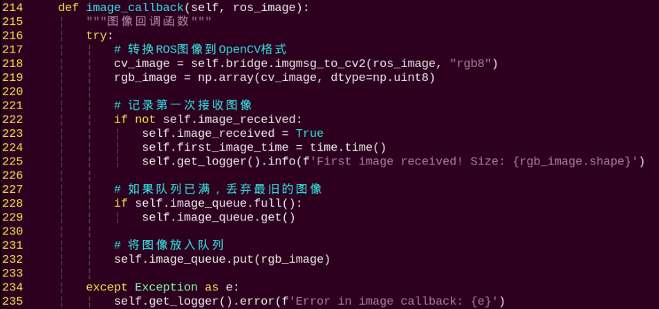

It converts received ROS image messages to `NumPy` arrays and stores them in the queue.

**`main` Method**


(1) Create an instance of the `VLLMWithCamera` node.

(2) A multithreaded executor is used to handle the node's tasks.

(3) Call `executor.spin()` to start processing ROS events.

(4) Upon shutdown, the node is properly destroyed using `node.destroy_node()`.


### 12.4.4 Smart Home Assistant in Embodied AI Applications

* **Overview**

> [!NOTE]
>
> **The large model used in this lesson is an online model, so network access is required before getting started. Please prepare an Ethernet cable to connect the robot to the network, or switch the robot to LAN mode.**

Say the wake word to activate WonderEcho Pro, and it will respond with **I'm here**. By default, the firmware uses the wake word **Hello Hiwonder**, please confirm the firmware version to use the correct wake word.

Once activated, the robot can be controlled via voice commands. For example, give the instruction: **Go to the zoo to see what animals are there, and then come back and tell me**. Upon receiving a command, the terminal displays the recognized speech content. The voice device then verbally responds with a generated answer and the robot simultaneously executes the corresponding action.

* **Preparation**

**1. Confirm WonderEcho Pro Firmware**

The factory default wake-up word for the WonderEcho Pro is Hello HiWonder in the English firmware. If you want to change the wake-up word to 'Xiaohuan Xiaohuan in Chinese, you can refer to the tutorial in the section [12.2 Voice Module Introduction and Installation](#anchor_12_2) to flash the Chinese firmware.

If you have previously flashed a different firmware, such as the one using the wake word "Xiaohuan Xiaohuan," you must use the corresponding wake word.

The examples in this course will assume the default factory wake word: **Hello, Hiwonder**.

**2. Configuring the Large Model API-KEY**

By default, the program does not include the configuration of the Large Model-related API keys. Before activating features related to the Large AI Model, please refer to the section [12.3.1 Obtain and Configure the Large Model API Key](#anchor_12_3_1) to configure the necessary keys. This step is mandatory and cannot be skipped, as it is crucial for the proper functioning and experience of the large model features.

**3. Network Configuration**

> [!NOTE]
>
> **The large model used in this lesson is an online model, so network access is required before getting started. Please prepare an Ethernet cable to connect the robot to the network, or switch the robot to LAN mode.**

The robot must be connected to the Internet during this feature, either in STA (LAN) mode or AP (direct connection) mode via Ethernet. There are two methods available for configuring the network:

(1) To configure the network using the mobile app, you may refer to the tutorial of

[LAN Mode Connection (Optional)](https://wiki.hiwonder.com/projects/LanderPi/en/latest/docs/1_LanderPi_User_Manual.html#anchor_1_3_3_4) in the LanderPi User Manual.

(2) Connect to the robot via VNC and modify the network configuration files as described in

[LAN Mode Connection](https://wiki.hiwonder.com/projects/LanderPi/en/latest/docs/1_LanderPi_User_Manual.html#anchor_1_4_2_2) in the section 4. Development Environment Setup and Configuration of the LanderPi User Manual.

**4. Mapping Operation**

Before starting this activity, make sure to follow [SLAM Mapping Steps](https://wiki.hiwonder.com/projects/LanderPi/en/latest/docs/6_Mapping_Navigation_Course.html#anchor_6_1_4_2) in 6.1 Mapping Instruction to build and save the map in advance.

<p id="operation_steps_5"></p>

* **Operation Steps**

> [!NOTE]
>
> * **Command input is case-sensitive and space-sensitive.**
>
> * **The robot must be connected to the Internet, either in STA (LAN) mode or AP (direct connection) mode via Ethernet.**

1. Power on the robot and connect it to a remote control tool like VNC. For detail informations, please refer to [1.4 Development Environment Setup and Configuration](https://wiki.hiwonder.com/projects/LanderPi/en/latest/docs/1_LanderPi_User_Manual.html#development-environment-setup-and-configuration) in the user manual.

2. On the Raspberry Pi desktop, double-click the icon  to open the terminal, and enter the ROS2 development environment.

3. Enter the command to disable the auto-start service of the mobile app.

```
~/.stop_ros.sh
```

4. Enter the following command and press **Enter** to launch the smart home assistant feature.

```
ros2 launch large_models_examples vllm_navigation.launch.py map:=map_01
```

5. When the terminal displays output shown in the figure and the voice device announces **I'm ready**, the voice device has completed initialization. Then, you can say the wake words: **Hello Hiwonder**.


6. When the terminal displays the corresponding output shown in the figure and the device responds with **I'm here**, it indicates successful activation. The system will begin recording your voice command.


7. When the terminal displays the next output as the reference image, it shows the recognized speech transcribed by the voice device.


8. Upon receiving user input shown in the figure, the terminal will display output indicating that the cloud-based large language model has been successfully invoked. The model will interpret the command, generate a language response, and execute a corresponding action based on the meaning of the command.

>[!NOTE]
>
>**The response is automatically generated by the model. While the semantic content is accurate, the wording and structure may vary due to randomness in language generation.**


9. When the terminal shows the output shown in the figure indicating the end of one interaction cycle, the system is ready for the next round. To initiate another interaction, repeat step 4 by speaking the wake words again.

   

10. To exit the feature, press **Ctrl+C** in the terminal. If the feature does not exit immediately, press **Ctrl+C** multiple times.

* **Project Outcome**

Once the feature is started, you can phrase commands such as: **Go to the zoo and see what animals are there, then come back and tell me**. The robot will navigate to the preset zoo location, check how many animal models are there, then return to the starting point to report the result. To modify the navigation position, refer to 5. Modifying Navigation Locations in this document.

* **Program Brief Analysis**

**1. Launch File Analysis**

File Path:

`/home/ubuntu/ros2_ws/src/large_models_examples/large_models_examples /vllm_navigation.launch.py`

**Import Libraries**


(1) **os**: used for handling file paths and operating system-related functions.

(2) **ament_index_python.packages.get_package_share_directory**: retrieves the share directory path of ROS 2 package.

(3) **launch_ros.actions.Node**: used to define ROS 2 nodes.

(4) **launch.substitutions.LaunchConfiguration**: retrieves parameter values defined in the Launch file.

(5) **LaunchDescription, LaunchService**: used to define and start the Launch file.

(6) **launch_description_sources PythonLaunchDescriptionSource**: enables the inclusion of other Launch files.

(7) **launch.actions.IncludeLaunchDescription,DeclareLaunchArgument, OpaqueFunction**: used to define actions and arguments within the Launch file.

**Defining the launch_setup Function**


(1) `mode = LaunchConfiguration('mode', default=1)` defines a launch argument named `mode` with a default value of 1.

(2) `sdk_launch uses IncludeLaunchDescription` to include the **robot_sdk.launch.py** launch file from the **large_models** package, and passes the `mode` parameter.

(3) `large_models_launch`: includes the **start.launch.py** file from the **large_models** package using `IncludeLaunchDescription` and passes the `mode` argument to it.

(4) `vllm_track_node` defines a `ROS 2` node from the **large_models** package, executes the executable files from the `vllm_track`, and prints the node's output to the screen.

**Definition of the `generate_launch_description` Function**


**Main Program Entry**


(1) `ld = generate_launch_description()` generates the launch description object.

(2) `ls = LaunchService()` creates the `launch` service object.

(3) `ls.include_launch_description(ld)` adds the launch description to the service.

(4) `ls.run()` starts the service and execute all launch actions.

**2. Python File Analysis**

File Path:

`/home/ubuntu/ros2_ws/src/large_models_examples/large_models_examples/vllm_navigation.py`

**Import the Necessary Libraries**


(1) **cv2**: Utilized for image processing and display using OpenCV.

(2) **json**: used for handling data in JSON format.

(3) **sdk.fps as fps**: Used to calculate and display the frame rate (FPS).

(4) **speech**: module related to large model voice interaction.

(5) **large_models_msgs.srv**: custom service types for large models.

(6) **large_models.config**: configuration file for large models.

**Setting Navigation Locations**


**LLM_PROMPT String**


**VLLM_PROMPT String**


**VLLMObjectTransport Class**


(1) `self.llm_result`：stores results returned from LLM.

(2) `self.running`: used to control the runtime state of the program.

(3) `self.transport_finished`：indicates whether the transport task has been completed.

(4) `self.client`: speech API client used to communicate with the voice service.

(5) `self.tts_text_pub`: publishes TTS messages to a ROS topic.

(6) `self.asr_pub`: publishes speech recognition results to a ROS topic.

(7) `self.create_subscription`: subscribes to LLM result.

**get_node_state Method**


`return response`: returns a response object.

**init_process Method**


(1) `SetModel.Request()`: creates a request message to set the model.

(2) `SetString.Request()`: creates a request message to set the prompt string.

(3) `set_pose_target`: sets the robot's initial position.

(4) `self.send_request`: Sends a service request.

(5) `speech.play_audio`: plays an audio file.

(6) `threading.Thread`: starts a new thread for image processing and tracking.

**send_request Method**


(1) `client.call_async(msg)`: makes an asynchronous service call.

(2) `future.done()` and `future.result()`: check if the service call is complete and retrieve the result.

**llm_result_callback Method**


This callback receives results from the `agent_process/result` topic and stores them in `self.vllm_result`.

**wakeup_callback Method**


This method is invoked when the user activates the system via voice to receive and process the wake-up signal from the `vocal_detect/wakeup` topic.

**move(self, position) Method**


(1) Parameter receiving: receives a location name, such as zoo and supermarket.

(2) `p = position_dict[position]` Position Lookup: retrieves the corresponding coordinate and position data from the `position_dict` dictionary.

(3) Message Construction: creates a `SetPose2D.Request()` message and sets the values for x, y coordinates, and roll, pitch, yaw angles.

(4) `self.send_request(self.set_pose_client, msg)` Service Invocation: sends the request to the navigation controller using `set_pose_client`.

This method enables the robot to navigate between predefined locations, serving as a fundamental function for spatial movement tasks.

**play_audio(self) Method**


This method plays the text content stored in `self.response_text`. The play_audio_finish_callback method sends a wake-up signal after audio playback is completed.

**reach_goal_callback(self, msg) Method**


(1) Parameter Receiving: receives a Boolean message indicating whether the robot has reached its destination.

(2) State Update: updates the internal navigation status by assigning the message data to `self.reach_goal`.

This callback handles feedback from the navigation controller and informs the system when the robot completes a movement task.

**vision(self, query) Method**


This method processes visual queries using the Vision-Language Large Model (VLLM).

(1) **Parameter Receiving**: accepts a query string such as **What do you see?**

(2) **Service Invocation**: sends the request to the vision-language large model service via `set_vllm_content_client`.

(3) **Response Return**: returns the response message from the VLLM.

**play_audio_finish_callback(self, msg) Method**


This method handles the callback notification indicating the completion of audio playback.

**process Method**

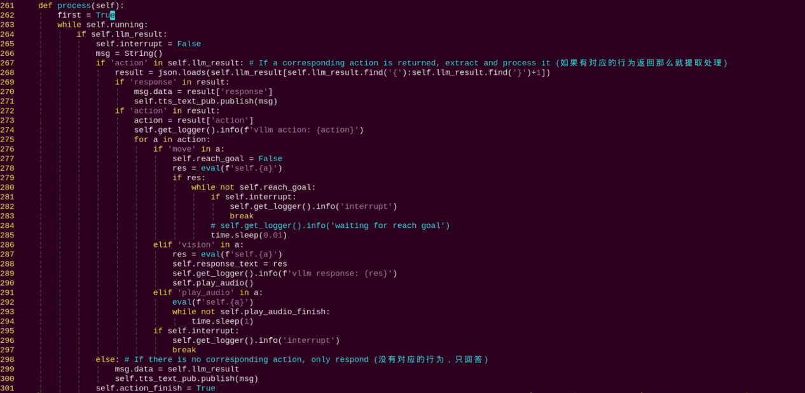

(1) **Check LLM Result**

`if self.llm_result`: check whether `self.llm_result` contains content. If not empty, it indicates that a new result from the LLM needs to be processed. Otherwise, the system enters a short sleep to wait for new results.

(2) **Check for Action Commands**

`if 'action' in self.llm_result`: If the returned result contains the **action** field, it means that in addition to the response text, there are action commands to execute.

(3) **Extract and Parse JSON Data**: uses string search to locate the start and end of the JSON section, and parses it into a dictionary using `json.loads` to extract fields such as `response` and `action`.

(4) **Handle Text Response and Execute Actions:** If the parsed result contains `response`, assign the content to a message and publish it to the `tts_text_pub topic` to trigger TTS playback.

(5) **Move command:** If the action string contains `move`, first set `self.reach_goal` to `False`, call the corresponding move function using `eval` to execute dynamically, and then loop until `self.reach_goal` becomes `True`, which indicats that the robot has reached the goal. During this period, monitor `self.interrupt` to allow interruption.

(6) **Vision Detection:** If `vision` is present, execute the corresponding vision function, assign the returned result to `self.response_text`, and log the result.

(7) **Audio Display:** If `play_audio` is present, directly call the corresponding audio playback function.

(8) **Interrupt Check**: During each action execution, continuously monitor the `self.interrupt` flag. If an interrupt is triggered while waiting or executing an action, the current action is interrupted and the corresponding loop is exited in time.

(9) **Mark as Complete and Switch Mode**: Regardless of whether actions are included, after processing the current LLM result, set `self.action_finish` to True and clear `self.llm_result`. Later in the loop, when both `self.play_audio_finish` and `self.action_finish` are `True`, reset these two flags and send a mode-switch request via `set_mode_client`, entering the next state. Finally, when `self.running` becomes `False`, the loop exits and the ROS system is shut down.

**main Method**


(1) Create an instance of the `VLLMObjectTransport` node.

(2) A multithreaded executor is used to handle the node's tasks.

(3) Call `executor.spin()` to start processing ROS events.

(4) Upon shutdown, the node is properly destroyed using `node.destroy_node()`.

* **Modifying Navigation Locations**

To modify the navigation positions in the program, edit the file located at the following path:

`/home/ubuntu/ros2_ws/src/large_models/large_models/vllm_navigation.py`

1)  Begin by launching the program and displaying the map in rviz following the section [Operation Steps](#operation_steps_5) above. Then, click on **2D Goal Pose** in the rviz interface to set the desired navigation target on the map.


2. Return to the command terminal and check the published target position parameters, then fill them into the program accordingly.

   


Each list contains five values in the following order: x coordinate in meters, y coordinate in meters, roll angle with rotation around the x-axis in degrees, pitch angle with rotation around the y-axis in degrees, and yaw angle with rotation around the z-axis in degrees. Fill in the x and y coordinates according to the position reference in the diagram above. Next, convert the quaternion:  Quaternion(x=0.0, y=0.0, z=-0.5677173914973032, w=0.8232235197025761). After conversion to Euler angles (roll, pitch, yaw), the result is approximately:  
roll ≈ 0°, pitch ≈ 0°, yaw ≈ -69.3°

* **FAQ**

**Launching RVIZ in the Virtual Machine**

If the feature lags or the effect is not satisfactory, you can display RVIZ in the virtual machine. Follow the steps in [Mapping and Navigation Setup](https://wiki.hiwonder.com/projects/LanderPi/en/latest/docs/6_Mapping_Navigation_Course.html#anchor_6_1_4_3) in the file 6. Mapping & Navigation Course.

1)  On the Raspberry Pi, enter the following command and press Enter to launch the smart home assistant feature.

```
ros2 launch large_models vllm_navigation_virtual.launch.py
```

2)  On the virtual machine, click the desktop icon  to open a terminal.

3)  Enter the following command to launch RViz and visualize navigation:

```
ros2 launch navigation rviz_navigation.launch.py
```


### 12.4.5 Vision Tracking in Embodied AI Applications

* **Overview**

> [!NOTE]
>
> **The large model used in this lesson is an online model, so network access is required before getting started. Please prepare an Ethernet cable to connect the robot to the network, or switch the robot to LAN mode.**

Say the wake word to activate WonderEcho Pro, and it will respond with **I'm here**. By default, the firmware uses the wake word **Hello Hiwonder**, please confirm the firmware version to use the correct wake word.

Once activated, the robot can be controlled via voice commands. For example, saying **Track the purple ball** will prompt the terminal to display the recognized speech. The voice device will then broadcast the generated response and the robot will execute the corresponding action.

* **Preparation**

**1. Confirm WonderEcho Pro Firmware**

The factory default wake-up word for the WonderEcho Pro is Hello HiWonder in the English firmware. If you want to change the wake-up word to 'Xiaohuan Xiaohuan in Chinese, you can refer to the tutorial in the section [12.2 Voice Module Introduction and Installation](#anchor_12_2) to flash the Chinese firmware.

If you have previously flashed a different firmware, such as the one using the wake word "Xiaohuan Xiaohuan," you must use the corresponding wake word.

The examples in this course will assume the default factory wake word: **Hello, Hiwonder**.

**2. Configuring the Large Model API-KEY**

By default, the program does not include the configuration of the Large Model-related API keys. Before activating features related to the Large AI Model, please refer to the section [12.3.1 Obtain and Configure the Large Model API Key](#anchor_12_3_1) to configure the necessary keys. This step is mandatory and cannot be skipped, as it is crucial for the proper functioning and experience of the large model features.

**3. Network Configuration**

> [!NOTE]
>
> **The large model used in this lesson is an online model, so network access is required before getting started. Please prepare an Ethernet cable to connect the robot to the network, or switch the robot to LAN mode.**

The robot must be connected to the Internet during this feature, either in STA (LAN) mode or AP (direct connection) mode via Ethernet. There are two methods available for configuring the network:

(1) To configure the network using the mobile app, you may refer to the tutorial of

[LAN Mode Connection (Optional)](https://wiki.hiwonder.com/projects/LanderPi/en/latest/docs/1_LanderPi_User_Manual.html#anchor_1_3_3_4) in the LanderPi User Manual.

(2) Connect to the robot via VNC and modify the network configuration files as described in

[LAN Mode Connection](https://wiki.hiwonder.com/projects/LanderPi/en/latest/docs/1_LanderPi_User_Manual.html#anchor_1_4_2_2) in the section 4. Development Environment Setup and Configuration of the LanderPi User Manual.

* **Operation Steps**

> [!NOTE]
>
> * **Command input is case-sensitive and space-sensitive.**
>
> * **The robot must be connected to the Internet, either in STA (LAN) mode or AP (direct connection) mode via Ethernet.**

1. Power on the robot and connect it to a remote control tool like VNC. For detail informations, please refer to [1.4 Development Environment Setup and Configuration](https://wiki.hiwonder.com/projects/LanderPi/en/latest/docs/1_LanderPi_User_Manual.html#development-environment-setup-and-configuration) in the user manual.

2. On the Raspberry Pi desktop, double-click the icon  to open the terminal, and enter the ROS2 development environment.

3. Enter the command to disable the app auto-start service.

```
~/.stop_ros.sh
```

4. Enter the command and press Enter to launch the corresponding feature.

```
ros2 launch large_models_examples vllm_track.launch.py
```

5. When the terminal displays output shown in the figure and the voice device announces **I'm ready**, the voice device has completed initialization. Then, you can say the wake words: **Hello Hiwonder**.


6. When the terminal displays the corresponding output shown in the figure and the device responds with **I'm here**, it indicates successful activation. The system will begin recording your voice command.


7. When the terminal displays the next output as the reference image, it shows the recognized speech transcribed by the voice device.


8. Upon successful recognition by the speech recognition service of cloud-based large speech model, the parsed command will be displayed under the `publish_asr_result` output in the terminal.


9. Upon receiving user input shown in the figure, the terminal will display output indicating that the cloud-based large language model has been successfully invoked. The model will interpret the command, generate a language response, and execute a corresponding action based on the meaning of the command.

> [!NOTE]
>
> **The response is automatically generated by the model. While the semantic content is accurate, the wording and structure may vary due to randomness in language generation.**


10. When the terminal shows the output shown in the figure indicating the end of one interaction cycle, the system is ready for the next round. To initiate another interaction, repeat step 4 by speaking the wake words again.

    

11. To exit the feature, press **Ctrl+C** in the terminal. If the feature does not exit immediately, press **Ctrl+C** multiple times.

* **Project Outcome**

After the feature is activated, you can phrase your command freely—for example: **Track the purple ball**. The robot will automatically track the purple ball within its field of view. The ball will be highlighted on screen, and once it reaches the center of the frame, the robot will stop tracking.

* **Program Brief Analysis**

**1. Launch File Analysis**

File Path:

`/home/ubuntu/ros2_ws/src/large_models_examples/large_models_examples/vllm_track.launch.py`

**Import Libraries**


(1) **ament_index_python.packages.get_package_share_directory**: retrieves the share directory path of ROS 2 package.

(2) **launch_ros.actions.Node**: used to define ROS 2 nodes.

(3) **launch.substitutions.LaunchConfiguration**: retrieves parameter values defined in the Launch file.

(4) **LaunchDescription, LaunchService**: used to define and start the Launch file.

(5) **launch_description_sources PythonLaunchDescriptionSource**: enables the inclusion of other Launch files.

(6) **launch.actions.IncludeLaunchDescription, DeclareLaunchArgument, OpaqueFunction**: used to define actions and arguments within the Launch file.

**Defining the launch_setup Function**


(1) `mode = LaunchConfiguration('mode', default=1)` defines a `launch` argument named `mode` with a default value of 1.

(2) `sdk_launch` uses `IncludeLaunchDescription` to include the **robot_sdk.launch.py** launch file from the **large_models** package, and passes the `mode` parameter.

(3) `large_models_launch`: includes the **start.launch.py** file from the **large_models** package using `IncludeLaunchDescription` and passes the `mode` argument to it.

(4) `vllm_track_node` defines a `ROS 2` node from the **large_models** package, executes the executable files from the `vllm_track`, and prints the node's output to the screen.

**Definition of the generate_launch_description Function**


**Main Program Entry**


(1) `ld = generate_launch_description()` generates the launch description object.

(2) `ls = LaunchService()` creates the launch service object.

(3) `ls.include_launch_description(ld)` adds the launch description to the service.

(4) `ls.run()` starts the service and execute all launch actions.

**2. Python File Analysis**

The source code for this program is located at:

`/home/ubuntu/ros2_ws/src/large_models_examples/large_models_examples/vllm_track.py`

**Import the Necessary Libraries**


(1) **cv2**: Utilized for image processing and display using OpenCV.

(2) **json**: used for handling data in JSON format.

(3) **sdk.fps as fps**: Used to calculate and display the frame rate (FPS).

(4) **speech**: module related to large model voice interaction.

(5) **large_models_msgs.srv**: custom service types for large models.

(5) **large_models.config**: configuration file for large models.

**PROMPT String**


It defines a prompt string `PROMPT` used to guide how user commands and image data are processed. It specifies the recognition task logic and expected output format.

**VLLMTrack Class**


(1) `self.vllm_result`: stores the results processed by the model.

(2) `self.running`: a boolean flag used to control the runtime state of the program.

(3) `self.data`: an empty list used for storing intermediate data.

(4) `self.start_track`: a boolean flag used to control the start or stop of target tracking.

(5) `self.track = ObjectTracker()`: instantiates an object tracker.

(6) `self.tts_text_pub`: a publisher is created for sending text data to the text-to-speech node.

(7) `self.track.update_pid()`: passes the updated `PID` parameters to the object tracker `self.track` to adjust its PID controller.

(8) `self.pid_params`: contains the PID controller parameters used in the target tracking control logic.

**on_parameter_update Method**


(1) `self.pid_params`: a dictionary storing PID parameters.

(2) `self.track.update_pid`: updates the PID parameters used by the target tracking module.

**create_update_callback Method**


It generates a dynamic update callback function for each PID parameter.

**get_node_state Method**


`return response`: returns a response object.

**init_process Method**


(1) `SetModel.Request()`: creates a request message to set the model.

(2) `SetString.Request()`: creates a request message to set the prompt string.

(3) `set_pose_target`: sets the robot's initial position.

(4) self.send_request: sends a service request.

(5) `speech.play_audio`: plays an audio file.

(6) `threading.Thread`: starts a new thread for image processing and tracking.

**send_request Method**


(1) `client.call_async(msg)`: makes an asynchronous service call.

(2) `future.done()` and `future.result()`: check if the service call is complete and retrieve the result.

**vllm_result_callback Method**


This callback receives results from the `agent_process/result` topic and stores them in `self.vllm_result`.

**Play_audio_finish_callback Method**


The `play_audio_finish_callback` method sends a wake-up signal after audio playback is completed.

**process Method**


(1) Retrieve image data from the `image_queue.get` queue, then subscribe to the results received in `vllm_result`. Use `json.load` to parse the image recognition results and process them, and finally call the `track.set_track_target` function to set the tracking target.

(2) `speech.play_audio(start_track_audio_path, block=False)`: Plays an audio file to indicate that target tracking has started.

(3) `self.send_request(self.awake_client, msg)`: Sends a service request through `awake_client` to enable the voice wake-up function.

**multi_callback Method**

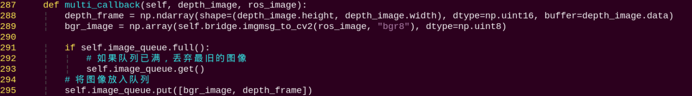

It converts received RGB and depth camera image messages to `NumPy` arrays and stores them in the queue.

**main Method**


An instance of the `VLLMTrack` node is created, and a multithreaded executor is used to handle the node's tasks. Call `executor.spin()` to start processing ROS events. Upon shutdown, the node is properly destroyed using `node.destroy_node()`.

### 12.4.6 Intelligent Transport in Embodied AI Applications

* **Overview**

> [!NOTE]
>
> **The large model used in this lesson is an online model, so network access is required before getting started. Please prepare an Ethernet cable to connect the robot to the network, or switch the robot to LAN mode.**

Say the wake word to activate WonderEcho Pro, and it will respond with **I'm here**. By default, the firmware uses the wake word **Hello Hiwonder**, please confirm the firmware version to use the correct wake word.

Once activated, the robot can be controlled by voice commands. For example, you can say: **Put the red block into the blue box**. Upon receiving a command, the terminal displays the recognized speech content. The voice device then verbally responds with a generated answer and the robot simultaneously executes the corresponding action.

* **Preparation**

**1. Confirm WonderEcho Pro Firmware**

The factory default wake-up word for the WonderEcho Pro is Hello HiWonder in the English firmware. If you want to change the wake-up word to 'Xiaohuan Xiaohuan in Chinese, you can refer to the tutorial in the section [12.2 Voice Module Introduction and Installation](#anchor_12_2) to flash the Chinese firmware.

If you have previously flashed a different firmware, such as the one using the wake word "Xiaohuan Xiaohuan," you must use the corresponding wake word.

The examples in this course will assume the default factory wake word: **Hello, Hiwonder**.

**2. Configuring the Large Model API-KEY**

By default, the program does not include the configuration of the Large Model-related API keys. Before activating features related to the Large AI Model, please refer to the section [12.3.1 Obtain and Configure the Large Model API Key](#anchor_12_3_1) to configure the necessary keys. This step is mandatory and cannot be skipped, as it is crucial for the proper functioning and experience of the large model features.

**3. Network Configuration**

> [!NOTE]
>
> **The large model used in this lesson is an online model, so network access is required before getting started. Please prepare an Ethernet cable to connect the robot to the network, or switch the robot to LAN mode.**

The robot must be connected to the Internet during this feature, either in STA (LAN) mode or AP (direct connection) mode via Ethernet. There are two methods available for configuring the network:

(1) To configure the network using the mobile app, you may refer to the tutorial of

[LAN Mode Connection (Optional)](https://wiki.hiwonder.com/projects/LanderPi/en/latest/docs/1_LanderPi_User_Manual.html#anchor_1_3_3_4) in the LanderPi User Manual.

(2) Connect to the robot via VNC and modify the network configuration files as described in

[LAN Mode Connection](https://wiki.hiwonder.com/projects/LanderPi/en/latest/docs/1_LanderPi_User_Manual.html#anchor_1_4_2_2) in the section 4. Development Environment Setup and Configuration of the LanderPi User Manual.

**4. Grasp and Placement Calibration**

Before starting the intelligent handling process, you need to adjust the grasping behavior to ensure accurate performance. If the robotic arm fails to pick up the colored blocks during the demo or operation, you can follow the steps below to perform grasp calibration. This allows you to adjust the pickup area using program commands.

(1) Power on the robot and connect it to a remote control tool like VNC. For detail informations, please refer to [1.4 Development Environment Setup and Configuration](https://wiki.hiwonder.com/projects/LanderPi/en/latest/docs/1_LanderPi_User_Manual.html#development-environment-setup-and-configuration) in the user manual.

(2) On the Raspberry Pi desktop, double-click the icon  to open the terminal, and enter the ROS2 development environment.

(3) Enter the command to disable the app auto-start service.

```
~/.stop_ros.sh
```

(4) To begin grasp calibration, enter the following command:

```
ros2 launch large_models_examples automatic_pick.launch.py debug:=pick
```

(5) Wait until the program finishes loading and you hear the voice prompt **I'm ready**.

(6) The robotic arm will perform a calibration grasping action and place the object at the gripper's pickup location. Once the robotic arm returns to its original posture, use the **mouse** to left-click and **drag a bounding box** around the target object on the screen. Once the object is correctly identified, the system will automatically calibrate the pickup position for that specific target.


(7) The calibration process for placing objects is the same as for grasping. To begin placement calibration, run the following command:

```
ros2 launch large_models_examples automatic_pick.launch.py debug:=place
```

**5. Navigation Map Construction**

Before enabling this feature, a map must be created in advance. Please refer to [6.1 Mapping Instruction](https://wiki.hiwonder.com/projects/LanderPi/en/latest/docs/6_Mapping_Navigation_Course.html#mapping-instruction) in 6. Mapping & Navigation Course for detailed instructions on how to build the map.

* **Operation Steps**

> [!NOTE]
>
> * **Command input is case-sensitive and space-sensitive.**
>
> * **The robot must be connected to the Internet, either in STA (LAN) mode or AP (direct connection) mode via Ethernet.**

1. Double click on the icon  to open a terminal.

2. Enter the command to disable the app auto-start service.

```
~/.stop_ros.sh
```

3. Enter the following command and press Enter to launch the intelligent transport feature.

```
ros2 launch large_models_examples vllm_navigation_transport.launch.py map:=map_01
```

4. Use the virtual machine to open the navigation RViz tool. For details, refer to the section [6.1 Navigation Instruction](https://wiki.hiwonder.com/projects/LanderPi/en/latest/docs/6_Mapping_Navigation_Course.html#mapping-instruction) in the file 6. Mapping & Navigation Course.

5. After opening the map in RViz, click the **2D Pose Estimate** icon to set the robot's initial position.

   

6. When the terminal displays output shown in the figure and the voice device announces **I'm ready**, the device has completed initialization and yolov8 model will be initialized at the same time. Then, you can say the wake words **Hello Hiwonder**.

   

   

7. When the terminal displays the corresponding output shown in the figure and the device responds with **I'm here**, it indicates successful activation. The system will begin recording your voice command.

Speak a command such as **Put the red square in the blue box.** The voice device will capture the speech, and the large language model will process the command.


8. Upon successful recognition by the speech recognition service of cloud-based large speech model, the parsed command will be displayed under the `publish_asr_result` output in the terminal.


9. Upon receiving user input shown in the figure, the terminal will display output indicating that the cloud-based large language model has been successfully invoked. The model will interpret the command, generate a language response, and execute a corresponding action based on the meaning of the command.

> [!NOTE]
>
> **The response is automatically generated by the model. While the semantic content is accurate, the wording and structure may vary due to randomness in language generation.**


10. The robot will first move to the red block and complete the task of picking it up.


11. Then it will go to the blue box and place the block inside.


12. When the terminal shows the output shown in the figure indicating the end of one interaction cycle, the system is ready for the next round. To initiate another interaction, repeat step 4 by speaking the wake words again.


13. To exit the feature, press **Ctrl+C** in the terminal. If the feature does not exit immediately, press **Ctrl+C** multiple times.

* **Project Outcome**

Once the program is activated, you can phrase your own commands. For example, saying **Put the red block into the blue box** will make the robot first move to the red block, pick it up, then navigate to the blue box waypoint, and place the block inside.

* **Modifying Navigation Locations**

To modify the navigation positions in the program, edit the file located at the following path:

`~/ros2_ws/src/large_models_examples/large_models_examples/navigation_transport/vllm_navigation_transport.py`

1)  Begin by launching the program and displaying the map in rviz following step 4 above. Then, click on **2D Goal Pose** in the rviz interface to set the desired navigation target on the map.


2)  Return to the command terminal and check the published target position parameters.


Locate the corresponding section of the code shown below, and fill in your target location parameters after the appropriate location name.


In the program, each location is defined as a target navigation point relative to the map's origin, which corresponds to the robot's starting position during the mapping process. Each navigation point includes five parameters:

x: position on the x-axis (meters)

y: position on the y-axis (meters)

roll: rotation around the x-axis (degrees)

pitch: rotation around the y-axis (degrees)

yaw: rotation around the z-axis (degrees)

For example, to define the position of **green square**, the parameters can be set to \[0.0, 0.45, 0.0, 0.0, 90.0\], indicating that the robot will navigate to a location offset from the map origin by those values.

For example, given the quaternion: Quaternion(x=0.0, y=0.0, z=-0.5677173914973032, w=0.8232235197025761). After conversion to Euler angles (roll, pitch, yaw), the result is approximately: roll ≈ 0°, pitch ≈ 0°, yaw ≈ -69.3°

* **Program Brief Analysis**

**1. Launch File Analysis**

File Path:

`/home/ubuntu/ros2_ws/src/large_models_examples/large_models_examples/navigation_transport/vllm_navigation_transport.launch.py`

**Import Libraries**


(1) **os**: used for handling file paths and operating system-related functions.

(2) **ament_index_python.packages.get_package_share_directory**: retrieves the share directory path of ROS 2 package.

(3) **launch_ros.actions.Node**: used to define ROS 2 nodes.

(4) **launch.substitutions.LaunchConfiguration**: retrieves parameter values defined in the Launch file.

(5) **LaunchDescription, LaunchService**: used to define and start the Launch file.

(6) **launch_description_sources PythonLaunchDescriptionSource**: enables the inclusion of other Launch files.

(7) **launch.actions.IncludeLaunchDescription, DeclareLaunchArgument, OpaqueFunction**: used to define actions and arguments within the Launch file.

**Defining the launch_setup Function**


(1) This function includes the **navigation_transport.launch.py** file from the **large_models_examples** package, which launches the navigation-to-goal functionality.

(2) `large_models_launch`: includes the **start.launch.py** Launch file from the **large_models** package using `IncludeLaunchDescription` and passes the `mode` argument to it.

(3) `vllm_navigation_transport_node`: defines a `ROS 2` node from the **large_models** package, executes the executable files from `vllm_navigation_transport`, and prints the node's output to the screen.

(4) The function returns a list of all defined launch actions.

**Definition of the generate_launch_description Function**


(1) This function is responsible for generating the complete launch description.

(2) The `launch_setup` function is incorporated using `OpaqueFunction`.

**Main Program Entry**


(1) `ld = generate_launch_description()` generates the launch description object.

(2) `ls = LaunchService()` creates the launch service object.

(3) `ls.include_launch_description(ld)` adds the launch description to the service.

(4) `ls.run()` starts the service and execute all launch actions.

**2. Python File Analysis**

File Path:

`/home/ubuntu/ros2_ws/src/large_models_examples/large_models_examples/navigation_transport/vllm_navigation_transport.py`

**Import the Necessary Libraries**


(1) **cv2**: Utilized for image processing and display using OpenCV.

(2) **json**: used for handling data in JSON format.

(3) **time**: manages execution delays and time-related operations.

(4) **queue**: handles image queues between threads.

(5) **rclpy**: provides tools for creating and communicating between ROS 2 nodes.

(6) **threading**: enables multithreading for concurrent task processing.

(7) **numpy (np)**: supports matrix and vector operations.

(8) **std_srvs.srv**: contains standard ROS service types, used to define standard service.

(9) **std_msgs.msg:** contains ROS message types.

(10) **rclpy**: provides tools for creating and communicating between ROS 2 nodes.

(11) **rclpy.node.Node**: base class for ROS 2 nodes.

(12) **rclpy.callback_groups.ReentrantCallbackGroup**: supports concurrent callback handling.

(13) **rclpy.executors.MultiThreadedExecutor**: multithreaded executor in ROS 2 for handling concurrent tasks.

(14) **rclpy.node**: node class in ROS 2.

(15) **speech**: module related to large model voice interaction.

(16) **large_models_msgs.srv**: custom service types for large models.

(17) **large_models.config**: configuration file for large models.

**PROMPT String**


It defines 3 prompt strings `PROMPT` used to guide how user commands and image data are processed. It specifies the recognition task logic and expected output format.

**VLLMObjectTransport Class**


(1) `rclpy.init()`: initializes the ROS 2 system.

(2) `super().init(name)`: calls the initializer of the parent class (Node) to create a ROS 2 node.

(3) `self.llm_result`：stores results returned from LLM.

(4) `self.running`: used to control the runtime state of the program.

(5) `self.transport_finished`：indicates whether the transport task has been completed.

(6) `self.tts_text_pub`: publishes TTS (Text-to-Speech) text to a `ROS` topic.

(7) `self.create_subscription`: subscribes to LLM results and the transport completion status.

(8) `self.lock`: threading lock used for synchronization in multi-threaded operations.

(9) `self.client`: speech API client used to communicate with the voice service.

(10) `self.tts_text_pub`: publishes TTS messages to a `ROS` topic.

(11) `self.asr_pub`: publishes speech recognition results to a `ROS` topic.

(12) `self.create_subscription`: subscribes to LLM result and transport status topics.

(13) `self.create_client`: creates multiple service clients for calling various functionalities.

(14) `self.timer`: creates a timer used to trigger the initialization process.

**get_node_state Method**


`return response`: returns a response object.

**init_process Method**


(1) `self.timer.cancel()`: cancels the timer.

(2) `SetModel.Request()`: creates a request message to set the LLM model.

(3) `SetModel.Request`: creates a request for `SetModel` service.

(4) `msg.model_type = 'llm'`: specifies the model type as `llm`.

(5) `self.send_request(self.set_model_client, msg)`: sends the model configuration request through the `set_model_client`.

(6) `SetString.Request`: creates a request message to set the prompt string.

(7) `self.send_request(self.set_prompt_client,msg)`: sends the model configuration request through the `set_prompt_client`.

(8) `Empty.Request`: request message used to clear the current conversation history.

(9) `self.send_request(self.clear_chat_client, msg)`: sends the request through the `clear_chat_client` to reset chat context.

(10) `self.create_client(Empty, 'object_transport/init_finish')`: creates a service client for calling the `object_transport/init_finish` endpoint.

(11) `init_finish.wait_for_service()`: waits for the `init_finish` service to become available.

(12) `self.send_request(self.enter_client, Trigger.Request())`: sends a `Trigger` request through the `enter_client` to initiate the process.

(13) `speech.play_audio`: plays an audio cue.

(14) `threading.Thread`: launches the main logic in a new thread.

(15) `self.create_service`: creates a service to signal the completion of initialization.

(16) `self.get_logger().info`: prints log messages.

**send_request Method**


(1) `client.call_async(msg)`: makes an asynchronous service call.

(2) `future.done()` and `future.result()`: check if the service call is complete and retrieve the result.

**vllm_result_callback Method**


(1) This callback receives results from the `agent_process/result` topic and stores them in `self.vllm_result`.

**get_object_position Method**


(1) `query`：a query request.

(2) `image`: the input image data.

(3) `offset`: offset of the placement position.

(4) `SetContent.Request`: request message used to set the LLM content.

(5) `self.get_logger().info`: prints log messages.

(6) `self.send_request`: sends the service request.

(7) `res.message`: extracts the message content from the service response.

(8) `if 'object' in vllm_result`: checks whether the result contains object-related information.

(9) `if vllm_result.startswith("")` and `vllm_result.endswith("")`: checks the message format.

(10) `vllm_result.strip("").replace("json\n", "").strip()**`: cleans up the message content, removes the code block markers, strips the `json\n` prefix, trims leading and trailing whitespace, and extracts a pure JSON string.

(11) `json.loads(message)`: parses the cleaned JSON string into a Python dictionary.

(12) `vllm_result.message`: extracts the message the response.

(13) `box = self.client.data_process(box, w, h)`: processes the bounding box for the placement position.

(14) `self.tts_text_pub.publish(msg)`: publishes the final message.

**pick Method**


(1) **<u>Trigger Pick Preparation</u>**

`self.send_request(self.set_pick_client, Trigger.Request())`: sends a trigger request to the pick service, which may cause the robotic arm to enter pick-ready status.

(2) **<u>Acquire Image</u>**

`image = self.image_queue.get(block=True)`: retrieves the latest image from the image queue. `block=True` means the method will wait until an image is available before proceeding.

(3) **<u>Detect Target Object</u>**

`box = self.get_object_position(query, image)`: calls the `get_object_position` method to detect the object based on the query and input image, returning bounding box coordinates.

(4) **<u>Handle Detection Result</u>**

`if box`: checks whether the object was successfully detected.

If successful, the bounding box data is recorded for further processing.

(5) **<u>Create Bounding Box Request</u>**

`msg = SetBox.Request()`: creates a request to set the bounding box coordinates.

Set the bounding box coordinates:

`msg.x_min = box[0]`

`msg.y_min = box[1]`

`msg.x_max = box[2]`

`msg.y_max = box[3]`

(6) **<u>Send Bounding Box to Pick Node</u>**

`self.log_info("Step 5: Sending bounding box to automatic_pick node")`: logs the operation of sending the bounding box.

`self.send_request(self.set_box_client, msg)`: sends the bounding box request to the pick node

so it knows where the object is located for grasping.

**place Method**


The logic and structure are analogous to the pick method.

**Play_audio_finish_callback Method**


This method handles updates on the transport status.

**process Method**


(1) `while self.running`: this loop keeps running as long as `self.running` is set to `True`.

(2) `if self.vllm_result`: checks whether `self.vllm_result` is empty, which is the result from vllm model.

(3) `self.interrupt = False`: resets the interrupt flag.

(4) `if 'action' in self.llm_result`: checks if the result contains an action command.

(5) `result = eval(self.llm_result\[...\])`: parses the JSON result.

(6) `if 'response' in result`: checks if the result includes a response message.

(7) `msg.data = result\['response'\]`: set response text.

(8) `self.tts_text_pub.publish(msg)`: publishes the response text.

(9) `if 'action' in result`: checks whether the result contains an action list.

(10) `action = result\['action'\]`: retrieves the action list.

(11) `if 'move' in a`: checks whether it is a move action.

(12) `self.reach_goal = False`: resets the "goal reached" flag.

(13) `eval(f'self.{a}')`: executes the move command.

(14) `while not self.reach_goal`: waits until the target is reached.

(15) `elif 'pick' in a or 'place' in a`: checks whether it is a pick or place action.

(16) `eval(f'self.{a}')`: executes the pick or place command.

(17) `self.transport_action_finish = False`: resets the transport action completion flag.

(18) `while not self.transport_action_finish`: waits until the action is completed.

(19) `Interrupt Handling`: if self.interrupt checks whether the process has been interrupted.

(21) No action response handling `else`: \# No corresponding action found, only respond. handling process when no action is found.

(22) Finish Handlling `self.action_finish = True`: marks the action as completed.

(23) Waiting Handling `else`: `time.sleep(0.01)`: short sleep.

(24) Mode Switching `if self.play_audio_finish and self.action_finish`: checks if both audio playback and action execution are complete.

(25) Shutdown Handling `rclpy.shutdown()`: shut down the ROS 2 system.

(26) `for a in action`: iterates over the action list and execute each action.

**main Method**


(1) Create an instance of the `VLLMObjectTransport` node.

(2) A multithreaded executor is used to handle the node's tasks.

(3) Call `executor.spin()` to start processing ROS events.

(4) Upon shutdown, the node is properly destroyed using `node.destroy_node()`.


## 12.5 Comprehensive Application of Large AI Models

<p id ="p12-5-1"></p>

### 12.5.1 Obtain and Configure the Large Model API Key

> [!NOTE]
>
> **This section requires registering on the official OpenAI website and obtaining an API key for accessing large language models.**

#### 12.5.1.1 Register and Deploy OpenAI Account 

1)  Copy and open the following URL: https://platform.openai.com/docs/overview to click the **Sign Up** button in the upper-right corner.


2)  Register and log in using a Google, Microsoft, or Apple account, as prompted.


3)  After logging in, click the Settings button, then go to Billing, and click Payment Methods to add a payment method. Recharge your account to purchase tokens as needed.


4)  Once your account is set up, go to the **API Keys** section and click **Create new key**. Follow the instructions to generate a new API key and save it securely for later use.


5)  The creation and deployment of the large model have been completed, and this API will be used in the following sections.

#### 12.5.1.2 Register and Deploy OpenRouter Account 

1)  In the website https://openrouter.ai/, click **Log In**, and register or sign in using Google or another available account.


2)  After logging in, click the icon in the top-right corner, then select **Credits** to add a payment method.


3)  Create an API key. Go to **API Keys**, then click **Create Key**. Follow the prompts to generate a key. Save the API key securely for later use.


4)  The creation and deployment of the large model have been completed, and this API will be used in the following sections.

#### 12.5.1.3 API Configuration

1)  In the command-line terminal, enter the following command to navigate to the directory where the large model keys are configured.

**cd /home/ubuntu/ros2_ws/src/large_models/large_models/large_models**


2. Next, open the configuration file with the following command.

   **vim config.py**


3)  Once the file is open, you need to configure the OpenAI and OpenRouter keys by filling them into the parameters llm_api_key and vllm_api_key, respectively.


For example, copy the keys you created in this chapter and paste them into the corresponding fields. Place the cursor between the quotation marks, right-click, and select Paste. 

> [!NOTE]
>
> **Keys from different large models cannot be mixed, otherwise the functions may fail to work properly.**

4. After pasting, press **Esc**, then enter the command and press **Enter** to save the file.

   ```
   :wq
   ```

   


### 12.5.2 Vision Applications

#### 12.5.2.1 Overview

When the program starts running, WonderEcho Pro will announce **I’m ready**.

Say the wake word to activate WonderEcho Pro, and it will respond with **I’m here**. By default, the firmware uses the wake word Hello Hiwonder, please confirm the firmware version to use the correct wake word.

Then, the robot can be controlled via voice commands. For example, **follow the black line, avoid obstacles, rotate in place once, and describe the surroundings**. Voice input is converted to text via the Cloud ASR API and provided to the large language model for analysis. Once the model completes its reasoning, the result will be broadcast using the API and the corresponding action will be executed.

#### 12.5.2.2 Preparation

* **Confirm WonderEcho Pro Firmware**

WonderEcho Pro ships with an English firmware, with the default wake word set to **Hello Hiwonder**. To change the wake word to LanderPi, please refer to the file [03 Firmware Flashing](https://drive.google.com/file/d/1ETzWzMl_N2Z1HDhExGgJK2x6erBpauMW/view?usp=sharing).

If a different firmware has been flashed previously, such as one using the wake word **LanderPi**, the corresponding wake word must be used for activation.

The examples in this course will assume the default factory wake word: **Hello Hiwonder**.

* **Configuring the Large Model API-KEY**

By default, the program does not include the configuration of the Large Model-related API keys. Before activating features related to the Large AI Model, please refer to the section [12.5.1 Obtain and Configure the Large Model API Key](#p12-5-1) to configure the necessary keys. This step is mandatory and cannot be skipped, as it is crucial for the proper functioning and experience of the large model features.

* **Network Configuration**

Note: The large model used in this lesson is an online model, so network access is required before getting started. Please prepare an Ethernet cable to connect the robot to the network, or switch the robot to LAN mode.

The robot must be connected to the Internet during this feature, either in STA (LAN) mode or AP (direct connection) mode via Ethernet. There are two methods available for configuring the network:

- Network configuration can be completed through the app using the following path.

[LAN Mode Connection (Optional)](https://wiki.hiwonder.com/projects/LanderPi/en/latest/docs/1_LanderPi_User_Manual.html#anchor_1_3_3_4) in the LanderPi User Manual.

- Connect to the robot via VNC and modify the network configuration files as described in

LAN Mode Connection in the section [1.4 Development Environment Setup and Configuration](https://wiki.hiwonder.com/projects/LanderPi/en/latest/docs/1_LanderPi_User_Manual.html#development-environment-setup-and-configuration) of the LanderPi User Manual.

#### 12.5.2.3 Operations

> [!NOTE]
>
> **1. Command input is case-sensitive and space-sensitive.**
>
> **2. The robot must be connected to the Internet, either in STA (LAN) mode or AP (direct connection) mode via Ethernet.**

1)  Power on the robot and connect it to a remote control tool like VNC. For detailed information, please refer to Section [1.4 Development Environment Setup and Configuration](https://wiki.hiwonder.com/projects/LanderPi/en/latest/docs/1_LanderPi_User_Manual.html#development-environment-setup-and-configuration) in the file LanderPi User Manual.

2)  Click the icon  to open the command-line terminal.

3)  Enter the command to disable the auto-start service.

```
~/.stop_ros.sh
```


4)  Entering the following command to start the feature.

```
ros2 launch large_models_examples llm_control_progress.launch.py
```


5)  When the command-line output shown below appears, initialization is complete. At this point, speak the wake word **Hello Hiwonder**.


6)  When the terminal displays the corresponding output shown in the figure and the device responds with **I’m here**, it indicates successful activation. The system will begin recording voice commands.


7. Voice commands can be issued to control the robot's movement, such as **follow the black line, avoid obstacles, rotate in place once, and describe the surroundings**.

8. The cloud-based speech recognition service of the large speech model is invoked to process the command audio. “**publish asr result**” indicates the recognized speech output. When the cloud-based speech synthesis service of the large language model is successfully invoked, WonderEcho Pro will play the audio.

9. When the command-line output shown below appears, the robot will execute the corresponding action.

   

10. When the terminal shows the output shown in the figure indicating the end of one interaction cycle, the system is ready for the next round. To initiate another interaction, repeat step 5 by speaking the wake words again.


11) To exit the feature, press **Ctrl+C** in the terminal. If the feature does not exit immediately, press **Ctrl+C** multiple times.

#### 12.5.2.4 Project Outcome

Once the feature is activated, voice commands can be issued to the robot, enabling it to move, follow lines, and perform real-time detection.

> [!NOTE]
>
> **The actions used in this feature is preset in the program library and the quantity is limited. The robot's movement is controlled by calling functions corresponding to the action strings designed by the large model. If the instruction involves unpreset actions, the program will not be able to execute, but the large model will recognize the instruction and give a response.**

#### 12.5.2.5 Program Analysis

* **Launch File Analysis**

The launch file is located at: **/home/ubuntu/ros2_ws/src/large_models_examples/large_models_examples/function_calling/llm_control_progress.launch.py**


Launch the nodes for motion control, LiDAR, depth camera, navigation, and large model functions, as well as the nodes for line following and object tracking.

* **Python File Analysis**

The Python file is located at:  
**/home/ubuntu/ros2_ws/src/large_models_examples/large_models_examples/function_calling/llm_control.py**

**1. Tool List**


Defines the metadata for all tool functions accessible by the large model, including name, description, and parameters. This covers object recognition, navigation, line following, tracking, robotic arm manipulation, and more, serving as a mapping between the large model and robot functions.

**2. Initialization**


Initializes the node, including variable setup, service client creation, subscriber and publisher configuration, and timer initialization.

**3. Service Client Setup**


Creates service clients for the large model with tool settings, model selection, and prompt configuration, for navigation with pose settings, for line following with start, stop, and target configuration, and for voice wake-up. These clients allow calling services from other nodes.

**4. Publisher and Subscriber Initialization**


Subscribes to commands for tool invocation, large language model results, AMCL poses to obtain localization information, navigation target arrival, voice wake-up and completion, chassis velocity, and image data.

Publishes tool execution results, text for voice output, chassis control commands, robotic arm commands, and processed vision images.

**5. Pose Processing**


Receives AMCL localization results, parses the robot’s current coordinates (x/y) and orientation (yaw), and provides corresponding data.

**6. Synchronized Image Callback**


Receives RGB and depth camera data simultaneously, converts them to OpenCV format, and stores them in an image queue to provide a data source for vision-based tools.

**7. Get Pixel Distance**


Reads the depth value at a specified pixel in the depth image, converts it to meters, and returns the result.

**8. Get Object Pixel Position**


Uses the large model to identify a specified object in the image and returns the pixel coordinates of the object’s center.

**9. Move to Specified Position**


Sets a target pose through the navigation service based on a predefined location name, waits for the `reach_goal` signal, and returns the navigation result.

**10. Describe View**


Uses VLLM to describe the current scene based on a query and performs voice playback.

**11. Line-Following Function**


Calls the line-following service, sets the target color, starts line following, and updates the line-following status flag.

**12. Obstacle Detection**


During line following, monitors obstacles by checking chassis velocity. If the velocity remains zero for a prolonged period, line following is stopped, and the detection result is returned.

**13. Color Tracking**


Calls the color-tracking service, sets the target color, starts tracking, and updates the tracking status flag.

**14. Motion Control**


Controls the chassis to move at specified linear and angular velocities for a given duration. The chassis stops after the motion is completed.

**15. Object Tracking**


Sets the bounding box for object tracking and activates the tracking flag.

**16. Color Picking**


Main process for color-based picking, integrating `color_detect` and `pick_handle` to complete the workflow from visual localization to motion, and finally robotic arm grasping.

**17. Color Placement**


Main process for color-based placement, resets motion parameters, and controls the robotic arm to perform the placement action and return to its initial position.

**18. Picking Process**


Closed-loop control for color-based picking. The chassis is directed toward the target color object using PID control. When stop conditions are met, the grasping action is triggered.

**19. Color Detection**


Detects objects of a specified color in the LAB color space and returns the object’s center point, angle, and bounding box. Provides visual data for color tracking and picking.

**20. Tool Callback**


Receives tool invocation commands from the large model, parses tool ID, name, and parameters, and stores them in `self.tools` for execution in the main processing loop.

**21. Main Loop**


Continuously monitors tool invocation commands from the large model, calls the corresponding function based on the tool name, publishes the results after execution, and captures exceptions to return error information.

**22. Display Thread**


Continuously reads from the image queue, draws bounding boxes for color detection and object tracking, and displays the results in the window.

**23. Object Tracking**


Runs independently, reading data from the image queue and executing object tracking based on bounding boxes. PID outputs are used to control chassis speed. In picking mode, the robotic arm is triggered when position conditions are satisfied.


### 12.5.3 Intelligent Navigation & Transport

#### 12.5.3.1 Overview

> [!NOTE]
>
> **The large model used in this lesson is an online model, so network access is required before getting started. Please prepare an Ethernet cable to connect the robot to the network, or switch the robot to LAN mode.**

Say the wake word to activate WonderEcho Pro, and it will respond with **I'm here**. By default, the firmware uses the wake word Hello Hiwonder, please confirm the firmware version to use the correct wake word.

Once activated, the robot can be controlled by voice commands. For example, **Go to the express station and bring back the red package**. Upon receiving a command, the terminal displays the recognized speech content. The voice device then verbally responds with a generated answer and the robot simultaneously executes the corresponding action.

#### 12.5.3.2 Preparation

* **Confirm WonderEcho Pro Firmware**

WonderEcho Pro ships with an English firmware, with the default wake word set to **Hello Hiwonder**. To change the wake word to LanderPi, please refer to the file [03 Firmware Flashing](https://drive.google.com/file/d/1ETzWzMl_N2Z1HDhExGgJK2x6erBpauMW/view?usp=sharing).

If a different firmware has been flashed previously, such as one using the wake word **LanderPi**, the corresponding wake word must be used for activation.

The examples in this course will assume the default factory wake word: **Hello Hiwonder**.

* **Configuring the Large Model API-KEY**

By default, the program does not include the configuration of the Large Model-related API keys. Before activating features related to the Large AI Model, please refer to the section [12.5.1 Obtain and Configure the Large Model API Key](#p12-5-1) to configure the necessary keys. This step is mandatory and cannot be skipped, as it is crucial for the proper functioning and experience of the large model features.

* **Network Configuration**

Note: The large model used in this lesson is an online model, so network access is required before getting started. Please prepare an Ethernet cable to connect the robot to the network, or switch the robot to LAN mode.

The robot must be connected to the Internet during this feature, either in STA (LAN) mode or AP (direct connection) mode via Ethernet. There are two methods available for configuring the network:

1. Network configuration can be completed through the app following the steps in [LAN Mode Connection (Optional)](https://wiki.hiwonder.com/projects/LanderPi/en/latest/docs/1_LanderPi_User_Manual.html#anchor_1_3_3_4) in the LanderPi User Manual.

2. Connect to the robot via VNC and modify the network configuration files as described in LAN Mode Connection in the section [1.4 Development Environment Setup and Configuration](https://wiki.hiwonder.com/projects/LanderPi/en/latest/docs/1_LanderPi_User_Manual.html#development-environment-setup-and-configuration) of the LanderPi User Manual.

* **Grasp and Placement Calibration**

Before starting the intelligent handling process, adjust the grasping behavior to ensure accurate performance. If the robotic arm fails to pick up the colored blocks during the demo or operation, you can follow the steps below to perform grasp calibration. This allows you to adjust the pickup area using program commands.

1)  Power on the robot and connect it to a remote control tool like VNC. For detailed information, please refer to Section [1.4 Development Environment Setup and Configuration](https://wiki.hiwonder.com/projects/LanderPi/en/latest/docs/1_LanderPi_User_Manual.html#development-environment-setup-and-configuration) in the file LanderPi User Manual.

2)  Click the icon  to open the command-line terminal.

3)  Enter the command to disable the auto-start service.

```
~/.stop_ros.sh
```


4)  To begin grasp calibration, enter the following command:

```
ros2 launch large_models_examples automatic_pick.launch.py debug:=pick
```


5)  Wait until the program finishes loading and announces the voice prompt **I'm ready**.

6)  The robotic arm will perform a calibration grasping action and place the object at the gripper’s pickup location. Once the robotic arm returns to its original posture, use the mouse to left-click and drag a bounding box around the target object on the screen. Once the object is correctly identified, the system will automatically calibrate the pickup position for the recognized target.

7)  The calibration process for placing objects is the same as for grasping. To begin placement calibration, run the following command:

```
ros2 launch large_models_examples automatic_pick.launch.py debug:=place
```


* **Navigation Map Construction**

Before enabling this feature, a map must be created in advance. Please refer to [6. Mapping & Navigation Course\6.1 Mapping Instruction](https://wiki.hiwonder.com/projects/LanderPi/en/latest/docs/6_Mapping_Navigation_Course.html#mapping-instruction) for detailed instructions on how to build the map.

#### 12.5.3.3 Operations

> [!NOTE]
>
> **1\. Command input is case-sensitive and space-sensitive.**
>
> **2. The robot must be connected to the Internet, either in STA (LAN) mode or AP (direct connection) mode via Ethernet.**

1)  Click the icon  to open a terminal.

2)  Enter the command to disable the auto-start service.

```
~/.stop_ros.sh
```


3)  Launching the RViz tool allows monitoring of the navigation status.

```
rviz2 rviz2 -d /home/ubuntu/ros2_ws/src/navigation/rviz/navigation_controller.rviz
```


4)  Enter the following command and press **Enter** to launch the real-time navigation and transport features.

```
ros2 launch large_models_examples llm_control_progress.launch.py function:=navigation
```


5)  After opening the map in RViz, click the **2D Pose Estimate** icon to set the robot’s initial position.


6. When the command line displays the output shown below and announces **I’m ready**, the voice device has completed initialization. At this point, say the wake word **Hello Hiwonder**.

   

7. When the terminal displays the corresponding output shown in the figure and the device responds with **I’m here**, it indicates successful activation. At this point, the recording of the spoken command begins.


Next, speak the command **Go to the express station and bring back the red package**, and wait for the large model to process and recognize it.

8. Upon successful recognition by the speech recognition service of a cloud-based large speech model, the parsed command will be displayed under the **publish_asr_result** output in the terminal.

9. Upon receiving voice input shown in the figure, the terminal will display output indicating that the cloud-based large language model has been successfully invoked. The model will interpret the command, generate a language response, and generate the corresponding action.

   

10. The robot first navigates to the **express station** to complete the task of picking up the **red package**.


11. It then returns to the starting point to place the package down.

12. When the terminal shows the output shown in the figure, indicating the end of one interaction cycle, the system is ready for the next round. To initiate another interaction, repeat step 6 by speaking the wake words again.

    

13. To exit the feature, press **Ctrl+C** in the terminal. If the feature does not exit immediately, press **Ctrl+C** multiple times.

#### 12.5.3.4 Project Outcome

Once the feature is started, voice commands can be issued to the robot. For example, saying **Go to the express station and bring back the red package** will prompt the robot to first navigate to the **express station**, pick up the **red package**, and then return to the starting point to place it down.

* **Modifying Navigation Locations**

To modify the navigation positions in the program, edit the file located at the following path:

**~/ros2_ws/src/large_models_examples/large_models_examples/function_calling/llm_control.py**

1)  Begin by launching the program and displaying the map in rviz by following step 3 above. Then, click on **2D Goal Pose** in the rviz interface to set the desired navigation target on the map.


2. Return to the command terminal and check the published target position parameters.

    

Locate the corresponding section of the code shown below, and fill in the target location parameters after the appropriate location name.


In the program, each location is defined as a target navigation point relative to the map’s origin, which corresponds to the robot’s starting position during the mapping process. Each navigation point includes five parameters:

x: position on the x-axis (meters)

y: position on the y-axis (meters)

roll: rotation around the x-axis (degrees)

pitch: rotation around the y-axis (degrees)

yaw: rotation around the z-axis (degrees)

For example, given the quaternion:  
Quaternion(x=0.0, y=0.0, z=-0.5677173914973032, w=0.8232235197025761). After conversion to Euler angles (roll, pitch, yaw), the result is approximately:  
roll ≈ 0°, pitch ≈ 0°, yaw ≈ -69.3°

#### 12.5.3.5 Program Analysis

The program analysis section can be referenced in [12.5.2.5 Program Analysis](#p12-5-2-5).
