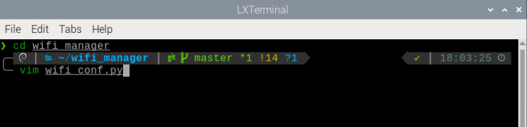
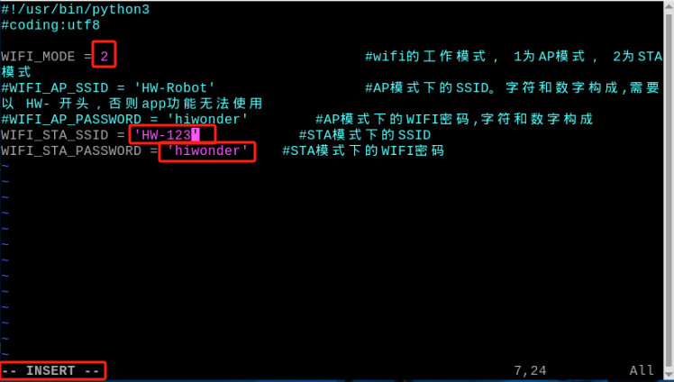
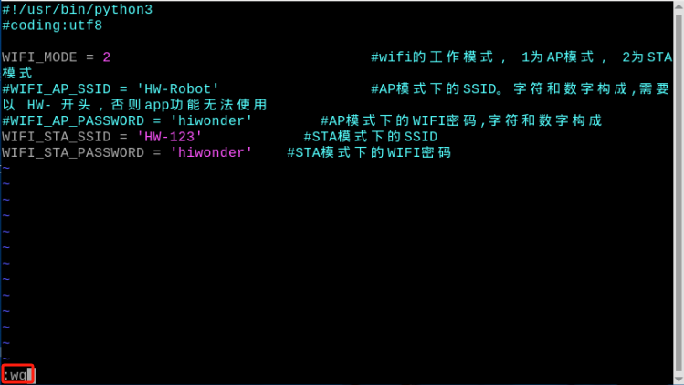

# 13. Group Control

## 13.1 Host-Slave and Environment Variable Configuration

### 13.1.1 Preparation

1)  In this lesson, two robot units will be used as an example, please prepare at least two LanderPi.

2)  To set up the development environment, please follow the instructions in [1.4 Development Environment Setup and Configuration](https://wiki.hiwonder.com/projects/LanderPi/en/latest/docs/1_LanderPi_User_Manual.html#development-environment-setup-and-configuration) in the user manual to download and install the remote connection tool VNC.

### 13.1.2 Working Principle

By configuring the host and slave on the same network and using separate namespaces, the broadcast program sends speed commands to the slaves, achieving synchronized control. In this case, connect to the Raspberry Pi's hotspot to demonstrate the process.

<p id="anchor_13_1_3"></p>

### 13.1.3 Network Configuration

* **Configure Host Network**

1)  First, select one LanderPi as the host, power it on, and remotely connect to its system desktop.

2. Open the command-line terminal and enter the following command to navigate to the directory where the file is located.

```
cd wifi_manager
```


3)  Enter the following command to open the Wi-Fi configuration file using the Vim editor.

```
vim wifi_conf.py
```



4)  Press the **i** key on your keyboard to enter edit mode. To modify the host hotspot password, locate the two lines of code highlighted in the figure below.


5. After successfully making the modifications, press **Esc** to exit edit mode. Then type the following code to save and exit.

```
:wq
```


6. Enter the command to reboot the host.

```
sudo reboot
```


7)  After the host has rebooted, reconnect to its Wi-Fi using the password **hiwonder**.

* **Configure the Slave Device Network**

1)  Power on the slave device and remotely connect to its system desktop.

2)  Open the command-line terminal and enter the following command to navigate to the directory where the file is located.

```
cd wifi_manager
```


3） Enter the following command to open the Wi-Fi configuration file using the Vim editor.

```
vim wifi_conf.py
```


4）Press the **i** key on the keyboard to enter edit mode. Then, modify the Wi-Fi name and password as shown in the figure, and locate the three highlighted lines.



Set the slave device's network mode to `2`, which corresponds to LAN mode. `HW-123` and `hiwonder` are the host Wi-Fi name and password set in [Configure Host Network](#anchor_13_1_3).

6）After successfully making the modifications, press **Esc** to exit edit mode. Then type the following code to save and exit.

```
:wq
```



7）Enter the command to reboot the device. Donot skip this step!

```
sudo reboot
```


> [!NOTE]
>
> **When LanderPi is powered on in LAN mode, it will automatically search for the preset network. During this process, LED2 on the Raspberry Pi expansion board will flash rapidly, indicating that the network search is in progress. If the target network is not found after three consecutive search attempts, LanderPi automatically switches to direct connection mode, and LED2 will flash slowly.**
>
> **If LanderPi fails to find the target network in LAN mode and switches to direct connection mode, the wifi_conf.py file will not be modified and will retain the LAN configuration on the next startup.**
>
> **Before setting the slave device to LAN mode, ensure that the host is powered on and its network configuration is complete, so that the slave can detect the host's hotspot. Otherwise, if the slave device cannot find the host hotspot within a certain period after powering on, it may automatically switch to direct connection mode, resulting in the inability to establish a network connection between the master and slave devices.**

<p id="anchor_13_1_4"></p>

### 13.1.4 Configure Environment Variables

* **Configure Host Environment Variables**

1. Select a LanderPi as the host and power it on. Connect to the Raspberry Pi desktop remotely via VNC.

2. Click  in the top-left corner of the desktop to open the Terminator terminal.

3. Ensure that a USB wireless controller receiver is connected to the host.


4. Enter the command to disable auto-start mode and press **Enter**.

```
~/.stop_ros.sh
```


5. Enter the command to open .typerc and set up the host environment variables.

```
vim /home/ubuntu/ros2_ws/.typerc
```

6. Press the **i** key on the keyboard to enter edit mode, and enable the host-slave settings, setting the host to `robot_1`.


7. After making the changes, press **Esc** and type the command to save and exit.

```
:wq
```


8. Then enter the following command to complete the host setup.

```
source ~/.zshrc
```


* **Configure Slave Environment Variables**

1)  Open the mobile app and connect to the host's Wi-Fi. Then search for the robot's icon. Long-press the icon to display the slave's IP address. If you want to use this IP, you can refer to [LAN Mode Connection (Optional)](https://wiki.hiwonder.com/projects/LanderPi/en/latest/docs/1_LanderPi_User_Manual.html#anchor_1_4_2_2) in the user manual.


2)  After obtaining the IP, please refer to the section [Configure Host Environment Variables](#anchor_13_1_4) for details. First, disable the auto-start service, open the **.typerc** file, and set the slave device's environment variable HOST to `robot_2`. After making the changes, save and exit the file. Finally, enter the command `source ~/.zshrc` to refresh the environment variables.


## 13.2 Group Control Startup and Operation

### 13.2.1 Synchronize Time

1. On the host device, open the terminal and enter the following command to check the time:

```
date
```


2. On the slave device, open the terminal and enter the following command to synchronize the system time. 

> [!NOTE]
>
> **The time on the slave device must match the time displayed on the host device.**

```
sudo date -s "2025-8-20 10:50:03"
```


> [!NOTE]
>
> * **If noticeable desynchronization occurs between the host and slave devices during joystick operation, it is likely caused by inconsistent system times. In this case, you can return to the previous step and resynchronize the time.**
>
> * **When using the `date` command to synchronize the host's time with the slave device, the process takes a certain amount of time. Therefore, by the time the update is applied on the slave, the host's current time may have already moved forward slightly. Since this process may introduce some errors, to avoid them, after obtaining the host's time, you should manually track the elapsed seconds using a stopwatch or other tools. The time entered on the slave device should then be the host's time plus the recorded elapsed seconds.**
>
> * **After synchronizing the time between the host and slave devices, enter the `date` command on each device's command line. Make sure both commands are executed within a short interval. Check the time on both devices—if the difference is minimal, the synchronization is considered successful.**

### 13.2.2 Execute the Program

1. On the host, open three terminals and enter the following commands in each terminal to execute the respective programs.

`joy_node`: Start the node for wireless controller.

```
ros2 launch large_models llm_control_move.launch.py

python3 ros2_ws/src/multi/launch/joystick_control_multi.py

ros2 run joy joy_node
```


`multi_controller.launch.py`：Chassis control.

`joystick_control_multi.py`：Joystick control.

2. On the slave device, enter the following commands to execute the programs.

```
ros2 launch multi multi_controller.launch.py
```

> [!NOTE]
>
> **Each time you power on the devices and want to use the group control mode, you must first disable the auto-start service on both the host and slave devices and synchronize the system time.**

### 13.2.3 Group Control Operation

1)  Push the wireless controller power switch to the **ON** position. You will see the red and green LED indicators on the wireless controller start flashing simultaneously.

2)  Wait a few seconds for the robot and wireless controller to pair automatically. Once pairing is successful, the green LED will remain solid while the red LED turns off.

3)  Connect the wireless controller to the host. Press the **START** button, and the buzzers on both robot cars will beep once.

> [!NOTE]
>
> **Gently pushing the joysticks in any direction will allow the robot to move at low speed.**

|  **Button / Stick**  |                         **Function**                         | **Description** |
| :------------------: | :----------------------------------------------------------: | :-------------: |
|        START         |                  Stop and reset the robot.                   |      Press      |
|   Left Joystick Up   |                        Move forward.                         |      Push       |
|  Left Joystick Down  |                        Move backward.                        |      Push       |
|  Left Joystick Left  |             Turn left for Mecanum chassis only.              |      Push       |
| Left Joystick Right  |             Turn right for Mecanum chassis only.             |      Push       |
| Right Joystick Left  | Turn left, controlling Tank chassis and Ackerman chassis front wheels. |      Push       |
| Right Joystick Right | Turn right, controlling Tank chassis and Ackerman chassis front wheels. |      Push       |