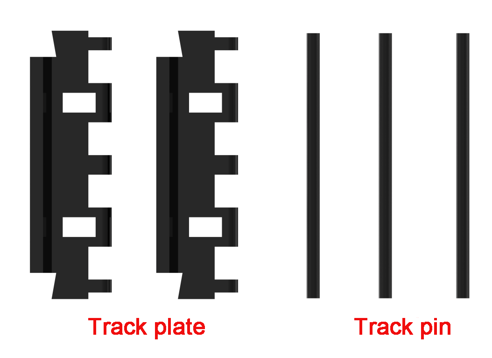
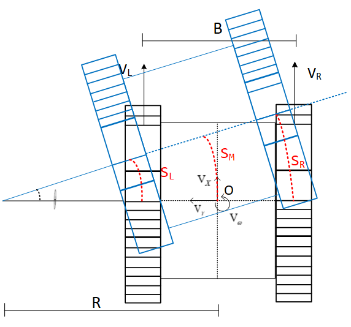
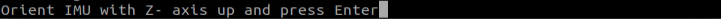
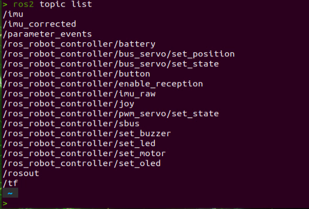
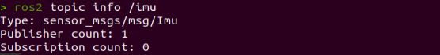
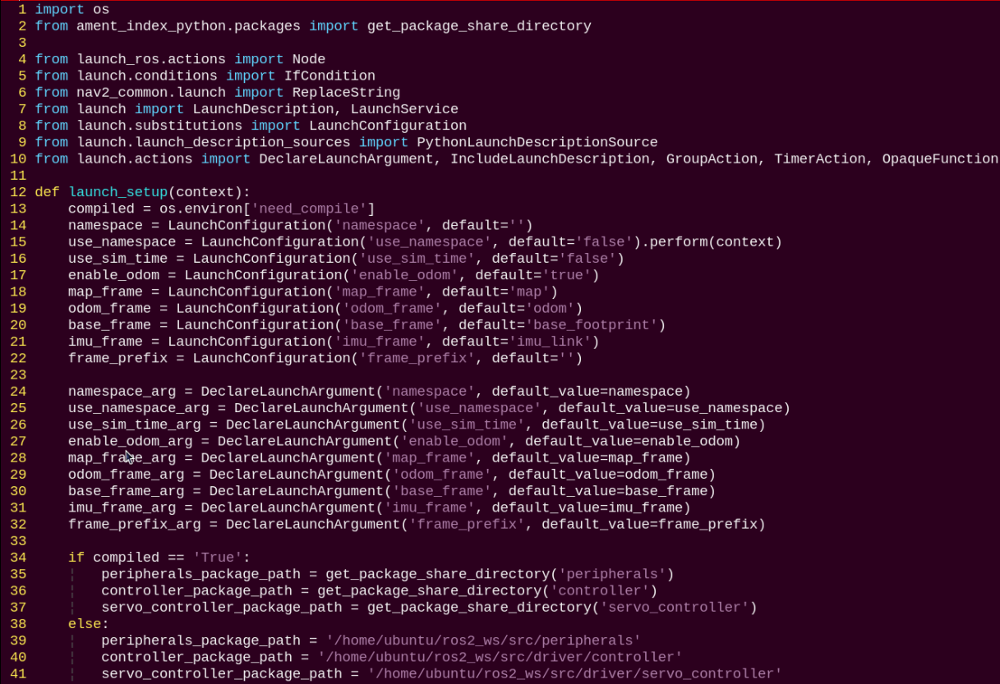
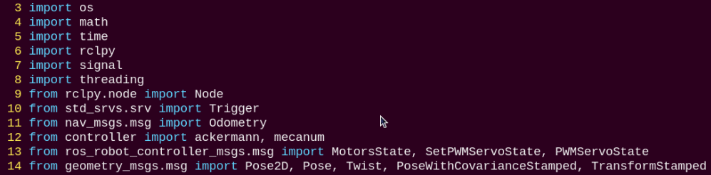

# 3. Chassis Motion Control

Based on the LanderPi series, the chassis comes in three main types: Mecanum chassis, Ackerman chassis, and Tank chassis. The robot's upper body can also be detached from the chassis, allowing flexible switching between different configurations.

## 3.1 Kinematics Analysis

### 3.1.1 Mecanum Chassis

* **Hardware Structure**


A Mecanum wheel consists of a main wheel hub and multiple rollers mounted around the hub. The rollers are angled at 45 degrees relative to the axis of the hub. Typically, Mecanum wheels are used in sets of four, two left-handed wheels (Type A) and two right-handed wheels (Type B), which are arranged symmetrically.

There are several common configurations, such as AAAA, BBBB, AABB, ABAB, BABA, etc. However, not all configurations support full-range movement functions like forward/backward motion, rotation, and lateral movement. The Mecanum chassis uses the ABAB configuration, which enables true omnidirectional movement.


* **Physical Characteristics**

The motion of a Mecanum wheel robot is determined by the direction and speed of each individual wheel. The forces generated by each wheel combine to produce a resultant force vector, allowing the robot to move freely in any desired direction without changing the orientation of the wheels.

Because of the angled rollers distributed around the edge of the wheel, lateral movement is also possible. The rollers follow a unique path. When the wheel rotates around its central axis, the roller surfaces form a cylindrical envelope, allowing the robot to roll continuously in a given direction.

* **Kinematic Principles and Equations**

In kinematic analysis, the motion of Mecanum wheels can be described using a kinematic model. This includes several key parameters:


1. V<sub>x</sub>: Linear velocity of the chassis along the X-axis, typically the forward/backward direction.

2. V<sub>y</sub>: Linear velocity of the chassis along the Y-axis, typically the left/right or lateral direction.

3. V<sub>ω</sub>: Angular velocity of the chassis, the rotation speed around its own center.

4. V<sub>A</sub>、V<sub>B</sub>、V<sub>C</sub>、V<sub>D</sub>: The real-time speeds of the four Mecanum wheels.

For example, the motion of the front-right wheel (Wheel B) on a 2D plane can be decomposed into:

5) Bx: Linear velocity of the chassis along the X-axis, typically the forward/backward direction.

6. VBy: Linear velocity of the chassis along the Y-axis, typically the left/right or lateral direction.

7. L: The distance between the centers of the left and right wheels.

8. H: The distance between the centers of the front and rear wheels.

9. θ<sub>ω</sub>: The angle between the robot's center of chassis and the front-right wheel is 45°.

Based on these parameters, we can perform kinematic analysis of the Mecanum wheel chassis to determine how wheel speeds contribute to the overall movement of the robot in any direction. Key equations are given below:

**Kinematic Analysis and Formula Derivation:**

To simplify the kinematic model, we make the following two idealized assumptions:

1. The Mecanum wheels do not slip on the ground, and the ground provides sufficient friction.

2. The four wheels are positioned at the corners of a rectangle or square, and all wheels are parallel to their corresponding axes.

In this model, the robot's rigid body movement is decomposed into three linear components: translation along the X-axis, translation along the Y-axis, and rotation around the Z-axis. By calculating the individual wheel speeds required for these three simple motions, we can combine them to compute the required rotational speed for each wheel during compound motion of simultaneous translation and rotation.

Here V<sub>A</sub>、V<sub>B</sub>、V<sub>C</sub>、V<sub>D</sub>  represent the rotational speeds of wheels A, B, C, and D, respectively, corresponding to the motor speeds. V<sub>X</sub> is the translational velocity of the robot along the X-axis, V<sub>y</sub> is the translational velocity along the Y-axis, and V<sub>ω</sub> is the rotational velocity around the Z-axis.

 is half the track width L, and  is half the wheelbase H.

1. When the robot moves along the X-axis, the speed component of each wheel can be calculated using the following formula:


V<sub>A</sub>、V<sub>B</sub>、V<sub>C</sub>、V<sub>D</sub>：the real-time speeds of the four Mecanum wheels, V<sub>X</sub>：the velocity component in the X-axis direction.

2. When the robot moves along the Y-axis, the speed component of each wheel can be calculated using the following formula:


V<sub>y</sub> is the velocity component in the Y-axis direction.

3. When the robot rotates around the Z-axis, the speed component of each wheel can be calculated using the following formula:


: Angular velocity of the chassis, the rotation speed around its own center.

By combining the velocities along the X, Y, and Z axes, the rotational speed required for each of the four wheels can be derived according to the robot's overall motion state.


* **Program Outcome**

File path: `ros2_ws/src/driver/controller/controller/mecanum.py`


This module defines the Mecanum Wheel Kinematics class, which is used to calculate wheel speeds and implement Mecanum wheel motion.

`Init`:


Initializes the wheel dimensions for subsequent calculations.

`speed_covert`:


Converts linear velocity (m/s) to angular velocity (rps) based on wheel parameters.

`set_velocity`:


Decomposes the input velocity parameters, computes the corresponding angular velocity using `speed_convert`, and publishes the resulting radian velocity to the motors.


### 3.1.2 Ackerman Chassis

* **Hardware Structure**

The front-wheel steering mechanism of the Ackerman chassis consists of a servo, a linkage, and the wheels. The servo connects to the linkage, which in turn connects to the wheels. By controlling the rotation of the servo, the linkage rotates accordingly, which adjusts the steering angle of the front wheels.

When the robot turns, the two front wheels remain parallel, meaning both wheels turn at the same angle. The rear wheels are driven by motors, which control the robot's forward and backward motion as well as its speed.


* **Physical Characteristics** 

The Ackerman chassis is designed to provide excellent steering performance and stability. It employs the principle known as “Ackerman geometry,” which refers to the difference in steering angles between the inner and outer front wheels. By giving the inner front wheel a larger steering angle, the Ackerman chassis makes the vehicle easier to control during turns and reduces lateral slip.

In addition, the Ackerman chassis features a well-designed suspension system. The suspension, which connects the wheels to the chassis, has a significant impact on the vehicle's physical behavior. Typically, the chassis uses an independent suspension system, allowing each wheel to move independently. This design improves suspension performance, enhances stability, and provides a smoother motion.

The chassis also takes the vehicle's center of gravity into account. The position of the center of gravity significantly affects stability and handling. In general, the Ackerman chassis keeps the center of gravity low to minimize body roll and reduce the risk of lateral slip.

Finally, the physical characteristics of the Ackerman chassis also include the braking system and the powertrain. The braking system controls the braking force at each wheel, affecting the vehicle's stopping performance and stability, while the powertrain transmits engine power to the wheels, influencing acceleration and overall drive performance.

* **Kinematic Principles and Equations**

When analyzing the kinematics of an Ackerman chassis, the following mathematical parameters and formulas are used to describe its motion characteristics.

To achieve pure rolling motion, with no lateral slip when the vehicle turns, the normals of all four wheels' rolling directions, which are the lines perpendicular to the wheel's rolling direction, must intersect at a single point, known as the instantaneous center of rotation.

For simplicity, the model assumes only a single front wheel located at the midpoint of the front axle, as illustrated by the dashed line in the diagram. The key parameters are:


1. **Front Wheel Steering Angle (θ)**: The steering angle of the front wheel relative to the vehicle's forward direction, typically measured in radians (rad).

2. **Vehicle Linear Velocity (V)**: The translational speed of the vehicle, measured in meters per second (m/s). **Left rear wheel speed: V_L. Right rear wheel speed: V_R.**

3. **Wheel Track (D)**: The distance between the left and right wheels, measured in meters (m).

4. **Wheelbase (H)**: The distance between the front and rear wheels, measured in meters (m).

5. **Turning Radius (R)**: The radius of the circular path followed by the vehicle when turning, measured in meters (m).

**Left wheel turning radius: R<sub>L</sub>. Right wheel turning radius: R<sub>R</sub>.**

Computation of robot velocity and wheel speeds:

1. Angular velocity consistency:


where ω is the angular velocity of the vehicle, **R** is the turning radius of the vehicle's center, **V** is the linear velocity of the vehicle, **V<sub>L</sub>** and **V<sub>R</sub>** are the linear velocities of the left and right rear wheels, and **R<sub>L</sub>** and **R<sub>R</sub>** are their respective turning radii.

2. Relationship between the front wheel steering angle and the turning radius:


where **H** is the wheelbase, the distance between front and rear axles, **R** is the turning radius of the vehicle, **D** is the track width, the distance between left and right wheels, and **θ** is the steering angle of the front wheel.

3. Left rear wheel velocity:


4. Right rear wheel velocity:


Given the robot's track width, wheelbase, linear velocity, and steering angle, the velocities of the left and right rear wheels can be determined.

* **Program Outcome**

File path: `ros2_ws\src\driver\controller\controller\ackermann.py`


Ackerman Kinematics class, used to compute wheel velocities and implement Ackerman steering kinematics.

`Init`:


Initializes the wheel dimensions for subsequent calculations.

`speed_covert`:


Converts linear velocity (m/s) to angular velocity (rps) based on wheel parameters.

`set_velocity`:


Decomposes the input velocity parameters, converts them into wheel speeds using `speed_convert`, and publishes the computed angular velocities to the motors. Based on the linear and angular velocities, it calculates the required steering angle for the servo and sends the converted value to the servo for execution.

### 3.1.3 Tank Chassis

* **Hardware Structure**

The track is driven by drive sprockets, with a flexible track loop running around the drive sprocket, road wheels, guide wheel, and idler wheel.


The track is made up of track plates and track pins.



* **Physical Characteristics**


**1. Drive Sprocket**

The drive sprocket is part of the track propulsion system, responsible for transferring the power from the transmission system to the track. Its main function is to transfer power to the track and is typically installed at the rear of the vehicle.

**2. Road Wheel**

The road wheel bears the weight of the vehicle and aligns the track. Its primary role is to evenly distribute the pressure of the track on the ground, enhancing the stability of the vehicle during movement.

**3. Guide Wheel**

The position of the guide wheel depends on the placement of the drive sprocket and is typically installed at the front of the chassis. Its main function is to guide the track to loop correctly, preventing misalignment or derailment.

**4. Idler Wheel**

The idler wheel helps support the upper section of the track, preventing excessive sagging or lateral slipping, This helps reduce vibration and jumping while the track is in motion.

**5. Chassis**

The tank chassis moves using the tracks mounted on its chassis. When the chassis moves, it operates similarly to walking on a set track. The power generated by the track is continuously transmitted through the drive wheel, which keeps turning the track in a winding motion. During the propulsion process, the track laid by the guide wheel is pressed down on the ground, while the track passed by the rear road wheel is pulled back onto the drive sprocket.

* **Kinematic Principles and Equations**

In kinematic analysis, the motion of Tank chassis can be described using a kinematic model. This includes several key parameters:



1. B: Track width — the distance between the two drive wheels, usually measured in meters (m).

2. R: Turning radius produced when the robot moves forward while rotating, measured in meters (m).

3. Vx: Target forward/backward velocity at point O, positive in the forward direction, measured in meters per second (m/s).

4. Vy: Target lateral velocity at point O, positive to the left, measured in meters per second (m/s). Often neglected in two-wheel models.

5. Vw: Target angular velocity around point O, positive in the counterclockwise direction, measured in radians per second (rad/s).

6. V<sub>L</sub>: Velocity of the left track, positive in the forward direction, measured in meters per second (m/s).

7. S<sub>R</sub>: Velocity of the right track, positive in the forward direction, measured in meters per second (m/s).

8. S<sub>L</sub>: Path length of the left track over time t.

S<sub>M</sub>: Path length of midpoint O over time t.

S<sub>R</sub>: Path length of the right track over time t.

9. θ: The robot's rotation angle over a period of time t, in radians.

**Kinematic Calculations:**

1. We can analyze the relationships and derive the forward and inverse kinematics formulas for a robot with Tank chassis(differential-drive). Distance from velocity integration:


2. The rotation angle is given by the arc length divided by the radius:


3. Dividing both sides by t gives the velocities:


4. Based on the above equations, the inverse kinematics can be calculated. Given the robot's target velocity parameters V<sub>x</sub> and V<sub>ω</sub>, the corresponding driving wheel speeds V<sub>L</sub> and V<sub>R</sub> can be determined:


5. Using the inverse kinematics equations, the forward kinematics can be calculated. Given the current speeds of the drive wheels  V<sub>L</sub> and V<sub>R</sub>, the robot's instantaneous linear velocity V<sub>x</sub> and V<sub>ω</sub> can be calculated.


* **Program Outcome**

File Path: `ros2_ws\src\driver\controller\controller\odom_publisher_node.py`

The Tank chassis also uses differential motion, so the mecanum wheel kinematics can be directly applied.

**Velocity Setting and Calibration:**


Read the linear X-axis velocity from `msg.linear.x` and assign it to `self.linear_x`. If `self.linear_x` is greater than 0.3, set it to 0.3. If `self.linear_x` is less than -0.3, set it to -0.3. Read the linear Y-axis velocity from `msg.linear.y` and assign it to `self.linear_y`. Read the angular velocity from `msg.angular.z` and assign it to `self.angular_z`. If `self.linear_x \>= 0.0` and `self.angular_z == 0.0`, apply calibration.

**Velocity Publishing:**


Use `self.mecanum.set_velocity` to set the chassis velocity: scale the linear X velocity by 0.75/0.45, set the linear Y velocity to 0.0, and set the angular velocity to `self.angular_z`. Publish the calculated velocity using `self.motor_pub.publish(speeds)`.

## 3.2 Motion Control

### 3.2.1 IMU, Linear Velocity, Angular Velocity Calibration

> [!NOTE]
>
> * **The robot is factory-calibrated and generally does not require recalibration, this section is provided for reference only. If you notice significant deviations during movement, for example, the robot veering to one side instead of moving straight, you can follow the calibration tutorial below.**
>
> * **Calibration is intended to reduce errors. Some hardware deviations are inevitable, so the goal is to adjust the settings to achieve a relatively accurate performance that meets your needs.**

If deviations occur during use, the IMU, linear velocity, and angular velocity should be recalibrated. After calibration, the robot can perform all its functions correctly.

* **IMU Calibration**

The IMU, Inertial Measurement Unit, measures an object's three-axis orientation (angular velocity) and acceleration. The gyroscope and accelerometer are the main components of the IMU, providing a total of six degrees of freedom to measure angular velocity and acceleration in 3D space.


The figure above shows the positive directions of the IMU's x, y, and z axes. During the calibration process, you can refer to this coordinate system. **After the node receives the first IMU message, it will prompt you to hold the IMU in a specific orientation** and press Enter to record the measurement. Once all six orientations are completed, the node calculates the calibration parameters and writes them to the specified YAML file. The detailed steps are as follows:

> [!NOTE]
>
> **When entering commands, be sure to use correct case and spacing. You can use the Tab key to auto-complete keywords.**

1)  Power on the robot and connect it to a remote control tool like VNC. For detail informations, please refer to: [1.4 Development Environment Setup and Configuration](https://wiki.hiwonder.com/projects/LanderPi/en/latest/docs/1_LanderPi_User_Manual.html#development-environment-setup-and-configuration).

2)  Click the terminal icon  in the system desktop to open a command-line window.

3)  Enter the following command and press Enter to stop the app auto-start service.

```
~/.stop_ros.sh
```

4)  Next, enter the command and press **Enter** to start the chassis control node:

```
ros2 launch ros_robot_controller ros_robot_controller.launch.py
```

5)  Then, open a new terminal, enter the command, and press **Enter** to start the IMU calibration:

```
ros2 run imu_calib do_calib --ros-args -r imu:=/ros_robot_controller/imu_raw --param output_file:=/home/ubuntu/ros2_ws/src/calibration/config/imu_calib.yaml
```

6)  When the following prompt appears, position the robot facing forward from its first-person perspective, then press Enter. The first direction you face is defined as **forward**, all subsequent orientations should be based on this initial direction.


**After each orientation is successfully calibrated, the following prompts will appear:**


7)  Position the robot facing backward, then press **Enter**.


8)  Position the robot facing left, then press **Enter**.


9)  Position the robot facing right, then press **Enter**.


10) Lift the robot and position it facing upward. Secure it carefully, then press **Enter**. When placing the robot in the up and down orientation, it may be unstable or bump against surfaces, please hold it steady by hand to prevent damage to the depth camera or screen.


11) Lift the robot and position it facing downward. Secure it, then press **Enter**.




12) When the following message appears, the calibration is complete, then press **Ctrl + C** to exit.


13) After calibration, you can check the calibrated model by running:

```
ros2 launch peripherals imu_view.launch.py
```

You can rotate the physical robot to verify that its movement matches the model's orientation.


* **Angular Velocity Calibration**

**For the LanderPi with Ackerman chassis, angular velocity calibration is not required.**

Typically, angular velocity calibration involves rotating the robot a full circle. During testing, it is important to clearly mark the robot's orientation to easily observe any deviations. The detailed steps are as follows:

> [!NOTE]
>
> **When entering commands, be sure to use correct case and spacing. You can use the Tab key to auto-complete keywords.**

1)  Place the robot on a flat surface, and mark a point directly in front of it using tape or another indicator.

2)  Power on the robot and connect it to a remote control tool like VNC. For detail informations, please refer to: [1.4 Development Environment Setup and Configuration](https://wiki.hiwonder.com/projects/LanderPi/en/latest/docs/1_LanderPi_User_Manual.html#development-environment-setup-and-configuration).

3)  Click the terminal icon  in the system desktop to open a command-line window.

4)  Enter the following command and press **Enter** to stop the app auto-start service.

```
~/.stop_ros.sh
```

5)  Before starting the calibration, navigate to the calibration configuration file directory and open the configuration file.

```
cd ~/ros2_ws/src/driver/controller/config && vim calibrate_params.yaml
```

6)  Set the angular velocity parameter to 1.0 before proceeding with the calibration.


7)  After editing, press **ESC**, type `:wq`, and press **Enter** to save and exit.

8)  Next, enter the command and press **Enter** to start the chassis control node:

```
ros2 launch ros_robot_controller ros_robot_controller.launch.py
```

9)  Then, open a new terminal, enter the command, and press **Enter** to start the angular velocity calibration:

```
ros2 launch calibration angular_calib.launch.py
```

Then double-click **calibrate_angular** on the left to open the calibration interface, as shown below.


The meanings of the parameters on the left side of the interface are as follows:

\(1\) `test_angle`– The rotation angle for testing, 360° by default.

\(2\) `speed` – The linear speed, default is 0.15 m/s.

\(3\) `tolerance` – The allowable error, smaller values reduce the deviation from the target but may cause more shaking after reaching the target.

\(4\) `odom_angle_scale_correction` – The odometry angle scaling factor.

\(5\) `start_test` – Button to start testing the odometry angle scaling.


Make sure the robot is properly aligned, then check **start_test**. The robot will rotate in place. If it cannot complete a full rotation or shows deviation, adjust the `odom_angle_scale_correction` value, which scales the motor rotation during turning. It is recommended to adjust in increments of 0.01 and repeat the test until the robot can rotate exactly one full turn, then record this value.


10) After calibration, open the calibration configuration file to save the corrected parameter:

```
cd ~/ros2_ws/src/driver/controller/config && vim calibrate_params.yaml
```

Press the key **i** to enter edit mode and modify `angular_correction_factor` to the calibrated value of `odom_angle_scale_correction`.


> [!NOTE]
>
> **This example uses the Mecanum chassis for calibration, but the method is also applicable to Tank chassis.**

11) After editing, press **ESC**, type `:wq`, and press **Enter** to save and exit.

* **Linear Velocity Calibration**

**For the LanderPi with Ackerman chassis, angular velocity calibration is not required.**

> [!NOTE]
>
> **When entering commands, be sure to use correct case and spacing. You can use the Tab key to auto-complete keywords.**

Place the robot on a flat and open surface. Once the program is started, the robot will use a forward movement of 1 m as the reference for linear velocity calibration. You can mark a spot 1 m in front of the robot using tape.

1)  Start the robot and connect it to the remote control software VNC. For detail informations, please refer to: [1.4 Development Environment Setup and Configuration](https://wiki.hiwonder.com/projects/LanderPi/en/latest/docs/1_LanderPi_User_Manual.html#development-environment-setup-and-configuration).

2)  Click the terminal icon  in the system desktop to open a command-line window.

3)  Enter the following command and press **Enter** to stop the app auto-start service.

```
~/.stop_ros.sh
```

4)  Before starting the calibration, navigate to the calibration configuration file directory and open the configuration file.

```
cd ~/ros2_ws/src/driver/controller/config && vim calibrate_params.yaml
```

5)  Change the linear velocity parameter `linear_correction_factor` to 1.0 before proceeding with the calibration.


6)  After editing, press **ESC**, type `:wq`, and press **Enter** to save and exit.

7)  Next, enter the command and press **Enter** to start the chassis control node:

```
ros2 launch ros_robot_controller ros_robot_controller.launch.py
```

8)  Then, open a new terminal, enter the command, and start the linear velocity calibration:

```
ros2 launch calibration linear_calib.launch.py
```

9)  After the calibration program starts, double-click on **calibrate_linear** on the left to open the calibration interface as shown below:


The meanings of the parameters on the left side of the interface are as follows:

\(1\) `test_distance` – The test distance, default is 1 meter.

\(2\) `speed` – The linear speed, default is 0.2 m/s.

\(3\) `tolerance` – The allowable error, smaller values reduce the deviation from the target but may cause more shaking after reaching the target.

\(4\) `odom_linear_scale_correction` – The odometry linear scale factor.

\(5\) `start_test` – The button to start testing the odometry linear scale factor.


10) Ensure the robot is properly aligned and positioned at the starting marker. Check **start_test** to begin. The robot will move forward, and you should observe whether it travels in a straight line. If there is any deviation, adjust the `odom_linear_scale_correction` value, which scales the motor output for forward motion. It is recommended to adjust in increments of 0.01 until the robot moves straight.


11) After calibration, open the calibration configuration file to save the corrected parameter:

```
cd ~/ros2_ws/src/driver/controller/config && vim calibrate_params.yaml
```

12) Press the key i to enter edit mode and modify `linear_correction_factor` to the calibrated value of `odom_linear_scale_correction`.


13) After editing, press **ESC**, type `:wq`, and press **Enter** to save and exit.

14) To exit the feature, press **Ctrl + C** in the terminal. If the program does not close successfully, try pressing **Ctrl + C** again.

### 3.2.2 IMU and Odometry Data Publishing

In robot navigation, calculating the real-time position is crucial.

Typically, odometry information is computed using the motor encoders combined with the robot's kinematic model. However, in some special scenarios, such as when the robot's wheels spin in place or the robot is lifted off the ground, it may appear that the robot has moved a certain distance, even though the wheels did not actually turn.

In such cases, fusing IMU and odometry data provides a more accurate estimation of the robot's position, which helps improve mapping and enhances navigation accuracy.

* **Introduction to IMU and Odometry**

The IMU, Inertial Measurement Unit, measures an object's three-axis orientation (angular velocity) and acceleration. The gyroscope and accelerometer are the main components of the IMU, providing a total of six degrees of freedom to measure angular velocity and acceleration in 3D space.

Odometry is a method for estimating an object's position over time based on data obtained from motion sensors. It is widely used in robotic systems to estimate how far a robot has moved relative to its initial position.

Common odometry methods include wheel odometry, visual odometry, and visual-inertial odometry. For the robot, wheel odometry is used.

The principle of wheel odometry can be illustrated with an example: Imagine you have a cart, and you want to know the distance from point A to point B.

If you know the circumference of the cart's wheels and have a device to count the number of rotations while driving, you can calculate the distance by combining the wheel circumference with the total number of rotations during the trip from A to B.

For a wheeled robot, odometry provides a basic estimate of its pose. However, it has a significant limitation, which is cumulative error. Besides inherent hardware inaccuracies, environmental factors, such as wheel slippage caused by wet or slippery surfaces, can increase odometry errors as the robot travels farther.

Therefore, both the IMU and odometry are key components on the robot. They are used to measure the object's three-axis orientation or angular velocity, and acceleration, as well as to estimate the robot's displacement and pose relative to its initial position, including movement speed and direction.

To correct for errors in odometry, the IMU is used in combination, and the data from both sources are fused to obtain more accurate information.

The IMU data is published on the topic `/imu`, and the odometry data is published on `/odom`. Once both sets of data are obtained, they are fused using the `ekf` package in ROS, and the resulting fused localization information is then re-published.

* **IMU Data Publishing**

**1. Enable Simulation Service**

> [!NOTE]
>
> **When entering commands, be sure to use correct case and spacing. You can use the Tab key to auto-complete keywords.**

(1) Power on the robot and connect it to a remote control tool like VNC. For detail informations, please refer to: [1.4 Development Environment Setup and Configuration](https://wiki.hiwonder.com/projects/LanderPi/en/latest/docs/1_LanderPi_User_Manual.html#development-environment-setup-and-configuration).

(2) Click the terminal icon  in the system desktop to open a command-line window.

(3) Enter the following command and press **Enter** to stop the app auto-start service.

```
~/.stop_ros.sh
```

(4) Next, enter the command and press **Enter** to start the chassis control node:

```
ros2 launch ros_robot_controller ros_robot_controller.launch.py
```

(5) Open a new terminal, enter the command, and press **Enter** to start publishing IMU data:

```
ros2 launch peripherals imu_filter.launch.py
```

* **View Data**

1)  Open a terminal, enter the command to list the current topics:

```
ros2 topic list
```



2)  Next, enter the command to check the type, publisher, and subscriber of the `/imu` topic, you can replace it with any topic you want to check. The type of this topic is `sensor_msgs/msg/Imu`:

```
ros2 topic info /imu
```



3)  Then, enter the command to print the topic message content, you can replace it with any topic you want to inspect:

```
ros2 topic echo /imu
```


The message content shows the data collected from the three axes of the IMU.

* **Odometry Data Publishing**

**1. Enable Simulation Service**

> [!NOTE]
>
> **When entering commands, be sure to use correct case and spacing. You can use the Tab key to auto-complete keywords.**

(1) Power on the robot and connect it to a remote control tool like VNC. For detail informations, please refer to: [1.4 Development Environment Setup and Configuration](https://wiki.hiwonder.com/projects/LanderPi/en/latest/docs/1_LanderPi_User_Manual.html#development-environment-setup-and-configuration).

(2) Click the terminal icon  in the system desktop to open a command-line window.

(3) Enter the following command and press Enter to stop the app auto-start service.

```
~/.stop_ros.sh
```

(4) Enter the command and press **Enter** to start publishing odometry data:

```
ros2 launch controller odom_publisher.launch.py
```

**2. View Data**

(1) Open a terminal, enter the command to list the current topics:

```
ros2 topic list
```


(2) Next, enter the command to check the type, publisher, and subscriber of the `/odom_raw` topic, you can replace it with any topic you want to check. The type of this topic is `nav_msgs/msg/Odometry`:

```
ros2 topic info /odom_raw
```


(3) Then, enter the command to print the topic message content, you can replace it with any topic you want to inspect:

```
ros2 topic echo /odom_raw
```


The message contains the robot's pose and twist data.

### 3.2.3 Robot Speed Control

In this lesson, you will learn to control the robot's forward speed by adjusting the linear velocity parameter.

* **Working Principle**

Based on the robot's motion characteristics, the forward, backward, and turning motions are achieved by controlling the rotation direction of the driving wheels.

In the program, the `/controller/cmd_vel` topic is subscribed to in order to obtain the set linear and angular velocities. The robot's movement speed is then calculated based on these velocity values.

The source code for this program is located at: `/home/ubuntu/ros2_ws/src/driver/controller/controller/odom_publisher_node.py`


<p id="anchor_3_2_3_1"></p>

* **Stopping the App Service and Enabling Speed Control**

> [!NOTE]
>
> **When entering commands, be sure to use correct case and spacing. You can use the Tab key to auto-complete keywords.**

1)  Power on the robot and connect it to the remote control software VNC. For detail informations, please refer to: [1.4 Development Environment Setup and Configuration](https://wiki.hiwonder.com/projects/LanderPi/en/latest/docs/1_LanderPi_User_Manual.html#development-environment-setup-and-configuration).

2)  Click the terminal icon  in the system desktop to open a command-line window.

3)  Enter the command to stop the app service and press **Enter**:

```
~/.stop_ros.sh
```

4)  Enter the command to start the motion control service:

```
ros2 launch controller controller.launch.py
```

5)  Open a new ROS2 terminal and enter the command to enable speed control:

```
ros2 topic pub /controller/cmd_vel geometry_msgs/Twist "linear:

x: 0.0

y: 0.0

z: 0.0

angular:

x: 0.0

y: 0.0

z: 0.0"
```


The `linear` parameter sets the linear velocity. From the robot's perspective, the positive X direction points forward, with no motion along the Y or Z axes.

The `angular` parameter sets the angular velocity. A positive Z value makes the robot turn left, while a negative Z value makes it turn right. There is no rotation along the X or Y axes.

> [!NOTE]
>
> * **The unit of linear velocity X is meters per second (m/s), with a recommended range of -0.6 ~ 0.6.**
>
> * **Z represents the angular velocity for turning. It can be calculated using the formulas: V = ωR and tanΦA = D / R, where z = ω, D = 0.213, and ΦA is the turn angle, ranging from 0° to 36°.**

Use the keyboard arrow keys to modify the corresponding parameters. For example, to move forward, set linear X to `0.1` and press **Enter** to execute.


6)  To stop the robot, open a new terminal, set the previously modified linear X back to `0.0`, and press **Enter**.


7)  To exit this control mode, press **Ctrl + C** in each terminal.

> [!NOTE]
>
> **First open a new terminal to stop the robot as in Step 6 before closing the control mode. If you press Ctrl + C directly in the terminal to exit, the robot may not stop properly.**

* **Modifying Forward Speed**

By adjusting the linear velocity X value, the robot can move forward at different speeds. For example, to make the robot move straight forward, set X to `0.3` in Step 5 of [3.2.3 Robot Speed Control -> Stopping the App Service and Enabling Speed Control](#anchor_3_2_3_1).


After pressing **Enter**, the robot will move forward at a speed of 0.3 m/s.

* **Program Outcome**

After starting the feature, the robot will move forward at the previously set speed of 0.3 m/s.

* **Program Brief Analysis**


In the program, **hiwonder_controller.launch** is the launch file, **calibrate_params.yaml** is the configuration file, and **odom_publisher.py** is the program file.

When starting, the launch file is executed first. It loads the YAML configuration file and passes the parameters to the ROS nodes. The nodes then read these parameters, initialize themselves, and communicate with other nodes to coordinate the robot's behavior.

**1. launch File**


The launch file is located at: `/home/ubuntu/ros2_ws/src/driver/controller/launch/controller.launch.py`



**(1) Setting Paths**

The paths for the **peripherals**, **controller**, and **servo_controller** packages are obtained.


**(2) Launching Other Files**


**① odom_publisher_launch**: Launches the odometry node.

**② imu_filter_launch**: Launches the IMU node.

**(3) Starting Nodes**

Starts the EKF fusion node.


**2. Python Program**


The Python program is located at: `/home/ubuntu/ros2_ws/src/driver/controller/controller/odom_publisher_node.py`

**(1) Imported Libraries**



**(2) Main Function**


Calls the `Controller` class and waits for the node to exit.

**(3) Global Parameters**


**(4) Functions**


`rpy2qua`: Converts Euler angles to a quaternion.

`qua2rpy`: Converts a quaternion to Euler angles.

**(5) Controller Class**

**① Kinematics Invocation**


`self.ackermann`: Initializes the Ackermann kinematics object.
`self.mecanum`: Initializes the Mecanum kinematics object.

**② ROS Parameters Definition**


`self.declare_parameter`: Defines a ROS parameter.
`self.get_parameter`: Retrieves the value of a ROS parameter.
`pub_odom_topic`: Whether to publish odometry data.
`base_frame_id`: Robot base frame ID.
`odom_frame_id`: Robot odometry frame ID.
`linear_correction_factor`: Linear velocity correction factor.
`angular_correction_factor`: Angular velocity correction factor.
`machine_type`: Type of robot.

**③ Publishing Odometry**


The `pub_odom_topic` parameter determines whether the odometry node should be published. If enabled, the node is initialized.

Set the corresponding parameters and publish the odometry using the `self.create_publisher` function, while updating the odometry data through the `self.cal_odom_fun` function.

**④ Topic Publishing**


`self.create_subscription`: Subscribes to a topic.

`self.create_service`: Creates a service.

`self.motor_pub`: Publishes motor control messages on `ros_robot_controller/set_motor` with message type `MotorsState`.

`self.servo_state_pub`: Publishes servo control messages on `ros_robot_controller/bus_servo/set_state` with message type `SetBusServoState`.

`self.pose_pub`: Publishes servo pose messages on `set_pose` with message type `PoseWithCovarianceStamped`.

Publishes to `set_odom` with message type `Pose2D`, callback function `self.set_odom`.

Publishes to `controller/cmd_vel` with message type `Twist`, callback function `self.cmd_vel_callback`.

Publishes to `cmd_vel` with message type `Twist`, callback function `self.set_app_cmd_vel_callback`.

Publishes service `controller/load_calibrate_param` of type `Trigger`, callback `self.load_calibrate_param`.

Publishes service `~/init_finish` of type `Trigger`, callback `self.get_node_state`.

**⑤ `Controller` Class Function**


* **FAQ**

**Q:** The robot keeps moving even after pressing **Ctrl + C** in the terminal.

**A:** In this case, open a new terminal and enter the command:

```
rostopic pub /hiwonder_controller/cmd_vel geometry_msgs/Twist "linear:
```

Use the Tab key to auto-complete, then set the speed to `0` and press **Enter** to execute.