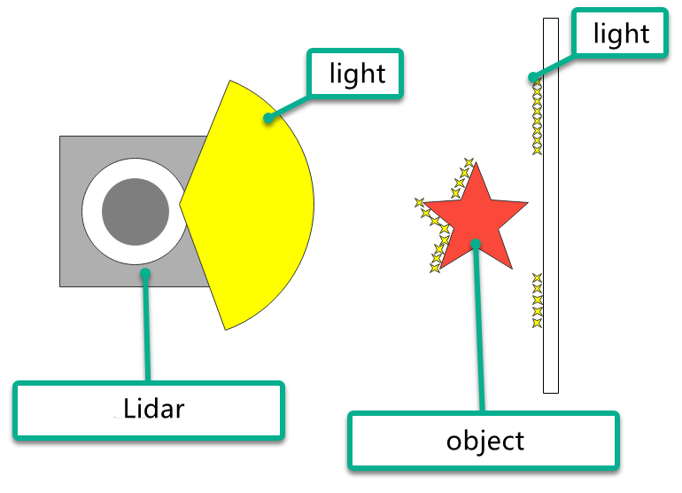

# 4. Lidar

## 4.1 Lidar Introduction

### 4.1.1 Overview

As a high-precision and high-speed remote sensing technology, Lidar plays a critical role in mapping, autonomous driving, environmental perception, and robotic navigation. This document introduces the principles, components, operating mechanisms, application areas, and advantages of Lidar, as well as its development trends.

Lidar holds a pivotal position in autonomous driving and intelligent transportation by providing real-time detection of obstacles, pedestrians, and vehicles on the road, while delivering precise distance and positional information. In robotic navigation and environmental perception, it supplies robots with accurate maps and detailed information about their surrounding environment. Furthermore, it is widely employed in 3D modeling and mapping, security monitoring, and remote sensing survey applications.


### 4.1.2 Lidar Components and Classification

Lidar consists of components such as laser transmitters, receivers and photoelectric detectors, scanning mechanisms and angle resolution. The laser emitter generates laser beams, while the receiver and photodetector capture the reflected light signals. The scanning mechanism is used to survey the surrounding environment, and the angle measurement system determines the position of target objects.

Based on the scanning method, Lidar can be functionally classified into the following types:

**Rotating Lidar:** Performs full horizontal scanning of laser beams by rotating the laser emitter or scanning mechanism. It provides high scanning speed and measurement accuracy, and is widely employed in autonomous driving, 3D environment modeling, and mapping applications.

**Solid-State Lidar:** Utilizes a solid-state laser emitter without any rotating components. It is typically more compact and lightweight, with lower power consumption, and is also suitable for applications such as mobile devices, drones, and robots.

**Mechanical Lidar:** Uses mechanical components, such as rotating mirrors or prisms, to scan laser beams. It typically offers longer measurement ranges and higher accuracy, but with slower scanning speeds. Mechanical Lidar is widely applied in terrain surveying, building scanning, and navigation.

**Phase-Modulated Lidar:** Measures the distance between target objects and the Lidar system by modulating the phase of the laser beam. It typically provides high measurement accuracy and extended range, and is widely used in mapping, surveying, and industrial applications.

**Flash Lidar:** Illuminates the entire scene at once using a single, short-duration, high-power laser pulse, and captures the reflected light signals with a receiver array. It offers high speed and high resolution, making it suitable for rapid scene capture and motion tracking applications.

### 4.1.3 Lidar Version Description


The robot is equipped with MS200 laser radar by default, which uses connectors to connect to external systems for power supply and data reception.

1)  Power on the robot and connect via a remote desktop tool. For detailed connection instructions, refer to [4. Development Environment Setup and Configuration]().

2)  After a successful connection, double-click the **Tool** icon  on the desktop.

3)  Then click the **Execute** button to run the program:


4)  The interface is as follows:


5)  Click the dropdown button on the Lidar tab and select the model that matches your robot. For example, the robot is equipped by default with the MS200 Lidar. Then click **Save** and **Apply**.


6)  A popup window, as shown below, will appear. The robot's auto-start service will restart, and the Lidar model will be configured according to the selected option.


7)  After the restart is complete, click **Exit**.


8)  After switching, click the ROS2 command-line terminal icon  to verify the Lidar version.


## 4.2 Operating Principles and Distance Measurement

### 4.2.1 Lidar Distance Measurement

Common LiDAR systems use two methods to determine the distance to a target: triangulation and time-of-flight (TOF).

For TOF, as illustrated below, the Lidar emits a laser beam toward the target. The target reflects the light directly back to the Lidar, which calculates the time of flight. Multiplying this time by the speed of light yields the distance between the target and the Lidar.


Triangulation can be understood with reference to the diagram below. During manufacturing, the Lidar is adjusted so that the laser is emitted at a specific angle rather than directly striking the target. This angle is preset and remains unchanged during operation. The distance from the target to the Lidar can then be calculated using trigonometric functions based on this angle.


### 4.2.2 Lidar Performance and Results

LiDAR emits laser beams that strike the surface of a target. When the Lidar receives the reflected light from the target, it marks the contours of the object at the points where the laser was reflected. Refer to the diagram below to understand the Lidar effect.



## 4.3 Lidar Obstacle Avoidance

The robot will detect the distance between the object in front of it and its body, and will turn left or right according to the set distance to avoid the obstacle. If no obstacle is encountered, it will continue to move forward.

This functionality can be enabled in two ways: either through the mobile app or by remotely connecting to the system and using commands.

For instructions on connecting the mobile app, refer to [3.4 App Control]().

1)  Start the robot and connect it to the remote control software VNC. For details on connecting to the remote desktop, refer to [4. Development Environment Setup and Configuration]().

2)  Click the terminal icon  in the system desktop to open a command-line window.

3. Enter the command to stop the APP auto-start service and press **Enter**.

```
~/.stop_ros.sh
```

4. Then enter the command and press **Enter** to start the robot's auto-start program:

```
ros2 launch app lidar_node.launch.py debug:=true
```

5)  Open another command-line terminal, enter the command, and press **Enter** to launch the Lidar function:

```
ros2 service call /lidar_app/enter std_srvs/srv/Trigger {}
```

6. Next, in the current command-line terminal, enter the command and press **Enter** to start the Lidar obstacle avoidance function:

```
ros2 service call /lidar_app/set_running interfaces/srv/SetInt64 "{data: 1}"
```

7. To stop the current function, enter the command in the same command-line terminal and press **Enter** to execute.

```
ros2 service call /lidar_app/set_running interfaces/srv/SetInt64 "{data: 0}"
```

8. To exit the function, simply press **Ctrl + C** in the terminal window from step 4 or 5.

## 4.4 Lidar Tracking

The robot detects the distance to objects directly in front of it. If the distance is greater than 35 cm, it follows the object. If less than 35 cm, it moves backward. The robot automatically stops when the distance to the object is exactly 35 cm.

This functionality can be enabled in two ways: either through the mobile app or by remotely connecting to the system and using commands.

For instructions on connecting the mobile app, refer to  [3.4 App Control]().

1)  Start the robot and connect it to the remote control software VNC. For details on connecting to the remote desktop, refer to [4. Development Environment Setup and Configuration]().

2)  Click the terminal icon  in the system desktop to open a command-line window.

3. Enter the command to stop the APP auto-start service and press **Enter**.

   ```
   ~/.stop_ros.sh
   ```

4. Enter the command and press **Enter** to start the local services for the app functions and the chassis control service:

```
ros2 launch app lidar_node.launch.py debug:=true
```

5)  Open another command-line terminal, enter the command, and press **Enter** to launch the Lidar function:

```
ros2 service call /lidar_app/enter std_srvs/srv/Trigger {}
```

6. Next, in the current command-line terminal, enter the command and press **Enter** to start the Lidar obstacle avoidance function:

```
ros2 service call /lidar_app/set_running interfaces/srv/SetInt64 "{data: 2}"
```

7. To stop the current function, enter the command in the same command-line terminal and press **Enter** to execute.

```
ros2 service call /lidar_app/set_running interfaces/srv/SetInt64 "{data: 0}"
```

8)  To exit the function, simply press **Ctrl + C** in the terminal window from step 4 or 5.

## 4.5 Lidar Guard

> [!NOTE]
>
> **The Lidar Guard function is not supported when the LanderPi is in Ackermann configuration.**

The robot will detect the distance between the object in front of it and its body. If there is an object within the set distance, it will turn and the body will always face the object.

This functionality can be enabled in two ways: either through the mobile app or by remotely connecting to the system and using commands.

For instructions on connecting the mobile app, refer to [3.4 App Control]().

1)  Start the robot and connect it to the remote control software VNC. For details on connecting to the remote desktop, refer to [4. Development Environment Setup and Configuration]().

2)  Click the terminal icon  in the system desktop to open a command-line window.

3. Enter the command to stop the app auto-start service and press **Enter**.

```
~/.stop_ros.sh
```

4. Enter the command and press **Enter** to start the local services for the app functions and the chassis control service:

```
ros2 launch app lidar_node.launch.py debug:=true
```

5)  Open a new ROS2 command-line terminal, enter the command, and press **Enter** to launch the Lidar function:

```
ros2 service call /lidar_app/enter std_srvs/srv/Trigger {}
```

6. Create a new command line terminal, enter the command, and press **Enter** to enable radar obstacle avoidance function:

```
ros2 service call /lidar_app/set_running interfaces/srv/SetInt64 "{data: 3}"
```

7. To stop the current function, enter the command in the same command-line terminal and press **Enter** to execute.

```
ros2 service call /lidar_app/set_running interfaces/srv/SetInt64 "{data: 0}"
```

8)  To exit the function, simply press **Ctrl + C** in the terminal window from step 4 or 5.