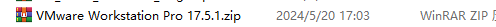
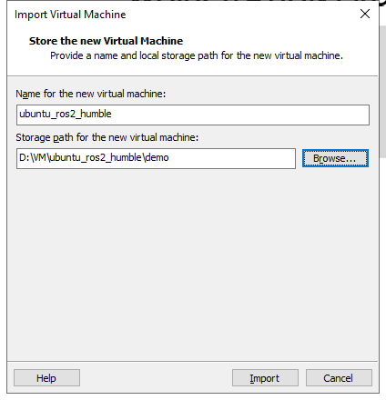
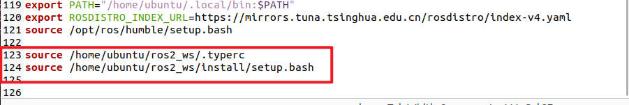
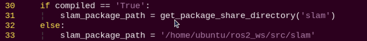
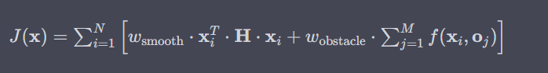
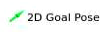
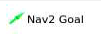

# 6. Mapping & Navigation Course

## 6.1 Mapping Instruction

### 6.1.1 Introduction and Getting Started with URDF Model

* **URDF Model Introduction**

URDF is a format based on the XML specification, designed for describing the structure of robots. Its purpose is to provide a robot description standard that is as general and widely applicable as possible.

Robots are typically composed of multiple links and joints. A link is defined as a rigid object with certain physical properties, while a joint connects two links and constrains their relative motion.

By connecting links with joints and imposing motion restrictions, a kinematic model is formed. The URDF file specifies the relationships between joints and links, their inertial properties, geometric characteristics, and collision models.

* **Comparison between Xacro and URDF Model**

The URDF model serves as a description file for simple robot models, offering a clear and easily understandable structure. However, when it comes to describing complex robot structures, using URDF alone can result in lengthy and unclear descriptions.

To address this limitation, the xacro model extends the capabilities of URDF while maintaining its core features. The Xacro format provides a more advanced approach to describe robot structures. It greatly improves code reusability and helps avoid excessive description length.

For instance, when describing the two legs of a humanoid robot, the URDF model would require separate descriptions for each leg. On the other hand, the Xacro model allows for describing a single leg and reusing that description for the other leg, resulting in a more concise and efficient representation.

* **URDF Model Basic Syntax**

1. XML Basic Syntax

Since URDF models are written based on the XML specification, it is necessary to understand the basic structure of the XML format.

**Elements:**

An element can be defined as desired using the following formula:

```xml
<element>

</element>
```

**Properties:**

Properties are included within elements to define characteristics and parameters. Please refer to the following formula to define an element with properties:

```xml
<element
property_1="property value1"
property_2="property value2">

</element>
```

**Comments:**

Comments have no impact on the definition of other properties and elements. Please use the following formula to define a comment:

```xml
<!-- comment content -->
```

2. Link

The Link element describes the visual and physical properties of the robot's rigid component. The following tags are commonly used to define the motion of a link:


<visua>: Describe the appearance of the link, such as size, color and shape.

<inertial>: Describe the inertia parameters of the link, which will used in dynamics calculation.

<collision>: Describe the collision inertia property of the link.

Each tag contains the corresponding child tag. The functions of the tags are listed below.

| **Tag** | **Function** |
|:--:|:--:|
| origin | Describe the pose of the link. It contains two parameters, including `xyz` and `rpy`. `xyz` describes the pose of the link in the simulated map, while `rpy` describes the pose of the link in the simulated map. |
| mess | Describe the mass of the link. |
| inertia | Describe the inertia of the link. As the inertia matrix is symmetrical, these six parameters need to be input, `ixx`, `ixy`, `ixz`, `iyy`, `iyz` and `izz`, as properties. These parameters can be calculated. |
| geometry | Describe the shape of the link. It uses `mesh` parameter to load texture file, and employs `filename` parameters to load the path for texture file. It has three child tags, namely `box`, `cylinder` and `sphere`, representing rectangles, cylinders and spheres. |
| material | Describe the material of the link. The parameter `name` is the required filed. The tag `color` can be used to change the color and transparency of the link. |

3. Joint

In a URDF model, joints are defined using the `<joint>` tag. They describe the kinematic and dynamic properties of the robot's joints, as well as constraints on motion such as position and velocity limits. According to the type of motion, joints in a URDF model can be categorized into six types:

| **Type and Explanation** | **Tag** |
|----|:--:|
| Rotational joint: can rotate infinitely around a single axis | continuous |
| Rotational joint: similar to continuous, but with rotation angle limits | revolute |
| Prismatic joint: allows translation along an axis, with position limits | prismatic |
| Planar joint: allows translation or rotation in orthogonal directions within a plane | planar |
| Floating joint: allows both translation and rotation | floating |
| Fixed joint: a special joint that does not allow any motion | fixed |

When defining joint behavior, the following tags are commonly used:


`<parent_link>`: Specifies the parent link.

`<child_link>`: Specifies the child link.

`<calibration>`: Used to calibrate the joint angle.

`<dynamics>`: Describes certain physical properties of the motion.

`<limit>`: Defines motion constraints.

Each tag contains the corresponding child tag. The functions of the tags are listed below.

| **Tag** | **Function** |
|:--:|:--:|
| origin | Describes the pose of the parent link. It contains two parameters, including xyz and rpy. xyz describes the pose of the link in the simulated map. rpy describes the pose of the link in the simulated map. |
| axis | Specifies the axis of rotation or translation along the parent link's X, Y, or Z axis. |
| limit | Defines motion constraints for the child link. lower and upper attributes specify the range of motion in radians for revolute joints, while the effort attribute specifies the force/torque limit during motion, with both positive and negative values measured in newtons (N). The velocity attribute limits the rotational speed, measured in meters per second (m/s). |
| mimic | Indicates that this joint's motion is dependent on another joint. |
| safety_controller | Defines safety parameters that protect the joint from exceeding safe motion limits. |

4. robot Tag

The complete top tags of a robot, including the `<link>` and `<joint>` tags, must be enclosed within the `<robot>` tag. The format is as follows:


5. gazebo Tag

This tag is used in conjunction with the Gazebo simulator. Within this tag, you can define simulation parameters and import Gazebo plugins, as well as specify Gazebo's physical properties, and more.


6. Write Simple URDF Model

(1) Name the model of the robot

To start writing the URDF model, we need to set the name of the robot following this format: `<robot name=“robot model name”>`. Lastly, input `</robot>` at the end to represent that the model is written successfully.


**(2) Set links**

① To write the first link and use indentation to indicate that it is part of the currently set model. Set the name of the link using the following format: `<link name="link name">`. Finally, conclude with `</link>` to indicate the successful completion of the link definition.


② When writing the link description, use indentation to indicate that the description belongs to the current link. Start the description with `<visual>` and end it with `</visual>`.


③ The `<geometry>` tag is employed to define the shape of a link. Once the description is complete, include `</geometry>`. Within the `<geometry>` tag, indentation is used to specify the detailed description of the link's shape. The following example demonstrates a link with a cylindrical shape: `<cylinder length="0.01" radius="0.2"/>`. In this instance, `length="0.01` signifies a length of 0.01 meters for the link, while `radius="0.2` denotes a radius of 0.2 meters, resulting in a cylindrical shape.


④ The `<origin>` tag is utilized to specify the position of a link, with indentation used to indicate the detailed description of the link's position. The following example demonstrates the position of a link: `<origin rpy="0 0 0" xyz="0 0 0" />`. In this example, `rpy` represents the angles of the link, while `xyz` represents the coordinates of the link's position. This particular example indicates that the link is positioned at the origin of the coordinate system.


⑤ The `<material>` tag is used to define the visual appearance of a link, with indentation used to specify the detailed description of the link's color. To start describing the color, include `<material>`, and end with `</material>` when the description is complete. The following example demonstrates setting a link color to yellow: `<color rgba="1 1 0 1" />`. In this example, `rgba="1 1 0 1"` represents the color threshold for achieving a yellow color.


(3) Set Joint

① To write the first joint, use indentation to indicate that the joint belongs to the current model being set. Then, specify the name and type of the joint as follows: `<joint name="joint name" type="joint type">`. Finally, include `</joint>` to indicate the completion of the joint definition.

> [!NOTE]
>
> **To learn about the type of the joint, please refer to the section [Joint]() in this document.**


② Write the description section for the connection between the link and the joint. Use indentation to indicate that it is part of the currently defined joint. The parent parameter and child parameter should be set using the following format: `<parent link="parent link"/>`, and `<child link="child link" />`. With the parent link serving as the pivot, the joint rotates the child link.


③ `<origin>` describes the position of the joint, with indentation used to specify the detailed coordinates of the joint. The image below describes the position of the joint: `<origin xyz=“0 0 0.1” />`. xyz is the coordinate of the joint, indicating that the joint is located at x=0, y=0, z=0.1 in the coordinate system.


④ `<axis>` describes the orientation of the joint, with indentation used to specify its precise posture. The figure below shows the posture of a joint `<axis xyz="0 0 1" />`, where `xyz` defines the orientation of the joint.


⑤ `<limit>` is used to restrict joint motion, with indentation applied to specify detailed angle constraints. The figure below shows a joint whose maximum torque does not exceed 300 N, with an upper rotation limit of 3.14 radians and a lower limit of -3.14 radians. These limits are defined according to the following formula: effort = joint torque (N), velocity = joint speed, lower = lower bound of the rotation angle (radians), upper = upper bound of the rotation angle (radians).


⑥ `<dynamics>` describes the dynamic properties of the joint, with indentation used to specify detailed motion parameters. The figure below shows an example of a joint's dynamics parameters: `<dynamics damping="50" friction="1" />`, where `damping` specifies the damping value, and `friction` specifies the friction coefficient.


**The complete code is shown as follows:**


### 6.1.2 Robot URDF Model Instructions

* **Preparation**

To understand the URDF model, you can refer to the section [URDF Model Basic Syntax](). This section provides a brief analysis of the robot model code and component models.

* **Viewing the Robot Model Code**

1)  Power on the robot and connect it to the remote control software VNC. For detail informations, please refer to [4. Development Environment Setup and Configuration]().

2)  Click the terminal icon  in the system desktop to open a command-line window.

3)  Enter the following command and press **Enter** to stop the app auto-start service.

```
~/.stop_ros.sh
```


4)  Enter the following command to open the robot simulation model folder.

```
cd /home/ubuntu/ros2_ws/src/simulations/landerpi_description/urdf/
```


5)  Enter the following command to open the robot simulation model folder.

```
vim landerpi.xacro
```


6)  Find the code section shown in the image below:


Multiple URDF models are called to form the complete robot.

|  **File Name**  |    **Device**    |
|:---------------:|:----------------:|
| inertial_matrix | Inertial matrix  |
|     mecanum     | Mecanum chassis  |
|      tank       |   Tank chassis   |
|       ack       | Ackerman chassis |
|       arm       |    Robot arm     |
|     gripper     |     Gripper      |

* **Brief Analysis of the Robot's Main Model**

1. Robot Base Model

The LanderPi robot supports three types of chassis configurations: Mecanum chassis, Tank chassis, and Ackerman chassis. In this section, we'll use the Mecanum chassis as an example. The Ackerman and Tank chassis share most of the same model files, with their differences explained later in this document.

Open a new command line, and enter the command to load the robot model file, which contains descriptions of the various components of the robot model.

```
vim mecanum.xacro
```

```xml
<?xml version="1.0" encoding="utf-8"?>

<robot xmlns:xacro="http://www.ros.org/wiki/xacro" name="mecanum">
```

This is the beginning of the URDF file. It specifies the XML version and encoding, and defines a robot model named **mecanum**. The `xmlns:xacro` namespace is used here to enable the use of Xacro macros for generating the URDF.

Within the file, you'll find a link definition named `base_footprint`, which represents the robot's chassis.

```xml
   <link name="base_footprint"/>

   <joint name="base_footprint_to_base_link" type="fixed">

      <parent link="base_footprint"/>

      <child link="base_link"/>

      <origin xyz="0 0 0.054" rpy="0 0 0"/>

   </joint>
```

Joint Name `base_footprint_to_base_link` – This joint connects the robot's footprint reference point to the main body.

Joint Types `fixed` – A fixed joint, meaning there is no relative motion between the two links.

Parent Link `base_footprint` – The robot's footprint projection point on the ground.

Child Link `base_link` – The main body link of the robot.

Position Offset: `xyz="0 0 0.054"` – The child link is offset by 0.054 m (54 mm) along the Z-axis relative to the parent link.

Orientation Offset: `rpy="0 0 0"` – No rotational offset.

```xml
   <link name="base_link">

      <inertial>

         <origin xyz="0.00504187685192947 1.09185161661918E-07 -0.00805033236351077" rpy="0 0 0"/>

         <mass value="0.0549114964726037"/>

         <inertia ixx="8.19348226076021E-05" ixy="5.66571121584358E-10" ixz="2.76933476090848E-06"

                       iyy="0.000261801130920988" iyz="-1.79231384469249E-11" izz="0.000329791457319821"/>

      </inertial>

      <visual>

         <origin xyz="0 0 0" rpy="0 0 0"/>

         <geometry>

            <mesh filename="\${mesh_dir}/base_link.STL"/>

         </geometry>

         <material name="">

            <color rgba="0.792156862745098 0.819607843137255 0.933333333333333 1"/>

         </material>

      </visual>

      <collision>

         <origin xyz="0 0 0" rpy="0 0 0"/>

         <geometry>

            <mesh filename="\${mesh_dir}/base_link.STL"/>

         </geometry>

      </collision>

   </link>
```

This section defines the robot's main body link: `base_link`.

**Inertial Properties (inertial)**

Center of Mass: `origin xyz="..."` – Offset of the center of mass relative to the link's coordinate frame. X: 5.04mm, slightly forward.

Y: ~0 mm, near the center line.

Z: -8.05mm, slightly downward.

Mass: 0.055 kg, approximately 55 g.

Inertia Matrix: Defines the link's rotational inertia around each axis.

ixx,  iyy,  izz: Principal moments of inertia about the X, Y, and Z axes.

ixy,  ixz,  iyz: Products of inertia, cross terms.

**Visual Properties (visual)**

Geometry: Uses the same STL file for rendering as for collision detection.

Position: No offset, aligned with the visual model.

Material Color: RGBA value is defined to display as a light bluish-gray.

R: 0.792 (79.2%)

G: 0.820 (82.0%)

B: 0.933 (93.3%)

A: 1.0 (fully opaque)

**Collision Properties (collision)**

Geometry: Uses the same STL file for rendering as for collision detection.

Position: No offset, aligned with the visual model.

**Summary:**

The `base_link` represents the core body link of the robot, serving multiple purposes:

Physics Simulation: Inertial parameters allow simulators to accurately compute dynamics.

Visualization: Defines how the robot appears in tools such as RViz.

Collision Detection: Used in simulation environments for physics-based collision handling.

Reference Frame: Provides the mounting base for other components such as wheels and sensors.

These detailed physical parameters ensure that the robot's behavior in simulators like Gazebo closely matches that of the real robot.

```xml
   <!-- lidar_link -->

   <link name="lidar_frame">

      <inertial>

         <origin xyz="8.95525878428366E-05 6.449498190296E-05 -0.00525031924280694" rpy="0 0 0"/>

         <mass value="0.0385601724394132"/>

         <inertia ixx="4.66264242687519E-06" ixy="-1.6072319384352E-07" ixz="2.0526387548096E-09"

                       iyy="4.71597786598089E-06" iyz="1.10063344618588E-08" izz="7.61241693698137E-06"/>

      </inertial>

      <visual>

         <origin xyz="0 0 0" rpy="0 0 0"/>

         <geometry>

            <mesh filename="\${mesh_dir}/lidar_link.STL"/>

         </geometry>

         <material name="">

            <color rgba="0.792156862745098 0.819607843137255 0.933333333333333 1"/>

         </material>

      </visual>

      <collision>

         <origin xyz="0 0 0" rpy="0 0 0"/>

         <geometry>

            <mesh filename="\${mesh_dir}/lidar_link.STL"/>

         </geometry>

      </collision>

   </link>

   <!-- lidar_joint -->

   <joint name="lidar_joint" type="fixed">

      <origin xyz="0.077447689677331 0 0.0206999999999998" rpy="0 0 0"/>

      <parent link="back_shell_middle_link"/>

      <child link="lidar_frame"/>

      <axis xyz="0 0 0"/>

   </joint>
```

**Lidar Link (lidar_frame)**

Inertial Properties

Center of Mass: Almost at the center of the link with very small offset.

X: 0.09 mm, slightly forward.

Y: 0.06 mm, slightly to the right.

Z: -5.25 mm, downward offset.

Mass: 0.0386 kg, about 38.6 g, a relatively lightweight sensor.

Inertia Matrix: Very small values, consistent with the characteristics of a compact Lidar unit.

**Visual and Collision Models**

Appearance: Uses the dedicated **lidar_link.STL** file for visualization.

Color: Same light bluish-gray as the robot's main body.

Collision Model: Uses the same STL file as the visual model.

**Lidar Mount Joint (lidar_joint)**

Joint Types  `fixed` – Rigidly mounted, no rotation allowed.

Parent Link  `back_shell_middle_link` – Mounted to the middle section of the robot's rear shell.

Installation Position:

X: 77.4mm, slightly forward.

Y: 0 mm, aligned with the center line.

Z: 20.7 mm, raised upward.

Orientation: No rotational offset, remains level.

```xml
   <!-- wheel_left_front_link -->

   <link name="wheel_left_front_link">

      <inertial>

         <origin xyz="3.88969803044453E-05 -0.00231155374534464 3.49803495641177E-05" rpy="0 0 0"/>

         <mass value="0.0379481315569691"/>

         <inertia ixx="3.67997665923715E-06" ixy="-1.4322868285409E-09" ixz="-1.20125267428777E-08"

                       iyy="5.74062073311133E-06" iyz="1.72620588597218E-09" izz="3.68307436222746E-06"/>

      </inertial>

      <visual>

         <origin xyz="0 0 0" rpy="0 0 0"/>

         <geometry>

            <mesh filename="\${mesh_dir}/wheel_left_front_link.STL"/>

         </geometry>

         <material name="">

            <color rgba="0.792156862745098 0.819607843137255 0.933333333333333 1"/>

         </material>

      </visual>

      <collision>

         <origin xyz="0 0 0" rpy="0 0 0"/>

         <geometry>

            <mesh filename="\${mesh_dir}/wheel_left_front_link.STL"/>

         </geometry>

      </collision>

   </link>

   <!-- wheel_left_front_joint -->

   <joint name="wheel_left_front_joint" type="continuous">

      <origin xyz="0.066774 0.073754 -0.021099" rpy="0 0 0"/>

      <parent link="base_link"/>

      <child link="wheel_left_front_link"/>

      <axis xyz="0 1 0"/>

      <limit lower="0" upper="0" effort="0" velocity="0"/>

   </joint>
```

This section defines the robot's left front wheel, including the wheel link and its drive joint.

**Left Front Wheel (wheel_left_front_link)**

Inertial Properties (inertial)

Center of Mass: Located near the center of the wheel.

X:  0.04 mm, almost no offset.

Y:  -2.31 mm, slight inward offset, consistent with tire mass distribution.

Z: 0.03 mm, almost no offset.

Mass:  0.038 kg, about 38 g, a lightweight design for a mecanum wheel.

Inertia Characteristics:

`iyy > ixx ≈ izz`: Consistent with the inertia profile of a disk-shaped object.

`iyy` represents the moment of inertia around the wheel's rotation axis (Y-axis), which is the largest value, as expected.

**Wheel's Visual and Collision Model (visual)**

Appearance: Uses a dedicated STL file for the left front wheel.
Color: Same light bluish-gray color as the robot's main body.

**Left Front Wheel Joint (wheel_left_front_joint)**

Joint Properties

Joint Types  `continuous` – A continuous rotation joint, allowing unlimited rotation.

Mounting Position, relative to `base_link`:

X: 66.77 mm, forward, front wheel position.

Y: 73.75 mm, to the left, left-side wheel.

Z: -21.10 mm, downward, at ground contact.

Rotation Axis:  `axis xyz="0 1 0"` – Rotates around the Y-axis, matching the standard wheel rotation for forward and backward motion.

Limit Parameters:  `limit lower="0" upper="0" effort="0" velocity="0"`

All set to 0, meaning no limits, which is normal for a continuous joint.

Actual torque and velocity limits are defined in the controller.

**Characteristics of the Mecanum Wheels**

From the code definitions, you can observe several important features:

Track Width and Wheelbase:

Track width, distance between left and right wheels: 73.75 mm × 2 = 147.5 mm

Wheelbase, distance between front and rear wheels: 66.77 mm × 2 = 133.54 mm

Ground Clearance: 21.10 mm – Determines the robot's clearance from the ground.

Symmetrical Design: All four wheels have nearly identical mass about 38 g each, ensuring balanced motion.

Independent Drive: Each wheel is controlled by its own continuous joint, enabling omnidirectional movement.

**2. Robot arm**

Open a new terminal and enter the command to load the robot arm model file.

```
vim arm.urdf.xacro
```

```xml
   <!-- link1 -->

   <link name="link1">

      <inertial>

         <origin xyz="-5.67434079306178E-05 -0.00183922864739318 0.0128899047255676" rpy="0 0 0"/>

         <mass value="0.0118309583811137"/>

         <inertia ixx="1.4948064066526E-06" ixy="-4.84499294246996E-09" ixz="-7.07755635870065E-09"

                       iyy="1.83446645758585E-06" iyz="2.91602544513314E-08" izz="1.90385026531022E-06"/>

      </inertial>

      <visual>

         <origin xyz="0 0 0" rpy="0 0 0"/>

         <geometry>

            <mesh filename="\${mesh_dir}/link1.STL"/>

         </geometry>

         <material name="">

            <color rgba="0.792156862745098 0.819607843137255 0.933333333333333 1"/>

         </material>

      </visual>

      <collision>

         <origin xyz="0 0 0" rpy="0 0 0"/>

         <geometry>

            <mesh filename="\${mesh_dir}/link1.STL"/>

         </geometry>

      </collision>

   </link>
```

**Inertial Properties (inertial)**

Center of Mass: Slightly offset relative to the link's coordinate frame, about +12.9 mm along the Z-axis.

Mass:  0.0118 kg, approximately 11.8 g.

Inertia Tensor: Defines the rotational inertia about the three axes. The small values indicate this is a lightweight component.

**Visual Properties (visual)**

Position:  The visual model is aligned with the link's coordinate frame.

Geometry: Uses the STL mesh file link1.STL.

Color:  Light bluish-gray, RGB value: 202, 209, 238.

**Collision Properties (collision)**

Uses the same STL file as the visual model.

Fully aligned with the visual model.

```xml
   <!-- joint1 -->

   <joint name="joint1" type="revolute">

      <origin xyz="0.0798305157765817 0.00796999989406598 -0.00881105926199899" rpy="0 0 0"/>

      <parent link="back_shell_black_link"/>

      <child link="link1"/>

      <axis xyz="0 -0.00872653549837298 0.999961923064171"/>

      <limit lower="-2.09" upper="2.09" effort="1000" velocity="10"/>

   </joint>
```

**Joint Types  **

`revolute`: A rotational joint.

**Position:**

Relative position: Offset from parent link `back_shell_black_link` to child link `link1`.

X: 79.8 mm, main offset direction.

Y:  8.0mm

Z:  -8.8 mm, downward offset.

**Rotation axis:**

```xml
<axis xyz="0 -0.00872653549837298 0.999961923064171"/>
```

Y component is very small (-0.0087), while Z component is nearly 1 (0.9999).

It indicates the joint primarily rotates around the Z-axis.

**Motion Limits**

Angular Range:  -2.09 to 2.09 radians, ≈ -119.7° to +119.7°.

Maximum Torque:  1000 units.

Maximum Velocity: 10 rad/s.

```xml
   <!-- link2 -->

   <link name="link2">

      <inertial>

         <origin xyz="-4.90949608693142E-05 -0.0172946567203177 0.0348468784939513" rpy="0 0 0"/>

         <mass value="0.0134442645715788"/>

         <inertia ixx="2.06831776804487E-06" ixy="-4.83298815351655E-09" ixz="-7.08265998322103E-09"

                       iyy="1.86607200913389E-06" iyz="2.9217965782543E-08" izz="1.9164758927137E-06"/>

      </inertial>

      <visual>

         <origin xyz="0 0 0" rpy="0 0 0"/>

         <geometry>

            <mesh filename="\${mesh_dir}/link2.STL"/>

         </geometry>

         <material name="">

            <color rgba="0.792156862745098 0.819607843137255 0.933333333333333 1"/>

         </material>

      </visual>

      <collision>

         <origin xyz="0 0 0" rpy="0 0 0"/>

         <geometry>

            <mesh filename="\${mesh_dir}/link2.STL"/>

         </geometry>

      </collision>

   </link>

   *<!-- joint2 -->*

   <joint name="joint2" type="revolute">

      <origin xyz="0 0.0157173842856447 0.029407276270124" rpy="0 0 0"/>

      <parent link="link1"/>

      <child link="link2"/>

      <axis xyz="-0.000112352847229615 0.999999993633059 1.05223831512449E-05"/>

      <limit lower="-2.09" upper="2.09" effort="1000" velocity="10"/>

   </joint>
```

Comparison of `link2`/`joint2` and `link1`/`joint1`:

Similarities Basic structure: Both are revolute joints.

- Shared properties: Each joint defines inertia, visual, and collision attributes.

- Same material color applied.

Identical joint constraints: Rotation range from -2.09 to 2.09 rad, torque of 1000, and velocity of 10 rad/s.

**Differences**
`Joint1` Axis of Rotation: Primarily rotates around the Z-axis, which is the vertical axis.
`Joint2` Axis of Rotation: Primarily rotates around the Y-axis, which is the horizontal axis.

**3. Robot Gripper**

Open a new terminal and enter the command to load the robot arm file.

```
vim gripper.urdf.xacro
```

```xml
<!-- r_link -->

   <link name="r_link">

      <inertial>

         <origin xyz="0.00149994724977164 -0.00346401105593584 0.00482321845240047" rpy="0 0 0"/>

         <mass value="0.00222253527753655"/>

         <inertia ixx="4.21526138116034E-07" ixy="5.19501864465232E-12" ixz="4.17679673916264E-12"

                       iyy="2.26587637141938E-07" iyz="1.34876000686462E-07" izz="1.98272335819046E-07"/>

      </inertial>

      <visual>

         <origin xyz="0 0 0" rpy="0 0 0"/>

         <geometry>

            <mesh filename="\${mesh_dir}/r_link.STL"/>

         </geometry>

         <material name="">

            <color rgba="0.792156862745098 0.819607843137255 0.933333333333333 1"/>

         </material>

      </visual>

      <collision>

         <origin xyz="0 0 0" rpy="0 0 0"/>

         <geometry>

            <mesh filename="\${mesh_dir}/r_link.STL"/>

         </geometry>

      </collision>

   </link>

   <!-- r_joint -->

   <joint name="r_joint" type="revolute">

      <origin xyz="-0.00309786796953734 -0.0180033588479546 0.026950170065797" rpy="0 0 0"/>

      <parent link="gripper_link"/>

      <child link="r_link"/>

      <axis xyz="-0.999999784828379 -0.000360574512731351 0.000548023007084987"/>

      <limit lower="-1.57" upper="1.57" effort="1000" velocity="10"/>

   </joint>
```

**r_link**

This section defines the physical and visual properties of the right-side component of the gripper.

Inertial Properties (inertial):

origin: Center of mass located at 0.0015, -0.0035, 0.0048 meters.

mass: 0.0022 kg, approximately 2.2 grams.

inertia:  Inertia tensor matrix describing the rotational inertia around each axis.

Visual Properties (visual)

Uses the STL mesh file **r_link.STL** as the 3D model.

Material color is light blue with RGBA values 0.79, 0.82, 0.93, 1.

Collision Properties (collision)

Uses the same STL file **r_link.STL** for collision detection.

**r_joint**

Defines the rotational joint connecting the gripper body to the right-side component.

Joint Types  `revolute`: A rotational joint.

Position and Orientation

`origin`: Offset of the joint relative to the parent link.

`parent`: `gripper_link`, the gripper body.

`child`: `r_link`, the right-side component.

Axis of Rotation:

`axis`:  Axis of rotation vector: -1.0, -0.00036, 0.00055

Primarily rotates in the opposite direction around the X-axis.

Motion Limits

`lower/upper`: Angular Range: -1.57 to 1.57 radians, approximately ±90 degrees.

`effort`: Maximum Torque: 1000 N·m

`velocity`: Maximum Angular Velocity: 10 rad/s

```xml
<!-- r_in_joint -->

   <joint name="r_in_joint" type="revolute">

      <origin xyz="-0.0033016538756948 -0.00934973740913499 0.045358231082756" rpy="0 0 0"/>

      <parent link="gripper_link"/>

      <child link="r_in_link"/>

      <axis xyz="-0.999999999996305 0 0"/>

      <limit lower="-1.57" upper="1.57" effort="1000" velocity="10"/>

      <mimic

         joint="r_joint"

         multiplier="1"

         offset="0" />

   </joint>
```

**r_in_joint**

**Basic Joint Properties**

Joint Types  `revolute`: A rotational joint.

Position Configuration:

`origin`: Position relative to parent link: -0.0033, -0.0093, 0.0454 meters.

`parent`:  `gripper_link`, the gripper body.

`child`: `r_in_link`, the right-side internal link.

Axis of Rotation:

`axis`: -1.0, 0, 0, along the negative X-axis.

**Motion Limits**

`lower/upper`: Angular Range: -1.57 to 1.57 radians, ±90 degrees.

`effort`: Maximum Torque: 1000 N·m

`velocity`: Maximum Angular Velocity: 10 rad/s

Key Feature: Mimic Mechanism

This is the most important characteristic of this joint:

```xml
<mimic

         joint="r_joint"

         multiplier="1"

         offset="0" />
```

 Function Explanation:

 Follower Joint:  `r_in_joint` automatically follows the motion of `r_joint`.

 `multiplier="1"`: Follows at a 1:1 ratio, meaning the angles are fully synchronized.

 `offset="0"`: No angular offset.

```xml
<!-- r_out_joint -->

   <joint name="r_out_joint" type="revolute">

      <origin xyz="0.000243406210538505 -0.0189415012666699 0.0235398453193471" rpy="0 0 0"/>

      <parent link="r_in_link"/>

      <child link="r_out_link"/>

      <axis xyz="-0.999999999996305 0 0"/>

      <limit lower="-1.57" upper="1.57" effort="1000" velocity="10"/>

      <mimic

         joint="r_joint"

         multiplier="-1"

         offset="0" />

   </joint>
```

**r_out_joint**

Basic Joint Properties

Joint Types  `revolute`: A rotational joint.

Hierarchy:

`parent`: Parent Link: `r_in_link`, the right-side internal link.

`child`: Child Link: `r_out_link`, the right-side external link.

`origin`: Relative position: 0.0002, -0.0189, 0.0235 meters.

Axis of Rotation:

axis:  -1.0, 0, 0, along the negative X-axis.

This is opposite in direction to the axes of `r_joint` and `r_in_joint`.

mimic Mechanism Analysis

```xml
      <mimic

         joint="r_joint"

         multiplier="-1"

         offset="0" />
```

Kinematic Chain Analysis

`r_out_joint` moves in the opposite direction to `r_joint`.

**Mechanical Structure**

`gripper_link`

`r_link` – outer fixed claw

`r_in_link` – intermediate link

`r_out_link` – end contact claw

```xml
 <joint name="l_joint" type="revolute">

      <origin xyz="-0.0015514745324403 0.00972619580013072 0.026264953269009" rpy="0 0 0"/>

      <parent link="gripper_link"/>

      <child link="l_link"/>

      <axis xyz="-0.999999999996305 0 0"/>

      <limit lower="-1.57" upper="1.57" effort="1000" velocity="10"/>

      <mimic

         joint="r_joint"

         multiplier="-1"

         offset="0" />

   </joint>
```

**l_joint**

Key Feature:

 `axis`:  -1.0, 0, 0 – along the negative X-axis, same as `r_joint`.

 `multiplier="-1"` follows the right main joint in the opposite direction.

 `parent`:  `gripper_link`  →  `child`:  `l_link`

```xml
 <joint name="l_in_joint" type="revolute">

      <origin xyz="-0.00307929229401988 0.000993411611255865 0.045929296528685" rpy="0 0 0"/>

      <parent link="gripper_link"/>

      <child link="l_in_link"/>

      <axis xyz="-0.999999999996305 0 0"/>

      <limit lower="-1.57" upper="1.57" effort="1000" velocity="10"/>

      <mimic

         joint="r_joint"

         multiplier="-1"

         offset="0" />

   </joint>
```

**l_in_joint**

Feature:

 `axis`:  -1.0, 0,  0, along the negative X-axis.

 `multiplier="-1"` also follows in the opposite direction

 `parent`:  `gripper_link`  →  `child`:  `l_in_link`

```xml
   <joint name="l_out_joint" type="revolute">

      <origin xyz="2.1044529118136E-05 0.0192824862431322 0.022949235908343" rpy="0 0 0"/>

      <parent link="l_in_link"/>

      <child link="l_out_link"/>

      <axis xyz="-0.999999999996305 0 0"/>

      <limit lower="-1.57" upper="1.57" effort="1000" velocity="10"/>

      <mimic

         joint="r_joint"

         multiplier="1"

         offset="0" />

   </joint>
```

**l_out_joint**

Feature:

 `axis`:  -1.0, 0,  0, along the negative X-axis.

` multiplier="1”` follows in the forward direction, note the difference

 `parent`: `l_in_link`  →  `child`:  `l_out_link`

**Motion Principle**

1. Opening and Closing Actions

 Main Control:  Only `r_joint` needs to be controlled.

 Right Side:  `r_in_joint` moves in the same direction, while `r_out_joint` moves in the opposite direction.

 Left Side:  `l_joint` and `l_in_joint` move in the opposite direction, while `l_out_joint` provides compensation.

2. Geometric Effect:

 When `r_joint` rotates positively:

 The right claw closes inward.

 The left claw, due to `multiplier=-1`, also closes inward.

 This creates a symmetrical gripping action.

3. Parallel Maintenance Mechanism:

 Through the configuration of multiple links and their axes/multipliers, the ends of the left and right claws remain parallel and symmetric, ensuring a stable and reliable grasp.

### 6.1.3 SLAM Map Construction Principle

* **Introduction to SLAM**

Consider humans as an example: before reaching a destination, we always need to know our current location, regardless of whether a map exists. Humans rely on their eyes, while robots use sensors such as Lidar. SLAM, the short form of Simultaneous Localization and Mapping, refers to the process of localization and mapping performed simultaneously.

Localization determines the robot's pose within a coordinate system. The origin and orientation of the coordinate system can be established from the first keyframe, an existing global map, landmarks, or GPS.

Mapping creates a map of the environment as perceived by the robot. The basic geometric elements of the map are points. The main purpose of the map is to support localization and navigation. Navigation can be divided into guidance and motion control: guidance involves global and local path planning, while motion control executes the planned path to move the robot.

* **SLAM Mapping Principles**

SLAM-based mapping generally involves three main processes:

1.  Preprocessing: The raw point cloud data from the Lidar is first optimized, which involves filtering and removing faulty or noisy data.

Lidar works by emitting laser pulses, which scatter when they hit surrounding obstacles.


A portion of the reflected light is received by the Lidar sensor, and based on the time-of-flight measurement principle, the distance between the Lidar and the target point can be calculated.

About Point Clouds: In simple terms, the environmental data collected by Lidar is referred to as a point cloud. It represents the “vision” of the robot, showing the part of the environment that the sensor can detect. The captured object information is expressed as a set of discrete data points, each carrying precise distance and angular information.

2.  Matching: The current point cloud data of the local environment is matched against the existing map.

In practice, Lidar-based SLAM systems align and compare point clouds captured at different times. By calculating the relative displacement and orientation changes between them, the robot's position can be estimated.

3.  Map Fusion: Newly acquired Lidar data is integrated into the existing map, thereby updating and refining it over time.

* **Mapping Guidelines**

1. When starting the mapping process, it is recommended to position the robot facing a flat wall, or alternatively use an enclosed cardboard box. This helps the Lidar capture as many points as possible for a stable initialization.

2. Ensure that the robot explores all areas within its potential path. The Lidar should scan the full 360° surroundings to maximize the completeness of the generated map.

3. In wide or open spaces, it is best to first let the robot close the mapping loop before proceeding to scan smaller details, which improves accuracy and consistency in the final map.

* **Map Evaluation Criteria**

After the mapping process is completed, the following points can be used to evaluate whether the map is suitable for navigation:

1. Check if the boundaries of obstacles are well-defined.

2. Verify whether the map aligns with the actual surroundings, for example, closed-loop detection.

3. Identify any gray regions within the robot's operating area that indicate missing scans.

4. Ensure that the map does not include obstacles that will not exist during subsequent navigation, for instance, moving objects.

5. Confirm that, within the robot's working area, the Lidar has scanned the full 360° field of view from every position.

### 6.1.4 SLAM Toolbox Mapping Algorithm

* **Algorithm Overview**

The Slam Toolbox package combines data from the Lidar using LaserScan messages and applies a TF transformation from the odom frame to the base_link frame, creating a 2D spatial map. This package allows full serialization of SLAM map data and pose graphs, enabling reloading for continuous mapping, localization, merging, or other operations. Slam Toolbox can operate in both synchronous mode to process all valid sensor measurements even if delayed, and asynchronous mode to process valid sensor measurements whenever possible.

Built on top of the powerful Karto scan matcher, which has been widely used and optimized for speed, SLAM Toolbox serves as a feature-complete SLAM system in ROS, replacing packages such as gmapping, cartographer, karto, and hector. It also integrates a Google Ceres–based optimization plugin and a novel method called Elastic Pose-Graph Localization, which uses a sliding measurement window for optimization. This allows the system to track local environmental changes rather than treating them as errors, and to remove redundant nodes once the robot leaves an area, without affecting the long-term map.

Slam Toolbox is a suite of tools for 2D SLAM. Its main features include:

1. Create maps and save them as .pgm files.

2. Refine maps, rebuild them, or continue mapping on an existing saved map.

3. Long-term mapping: Load a saved map, continue mapping, and remove irrelevant data from new laser point clouds

4. Improve localization using previously built maps. Run in localization mode using “laser odometry,” without requiring map building.

5. Synchronous and asynchronous mapping.

6. Dynamic map merging.

7. Plugin-based optimization solvers, including a new Google Ceres–based optimization plugin.

8. Interactive RViz plugin.

9. Provides graphical tools to manipulate nodes and connections during mapping.

10. Map serialization and lossless data storage.

**KARTO:**

Karto_SLAM is based on graph optimizationm, which uses a highly optimized, non-iterative Cholesky decomposition to solve sparse systems. The graph optimization method represents the map as a graph, where each node corresponds to a robot pose along its trajectory and the associated sensor measurement dataset. Whenever a new node is added, the system performs a computation update.

The ROS version of Karto_SLAM uses Sparse Pose Adjustment (SPA), which is closely related to scan matching and loop closure detection. The more landmarks there are, the higher the memory requirements. However, compared to other methods, the graph optimization approach has clear advantages for large-scale mapping, since it only maintains a pose graph (robot poses) rather than the full map. Once the poses are optimized, the map can then be reconstructed.

Karto SLAM algorithm framework:


As shown in the figure above, the workflow of Karto SLAM is relatively straightforward. It follows the traditional soft real-time mechanism of SLAM: each incoming data frame is processed immediately, and then the result is returned.

**Related Resources:**

- Karto SLAM ROS Wiki: <http://wiki.ros.org/slam_karto>

- slam_karto Package: <https://github.com/ros-perception/slam_karto>

- open_karto Open-Source Algorithm: <https://github.com/ros-perception/open_karto>

<p id="anchor_6_1_4_3"></p>

* **Mapping and Navigation Setup**

ROS2 mapping and navigation use a virtual machine connected to the robot within the same local network.

1. Install and Import the Virtual Machine

(1) Locate the installation package under: [06 Virtual Machine Installation Package](3_Chassis_Motion_Control.md) and double-click the installer to begin installation.



(2) Click the icon  to launch VMware and open the virtual machine.

(3) In the VMware interface, click **Open a Virtual Machine**.


(4) Navigate to the extracted folder `ubuntu_ros2_humble`, select the file **Ubuntu 22.04 ROS2.ovf**, and click **Open**.

(5) Enter a name for your virtual machine and choose the desired installation path. Then click **Import**.



(6) The import process will start, and the progress will be displayed on screen.


(7) Once the import is complete, follow the prompts to finish the installation.

2. Copying Robot Files to the Virtual Machine

Export Files from the Robot

(1) Power on the robot and connect it to a remote control tool like VNC. For detail informations, please refer to [4. Development Environment Setup and Configuration]().

(2) Click the terminal icon  in the system desktop to open a ROS2 command-line window.

(3) Enter the command to disable the app auto-start service.

```
~/.stop_ros.sh
```


(4) Compress the navigation, slam, and simulations directories from the workspace into a **.tar** package and copy it into the shared tmp directory:

```
tar -cvf ~/shared/src.tar -C ~/ros2_ws/src ./navigation ./slam ./simulations
```


(5) Copy the hidden configuration file **.typerc** into the same shared directory:

```
cp ~/ros2_ws/.typerc ~/shared
```


(6) Use the SSH client MobaXterm to transfer the files **src.tar** and **.typerc** from the Raspberry Pi system directory `/home/pi/docker/tmp` to your local PC.


If you cannot find the **.typerc** file, enable **Show Hidden Files** in the file manager.


For details on connecting with MobaXterm,, please refer to [4. Development Environment Setup and Configuration]().

Import Files into the Virtual Machine

(1) In the virtual machine, click the desktop icon  to open a terminal. By default, it starts in the **/home** directory.


(2) Drag and drop the exported files **.typerc** and **src.tar** in section Export Files from the Robot from your PC into the virtual machine.


3. Create and Build the Workspace

(1) On the virtual machine, click the desktop icon  to open a terminal.

(2) Enter the command to create the workspace directory:

```
mkdir -p ros2_ws/src
```


(3) Extract **src.tar** into the current `/home/ubuntu` directory.

```
tar -xvf src.tar -C ~/ros2_ws/src
```


(4) Move the .typerc file to the `ros2_ws` directory.

```
mv .typerc ~/ros2_ws
```


(5) Navigate to the workspace directory:

```
cd ~/ros2_ws
```


(6) Enter the command to verify that **.typerc** has been moved to the workspace:

```
ls -a
```


(7) Build the workspace:

```
colcon build
```


(8) Edit the **.bashrc** file to configure the environment:

```
gedit ~/.bashrc
```


Add the following lines at the end of the **.bashrc** file:

```
source /home/ubuntu/ros2_ws/.typerc

source /home/ubuntu/ros2_ws/install/setup.bash
```



(9) After editing, save and close the file by pressing **Ctrl + S** or clicking **Save** at the top right.


(10) Refresh the environment settings:

```
source ~/.bashrc
```


4. Configure the Robot for LAN Mode

(1) On the VNC desktop, open the terminal  and navigate to the [wifi_manager]() directory:

```
cd ~/wifi_manager
```


(2) Edit the Wi-Fi configuration file to set the robot to local network mode. Update the file with your Wi-Fi name and password:

```
gedit wifi_manager/wifi_conf.py
```


(3) After editing, save and close the file by pressing **Ctrl + S** or clicking **Save** at the top right.


(4) Enter the command to restart the network or reboot the robot. It is recommand to perform a full reboot. After the robot restarts, check the IP address using the mobile app or the Wi-Fi router interface to ensure connectivity.

```
sudo systemctl restart wifi.service
```


(5) Make sure the virtual machine and the robot are connected to the same local network, and that their IP addresses are on the same subnet:

 Virtual Machine:


 Robot:


(6) After rebooting, open the robot's ROS 2 terminal from the desktop . Verify that the `ROS_DOMAIN_ID` matches the virtual machine, for example 0.

Robot:


Virtual Machine:


* **SLAM Mapping Steps**

1. On the Robot

(1) Click the terminal icon  in the system desktop to open a command-line window.

(2) Enter the command to disable the app auto-start service.

```
~/.stop_ros.sh
```


(3) Entering the following command to start mapping.

```
ros2 launch slam slam.launch.py
```


2. On the Virtual Machine

(1) On the virtual machine, click the desktop icon  to open a terminal.

(2) Launch RViz to visualize the mapping results:

```
ros2 launch slam rviz_slam.launch.py
```


3. Enable Keyboard Control on the Robot

(1) Click the terminal icon  in the system desktop to open a command-line window.

(2) Start the keyboard control node by entering the following command and pressing Enter:

```
ros2 launch peripherals teleop_key_control.launch.py
```


If the prompt shown below appears, the keyboard control service has started successfully.


(3) Use the keyboard to drive the robot around the environment to build a more complete map. The table below lists the keyboard keys that can be used to control the robot's movement and their corresponding functions.

| **Keyboard Key** | **Robot Action** |
|:--:|:--:|
| W | Short press to switch to forward state, then the robot will keep moving forward. |
| S | Short press to switch to backward state, then the robot will keep moving backward. |
| A | Long press to interrupt forward or backward state and turn left. |
| D | Long press to interrupt forward or backward state and rotate clockwise in place. |

(4) When using the keyboard to move the robot for mapping, you can reduce the robot's speed. A slower speed results in smaller relative odometry errors and better mapping accuracy. As the robot moves, RViz will gradually display the map, expanding until the entire environment is mapped.

* **Saving the Map**

1)  Click the terminal icon  in the system desktop to open a command-line window.

2)  Save the map by entering the following command and pressing **Enter**:

```
cd ~/ros2_ws/src/slam/maps && ros2 run nav2_map_server map_saver_cli -f "map_01" --ros-args -p map_subscribe_transient_local:=true
```

* **Optimization**

To achieve more precise mapping results, you can optimize the odometry. The robot relies on odometry for mapping, which in turn depends on the IMU.

The robot comes with preloaded calibrated IMU data, which allows it to perform mapping and navigation normally. However, you can recalibrate the IMU to achieve higher precision. For IMU calibration methods and steps, refer to [1. IMU, Linear Velocity, Angular Velocity Calibration]().

* **Parameter Description**

The parameter file can be found at: `ros2_ws/src/slam/config/slam.yaml`.

For detailed explanations about the parameters, please refer to the official documentation: [https://wiki.ros.org/slam_toolbox](https://wiki.ros.org/slam_toolbox).

* **launch File Analysis**


The launch file is located at: `/home/ubuntu/ros2_ws/src/slam/launch/slam.launch.py`

1. Imported Libraries

Detailed explanations for launch library can be found in the official ROS documentation:

<https://docs.ros.org/en/humble/How-To-Guides/Launching-composable-nodes.html>


2. Setting Paths

Use `get_package_share_directory` to obtain the path of the **slam** package.



3. Starting Other Launch Files


`base_launch` – Launches the hardware required by the program.

`slam_launch` – Base launch for mapping.

`bringup_launch` – Initial pose launch.

<p id="anchor_6_1_5"></p>

### 6.1.5 RTAB-VSLAM 3D Mapping

* **Introduction to RTAB-VSLAM**

RTAB-VSLAM is an appearance-based real-time 3D mapping system. It is an open-source library that implements loop closure detection using memory management techniques. The system limits the map size so that loop closure detection can always be processed within a fixed time frame, enabling long-term and large-scale online mapping.

* **RTAB-VSLAM Principles**

The principle of RTAB-VSLAM involves feature-based 3D mapping. Its advantage is that most environments provide abundant feature points, which makes it highly adaptable to different scenes and enables relocalization using these features. However, it also has drawbacks: computing feature points is time-consuming, the amount of information utilized from the features is limited, much of the image data is lost, feature-based methods are ineffective in low-texture areas, and feature matching is prone to errors, which can significantly affect the results.

Once features are extracted from images, they must be matched across different time frames to form loop closures. After matching, the data is divided into two types: long-term memory (LTM) and short-term memory (STM). LTM is used for matching future data, while STM is used to match consecutive data within the current time frame.

During operation, the RTAB-VSLAM algorithm first updates the robot's pose and map using STM, and when future data matches LTM, the corresponding LTM data is incorporated into STM to further update the pose and the map.


**RTAB-VSLAM** software resources: <https://github.com/introlab/rtabmap>

* **RTAB-VSLAM 3D Mapping Steps**

1. On the Robot

(1) Click the terminal icon  in the system desktop to open a command-line window.

(2) Enter the command to disable the app auto-start service.

```
~/.stop_ros.sh
```

(3) Entering the following command to start mapping.

```
ros2 launch slam rtabmap_slam.launch.py
```

2. On the Virtual Machine

(1) Click the terminal icon  in the system desktop to open a command-line window.

(2) Launch RViz to visualize the mapping results:

```
ros2 launch slam rviz_rtabmap.launch.py
```


3. Enable Keyboard Control on the Robot

(1) Click the terminal icon  in the system desktop to open a command-line window.

(2) Start the keyboard control node by entering the following command and pressing Enter:

```
ros2 launch peripherals teleop_key_control.launch.py
```

If the prompt shown below appears, the keyboard control service has started successfully.


(3) Use the keyboard to drive the robot around the environment to build a more complete map. The table below lists the keyboard keys that can be used to control the robot's movement and their corresponding functions.

| **Keyboard Key** | **Robot Action** |
|:--:|:--:|
| W | Short press to switch to forward state, then the robot will keep moving forward. |
| S | Short press to switch to backward state, then the robot will keep moving backward. |
| A | Long press to interrupt forward or backward state and turn left. |
| D | Long press to interrupt forward or backward state and rotate clockwise in place. |

When using the keyboard to move the robot for mapping, you can reduce the robot's speed. A slower speed results in smaller relative odometry errors and better mapping accuracy. As the robot moves, RViz will gradually display the map, expanding until the entire environment is mapped.


4. Saving the Map

After completing the mapping, press **Ctrl + C** in each terminal window to stop the currently running programs.

> [!NOTE]
>
> **For 3D mapping, you do not need to manually save the map. When you stop the mapping process using Ctrl + C, the map will be saved automatically.**


* **Launch File Analysis**


The launch file is located at: `/home/ubuntu/ros2_ws/src/slam/launch/rtabmap_slam.launch.py`

**1. Imported Libraries**

Detailed explanations for launch library can be found in the official ROS documentation:

<https://docs.ros.org/en/humble/How-To-Guides/Launching-composable-nodes.html>


**2. Setting Paths**

Use `get_package_share_directory` to obtain the path of the **slam** package.


**3. Starting Other Launch Files**


`base_launch` – Launches the hardware required by the program.

`rtabmap_launch` – Launch file for RTAB 3D mapping.

`bringup_launch` – Initial pose launch.

## 6.2 Navigation Instruction

### 6.2.1 ROS Robot Autonomous Navigation

* **Overview**

Autonomous navigation refers to the method of guiding a device to move from one point to another along a specified path. The main application scenarios are listed as following.

Land applications include autonomous vehicle navigation, vehicle tracking and monitoring, intelligent vehicle information systems, connected vehicle applications, and railway operation monitoring.

Marine applications include ocean shipping, inland waterway transport, ship docking, and harbor maneuvers.

Aerial applications include route navigation, airport traffic monitoring, and precision approaches.


Following the ROS principle of “don't reinvent the wheel,” its navigation-related packages provide a general-purpose implementation for robot navigation, allowing developers to focus on higher-level functionalities instead of dealing with complex, low-level details such as navigation algorithms or hardware interactions. These implementations are managed, iterated, and maintained by professional teams, and to use the navigation features, developers only need to configure the module settings according to their robot's parameters. Additionally, existing packages can be extended or customized to meet specific requirements, significantly improving R&D efficiency and shortening the time to product deployment.

In summary, for most developers, using ROS navigation packages offers clear advantages. They are developed and maintained by professional teams, providing stable and comprehensive functionality, allowing developers to focus on higher-level implementations and achieve faster, more efficient development.

* **Navigation Package Details**

In this section, we provide a detailed analysis of the navigation packages, including explanations of parameter usage.

**1\. Principles and Structural Framework**

The Nav2 project inherits and extends the philosophy of the ROS Navigation Stack, aiming to enable mobile robots to move safely from point A to point B. Nav2 can also be applied to other scenarios, including dynamic point tracking, which involves dynamic path planning, motor speed calculation, obstacle avoidance, and recovery behaviors.

Nav2 uses behavior trees (BT) to invoke modular servers to perform specific actions. These actions can include path computation, force control, recovery operations, or any other navigation-related tasks. Each action is executed as an independent node that communicates with the behavior tree through ROS Action servers. The figure below provides an overview of the Nav2 architecture.


This architecture can be conceptually divided into one main component and three subordinate components for easier understanding.

**Main Component:**

BT Navigator Server – The navigation behavior tree (BT) service, which organizes and invokes the three subordinate services below.

**Subordinate Components:**

\(1\) Planner Server – The planning server is responsible for computing paths that satisfy certain objective functions. Depending on the chosen naming conventions and algorithms, these paths may also be referred to as routes. In simple terms, it finds a path on the map.

\(2\) Controller Server – The control server, also known as the local planner in ROS1, determines how the robot follows the globally computed path or performs local tasks. In simple terms, it controls the robot's movement along the planned path.

\(3\) Recovery Server – The recovery server acts as the backbone of the fault-tolerant system. Its purpose is to handle unexpected situations or faults and autonomously manage these events. In simple terms, it helps the robot recover from incidents, such as escaping if it falls into a pit.

Autonomous navigation is achieved by continuously switching between path planning, controlling the robot along the path, and performing recovery actions when problems arise. During robot navigation, relying solely on a static map generated by SLAM is not sufficient. New obstacles may appear as the robot moves, and some obstacles in the original map may no longer exist. Therefore, the map maintained during navigation is a dynamic map, which can be categorized into two types based on update frequency and purpose:

**Global Costmap:**

The global costmap is primarily used by the global planner, which can be seen in the Planner Server in the architecture diagram.

It typically includes the following layers:

Static Map Layer: The static map layer, usually generated by SLAM.

Obstacle Map Layer: Records obstacles detected by sensors dynamically.

Inflation Layer: Expands obstacles outward on the above layers to prevent the robot's body from colliding with them.

**Local Costmap:**

The local costmap is primarily used by the local planner, which can be seen in the Controller Server in the architecture diagram.

It typically includes the following layers:

Obstacle Map Layer: Records obstacles detected by sensors dynamically.

Inflation Layer: Expands obstacles outward on the obstacle map layer to prevent collisions with the robot's body.

**2\. Installation of Navigation Packages**

The navigation system takes navigation goals, localization information, and map data as inputs, and outputs control commands to drive the robot. To navigate effectively, the robot must first know its current position and then determine the target it needs to reach.

There are two methods for installing the navigation packages. The first method is to install them directly into the system using apt-get, with the following commands:

```
sudo apt install ros-*-navigation2
```

```
sudo apt install ros-*-nav2-bringup
```

> [!NOTE]
>
> **The asterisk (\*) represents your ROS 2 version. You can check your version in the terminal by entering: echo \$ROS_DISTRO.**

Another method is to download the package source code and compile and install it manually. For learning and basic usage, binary installation is recommended because it is quick and convenient. If you need to modify the package code to improve algorithms, you should use the manual source installation.

Navigation package wiki: [https://wiki.ros.org/Robots/Nav2](https://wiki.ros.org/Robots/Nav2)

> [!NOTE]
>
> **The navigation packages are pre-installed on this robot, so you don't have to install them again.**

### 6.2.2 AMCL Adaptive Monte Carlo Localization

* **AMCL Localization**

Localization is the process of determining a robot's position within a global map. Although SLAM also includes a localization algorithm, its purpose is to support the construction of the global map, which happens before navigation begins. In contrast, the localization used during navigation allows the robot to follow a predefined route and check whether its actual trajectory matches expectations. The ROS navigation stack (ros-navigation) provides the AMCL localization system for robot positioning during navigation.

AMCL (Adaptive Monte Carlo Localization) is a probabilistic localization system for 2D mobile robots. It implements the adaptive Monte Carlo localization method, which uses a particle filter to estimate the robot's position based on a pre-existing map.

Localization resolves the association between the robot and surrounding obstacles, which is essential because path planning is essentially the process of making decisions relative to obstacles around the robot. In theory, as long as the robot's global position is known and sensors such as Lidar provide real-time obstacle detection, navigation can be achieved. However, global localization alone often lacks the required accuracy and responsiveness. Local localization from sources like odometry and IMU helps maintain real-time accuracy in the robot's trajectory. In the navigation stack, the `amcl` node provides global localization by publishing the `map_odom` transformation. AMCL-based global localization is not mandatory; users may replace it with other systems capable of providing the map_odom transform, such as SLAM, UWB, or QR code localization.

Global and local localization establish a dynamic tf transform chain between map, odom, and base_footprint, while static transforms between sensors, defined in the robot's URDF, describe how each sensor is positioned relative to the robot. This TF framework enables correlation between the robot and obstacles. For example, if Lidar detects an obstacle 3 meters ahead, the static transform between `base_link` and `laser_link` can be used to determine the obstacle's relative position to the robot's chassis.

* **Particle Filter**

The Monte Carlo localization process can be illustrated using a one-dimensional robot's particle update. First, a set of particles is randomly generated. Each particle may represent variables such as position, orientation, or other states to be estimated, and each is assigned a weight that indicates how closely it matches the robot's actual state. Then, the next state of each particle is predicted, and the particles are moved according to the expected behavior of the real system. After that, the particle weights are updated based on measurements, with particles that better match the observed data being assigned higher weights. The particles are then resampled, discarding those that are highly unlikely and replacing them with more probable ones. Finally, the weighted mean and covariance of the particle set are computed to obtain the estimated state.


Although different Monte Carlo methods vary, they generally follow a specific pattern:

1. Define the domain of possible inputs.

2. Randomly generate inputs from a probability distribution over that domain.

3. Perform deterministic calculations using the inputs.

4. Aggregate the results.

There are two key considerations:

1. If the sampling points are not uniformly distributed, the approximation will be poor.

2. A large number of particles is required. With only a few randomly placed points in the domain, the approximation tends to be very inaccurate, but on average, the accuracy improves as more points are added.

The Monte Carlo particle filter algorithm has a wide range of applications in various fields, including physics, engineering, climatology, and computational biology.

* **Adaptive Monte Carlo Localization**

Adaptive Monte Carlo Localization (AMCL) can be seen as an improved version of the Monte Carlo localization algorithm. It enhances real-time performance by reducing execution time through the use of fewer samples. AMCL implements an adaptive, or KLD-sampling, version of the Monte Carlo localization method, where a particle filter is used with a pre-existing map to track a robot's pose.

The AMCL node primarily relies on laser scans and a Lidar-based map to exchange messages and compute pose estimation. The process begins by initializing the particle filter for the adaptive Monte Carlo localization algorithm using the parameters provided by the ROS system. If no initial pose is specified, the algorithm assumes the robot starts from the origin of the coordinate frame, which makes calculations more complex.

Therefore, it is recommended to set the initial pose in RViz using the 2D Pose Estimate button. For more details on Adaptive Monte Carlo Localization, you can also refer to the official wiki page: [https://github.com/ros-planning/navigation](https://github.com/ros-planning/navigation).

* **Costmaps**

Whether the SLAM map is generated by a Lidar or a depth camera in 2D or 3D, it cannot be directly used for navigation. Instead, the map must be converted into a costmap, which in ROS is typically represented in a grid format. In a grid map, each cell is stored in one byte (8 bits), meaning it can hold values from 0 to 255. For navigation, we usually only need three states: Occupied (an obstacle is present), Free (no obstacle), and Unknown Space (unmapped area).

Before diving into costmap_2d, it is important to introduce the Bresenham algorithm. The Bresenham line algorithm is used to draw a straight line defined by two points, calculating the closest rasterized points along the line in an n-dimensional grid. The algorithm relies only on fast integer operations such as addition, subtraction, and bit shifting, and is widely used in computer graphics for line rendering. It was one of the earliest algorithms developed in this field.


When constructing the costmap, a set of virtual grid lines is drawn through the center of each row and column of pixels as shown in the figure. The algorithm then calculates the intersections of the line segment with the vertical grid lines in sequence from the start point to the end point, and based on the sign of the error term, determines which pixel in that column is closest to the intersection.

The core idea of the algorithm assumes that k = dy/dx. Since the line starts at a pixel center, the initial error term is d0 = 0. Each time the x-index increases by 1, the error value d increments by the slope value k, i.e., d = d + k. Whenever d ≥ 1, subtract 1 to keep d within 0 and 1. If d ≥ 0.5, the closest pixel is the one at the upper-right (x+1, y+1). If d < 0.5, the closest pixel is the one directly to the right (x+1, y). For convenience, let e = d – 0.5, with an initial value of -0.5 and an increment of k. When e ≥ 0, the algorithm selects the upper-right pixel (x+1, y+1). When e < 0, it selects the right pixel (x+1, y). To simplify calculations, integer arithmetic can be used to avoid division. Since the algorithm only depends on the sign of the error term, it can be reformulated as e1 = 2 \* e \* dx.


The Costmap2D class maintains the cost values for each grid cell. The Layer class serves as a virtual base class that unifies the interface for all costmap plugin layers. The most important interface functions include:

`initialize()`, which calls `onInitialize()` to initialize each costmap layer.

`matchSize()`, which in both the `StaticLayer` and `ObstacleLayer` classes calls the `CostmapLayer`'s `matchSize()` function to initialize each layer's size, resolution, origin, and default cost value, ensuring consistency with the layered costmap. For the `inflationLayer` class, the `cost` table is calculated based on the inflation radius, where the cost values vary with distance. This allows querying the cost of inflated grid cells directly by distance. Meanwhile, the `seen_`array is defined to mark whether a grid cell has already been traversed. For the `VoxelLayer` class, the voxel grid `size` is initialized.

The `updateBounds` function adjusts the size range of the current `costmap` layer that needs updating. For the `StaticLayer` class, the update range of the costmap is set to the size of the static map. 

> [!NOTE]
>
> **The static layer is typically only used in the global costmap. **

For the `ObstacleLayer` class, sensor data in `clearing_observations` is traversed to determine obstacle boundaries. Among them, the `initialize` function and `matchSize` function are only executed once. The `updateBounds` and `updateCosts` functions are executed periodically, and their execution frequency is determined by `map_update_frequency`.

The `CostmapLayer` class inherits from both the `Layer` class and the `Costmap2D` class, and provides several methods for updating `cost` values. Both the `StaticLayer` class and the `ObstacleLayer` class need to maintain the `cost` values of the instantiated costmap layer, so they both inherit from the `CostmapLayer` class. The `StaticLayer` class updates its `costmap` using static grid map data. The `ObstacleLayer` class updates its `costmap` using sensor data. Compared with the `ObstacleLayer` class, the `VoxelLayer` class additionally considers data along the z-axis. The difference in effect mainly lies in obstacle clearing. One works on a 2D plane, while the other performs clearing in 3D space.


The costmap is highly flexible in representing obstacles, allowing specific layers to be created as needed to maintain obstacle information of interest. If the robot is equipped only with a Lidar, an **Obstacles** layer should be created to maintain the obstacle information detected by Lidar scans. If the robot is additionally equipped with ultrasonic sensor, a **Sonar** layer should be created to maintain the obstacle information detected by sonar scans. Each layer can define its own obstacle update rules, such as adding obstacles, removing obstacles, or updating the confidence level of obstacle points, which greatly enhances the scalability of the navigation system.

* **Global Path Planning**

Depending on the robot's understanding of the environment, the nature of the environment, and the algorithm being used, path planning can generally be classified into environment-based algorithms, map-knowledge-based algorithms, and completeness-based algorithms.


In autonomous navigation, commonly used path planning algorithms include Dijkstra, A\*, D\*, PRM, RRT, genetic algorithms, ant colony algorithms, and fuzzy algorithms.

Among these, Dijkstra and A\* are graph-based search algorithms. ROS navigation packages integrate several global path planning plugins such as navfn, global planner, and carrot planner. You can select one of these plugins to load into move_base, or they can use third-party global planning plugins, such as SBPL_Lattice_Planner and srl_global_planner, or even develop your own plugins in compliance with the nav_core interface.


Path planning enables a mobile robot to autonomously reach the target point. The navigation planning framework can be divided into three layers.

\(1\) Global Path Planning Layer: Based on a given target, it uses the weighted costmap information to generate a global costmap and plan a global path from the start point to the goal, which serves as a reference for local path planning.

\(2\) Local Path Planning Layer: As the local planning component, it uses the locally generated costmap and nearby obstacle information to compute a feasible local path.

\(3\) Behavior Execution Layer: Integrates high-level commands with the path planning results to determine the robot's current actions.

As one of the key research areas in mobile robotics, the performance of path planning algorithms plays a decisive role in the overall efficiency of robot navigation.

**1. Dijkstra Algorithm**

The Dijkstra algorithm is a classic shortest path algorithm and a typical example of a single-source shortest path approach. Its main feature is expanding outward from the starting point layer by layer—similar to a breadth-first search but with edge weights considered—until the destination is reached. For this reason, it is one of the most widely used algorithms for global path planning.

Illustration of the algorithm process:

(1) At the beginning, set `dis\[start\] = 0` and initialize all other nodes to `inf`.


(2) In the first iteration, the node with the smallest `distance` value, node 1, is selected and marked as visited. Then, the `distance` values of all blue nodes connected to node 1 are updated, resulting in `dis[2] = 2`, `dis[3] = 4`, and `dis[4] = 7`.


(3) In the second iteration, the node with the smallest `distance` value, node 2, is selected and marked as visited. The distance values of all unvisited nodes connected to node 2 are then updated, resulting in `dis[3] = 3` and `dis[5] = 4`.


(4) In the third iteration, the node with the smallest `distance` value, node 3, is selected and marked as visited. The distance values of all unvisited nodes connected to node 3 are then updated, resulting in `dis[4] = 4`.


(5) In the following two iterations, nodes 4 and 5 are marked as visited, and the algorithm terminates, yielding the shortest paths to all nodes.

For more details on the Dijkstra algorithm and usage examples, refer to the official ROS wiki link: [http://wiki.ros.org/navfn](http://wiki.ros.org/navfn).

**2. A\* Algorithm**

The A\* algorithm is an optimized version of Dijkstra's algorithm for a single destination. While Dijkstra's algorithm finds paths to all nodes, A\* finds the path to a specific node or the nearest node among several targets. It prioritizes paths that appear closer to the goal.

The A\* algorithm uses the formula F = G + H, where G represents the cost to move from the start to a given cell, and H is the estimated cost from that cell to the goal. There are two common ways to calculate H:

\(1\) Calculate the horizontal and vertical movement distances only, using the Manhattan distance method, without considering diagonal movement.


\(2\) Calculate the horizontal and vertical movement distances while allowing diagonal movement, using the diagonal distance method.


For more details on the A\* algorithm and its usage, please visit the Wiki: [http://wiki.ros.org/global-planner](http://wiki.ros.org/global-planner) and the Red Blob Games website: [https://www.redblobgames.com/pathfinding/a-star/introduction.html#graphs](https://www.redblobgames.com/pathfinding/a-star/introduction.html#graphs).

### 6.2.3 Local Path Planning

Global path planning takes the start point and the goal point as input and uses obstacle information from the global map to plan a global path from the start to the goal. The global path consists of a series of discrete waypoints and only considers static obstacles, so it cannot be directly used for navigation control and serves merely as a high-level reference.

* **DWA Algorithm**

**1. Description**

The DWA algorithm, also known as the Dynamic Window Approach, is a classical method for mobile robot path planning and motion control. The algorithm searches for the optimal combination of linear and angular velocities within the velocity space to ensure safe navigation on a known map. The following is a basic description of the DWA algorithm along with some formulas:


The core idea of DWA is that at each moment, the robot considers its current state and sensor information, then generates a set of possible motion trajectories in the velocity and angular velocity space, called the dynamic window, and evaluates these trajectories to select the best one. Evaluation criteria usually include obstacle avoidance, maximizing forward speed, and minimizing angular velocity. By continuously repeating this process, the robot can plan its motion trajectory in real time to handle dynamic environments and obstacles.

**2. Formulas**

\(1\) Robot state: position (x, y) and orientation θ.

\(2\) Motion control parameters: linear velocity V and angular velocity ω.

\(3\) Velocity and angular velocity sampling range: Vmin, Vmax and ωmin, ωmax.

\(4\) Time step: Δt.

Formulas:

**\(1\) Velocity sampling**: The DWA algorithm first samples the linear and angular velocities in the state space to generate a set of possible velocity-angular velocity pairs, known as the dynamic window.

V<sub>samples</sub> = \[v<sub>min</sub>, v<sub>max</sub>\]

ω<sub>samples</sub> = \[-ω<sub>max</sub>, ω<sub>max</sub>\]

Vsamples represents the linear velocity sampling range, and ω<sub>samples</sub> represents the angular velocity sampling range.

**\(2\) Motion simulation:** For each velocity–angular velocity pair, the DWA algorithm simulates the robot's motion and computes the trajectory resulting from applying that velocity–angular velocity combination from the current state.

x(t+1) = x(t) + v \* cos(θ(t)) \*Δt

y(t+1) = y(t) + v \* sin(θ(t)) \*Δt

θ(t+1) = θ(t) + ω \* Δt

The variables x(t) and y(t) represent the robot's position, θ(t) represents the robot's orientation, v represents the linear velocity, ω represents the angular velocity, and Δt represents the time step.

**(3) Trajectory Evaluation:** For each generated trajectory, the DWA algorithm evaluates it using an evaluation function, such as obstacle avoidance, maximum velocity, and minimum angular velocity.

**Obstacle avoidance evaluation:** Checks whether the trajectory intersects with any obstacles.

**Maximum velocity evaluation:** Checks whether the maximum linear velocity along the trajectory is within the allowed range.

**Maximum velocity evaluation:** Checks whether the maximum linear velocity along the trajectory is within the allowed range.

**\(4\) Minimum angular velocity evaluation:** Checks whether the minimum angular velocity along the trajectory is within the allowed range.


**3. Extensions**

Resources and learning links for the DWA algorithm:

The DWA algorithm is a foundational method in mobile robotics, and there are many extended and improved versions, such as DWA, e-DWA, and DP-DWA, aimed at enhancing the performance and efficiency of path planning:

\(1\) DWA algorithm extension: [https://arxiv.org/abs/1703.08862](https://arxiv.org/abs/1703.08862)

\(2\) Enhanced DWA (e-DWA) algorithm: [https://arxiv.org/abs/1612.07470](https://arxiv.org/abs/1612.07470)

\(3\) DP-DWA algorithm (DP-based Dynamic Window Approach): [https://arxiv.org/abs/1909.05305]( https://arxiv.org/abs/1909.05305)

\(4\) Wiki reference: [http://wiki.ros.org/dwa_local_planner](http://wiki.ros.org/dwa_local_planner)

These links provide detailed information and further research on the DWA algorithm and its extensions.

* **TEB Algorithm**

**1. Description**

The TEB (Timed Elastic Band) algorithm is a method used for path planning and motion planning, primarily applied in robotics and autonomous vehicles. The core idea of the TEB algorithm is to model the path planning problem as an optimization problem, where the goal is to generate an optimal trajectory within a given time while satisfying the robot's or vehicle's dynamic constraints and obstacle avoidance requirements. Key features of the TEB algorithm include:

**\(1\) Time-layered representation:** The TEB algorithm introduces a time-layered concept, dividing the trajectory into multiple time steps. Each time step corresponds to a specific position of the robot or vehicle along the trajectory, which helps enforce temporal constraints and avoid collisions.

**\(2\) Trajectory parameterization:** The trajectory is parameterized as a series of displacements and velocities, making it easier to optimize. Each time step has an associated displacement and velocity parameter.

**\(3\) Constraint optimization:** The algorithm takes into account the robot's dynamic constraints, obstacle avoidance constraints, and trajectory smoothness constraints. These are incorporated into the optimization problem as part of the objective function.

**\(4\) Optimization solving:** TEB uses optimization techniques, such as quadratic programming (QP) or nonlinear programming (NLP), to compute the optimal trajectory parameters while satisfying all constraints.


**2. Formulas**

The figure below illustrates the objective function used in the TEB algorithm:



For more details:

`J(x)` is the objective function, where `x` represents the trajectory parameters.

w<sub>smooth</sub> and w<sub>obstacle</sub> are the weights for smoothness and obstacle avoidance.

H is the smoothness penalty matrix.

f(x<sub>i</sub>,o<sub>j</sub>) represents the obstacle cost function between trajectory point x<sub>i</sub> and obstacle o<sub>j</sub>.

**(1) State definition:**

First, define the robot's state in the path planning problem.

Position: P=\[X,Y\], representing the robot's position in a 2D plane.

Velocity: V=\[Vx,Vy\], representing the robot's velocity along the X and Y axes.

Time: t, representing time.

Control input: u=\[ux,uy\], representing the robot's control inputs, which can be velocity or acceleration.

Robot trajectory: x(t)=\[p(t),v(t)\], representing the robot's state at time t.

**(2) Objective Function:**

The core of the TEB algorithm is an optimization problem, with the goal of minimizing an objective function composed of multiple components:


J<sub>smooth</sub>(x): The smoothness objective, used to ensure that the generated trajectory is smooth.

J<sub>obstacle</sub>(x): The obstacle avoidance objective, used to prevent collisions with obstacles.

J<sub>dynamic</sub>(x): The dynamics objective, used to ensure that the trajectory satisfies the robot's dynamic constraints.

**(3) Smoothness Objective Jsmooth(x):**

The smoothness objective typically involves the curvature of the trajectory to ensure it is smooth. It can be expressed as:


where k(t) represents the curvature.

**(4) Obstacle Avoidance Objective Jobstacle(x):**

The obstacle avoidance objective calculates the distance between trajectory points and obstacles, penalizing points that are too close to obstacles. The specific obstacle cost function f(x,o) can be customized according to the application requirements.


**(5) Dynamics Objective J<sub>dynamic</sub>(x):**

The dynamics objective ensures that the generated trajectory satisfies the robot's dynamic constraints. This can be defined based on the robot's kinematic and dynamic model and typically involves constraints on velocity and acceleration.

**(6) Optimization:**

Finally, the TEB algorithm formulates the above objective functions as a constrained optimization problem, where the optimization variables include trajectory parameters, time allocation, and control inputs. The optimization problem is typically solved as a nonlinear programming (NLP) problem.

**3. Extensions**


Resources and learning links for the TEB algorithm:

The TEB algorithm is an important technique in the field of path planning, and there are many extended and improved variants. The following resources and topics can help you gain a deeper understanding of the TEB algorithm and related concepts:

**\(1\) Original TEB Paper:** One of the best ways to learn is to study the original TEB paper to gain insights into its principles and applications.

\- Original TEB Paper: "**Trajectory modification considering dynamic constraints of autonomous robots**" by M. Rösmann et al.

**(2\) TEB Implementation in ROS:** The ROS package for the TEB algorithm is a common implementation that can be used for robot path planning.

ROS TEB Local Planner Package: [https://github.com/rst-tu-dortmund/teb_local_planner](https://github.com/rst-tu-dortmund/teb_local_planner)

Wiki page: [http://wiki.ros.org/teb_local_planner](http://wiki.ros.org/teb_local_planner)

These links provide resources for users to study the TEB algorithm in depth and explore related path planning topics.

### 6.2.4 Lidar Single-Point and Multi-Point Navigation and Obstacle Avoidance

Virtual Machine and Robot Connection Configuration: Refer to [4.2 Mapping and Navigation Setup](#anchor_6_1_4_3).

* **On the Robot**

1)  Click the terminal icon  in the system desktop to open a command-line window.

2)  Enter the command to disable the app auto-start service.

```
~/.stop_ros.sh
```


3)  Enter the command to start the navigation service and press **Enter**:

```
ros2 launch navigation navigation.launch.py map:=map_01
```


The `map_01` at the end of the command is the map name and can be modified according to your needs. The map is stored at the directory of `/home/ubuntu/ros2_ws/src/slam/maps`.

* **On the Virtual Machine**

1)  On the virtual machine, click the desktop icon  to open a terminal.

2)  Enter the following command to launch RViz and visualize navigation:

```
ros2 launch navigation rviz_navigation.launch.py
```


**1. Single-Point Navigation**

In the software menu bar, **2D Pose Estimate** is used to set LanderPi's initial position, **2D Nav Goal** is used to set a single target point, and **Publish Point** is used to set multiple target points.


(1) To set the robot's initial position, click  to choose a location on the map, and drag the mouse to select the robot's pose.


(2) After setting the initial position, the effect is shown as in the figure below.


(3) Click the icon, then select a location on the map as the target point and simply click once at that point with the mouse. Once the target is selected, the robot will automatically generate a route and move toward the target point.


(4) After the target is set, the map will display two paths: the green line represents the straight-line path from the robot to the target, while the dark blue line shows the robot's planned trajectory.


(5) When encountering obstacles, the robot will navigate around them, continuously adjusting its orientation and following the updated path.


**2. Multi-Point Navigation**

(1) Click the **Waypoint** button to start multi-point navigation.


(2) Set each navigation point  as shown in the figure.


(3) Finally, click **Start Waypoint Following** to have the robot move sequentially through the set target points.


> [!NOTE]
>
> **Clicking Start Nav Through Poses does not consider the robot's orientation at each navigation point. Start Waypoint Following ensures the robot reaches each navigation point with the correct orientation.**

(4) The multi-point navigation process is illustrated in the figure below, showing the robot visiting each target point in order.


(5) The final result after completing multi-point navigation is shown in the following figure.


* **launch File Analysis**


The launch file is located at: `/home/ubuntu/ros2_ws/src/navigation/launch/navigation.launch.py`


**1. Setting Paths**

Obtain the paths for the **slam** and **navigation** packages.


**2. Starting Other Launch Files**

`base_launch`: Launches all required hardware components.

`navigation_launch`: Starts the navigation algorithm.

`bringup_launch`: Initializes the robot's actions.


* **Package** 

The navigation package path is `ros2_ws/src/navigation/`.


**config**: Contains configuration parameters related to navigation, as shown below.


**launch**: Contains launch files related to navigation, including localization, map loading, and different navigation modes, as shown below.


**rviz**: Contains RViz visualization configuration files, including robot RViz setups for different navigation algorithms and navigation-specific configuration files.


**package.xml:** The configuration file for the current package.

### 6.2.5 RTAB-VSLAM 3D Navigation

* **Algorithm Overview and Principles**

For an introduction and explanation of the RTAB-VSLAM algorithm, please refer to [5. RTAB-VSLAM 3D Mapping](#anchor_6_1_5) for study and reference.

* **On the Robot**

1)  Power on the robot and connect it to a remote control tool like VNC. For detail informations, please refer to [4. Development Environment Setup and Configuration]().

2)  Click the terminal icon  in the system desktop to open a ROS2 command-line window.

3)  Enter the command to disable the app auto-start service.

```
~/.stop_ros.sh
```


4)  Enter the command to start the navigation service and press **Enter**:

```
ros2 launch navigation rtabmap_navigation.launch.py
```


* **On the Virtual Machine**

> [!NOTE]
>
> **Before proceeding, you need to complete the relevant steps described in [4.2 Mapping and Navigation Setup](#anchor_6_1_4_3).**

1)  On the virtual machine, click the desktop icon  to open a terminal.

2)  Enter the following command to launch RViz and visualize navigation:

```
ros2 launch navigation rviz_rtabmap_navigation.launch.py
```


3)  Enter the command to launch RViz and display navigation. Click **Download graph** to load the 3D map, then click **OK** to confirm.


In the software menu bar, **2D Nav Goal** is used to set a single navigation goal for the robot, while **Publish Point** is used to set multiple navigation goals.


4. Click the icon, then select a location on the map as the target point and simply click once at that point with the mouse. Once the target is selected, the robot will automatically generate a route and move toward the target point

   

5. Once the target point is set, the map will display two paths: the line formed by blue squares represents the straight-line path from the robot to the target, while the dark blue line represents the robot's planned path.


6)  When encountering obstacles, the robot will navigate around them, continuously adjusting its orientation and following the updated path.

* **launch File Analysis**


The launch file is located at:

`/home/ubuntu/ros2_ws/src/navigation/launch/rtabmap_navigation.launch.py`


**1. Setting Paths**

Obtain the paths for the **slam** and **navigation** packages.


**2. Starting Other Launch Files**

`rtabmap_launch`: Starts the 3D navigation algorithm.

`navigation_launch`: Starts the 3D navigation algorithm.

`bringup_launch`: Initializes the robot's actions.


