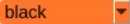
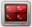

# 7. ROS+OpenCV Course

## 7.1 Color Threshold Adjustment

Various light sources can affect colors differently, leading to discrepancies in recognition. To address this issue, you can utilize LAB TOOL to adjust the color threshold, ensuring more accurate and consistent color recognition.

### 7.1.1 Open/Close LAB TOOL

> [!NOTE]
>
> * **The input command should be case sensitive, and the keywords can be complemented by "Tab" key.**
>
> * **Please strictly follow the below steps to open LAB TOOL, otherwise the tool cannot be opened.**

 During the color adjustment process, all steps are executed within the ROS2 environment.

1)  Power on the robot and connect it to the remote control software VNC. For detail informations, please refer to [1.4 Development Environment Setup and Configuration](https://wiki.hiwonder.com/projects/LanderPi/en/latest/docs/1_LanderPi_User_Manual.html#development-environment-setup-and-configuration).

2)  Click the terminal icon  in the system desktop to open a ROS2 command-line window.

3)  Enter the following command and press Enter to stop the app auto-start service.

```
~/.stop_ros.sh
```

4)  Enter the command to start the camera node:

```
ros2 launch peripherals depth_camera.launch.py
```

5)  Then open a new terminal, run the LAB Tool by entering the following command, and press **Enter**:

```
python3 /home/ubuntu/software/lab_tool/main.py
```


6. For the instructions and use of the interface buttons, you can refer to the subsequent content of this document. Click the **Quit** button at the bottom right to close it.

 

7)  After closing the LAB Tool, you need to restart the APP auto-start service by entering the corresponding command in the black terminal. Once the service starts, the robot arm will return to its initial position.

```
sudo systemctl restart start_app_node.service
```

> [!NOTE]
>
> **If the APP auto-start service is not running, certain app functions may not work properly. If the auto-start command has not been executed, restarting the robot will also automatically restart the app auto-start service.**

### 7.1.2 LAB TOOL Interface Introduction

LAB TOOL is divided into two parts, including image display area and recognition adjustment area.


1.  Image display area: at left is the processed image, and at right is the raw image.

> [!NOTE]
>
> **If the camera returned image doesn't occur, it is possible that the camera fails to connect. And you need to check the camera wiring.**

2.  In the recognition adjustment area, you can adjust the color threshold in this area. The functions of the buttons are listed below.

<table class="docutils-nobg" border="1">
<colgroup>
<col style="width: 35%" />
<col style="width: 64%" />
</colgroup>
<thead>
<tr>
<th style="text-align: center;"><strong>Icon</strong></th>
<th style="text-align: center;"><strong>Function</strong></th>
</tr>
</thead>
<tbody>
<tr>
<td style="text-align: center;"></td>
<td><p>Slider L, A and B are respectively used to adjust L, A and B components of the camera returned image.</p>
<p>The sliders at left represent min value, and the sliders at right represent max value.</p></td>
</tr>
<tr>
<td style="text-align: center;"></td>
<td>Select the color to be adjusted</td>
</tr>
<tr>
<td style="text-align: center;"></td>
<td>Delete the selected color</td>
</tr>
<tr>
<td style="text-align: center;"></td>
<td>Add new colors</td>
</tr>
<tr>
<td style="text-align: center;"></td>
<td>Save the adjusted value</td>
</tr>
<tr>
<td style="text-align: center;"></td>
<td>Switch the camera between depth camera and monocular camera</td>
</tr>
<tr>
<td style="text-align: center;"></td>
<td>Exit from the LAB TOOL</td>
</tr>
</tbody>
</table>

<p id="anchor_7_1_3"></p>

### 7.1.3 Adjusting Color Threshold

1)  Open LAB TOOL, and select the color in the drop down menu, and adjusting red color for an example in this section.


2)  Modify all **min** values of L, A and B as 0, and **max** values as 255.


3)  Put the red block within the camera frame. According to the LAB color space, adjust L, A and B components to approach the zone of the target color.


Red is around **+a** zone, hence you need to increase A component that is remain **max** value of A component the same and increase **min** value till the red block at left turns white and other area turns black.


4)  Based on the environment, modify the value of L and B. If the red appears too light, increase the **min** value of the L component. If it appears too dark, decrease the **max** value of the L component. If the red looks too warm, increase the **min** value of the B component. If it looks too cool, decrease the **max** value of the B component.


LAB Threshold Adjustment Parameter

| **Color Component** | **Range** | **Corresponding Color Zone** |
|:-------------------:|:---------:|:----------------------------:|
|          L          |   0~255   |    Black-White（-L ~ +L）    |
|          A          |   0~255   |     Green-Red（-a ~ +a）     |
|          B          |   0~255   |    Blue-Yellow（-b ~ +b）    |

5)  Click **Save** to save the adjusted color threshold parameter.


### 7.1.4 Add a New Recognition Color

Besides the built-in recognition colors, you can add new colors. For example, yellow.

1)  Open LAB TOOL and click **Add** button.


2)  Then fill in **yellow**, and click **OK**.


3. Select the color you added before in the drop-down menu.

    

4)  Face the camera to the yellow block. And then drag the slider of L, A and B to adjust the color threshold till the object at left turns white and other area turns black.


> [!NOTE]
>
> **For how to adjust the color threshold, please scroll up to [7.1.3 Adjusting Color Threshold](#anchor_7_1_3) in this document.**

5)  Click **Save** to save the adjusted color threshold parameter.


Once the adjustment is completed, press **Ctrl + C** to disable the camera service, then click **Close** to exit the interface.

## 7.2 Color Recognition

OpenCV will utilized to recognize red, green, and blue objects and the recognition result will be displayed on the live camera feed. Before starting the feature, please prepare three objects in these color: red, green, and blue.

### 7.2.1 Overview

First, capture the RGB image from the camera, then resize and apply Gaussian blur to the image, and convert the color space from RGB to Lab. For more details on the Lab color space, please refer to [OpenCV Computer Vision Course](https://drive.google.com/drive/folders/1lnKajY_LpkuutS4CfRIDVLnOHCB8zs6l?usp=sharing).

Based on this, color thresholds are used to identify the color of the object within the circle. A mask is then applied to the image, which involves selecting parts of the image, graphics, or objects to globally or locally block out areas in the image for processing.

After masking, morphological operations including opening and closing are performed on the object image to refine the results.

Opening operation: Involves erosion followed by dilation. Effect: Removes small objects, smooths object boundaries, and does not affect object area.

It also helps eliminate small noise and separates connected objects.

Erosion: Removes boundary pixels of an object, causing the edges to shrink inward. This operation can eliminate objects smaller than the structuring element.

Dilation: Expands the boundary pixels of an object by merging surrounding background pixels that are in contact with the object, causing the edges to grow outward.

Finally, the recognition results are overlaid on the return image.

### 7.2.2 Operations

> [!NOTE]
>
> **When entering commands, be sure to use correct case and spacing. You can use the Tab key to auto-complete keywords.**

1)  Power on the robot and connect it to a remote control tool like VNC. For detail informations, please refer to [1.4 Development Environment Setup and Configuration](https://wiki.hiwonder.com/projects/LanderPi/en/latest/docs/1_LanderPi_User_Manual.html#development-environment-setup-and-configuration).

2)  Click the terminal icon  in the system desktop to open a command-line window.

3)  Enter the command to disable the app auto-start service.

```
~/.stop_ros.sh
```

4)  Enter the command to start the camera node:

```
ros2 launch peripherals depth_camera.launch.py
```

5)  Open a new terminal, navigate to the program directory, and start the color detection feature by entering the following command:

```
cd ~/ros2_ws/src/example/example/color_detect && python3 color_detect_demo.py
```

6. The program will launch the camera image interface. For details on the detection steps, please refer to the section [7.2.3 Program Outcome](#anchor_7_2_3) in this document.

7. To exit the feature, press **Ctrl + C** in the terminal. If the program does not close successfully, try pressing **Ctrl + C** again.

<p id="anchor_7_2_3"></p>

### 7.2.3 Program Outcome

> [!NOTE]
>
> **After the feature starts, please ensure there is no other object containing the recognition color except the target object within the camera view, otherwise the recognition result will be affected.**

After the feature starts, put the objects within the camera's view. When the target object is detected, the program will highlight it with a circle of the corresponding color and display the color name in the lower-left corner of the window. The program can recognize objects in red, blue, and green.


### 7.2.4 Program Brief Analysis

The source code for this program is located at:

`/home/ubuntu/ros2_ws/src/example/example/color_detect/color_detect_demo.py`


* **Main Function**

Initializes the `ROS` node and create the color detection node named `color_detect_node`, subscribes to the image topic `/depth_cam/rgb/image_raw` with `image_callback` as its callback function, runs the color detection `main` function using multi-threading, and waits for the node to shut down.


* **Functions**

**1. Camera Callback Function**

 Reads the video stream from the topic and pushes frames into a queue to ensure real-time display.


**2. Color Detection `main` Function**

 Reads images from the queue and feeds them into the `run` function to obtain color-detected frames. Finally, displays the processed frames using `cv2`.


**3. YAML File Reading Function**


**4. Maximum Contour Function**

Takes contours detected by OpenCV as input, identifies the largest contour, and returns both the contour and its area.


**5. Color Detection Function**

Inputs an image and resizes it to `size(320, 240)` for faster processing, then applies Gaussian blur and converts the image to the LAB color space.


 Iterates through a list of target colors to detect the color of the largest contour.


 Filters out contours with an area smaller than 200. For valid contours, calculates contour coordinates and draws the detected color's position on the frame.


## 7.3 QR Code Creation and Recognition

This lesson is divided into two parts. The first part teaches how to create a QR code, and the second part focuses on recognizing the created QR code and decoding its information via the terminal.

### 7.3.1 QR Code Creation

* **Overview**

First, create an instance of the QR code tool and set its detailed parameters.

Next, obtain the user's data and fill it into the QR code.

Finally, generate a QR code image based on this data, display it in a window, and save it to the designated path.

* **Operations**

> [!NOTE]
>
> **When entering commands, be sure to use correct case and spacing. You can use the Tab key to auto-complete keywords.**

1)  Power on the robot and connect it to a remote control tool like VNC. For detail informations, please refer to [1.4 Development Environment Setup and Configuration](https://wiki.hiwonder.com/projects/LanderPi/en/latest/docs/1_LanderPi_User_Manual.html#development-environment-setup-and-configuration).

2)  Click the terminal icon  in the system desktop to open a ROS2 command-line window.

3)  Enter the command to disable the app auto-start service.

```
~/.stop_ros.sh
```

4)  Enter the following command to switch to the program directory and start the QR code creation program:

```
cd ~/ros2_ws/src/example/example/qrcode && python3 qrcode_creater.py
```

After launching the program, enter characters in the terminal to generate a QR code. For example, type ubuntu.

Press **Enter**, and a QR code containing the input data will be displayed.


5)  To exit the QR code window, press either the **ESC** key or the **q** key.

6)  You can re-display the QR code at any time by running the above command again in the terminal.

```
display ~/ros2_ws/src/example/example/qrcode/myQRcode.jpg
```

* **Program Brief Analysis**

The source code for this program is located at:

`/home/ubuntu/ros2_ws/src/example/example/qrcode/qrcode_creater.py`


**1. Creating a QR Code Tool Object**

Use the `qrcode` module to create the required object and set the parameters for the QR code.


The meanings of the parameters in the function above are as follows:

\(1\) `version` – an integer from 1 to 40 that controls the size of the QR code. If you want the program to determine the size automatically, set it to `None` and use the `fit` parameter.

\(2\) `error_correction` – controls the QR code's error correction capability. Possible values:

① `ERROR_CORRECT_L`: can correct approximately 7% or fewer errors.

② `ERROR_CORRECT_M`: default value, can correct approximately 15% or fewer errors.

③ `ERROR_CORRECT_H`: can correct approximately 30% or fewer errors.

\(3\) `box_size` – sets the number of pixels contained in each small square of the QR code.

\(4\) `border` – sets the number of squares in the border, which is the distance between the QR code and the edge of the image. Default is 4, which is the minimum specified by the standard.

**2. Generating a QR Code**

Use the `add_data` and `make` functions to input and encode the data, then generate the QR code image using the `make_image` function.


The parameters of the `make_image` function are as follows:

\(1\) `fill_color=(0, 0, 0)` – the color of the QR code itself, here set to black.

\(2\) `back_color=(255, 255, 255)` – the background color of the image, here set to white.

**3. Displaying the Image**

Convert the image color space using `cvtColor`, and then display it in a window using `imshow`.


**4. Saving the Image**

Save the generated QR code image using `imwrite` and print out the relevant information.


The parameters of the imwrite function are:

\(1\) `file_name` – the path where the image will be saved.

\(2\) `opencv_img` – the image to be saved.


### 7.3.2 QR Code Recognition

In the previous section, a QR code is created, which will be used to demonstrate recognizing the content of a QR code.

* **Overview**

First, create an instance of the QR code detector and load the required network structure and model weight files for detection.

Next, capture the video stream from the camera and perform detection on each frame.

Finally, when a QR code is detected, it will be highlighted with a bounding box, and the content of the QR code will be printed.

The source code for this program is located at:

`/home/ubuntu/ros2_ws/src/example/example/qrcode/qrcode_detecter.py`

* **Operations**

> [!NOTE]
>
> **When entering commands, be sure to use correct case and spacing. You can use the Tab key to auto-complete keywords.**

1)  Power on the robot and connect it to a remote control tool like VNC. For detail informations, please refer to [1.4 Development Environment Setup and Configuration](https://wiki.hiwonder.com/projects/LanderPi/en/latest/docs/1_LanderPi_User_Manual.html#development-environment-setup-and-configuration).

2)  Click the terminal icon  in the system desktop to open a ROS2 command-line window.

3)  Enter the command to disable the app auto-start service.

```
~/.stop_ros.sh
```

4)  Enter the command to start the camera node:

```
ros2 launch peripherals depth_camera.launch.py
```

5)  Open a new ROS2 terminal, navigate to the program directory, and start the QR code recognition program by entering the following command:

```
cd ~/ros2_ws/src/example/example/qrcode && python3 qrcode_detecter.py
```

To exit the feature, press **Ctrl + C** in the terminal. If the program does not close successfully, try pressing **Ctrl + C** again.

* **Program Outcome**

After starting the program, the camera feed window will appear. Place the QR code you created in previous section in front of the camera. The program will detect the QR code in the feed, highlight it with a bounding box, and print its content.


* **Program Brief Analysis**

The source code for this program is located at:

`/home/ubuntu/ros2_ws/src/example/example/qrcode/qrcode_detecter.py`


**1. Main Function**

 Initializes the `QRCodeDetectNode` with the node name `qrcode_detect`, waits for the ROS node to shut down, and deregisters the node upon closure.


**2. `QRCodeDetectNode` Class**

 Initializes the ROS node, sets parameters, and starts the `self.main` function.

 **Parameters:**

 `self.running`: Indicates whether detection is active.

 `self.model_path`: Path to the detection model.

 `self.image_queue`: Image queue.

`self.image_sub`: Subscriber to read camera frames.


 **Functions:**

 Camera callback function reads frames from the camera and places them into `self.image_queue`, automatically updating and discarding outdated images.


 Main function performs QR code detection. It checks `self.running` to determine whether to start detection.

If `True`, it reads images from `self.image_queue`, feeds them to the initialized detection model `self.qcd`, and finally prints the detected QR code content and draws bounding boxes around the detected codes.


## 7.4 Autonomous Patrolling

### 7.4.1 Overview

Firstly, the program will acquire the RGB image of the camera, scale the image, and perform Gaussian filtering on the image to convert the image color space from RGB into LAB. For more details on the Lab color space, please refer to [OpenCV Computer Vision Course](https://drive.google.com/drive/folders/1lnKajY_LpkuutS4CfRIDVLnOHCB8zs6l?usp=sharing).

Based on this, color thresholds are used to identify the color of the object within the circle. A mask is then applied to the image, which involves selecting parts of the image, graphics, or objects to globally or locally block out areas in the image for processing.

After masking, morphological operations including opening and closing are performed on the object image to refine the results.

Opening operation: Involves erosion followed by dilation. Effect: Removes small objects, smooths object boundaries, and does not affect object area.

It can remove small particle noise and separate objects that are stuck together.

Erosion: Removes boundary pixels of an object, causing the edges to shrink inward. This operation can eliminate objects smaller than the structuring element.

Dilation: Expands the boundary pixels of an object by merging surrounding background pixels that are in contact with the object, causing the edges to grow outward.

Finally, the recognition results are overlaid on the return image.

### 7.4.2 Operations

> [!NOTE]
>
> **When entering commands, be sure to use correct case and spacing. You can use the Tab key to auto-complete keywords.**

1)  Power on the robot and connect it to a remote control tool like VNC. For detail informations, please refer to [1.4 Development Environment Setup and Configuration](https://wiki.hiwonder.com/projects/LanderPi/en/latest/docs/1_LanderPi_User_Manual.html#development-environment-setup-and-configuration).

2)  Click the terminal icon  in the system desktop to open a command-line window.

3)  Enter the command to disable the app auto-start service.

```
~/.stop_ros.sh
```

4)  Enter the command to start the camera node:

```
ros2 launch app line_following_node.launch.py debug:=true
```

5)  Open a new terminal, navigate to the program directory, and start the autonomous patrolling feature by entering the following command:

```
ros2 service call /line_following/enter std_srvs/srv/Trigger {}
```

6)  Next, in the current terminal, switch to the program directory and start the autonomous patrolling feature by entering the following command:

```
ros2 service call /line_following/set_running std_srvs/srv/SetBool "{data: True}"
```

7)  Click on the line in the interface, select the corresponding color of the track, and the robot will start following the line.


8)  If you need to stop this feature, return to the terminal and enter the following command to stop it:

```
ros2 service call /line_following/exit std_srvs/srv/Trigger {}
```

### 7.4.3 Program Outcome

After starting the feature, the camera feed will appear. In the feed, the selected color track will be highlighted, and the robot will move along the track accordingly.


### 7.4.4 Program Brief Analysis

* **launch File Analysis**

The program file of the feature is located at:

`/home/ubuntu/ros2_ws/src/app/launch/line_following_node.launch.py`


**1. Path Retrieval**


Use `get_package_share_directory` to obtain the path of the package.

**2. Launch**


`controller_launch` launches the motion control launch file.

`depth_camera_launch` launches the depth camera.

`ms200_scan_launch` launches the Lidar.

**3. Node**

`line_following_node` is responsible for enabling the robot to follow lines.


* **Source Code Analysis**

The program file of the feature is located at:

`/home/ubuntu/ros2_ws/src/app/app/line_following.py`


> [!NOTE]
>
> **Before modifying the program, be sure to back up the original factory program. Do not modify the source code files directly. Incorrect parameter changes may cause the robot to behave abnormally and become irreparable!**

Based on the effects of the feature, the process logic has been outlined as shown in the diagram below:


First, the robot subscribes to the topic published by the camera node to acquire RGB images. Detect the line to be followed in the image and select it. By sampling its color, obtain the color threshold. Based on the line color information, extract the features of the line. Calculate the robot's offset relative to the line within the camera's field of view, and control the robot to move along the line, continuously correcting its position so that the line remains at the center of the view. Use the Lidar to detect obstacles and perform avoidance.

The flowchart below outlines the logic of the program based on this file.


The initialization function first defines several preset parameters, such as the **color threshold ratio**, **stop limit parameters**, and **angle swing parameters**, which can all affect the final recognition results. Next, the **color picker object** is defined, which is used for selecting colors in the feature, along with additional **Lidar obstacle avoidance** settings. Then comes the implementation of the `LineFollower` class, which mainly includes image preprocessing functions and the logic for line-following decisions.

**1. Functions**

`Main`:


Starts the line-following node.

**2. Class:**

`LineFollower`:


Sets the line-following color and ROI list.

`get_area_max_contour`:


Gets the contour with the largest area.

`Call`:


Performs color recognition based on the set color and provides feedback on the recognized image and angle.

`LineFollowingNode`:


Initializes parameters required for the program, calls the chassis and camera nodes, and starts services such as enter, exit, start, set color, get color, and set threshold.

`get_node_state`:


Sets the current node state.

`main`:


Reads the image and uses the mouse for color selection.

`mouse_callback`:


Mouse color selection callback function to obtain the pixel coordinates of the current mouse position.

`enter_srv_callback`:


Service for entering autonomous line-following reads camera and Lidar data and initializes actions.

`exit_srv_callback`:


Service for exiting autonomous line-following closes all reading nodes, resets PID, and stops line-following.

`set_target_color_srv_callback`:


Service to set the target line-following color.

`get_target_color_srv_callback`:


Service to get the target line-following color.

`set_running_srv_callback`:


Service to start the autonomous patrolling mode.

`set_threshold_srv_callback`:


Service to set the color threshold.

`lidar_callback`:


Lidar callback function processes the received data and determines whether to stop moving.

`image_callback`:


Camera callback function uses the received data to invoke the color picker and controls the robot's movement along the recognized line using PID.