# 8. ROS + Machine Learning Course

<p id="anchor_8_1"></p>

## 8.1 Machine Learning Basics

### 8.1.1 Introduction to Machine Learning

* **Overview**

Artificial Intelligence (AI) is a new technological science focused on the theories, methods, technologies, and applications used to simulate, extend, and augment human intelligence.

AI encompasses various fields such as machine learning, computer vision, natural language processing, and deep learning. Among them, machine learning is a subfield of AI, and deep learning is a specific type of machine learning.

Since its inception, AI has seen rapid development in both theory and technology, with expanding application areas, gradually evolving into an independent discipline.

* **What Machine Learning is**

Machine Learning is the core of AI and the fundamental approach to enabling machine intelligence. It is an interdisciplinary field involving probability theory, statistics, approximation theory, convex analysis, algorithmic complexity, and more.


The essence of machine learning lies in enabling computers to simulate or implement human learning behaviors in order to acquire new knowledge or skills, and reorganize existing knowledge structures to continuously improve performance. From a practical perspective, machine learning involves training models using data and making predictions with those models.

Take AlphaGo as an example—it was the first AI program to defeat a professional human Go player and later a world champion. AlphaGo operates based on deep learning, which involves learning the underlying patterns and hierarchical representations from sample data to gain insights.

* **Types of Machine Learning**

Machine learning is generally classified into supervised learning and unsupervised learning, with the key distinction being whether the dataset's categories or patterns are known.

**1. Supervised Learning**

Supervised learning provides a dataset along with correct labels or answers. The algorithm learns to map inputs to outputs based on this labeled data. This is the most common type of machine learning.

Labeled Data: Supervised learning uses training data that includes both input features and corresponding labels or outputs. Features describe the attributes of the data, while labels represent the target variable the model is expected to predict or classify. For instance, in image recognition, a large number of images of dogs can be labeled as "dog." The machine learns to recognize dogs in new images through this data.


Model Selection: Choosing the appropriate model to represent the relationship in data is crucial. Common models include linear regression, logistic regression, decision trees, support vector machines (SVM), and deep neural networks. The choice depends on the data characteristics and the specific problem.

Feature Engineering: This involves preprocessing and transforming raw data to extract meaningful features. It includes data cleaning, handling missing values, normalization or standardization, feature selection, and feature transformation. Good feature engineering enhances model performance and generalization.

Training and Optimization: Using labeled training data, the model is trained to fit the underlying relationships. This typically involves defining a loss function, selecting an appropriate optimization algorithm, and iteratively adjusting model parameters to minimize the loss. Common optimization methods include gradient descent and stochastic gradient descent.

Model Evaluation: After training, the model is evaluated to assess its performance on new data. Common metrics include accuracy, precision, recall, F1-score, and ROC curves. Evaluating the model ensures it is suitable for real-world applications.

In summary, supervised learning involves using labeled training data to build a model that can classify or predict unseen data. Key steps include model selection, feature engineering, model training and optimization, and performance evaluation. Together, these steps form the foundation of supervised learning.

**2. Unsupervised Learning**

Unsupervised learning involves providing the algorithm with data without labels or known answers. All data is treated equally, and the machine is expected to uncover hidden structures or patterns.

For example, in image classification, if you provide a set of images containing cats and dogs without any labels. The algorithm will analyze the data and automatically group the images into two categories—cat images and dog images—based on similarities.


### 8.1.2 Introduction to Machine Learning Libraries

* **Common Machine Learning Frameworks**

There are many machine learning frameworks available. The most commonly used include PyTorch, TensorFlow, PaddlePaddle, and MXNet.

**1. PyTorch**

Torch is an open-source machine learning framework under the BSD License, widely used for its powerful multi-dimensional array operations. PyTorch is a machine learning library based on Torch but offers greater flexibility, supports dynamic computation graphs, and provides a Python interface.

Unlike TensorFlow's static computation graphs, PyTorch uses dynamic computation graphs, which can be modified in real-time according to the needs of the computation. PyTorch allows developers to accelerate tensor operations using GPUs, build dynamic graphs, and perform automatic differentiation.


**2. Tensorflow**

TensorFlow is an open-source machine learning framework designed to simplify the process of building, training, evaluating, and saving neural networks. It enables the implementation of machine learning and deep learning concepts in the simplest way. With its foundation in computational algebra and optimization techniques,

TensorFlow allows for efficient mathematical computations. It can run on a wide range of hardware—from supercomputers to embedded systems—making it highly versatile. TensorFlow supports CPU, GPU, or both simultaneously. Compared to other frameworks, TensorFlow is best suited for industrial deployment, making it highly appropriate for use in production environments.


**3. PaddlePaddle**

PaddlePaddle, developed by Baidu, is China's first open-source, industrial-grade deep learning platform. It integrates a deep learning training and inference framework, a library of foundational models, end-to-end development tools, and a rich suite of supporting components. Built on years of Baidu's R&D and real-world applications in deep learning, PaddlePaddle is powerful and versatile.

In recent years, deep learning has achieved outstanding performance across many fields such as image recognition, speech recognition, natural language processing, robotics, online advertising, medical diagnostics, and finance.


**4. MXNet**

MXNet is another high-performance deep learning framework that supports multiple programming languages, including Python, C++, Scala, and R. It offers data flow graphs similar to those in Theano and TensorFlow and supports multi-GPU configuration. It also includes high-level components for model building, comparable to those in Lasagne and Blocks, and can run on nearly any hardware platform—including mobile devices.


MXNet is designed to maximize efficiency and flexibility. As an accelerated library, it provides powerful tools for developers to take full advantage of GPUs and cloud computing. MXNet supports distributed deployment via a parameter server and can scale almost linearly across multiple CPUs and GPUs.

## **8.2 Machine Learning Application**

### 8.2.1 Yolov11 Model

* **Introduction to the YOLO Series of Models**

**1. YOLO Series**

YOLO (You Only Look Once) is a One-stage, deep learning-based regression approach to object detection.

Before the advent of YOLOv1, the R-CNN family of algorithms dominated the object detection field. Although the R-CNN series achieved high detection accuracy, its Two-stage architecture limited its speed, making it unsuitable for real-time applications.

To address this issue, the YOLO series was developed. The core idea behind YOLO is to redefine object detection as a regression problem. It processes the entire image as input to the network and directly outputs Bounding Box coordinates along with their corresponding class labels. Compared to traditional object detection methods, YOLO offers faster detection speed and higher average precision.

**2. Yolov11**

Yolov11 builds upon previous versions of the YOLO model, delivering significant improvements in both detection speed and accuracy.

A typical object detection algorithm can be divided into four modules: the input module, the backbone network, the neck network, and the head output module. Analyzing Yolov11 according to these modules reveals the following enhancements:

(1) Input Module: During model training, Yolov11 uses Mosaic data augmentation to improve training speed and accuracy. It also introduces adaptive anchor box calculation and adaptive image scaling.

(2) Backbone Network: Yolov11 incorporates the Focus and CSP structures.

(3) Neck Network: Similar to YOLOv4, Yolov11 adopts the FPN+PAN architecture in this part, though there are differences in implementation details.

(4) Head Output Module: While the anchor box mechanism in Yolov11 remains consistent with YOLOv4, improvements include the use of the GIOU_Loss loss function and DIOU_NMS for filtering predicted bounding boxes.

* **Yolov11 Model Structure**

**1. Components**

(1) Convolutional Layer: Feature Extraction

Convolution is the process where an entity at multiple past time points does or is subjected to the same action, influencing its current state. Convolution can be divided into convolution and multiplication.

Convolution can be understood as flipping the data, and multiplication as the accumulation of the influence that past data has on the current data. The data flipping is done to establish relationships between data points, facilitating the calculation of accumulated influence with a proper reference.

In Yolov11, the data to be processed is images, which are two-dimensional in computer vision. Accordingly, the convolution is two-dimensional convolution. The purpose of 2D convolution is to extract features from images. To perform 2D convolution, it is necessary to understand the convolution kernel.

The convolution kernel is the unit region over which convolution calculation is performed each time. The unit is pixels, and the convolution sums the pixel values within the region. Typically, convolution is done by sliding the kernel across the image, and the kernel size is manually set.

When performing convolution, depending on the desired effect, the image borders may be padded with zeros or extended by a certain number of pixels, then the convolution results are placed back into the corresponding positions in the image. For example, a 6×6 image is first expanded to 7×7, then convolved with the kernel, and finally the results are filled back into a blank 6×6 image.


(2) Pooling Layer: Feature Amplification

The pooling layer, also called downsampling layer, is usually used together with convolution layers. After convolution, pooling performs further sampling on the extracted features. Pooling includes various types such as global pooling, average pooling, max pooling, etc., each producing different effects.

To make it easier to understand, max pooling is used here as an example. Before understanding max pooling, it is important to know about the filter, which is like the convolution kernel—a manually set region that slides over the image and selects pixels within the area.


Max pooling keeps the most prominent features and discards others. For example, starting with a 6×6 image, applying a 2×2 filter for max pooling produces a new image with reduced size.


(3) Upsampling Layer: Restoring Image Size

Upsampling can be understood as "reverse pooling." After pooling, the image size shrinks, and upsampling restores the image back to its original size. However, only the size is restored, the pooled features are also modified accordingly.

For example, starting with a 6×6 image, applying a 3×3 filter for upsampling produces a new image.


(4) Batch Normalization Layer: Data Regularization

Batch normalization means rearranging the data neatly, which reduces the computational difficulty of the model and helps map data better into the activation functions.

Batch normalization reduces the loss rate of features during each calculation, retaining more features for the next computation. After multiple computations, the model's sensitivity to the data increases.


(5) ReLU Layer: Activation Function

Activation functions are added during model construction to introduce non-linearity. Without activation functions, each layer is essentially a matrix multiplication. Every layer's output is a linear function of the previous layer's input, so no matter how many layers the neural network has, the output is just a linear combination of the input. This prevents the model from adapting to actual situations.

There are many activation functions, commonly ReLU, Tanh, Sigmoid, etc. Here, ReLU is used as an example. ReLU is a piecewise function that replaces all values less than 0 with 0 and keeps positive values unchanged.


(6) ADD Layer: Tensor Addition

Features can be significant or insignificant. The ADD layer adds feature tensors together to enhance the significant features.


(7) Concat Layer: Tensor Concatenation

The Concat layer concatenates feature tensors to combine features extracted by different methods, thereby preserving more features.


**2. Composite Elements**

When building a model, using only the basic layers mentioned earlier can lead to overly lengthy, disorganized code with unclear hierarchy. To improve modeling efficiency, these basic elements are often grouped into modular units for reuse.

(1) Convolutional Block

A convolutional block consists of a convolutional layer, a batch normalization layer, and an activation function. The process follows this order: convolution → batch normalization → activation.


(2) Strided Sampling and Concatenation Unit（Focus）

The input image is first divided into multiple large regions. Then, small image patches located at the same relative position within each large region are concatenated together to form a new image. This effectively splits the input image into several smaller images. Finally, an initial sampling is performed on the images using a convolutional block.

As shown in the figure below, for a 6×6 image, if each large region is defined as 2×2, the image can be divided into 9 large regions, and each contains 4 small patches.

By taking the small patches at position 1 from each large region and concatenating them, a 3×3 image can be formed. The patches at other positions are concatenated in the same way.  
Ultimately, the original 6×6 image is decomposed into four 3×3 images.


(3) Residual Block

The residual block enables the model to learn subtle variations in the image. Its structure is relatively simple and involves merging data from two paths.

In the first path, two convolutional blocks are used to extract features from the image. In the second path, the original image is passed through directly without convolution. Finally, the outputs from both paths are added together to enhance learning.

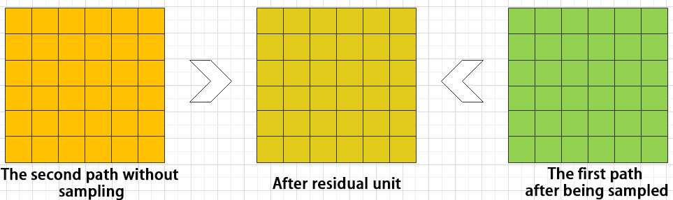


(4) Composite Convolutional Block

In Yolov11, a key feature of the composite convolutional block is its customizable design, allowing convolutional blocks to be configured as needed. This structure also uses two paths whose outputs are merged.

The first path contains a single convolutional layer for feature extraction, while the second path includes 2𝑥+1 convolutional blocks followed by an additional convolutional layer. After sampling and concatenation, batch normalization is applied to standardize the data, followed by an activation function. Finally, a convolutional block is used to process the combined features.


(5) Composite Residual Convolutional Block

The composite residual convolutional block modifies the composite convolutional block by replacing the 2𝑥 convolutional blocks with 𝑥 residual blocks. In Yolov11, this block is also customizable, allowing residual blocks to be tailored according to specific requirements.


(6) Composite Pooling Block

The output from a convolutional block is simultaneously passed through three separate max pooling layers, while an additional unprocessed copy is preserved. The resulting four feature maps are then concatenated and passed through a convolutional block. By processing data with the composite pooling block, the original features can be significantly enhanced and emphasized.


**3. Structure**

Yolov11 is composed of three main parts, each responsible for producing output at different spatial resolutions. These outputs are processed differently according to their respective sizes. The structure of Yolov11's output is shown as the diagram below.

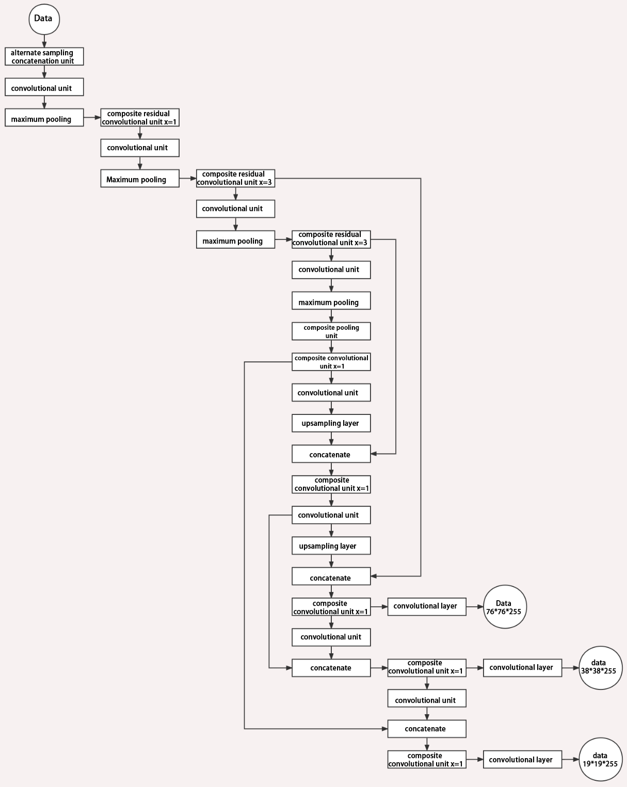


### 8.2.2 Yolov11 Workflow

This section explains the model's processing flow using the concepts of prior boxes, predicted boxes, and anchor boxes.

* **Prior Box**

When an image is fed into the model, predefined regions of interest must be specified. These regions are marked using prior boxes, which serve as initial bounding box templates indicating potential object locations in the image.


* **Predicted Box**

Predicted boxes are generated by the model as output and do not require manual input. When the first batch of training data is fed into the model, the predicted boxes are automatically created. The center points of predicted boxes tend to be located in areas where similar objects frequently appear.


* **Anchor Box**

Since predicted boxes may have deviations in size and location, anchor boxes are introduced to correct these predictions.

Anchor boxes are positioned based on the predicted boxes. By influencing the generation of subsequent predicted boxes, anchor boxes are placed around their relative centers to guide future predictions.


* **Project Process**

Once the bounding box annotations are complete, prior boxes appear on the image. When the image data is input into the model, predicted boxes are generated based on the locations of the prior boxes. Subsequently, anchor boxes are generated to adjust the predicted results. The weights from this round of training are then updated in the model.

With each new training iteration, the predicted boxes are influenced by the anchor boxes from the previous round. This process is repeated until the predicted boxes gradually align with the prior boxes in both size and location.


<p id="anchor_8_2_3"></p>

### 8.2.3 Image Collection and Annotation

Training a YOLOv11 model requires a large dataset, so you must first collect and annotate images to prepare for model training.

In this example, the demonstration uses traffic signs as target objects.

* **Image Collection**

1. Power on the robot and connect it to a remote control tool like VNC.

2. Click the terminal icon  in the system desktop to open a command-line window.

3. Stop the app auto-start service by entering the following command:

```
~/.stop_ros.sh
```

4. Start the depth camera service with command.

```
ros2 launch peripherals depth_camera.launch.py
```

5. Open a new command-line terminal and enter the command to create a directory for storing your dataset.

```
mkdir -p ~/my_data
```

6. Then, launch the tool by entering the following command.

```
cd ~/software/collect_picture && python3 main.py
```


The **save number** in the top-left corner of the tool interface shows the ID of the saved image. The **existing** shows how many images have already been saved.

7)  Click Choose to change the save path to the **my_data** folder created before.


8. After selecting the target directory, click **Choose**.

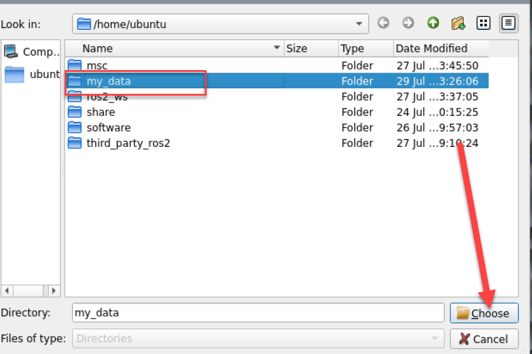

9. Place the target object within the camera view and click the **Save (space)** button or press the spacebar to save the current camera frame.


After clicking on **Save (space)** or the spacebar, a folder named **JPEGImages** will be automatically created under the path `/home/ubuntu/my_data` to store the images.

> [!NOTE]
>
> **To improve model reliability, capture the target object from various distances, angles, and tilts.**

10. After collecting images, click the **Quit** button to close the tool.

 

11. Then press **Ctrl + C** in all opened terminal windows to exit—this completes the image collection process.

* **Image Annotation**

Once the images are collected, they need to be annotated. Annotation is essential for creating a functional dataset, as it tells the training model which parts of the image correspond to which categories. This allows the model to later identify those categories in new, unseen images.

> [!NOTE]
>
> **When entering commands, be sure to use correct case and spacing. You can use the Tab key to auto-complete keywords.**

1. Open a terminal and enter the command to start the image annotation tool:

```
python3 ~/software/labelImg/labelImg.py
```

Below is a table of common shortcut keys:

|                         **Function**                         | **Shortcut Key** |    **Function**     |
| :----------------------------------------------------------: | :--------------: | :-----------------: |
|  |      Ctrl+U      | Select image folder |
| 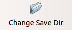 |      Ctrl+R      | Select save folder  |
| 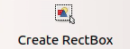 |        W         | Create bounding box |
|  |      Ctrl+S      |   Save annotation   |
| 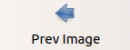 |        A         |   Previous image    |
|  |        D         |     Next image      |

2. Click the button  to open the folder where your images are stored. In this tutorial, select the directory used for image collection.


3. Click **Open**  to open the folder.


4)  Then click the **Change Save Dir** button  and select the annotation save folder, which is the **Annotations** directory located under the same path as the image collection.


5)  Click **Open** 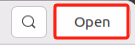 to return to the annotation interface.

6)  Press the **W** key to begin creating a bounding box.

7)  Move the mouse to the desired location and hold the left mouse button to draw a box that covers the entire object. Release the left mouse button to finish drawing the box.


8)  In the popup window, name the category of the object, such as **left** in this section. After naming, click **OK** or press **Enter** to save the label.


9. Press **Ctrl + S** to save the annotation for the current image.

10. Press the key **D** to move to the next image and repeat steps 7 to 9 to complete all annotations. Click the close button at the top-right corner of the tool to exit .

11. Open a new terminal and enter the following command to view the annotation files:

```
cd my_data/Annotations && ls
```

<p id="anchor_8_2_4"></p>

### 8.2.4 Data Format Conversion

* **Preparation**

Before starting this section, make sure you have completed image collection and annotation. For detailed steps, refer to the section [8.2.3 Image Collection and Annotation](#anchor_8_2_3).

Before training images using the YOLOv11 model, you need to define class labels and convert the annotation data into the appropriate format.

* **Data Format Conversion**

Before starting this section, make sure you have completed image collection and annotation.

> [!NOTE]
>
> **When entering commands, be sure to use correct case and spacing. You can use the Tab key to auto-complete keywords.**

1)  Open a new terminal and enter the following command to open the file: 

> [!NOTE]
>
> **You can create a file if the file cannot be found.**

```
vim ~/my_data/classes.names
```

2)  Press the key **i**, and enter the annotated class name **left** in the text file. If you have multiple class names, list each one on a new line.

3)  After editing, press **Esc**, type the command `:wq`, and press **Enter** to save and exit.

> [!NOTE]
>
> **The class names here must match the labels used in the labelImg annotation tool exactly.**

4. Next, return to the terminal and run the following command to convert the annotation format:

```
python3 ~/software/xml2yolo.py --data ~/my_data --yaml ~/my_data/data.yaml
```

> [!NOTE]
>
> **Make sure the paths to ~/software/xml2yolo.py and my_data match your actual file structure!**

This command uses three main parameters:

1. `xml2yolo.py`: A script that converts annotations from XML format to the YOLOv11 format. Make sure the path is correct.

2. `my_data`: The directory containing your annotated dataset.

3. `data.yaml`: A YAML file that specifies how the dataset is split and configured for training. It will be saved inside the **my_data** folder.

The following image shows a generated example of **data.yaml**:


The items listed after `names` represent the types of labels. The `nc` field specifies the total number of label categories. `train` refers to the training set—a commonly used term in deep learning that indicates the data used for model training. The parameter following it is the path to the training images. Similarly, `val` refers to the validation set, which is used to verify the model's performance during the training process, and the path that follows indicates where the validation data is located. These file paths need to be set based on the actual location of your data. For example, if you plan to speed up the training process later by moving the dataset from the robot to a local PC or a cloud server, you'll need to update the `train` and `val` paths accordingly to reflect their new locations.

Finally, an XML file will be generated under the **~/my_data** folder to record the path location of the currently split dataset. Similarly, you can change the save path by modifying the last parameter in step 4 to `~/my_data/data.yaml`. Please remember the path of this file, as it will be used later for model training.

### 8.2.5 Model Training

> [!NOTE]
>
> **When entering commands, be sure to use correct case and spacing. You can use the Tab key to auto-complete keywords.**

* **Preparation**

After converting the dataset format, you can proceed to the model training phase. Before starting, make sure the dataset with the correct format is ready. For details, refer to the section **[8.2.4 Data Format Conversion](#anchor_8_2_4)**.

* **Model Training**

1. Power on the robot and connect it to a remote control tool like VNC.

2. Click the terminal icon  in the system desktop to open a command-line window.

3. Enter the following command and press Enter to go to the specific directory.

```
cd /home/ubuntu/third_party_ros2/yolo/yolov11
```

4. Enter the command to start training the model.

```
python3 train.py --img 640 --batch 64 --epochs 300 --data ~/my_data/data.yaml --weights yolov11n.pt
```

In the command, the parameters stands for:  
`--img`: image size  
`--batch`: number of images per batch  
`--epochs`: number of training iterations  
`--data`: path to the dataset  
`--weights`: path to the pre-trained model

You can modify the parameters above based on your specific needs. To improve model accuracy, consider increasing the number of training epochs. Note that this will also increase training time.

If you see the following output, it means the training process is running successfully.


After training is complete, the terminal will display the path where the trained model files are saved. The training results are stored in the directory of **Yolov11/runs/train/exp**.

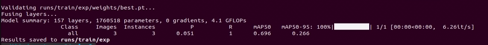

> [!NOTE]
>
> **The generated folder name under runs/train/ may vary. Please locate it accordingly.**

### 8.2.6 Traffic Sign Model Training

> [!NOTE]
>
> **The product names and reference paths mentioned in this document may vary. Please refer to the actual setup for accurate information.** 

When dealing with large datasets, it is not recommended to train models directly on the robot's onboard motherboard due to I/O speed and memory limitations. Instead, it is advised to use a PC with a dedicated GPU, which follows the same training steps, only requiring proper environment configuration.

If the traffic sign recognition in the autonomous driving scenario is not performing well, you can train a custom model by following the instructions in this section.

In the following instructions, screenshots may show different robot hostnames as different robots have similar environment setups. Simply follow the command steps in the document as described — it does not affect the execution.

* **Preparation**

1)  Prepare a laptop for training. If you're using a desktop PC, make sure you have a Wi-Fi adapter, mouse, and other necessary peripherals.

2)  Use the previously learned method to install and open the remote control tool VNC.

* **Operation Steps**

**1. Image Collection**

(1) Power on the robot and connect it to a remote control tool like VNC.

(2) Click the terminal icon  in the system desktop to open a command-line window.

(3) Execute the following command to stop the app service:

```
~/.stop_ros.sh
```

(4) Enter the following command to create a new directory for storing the dataset:

```
mkdir -p ~/my_data
```

(5) Execute the following command to start the camera service:

```
ros2 launch peripherals depth_camera.launch.py
```

(6) Open a new terminal, navigate to the image collection tool directory, and run the image collection script:

```
cd software/collect_picture && python3 main.py
```


The **save number** in the top-left corner of the tool interface shows the ID of the saved image. The **existing** shows how many images have already been saved.

(7) Change the save path to **/home/ubuntu/my_data**, which will also be used in later steps.


(8) Place the target object (traffic sign) within the camera's view. Click the **Save (space)** button or the spacebar to save the current camera frame. After pressing it, both save number and existing counters will increase by 1. This helps track the current image ID and total image count in the folder.


After clicking **Save (space)**, a folder named **JPEGImages** will be automatically created under the path **/home/ubuntu/my_data** to store the images.


> [!NOTE]
>
> * **To improve model reliability, capture the target object from various distances, angles, and tilts.**
>
> * **To ensure stable recognition, collect at least 200 images per category during the data collection phase.**

(9) After collecting images, click the **Quit** button to close the tool.


**2. Image Annotation**

> [!NOTE]
>
> **When entering commands, be sure to use correct case and spacing. You can use the Tab key to auto-complete keywords.**

(1) Power on the robot and connect it to a remote control tool like VNC.

(2) Click the terminal icon  in the system desktop to open a command-line window.

(3) Execute the following command to stop the app service:

```
~/.stop_ros.sh
```

(4) Open a new terminal and enter the following command.

```
python3 software/labelImg/labelImg.py
```

(5) After opening the image annotation tool. Below is a table of common shortcut keys:

|                         **Function**                         | **Shortcut Key** |    **Function**     |
| :----------------------------------------------------------: | :--------------: | :-----------------: |
|  |      Ctrl+U      | Select image folder |
|  |      Ctrl+R      | Select save folder  |
|  |        W         | Create bounding box |
|  |      Ctrl+S      |   Save annotation   |
|  |        A         |   Previous image    |
|  |        D         |     Next image      |

(6) Use the shortcut **Ctrl + U**, set the image storage directory to [/home/ubuntu/my_data/JPEGImages/](/home/ubuntu/my_data/JPEGImages/), and click **Open**.

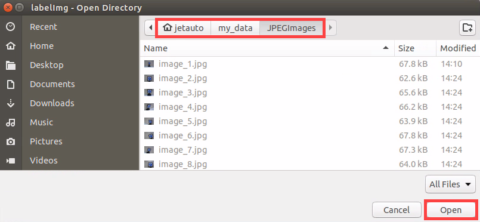

(7) Use the shortcut **Ctrl + R**, set the annotation data storage directory to [/home/ubuntu/my_data/Annotations/](/home/ubuntu/my_data/Annotations/), and click **Open**. The **Annotations** folder will be automatically generated when collecting images.


(8) Press the **W** key to begin creating a bounding box. Move the mouse to the desired location and hold the left mouse button to draw a box that covers the entire object. Release the left mouse button to finish drawing the box.


(9) In the popup window, name the category of the object, such as **right** in this section. After naming, click **OK** or press **Enter** to save the label.


(10) Press **Ctrl + S** to save the annotation for the current image.

(11) Refer to Step 9 to complete the annotation of the remaining images.

(12) Click the system status bar icon  to open the file manager and navigate to the directory `/home/ubuntu/my_data/Annotations/`. This is the same dataset path where the images were saved during data collection. You will be able to view the annotation files corresponding to each image in this folder.

**3. Generating Related Files**

(1) Click the terminal icon  in the system desktop to open a command-line window.

(2) Enter the following command to open the file for editing:

```
vim ~/my_data/classes.names
```

(3) Press the **i** key to enter edit mode and add the class names for the target recognition objects. If you need to add multiple class names, enter one class name per line.


> [!NOTE]
>
> **The class names here must match the labels used in the labelImg annotation tool exactly.**

(4) After editing, press **Esc**, then type `:wq` to save and close the file.


(5) Next, enter the command to convert the data format and press **Enter**:

```
python3 ~/software/collect_picture/xml2yolo.py --data ~/my_data --yaml ~/my_data/data.yaml
```

In this command, **xml2yolo.py** converts the annotated files into xml format, splits the dataset, and creates the training and validation sets.

The output paths depend on the actual storage location of the folders in your robot's file system. Paths may vary across devices, but the generated **data.yaml** file will correspond to your annotated dataset.

**4. Model Training**

(1) Click the terminal icon  in the system desktop to open a command-line window.

(2) Then enter the command to navigate to the specific directory.

```
cd /home/ubuntu/third_party_ros2/yolo/yolov11
```

(3) Enter the command to start training the model.

```
python3 train.py --img 640 --batch 8 --epochs 300 --data ~/my_data/data.yaml --weights yolov11n.pt
```

In the command, `--img` specifies the image size, `--batch` indicates the number of images input per batch, `--epochs` refers to the number of training iterations, representing how many times the machine learning model will go through the dataset. This value should be optimized based on the actual performance of the final model. In this example, the number of training epochs is set to 8 for quick testing. If the computer system is more powerful, this value can be increased to achieve better training results. `--data` is the path to the dataset, which refers to the folder containing the manually annotated data. `--weights` indicates the path to the pre-trained model weights. This specifies which .pt weight file the training process is based on. It's important to note whether you are using Yolov11n.pt, Yolov11s.pt, or another version.

You can modify the parameters above based on your specific needs. To improve model accuracy, consider increasing the number of training epochs. Note that this will also increase training time.

(4) When the following options appear as shown in the image, enter **3** and press **Enter**.


If you see the following output, it means the training process is running successfully.


After the model training is completed, the terminal will print the path where the output files are saved. Please make sure to record this path, as it will be needed later in the **Generating TensorRT Model Engine** step.

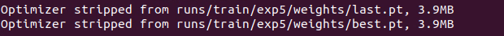


> [!NOTE]
>
> **If you run the training process multiple times, the folder name such as exp5 may change (e.g., exp2, exp3, etc.).  Subsequent steps will depend on the name of this folder, so please pay close attention to it.**

* **Using the Model**

1. Enter the following command and press Enter to stop the APP service:

```
~/.stop_ros.sh
```

2. Enter the following command to navigate to the directory where the corresponding feature's program is located:

```
cd /home/ubuntu/third_party_ros2/yolo/yolov11
```

3. Enter the command to view the models in the current directory. Pretrained models are already provided, as shown below.

The content in the red box, where `best_traffic.pt` is the trained `best.pt` model. If you have your own trained model, you can also import it into this directory.

```
ls
```


4. Next, enter the command to check the program that calls the model, and manually modify the model name.

```
vim ~/ros2_ws/src/yolov11_detect/yolov11_detect/yolov11_detect_demo.py
```

5. Change `MODEL_DEFAULT_NAME` to `best_traffic`, and then type `:wq` to save and exit.


6. After that, enter the command to run the model-calling program. A depth camera needs to be connected.

```
ros2 launch yolov11_detect yolov11_detect_demo.launch.py
```

## 8.3 MediaPipe Human-Robot Interaction

### 8.3.1 MediaPipe Introduction and Getting Started

* **Overview of MediaPipe**

MediaPipe is an open-source framework designed for building multimedia machine learning pipelines. It supports cross-platform deployment on mobile devices, desktops, and servers, and can leverage mobile GPU acceleration. MediaPipe is compatible with inference engines such as TensorFlow and TensorFlow Lite, allowing seamless integration with models from both platforms. Additionally, it offers GPU acceleration on mobile and embedded platforms.


* **Advantages and Disadvantages of MediaPipe**

**1. Advantages of MediaPipe**

(1) MediaPipe supports various platforms and languages, including iOS, Android, C++, Python, JAVAScript, Coral, etc.

(2) Swift running. Models can run in real-time.

(3) Models and codes are with high reuse rate.

**2. Disadvantages of MediaPipe**

(1) For mobile devices, MediaPipe will occupy 10M or above.

(2) As it greatly depends on Tensorflow, you need to alter large amount of codes if you want to change it to other machine learning frameworks, which is not friendly to machine learning developer.

(3) It adopts static image which can improve efficiency, but make it difficult to find out the errors.

* **Workflow of Using MediaPipe**

The figure below shows how to use MediaPipe. The solid line represents the part to coded, and the dotted line indicates the part not to coded. MediaPipe can offer the result and the function realization framework quickly.


**1. Dependency**

MediaPipe utilizes OpenCV to process video, and uses FFMPEG to process audio data. Furthermore, it incorporates other essential dependencies, including OpenGL/Metal, Tensorflow, and Eigen.

For seamless usage of MediaPipe, we suggest gaining a basic understanding of OpenCV, please refer to the tutorials under the directory of [OpenCV Computer Vision Course](https://drive.google.com/drive/folders/1lnKajY_LpkuutS4CfRIDVLnOHCB8zs6l?usp=sharing).

**2. MediaPipe Solutions**

Solutions is based on the open-source pre-constructed sample of TensorFlow or TFLite. MediaPipe Solutions is built upon a framework, which provides 16 Solutions, including face detection, Face Mesh, iris, hand, posture, human body and so on.

* **Websites for MediaPipe Learning**

MediaPipe Official Website: [https://developers.google.com/mediapipe](https://developers.google.com/mediapipe)

MediaPipe Wiki：[http://i.bnu.edu.cn/wiki/index.php?title=Mediapipe](http://i.bnu.edu.cn/wiki/index.php?title=Mediapipe)

MediaPipe github：[https://github.com/google/mediapipe](https://github.com/google/mediapipe)

dlib Official Website: [http://dlib.net/](http://dlib.net/)

dlib github: [https://github.com/davisking/dlib](https://github.com/davisking/dlib)

### 8.3.2 Background Segmentation

In this lesson, MediaPipe's Selfie Segmentation model is used to segment trained models from the background and then apply a virtual background, such as face or hand.

* **Program Introduction**

First, the MediaPipe selfie segmentation model is imported, and real-time video is obtained by subscribing to the camera topic.

Next, the image is processed and the segmentation mask is drawn onto the background image. Bilateral filtering is used to improve the segmentation around the edges.

Finally, the background is replaced with a virtual one.

* **Operation Steps**

1. Power on the robot and connect it to a remote control tool like VNC. For detail informations, please refer to [1.4 Development Environment Setup and Configuration](https://wiki.hiwonder.com/projects/LanderPi/en/latest/docs/1_LanderPi_User_Manual.html#development-environment-setup-and-configuration).

2. Click the terminal icon  in the system desktop to open a ROS2 command-line window.

3. Enter the command to disable the app auto-start service.

```
~/.stop_ros.sh
```

4. Enter the command to start the camera node:

```
ros2 launch peripherals depth_camera.launch.py
```

5)  Open a new command-line terminal, enter the command, and press **Enter** to run the program.

```
cd ~/ros2_ws/src/example/example/mediapipe_example && python3 self_segmentation.py
```

6)  To exit this feature, press the **Esc** key in the image window to close the camera feed.

7)  To exit the feature, press **Ctrl + C** in the terminal. If the program does not close successfully, try pressing **Ctrl + C** again.

* **Project Outcome**

After the feature is started, the screen will show a completely gray virtual background. Once a hand enters the frame, it will be segmented from the background.


* **Program Brief Analysis**

The program file of the feature is located at:

`~/ros2_ws/src/example/example/mediapipe_example/self_segmentation.py`

**1. Functions**

`main`:

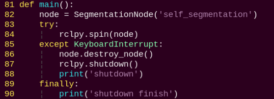

Starts the background control node and executes the segmentation task.

**2. Class**

`SegmentationNode`:


`init`: Initializes the parameters required for background segmentation, calls the image callback function, and starts the model inference function.

`image_callback`:


Image callback function, used to read data from the camera node and push it into the queue.

`main`:

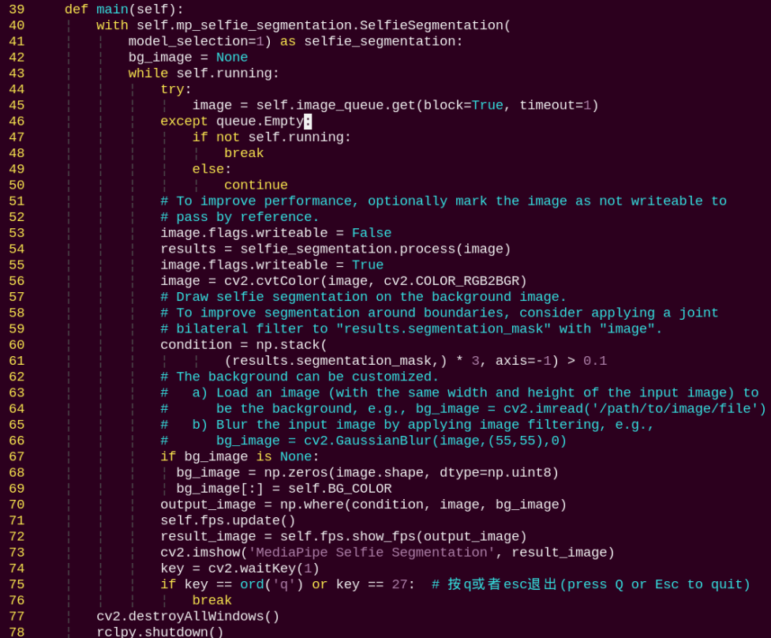

Reads the model from Mediapipe, inputs the image into the model, obtains the output image, and finally displays it using OpenCV.

### 8.3.3 3D Object Detection

* **Program Introduction**

First, import MediaPipe's 3D Objection and subscribe to the topic messages to obtain the real-time camera feed.

Next, apply preprocessing steps such as image flipping, and then perform 3D object detection on the images.

Finally, draw 3D bounding boxes on the detected objects in the image. In this section, a cup is used as the object for demonstrating.

* **Operation Steps**

1. Power on the robot and connect it to a remote control tool like VNC. For detail informations, please refer to [1.4 Development Environment Setup and Configuration](https://wiki.hiwonder.com/projects/LanderPi/en/latest/docs/1_LanderPi_User_Manual.html#development-environment-setup-and-configuration).

2. Click the terminal icon  in the system desktop to open a ROS2 command-line window.

3. Enter the command to disable the app auto-start service.

```
~/.stop_ros.sh
```

4. Enter the command to start the camera node:

```
ros2 launch peripherals depth_camera.launch.py
```

5)  Open a new command-line terminal, enter the command, and press **Enter** to run the program.

```
cd ~/ros2_ws/src/example/example/mediapipe_example && python3 objectron.py
```

6)  To exit this feature, press the **Esc** key in the image window to close the camera feed.

7)  To exit the feature, press **Ctrl + C** in the terminal. If the program does not close successfully, try pressing **Ctrl + C** again.

* **Project Outcome**

Once the program starts, a 3D bounding box will appear around the detected object in the camera view. Currently, four types of objects are supported: cup with handle, shoe, chair, and camera. For example, when detecting a cup, the effect is shown as follows:


* **Program Brief Analysis**

The program file of the feature is located at:

`~/ros2_ws/src/example/example/mediapipe_example/objectron.py`

**1. Functions**

`main`:


Used to start the 3D detection node.

**2. Class**

`ObjectronNode`:


`init`: Initializes the parameters required for 3D recognition, calls the image callback function, and starts the model inference function.

`image_callback`:


Image callback function, used to read data from the camera node and push it into the queue.

`main`:


Loads the model from MediaPipe, feeds the image into the model, and then uses OpenCV to draw object edges and display the results.

### 8.3.4 Face Detection

In this program, MediaPipe's face detection model is utilized to detect human face within the camera image.

MediaPipe Face Detection is a high-speed face detection solution that provides six key landmarks and supports multiple faces. It is based on BlazeFace, a lightweight and efficient face detector optimized for mobile GPU inference.

* **Program Introduction**

First, import the MediaPipe face detection model and subscribe to the topic messages to obtain the real-time camera feed.

Next, use OpenCV to process the image, including flipping and converting the color space.

Next, the system compares the detection confidence against the model's minimum threshold to determine if face detection is successful. Once a face is detected, the system will analyze the set of facial features. Each face is represented as a detection message that contains a bounding box and six key landmarks, including right eye, left eye, nose tip, mouth center, right ear region, and left ear region.

Finally, the face will be outlined with a bounding box, and the six key landmarks will be marked on the image.

* **Operation Steps**

1. Power on the robot and connect it to a remote control tool like VNC. For detail informations, please refer to [1.4 Development Environment Setup and Configuration](https://wiki.hiwonder.com/projects/LanderPi/en/latest/docs/1_LanderPi_User_Manual.html#development-environment-setup-and-configuration).

2. Click the terminal icon  in the system desktop to open a ROS2 command-line window.

3. Enter the command to disable the app auto-start service.

```
~/.stop_ros.sh
```

4. Enter the command to start the camera node:

```
ros2 launch peripherals depth_camera.launch.py
```

5)  Open a new command-line terminal, enter the command, and press **Enter** to run the program.

```
cd ~/ros2_ws/src/example/example/mediapipe_example && python3 face_detect.py
```

6)  To exit this feature, press the **Esc** key in the image window to close the camera feed.

7)  To exit the feature, press **Ctrl + C** in the terminal. If the program does not close successfully, try pressing **Ctrl + C** again.

* **Project Outcome**

Once the feature is started, the depth camera detects a face and highlights it with a bounding box in the returned video feed.


* **Program Brief Analysis**

The program file of the feature is located at:

`~/ros2_ws/src/example/example/mediapipe_example/face_detect.py`

**1. Functions**

`main`:


Launches the face detection node.

**2. Class**

`FaceDetectionNode`:


`init`: Initializes the parameters required for face recognition, calls the image callback function, and starts the model inference function.

`image_callback`:


Image callback function, used to read data from the camera node and push it into the queue.

`main`:


Loads the model from MediaPipe, feeds the image into it, and uses OpenCV to draw facial keypoints and display the returned video feed.

### 8.3.5 3D Face Detection

In this program, MediaPipe Face Mesh is utilized to detect human face within the camera image.

MediaPipe Face Mesh is a powerful model capable of estimating 468 3D facial features, even when deployed on a mobile device. It uses machine learning (ML) to infer 3D facial structure. This model leverages a lightweight architecture and GPU acceleration to deliver critical real-time performance.

Additionally, the solution is bundled with a face transformation module that bridges the gap between facial landmark estimation and practical real-time augmented reality (AR) applications. It establishes a metric 3D space and uses the screen positions of facial landmarks to estimate face transformations within that space. The face transformation data consists of common 3D primitives, including a facial pose transformation matrix and a triangulated face mesh.

* **Program Introduction**

First, it's important to understand that the machine learning pipeline used here, which can be thought of as a linear process, consists of two real-time deep neural network models working in tandem: One is a detector that processes the full image to locate faces. The other is a face landmark model that operates on those locations and uses regression to predict an approximate 3D surface.

For the 3D face landmarks, transfer learning was applied, and a multi-task network was trained. This network simultaneously predicts 3D landmark coordinates on synthetic rendered data and 2D semantic contours on annotated real-world data. As a result, the network is informed by both synthetic and real-world data, allowing for accurate 3D landmark prediction.

The 3D landmark model takes cropped video frames as input, without requiring additional depth input. It outputs the positions of 3D points along with a probability score indicating whether a face is present and properly aligned in the input.

After importing the face mesh model, you can subscribe to the topic messages to obtain the real-time camera feed.

The image is processed through operations such as flipping and color space conversion. Then, by comparing the face detection confidence to a predefined threshold, it determines whether a face has been successfully detected.

Finally, a 3D mesh is rendered over the detected face in the video feed.

* **Operation Steps**

1. Power on the robot and connect it to a remote control tool like VNC. For detail informations, please refer to [1.4 Development Environment Setup and Configuration](https://wiki.hiwonder.com/projects/LanderPi/en/latest/docs/1_LanderPi_User_Manual.html#development-environment-setup-and-configuration).

2. Click the terminal icon  in the system desktop to open a ROS2 command-line window.

3. Enter the command to disable the app auto-start service.

```
   ~/.stop_ros.sh
```

4. Enter the command to start the camera node:

```
ros2 launch peripherals depth_camera.launch.py
```

5)  Open a new command-line terminal, enter the command, and press **Enter** to run the program.

```
cd ~/ros2_ws/src/example/example/mediapipe_example && python3 face_mesh.py
```

6)  To exit this feature, press the **Esc** key in the image window to close the camera feed.

7)  To exit the feature, press **Ctrl + C** in the terminal. If the program does not close successfully, try pressing **Ctrl + C** again.

* **Project Outcome**

Once the feature is started, the depth camera detects a face and highlights it with a bounding box in the returned video feed.


* **Program Brief Analysis**

The program file of the feature is located at:

`~/ros2_ws/src/example/example/mediapipe_example/face_mesh.py`

**1. Functions**

`main`:


Used to launch the 3D face detection node.

**2. Class**

`FaceMeshNode`:


`init`: Initializes the parameters required for 3D face detection, calls the image callback function, and starts the model inference function.

`image_callback`:


Image callback function, used to read data from the camera node and push it into the queue.

`main`:


Loads the model from MediaPipe, feeds the image into it, and uses OpenCV to draw facial keypoints and display the returned video feed.

### 8.3.6 Hand Keypoint Detection

In this lesson, MediaPipe's hand detection model is used to display hand keypoints and the connecting lines between them on the returned image.

MediaPipe Hands is a high-fidelity hand and finger tracking model. It uses machine learning (ML) to infer 21 3D landmarks of a hand from a single frame.

* **Program Introduction**

First, it's important to understand that MediaPipe's palm detection model utilizes a machine learning pipeline composed of multiple models, which is a linear model, similar to an assembly line. The model processes the entire image and returns an oriented hand bounding box. The hand landmark model then operates on the cropped image region defined by the palm detector and returns high-fidelity 3D hand keypoints.

After importing the hand detection model, the system subscribes to topic messages to acquire real-time camera images.

The images are then processed with flipping and color space conversion, which greatly reduces the need for data augmentation for the hand landmark model.

In addition, the pipeline can generate crops based on the hand landmarks recognized in the previous frame. The palm detection model is only invoked to re-locate the hand when the landmark model can no longer detect its presence.

Next, the system compares the detection confidence against the model's minimum threshold to determine if hand detection is successful.

Finally, it detects and draws the hand keypoints on the output image.

* **Operation Steps**

1. Power on the robot and connect it to a remote control tool like VNC. For detail informations, please refer to [1.4 Development Environment Setup and Configuration](https://wiki.hiwonder.com/projects/LanderPi/en/latest/docs/1_LanderPi_User_Manual.html#development-environment-setup-and-configuration).

2. Click the terminal icon  in the system desktop to open a ROS2 command-line window.

3. Enter the command to disable the app auto-start service.

```
~/.stop_ros.sh
```

4. Enter the command to start the camera node:

```
ros2 launch peripherals depth_camera.launch.py
```

5)  Open a new command-line terminal, enter the command, and press **Enter** to run the program.

```
cd ~/ros2_ws/src/example/example/mediapipe_example && python3 hand.py
```

6)  To exit this feature, press the **Esc** key in the image window to close the camera feed.

7)  To exit the feature, press **Ctrl + C** in the terminal. If the program does not close successfully, try pressing **Ctrl + C** again.

* **Project Outcome**

After starting the feature, once the depth camera detects a hand, the returned image will display the hand landmarks along with the connections between them.


* **Program Brief Analysis**

The program file of the feature is located at:

`~/ros2_ws/src/example/example/mediapipe_example/hand.py`

**1. Functions**

`main`:


Used to launch the 3D face detection node.

**2. Class**

`HandNode`:


`init`: Initializes the parameters required for hand keypoints detection, calls the image callback function, and starts the model inference function.

`image_callback`:


Image callback function, used to read data from the camera node and push it into the queue.

`main`:


Loads the model from MediaPipe, feeds the image into it, and uses OpenCV to draw hand's keypoints and display the returned video feed.

### 8.3.7 Body Keypoint Detection

In this lesson, MediaPipe's pose detection model is used to detect body landmarks and display them on the video feed.

MediaPipe Pose is a high-fidelity body pose tracking model. Powered by BlazePose, it infers 33 3D landmarks across the full body from RGB input. This research also supports the ML Kit Pose Detection API.


* **Program Introduction**

First, import the pose detection model.

Then, the program applys image preprocessing such as flipping and converting the color space. By comparing against a minimum detection confidence threshold, it determines whether the human body is successfully detected.

Next, it uses a minimum tracking confidence threshold to decide whether the detected pose can be reliably tracked. If not, the model will automatically re-invoke detection on the next input image.

The pipeline first identifies the region of interest (ROI) containing the person's pose in the frame using a detector. The tracker then uses the cropped ROI image as input to predict pose landmarks and segmentation masks within that area. For video applications, the detector is only invoked when necessary—such as for the first frame or when the tracker fails to identify a pose from the previous frame. For all other frames, the ROI is derived from the previously tracked landmarks.

After importing the MediaPipe pose detection model, you can subscribe to the topic messages to obtain the real-time video stream from the camera.

Finally, it identifies and draws the body landmarks on the image.

* **Operation Steps**

1. Power on the robot and connect it to a remote control tool like VNC. For detail informations, please refer to [1.4 Development Environment Setup and Configuration](https://wiki.hiwonder.com/projects/LanderPi/en/latest/docs/1_LanderPi_User_Manual.html#development-environment-setup-and-configuration).

2. Click the terminal icon  in the system desktop to open a ROS2 command-line window.

3. Enter the command to disable the app auto-start service.

```
~/.stop_ros.sh
```

4. Enter the command to start the camera node:

```
ros2 launch peripherals depth_camera.launch.py
```

5)  Open a new command-line terminal, enter the command, and press **Enter** to run the program.

```
cd ~/ros2_ws/src/example/example/mediapipe_example && python3 pose.py
```

6)  To exit this feature, press the **Esc** key in the image window to close the camera feed.

7)  To exit the feature, press **Ctrl + C** in the terminal. If the program does not close successfully, try pressing **Ctrl + C** again.

* **Project Outcome**

After the program is launched, the depth camera performs human pose estimation and displays the detected keypoints and their connections on the video feed.


* **Program Brief Analysis**

The program file of the feature is located at:

`~/ros2_ws/src/example/example/mediapipe_example/pose.py`

**1. Functions**

`main`:


Used to launch the 3D face detection node.

**2. Class**

`PoseNode`:


`init`: Initializes the parameters required for body keypoints detection, calls the image callback function, and starts the model inference function.

`image_callback`:


Image callback function, used to read data from the camera node and push it into the queue.

`main`:


Loads the model from MediaPipe, feeds the image into it, and uses OpenCV to draw facial keypoints and display the returned video feed.

### 8.3.8 Fingertip Trajectory Recognition

The robot uses MediaPipe's hand detection model to recognize palm joints. Once a specific hand gesture is detected, the robot locks onto the fingertip in the image and begins tracking it, drawing the movement trajectory of the fingertip.

* **Program Introduction**

First, the MediaPipe hand detection model is called to process the camera feed.

Next, the image is flipped and processed to detect hand information within the frame. Based on the connections between hand landmarks, the finger angles are calculated to identify specific gestures.

Finally, once the designated gesture is recognized, the robot starts tracking and locking onto the fingertip, while displaying its movement trajectory in the video feed.

* **Operation Steps**

> [!NOTE]
>
> **When entering commands, be sure to use correct case and spacing. You can use the Tab key to auto-complete keywords.**

1. Power on the robot and connect it to a remote control tool like VNC. For detail informations, please refer to [1.4 Development Environment Setup and Configuration](https://wiki.hiwonder.com/projects/LanderPi/en/latest/docs/1_LanderPi_User_Manual.html#development-environment-setup-and-configuration).

2. Click the terminal icon  in the system desktop to open a ROS2 command-line window.

3. Enter the command to disable the app auto-start service.

```
~/.stop_ros.sh
```

4. Enter the command to start the camera node:

```
ros2 launch peripherals depth_camera.launch.py
```

5)  Open a new command-line terminal, enter the command, and press **Enter** to run the program.

```
cd ~/ros2_ws/src/example/example/mediapipe_example && python3 hand_gesture.py
```

6)  The program will launch the camera image interface. For details on the detection steps, please refer to the section [Project Outcome](#project_outcome_7) in this document.

7)  To exit this feature, press the **Esc** key in the image window to close the camera feed.

8)  To exit the feature, press **Ctrl + C** in the terminal. If the program does not close successfully, try pressing **Ctrl + C** again.

<p id="project_outcome_7"></p>

* **Project Outcome**

After starting the feature, place your hand within the camera's field of view. Once the hand is detected, key points of the hand will be marked in the returned image.

If the gesture **1** is recognized, the returned image will begin recording the movement trajectory of the index fingertip. If the gesture 5 is recognized, the recorded trajectory will be cleared.


* **Program Brief Analysis**

The program file of the feature is located at:

`~/ros2_ws/src/example/example/mediapipe_example/hand_gesture.py`


> [!NOTE]
>
> **Before modifying the program, be sure to back up the original factory program. Do not modify the source code files directly. Incorrect parameter changes may cause the robot to behave abnormally and become irreparable!**

Based on the effects of the feature, the process logic has been outlined as shown in the diagram below:


As shown in the figure above, this feature works by capturing images through the **camera** and performing **preprocessing** on them. The preprocessing includes **converting the color space** to facilitate recognition. **Key points of the hand** are then extracted from the processed images. Different gestures are identified through logical analysis, such as calculating angles between key points. Finally, the **gesture trajectory** is drawn on the live camera feed.

The flowchart below outlines the logic of the program based on this file.


From the figure above, the program's logical flow is mainly divided into the initialization functions and the recognition processing functions, with important parts marked by a star. The following documentation is organized according to this program flowchart.

**1. Functions**

`main`:


The main function is used to start the fingertip trajectory recognition node.

`get_hand_landmarks`:


Converts the normalized data from MediaPipe into pixel coordinates.

`hand_angle`:


After extracting the hand landmarks into the `results` variable, the landmarks need to be logically processed to determine the type of each finger, such as thumb or index finger. The `hand_angle` function takes the `landmarks(results)` collection as input and calculates the angles between the key points using the `vector_2d_angle` function. The elements of the `landmarks` collection correspond to the key points shown in the figure below:


Taking the thumb as an example, the `vector_2d_angle` function is used to calculate the angles between its joints. The keypoints `landmarks[3]`, `landmarks[4]`, `landmarks[0]`, and `landmarks[2]` correspond to points 3, 4, 0, and 2 in the hand keypoint diagram. By calculating the angles formed by these joint points at the fingertip, the posture features of the thumb can be determined. The processing logic for the joints of the other fingers is similar.

To ensure accurate recognition, the parameters and basic logic of angle addition and subtraction in the hand_angle function can be kept at their **default settings**.

`h_gesture`:


After identifying the types of fingers on the hand and determining their positions in the image, different gestures can be recognized by implementing the `h_gesture` function.

In the example `h_gesture` function shown above, the parameters `thr_angle = 65`, `thr_angle_thenum = 53`, and `thr_angle_s = 49` are the angle thresholds used to determine the gesture logic points. These values were chosen based on testing, as recognition is most stable at these settings. It is not recommended to change them. If the recognition results are unsatisfactory, adjustments within ±5 degrees are acceptable. The `angle_list[0,1,2,3,4]` corresponds to the types of the five fingers of the hand.

Taking the `"one"` gesture as an example:


The code above shows the logic for recognizing the `"one"` gesture based on finger angles. `angle_list[0] > 5` checks whether the thumb's joint angle in the image is greater than 5. `angle_list[1] < thr_angle_s` checks whether the index finger's joint angle is smaller than the preset threshold `thr_angle_s. angle_list[2] < thr_angle` checks whether the middle finger's joint angle is smaller than the preset threshold thr_angle. The remaining two fingers, `angle_list[3] and angle_list[4]`, are processed using similar logic. When all these conditions are met, the current hand gesture is recognized as `"one"`. The recognition of other gestures follows a similar approach.

Each gesture has its own logic, but the overall framework is largely the same, and other gestures can be referenced based on this method.

`draw_points`:


Draw the currently detected hand shape along with all its key points.

**2. Class**

`State`:


An enumeration class used to represent the current state of the program.

`HandGestureNode`:


`HandGestureNode` is the fingertip trajectory recognition node. It contains three functions: an initialization function, a `main` function, and an image callback function. The `init` function initializes all required components and calls the camera node.

<p id="anchor_8_3_9"></p>

### 8.3.9 Body Gesture Control

Using the human pose estimation model trained with the MediaPipe machine learning framework, the system detects the human pose in the camera feed and marks the relevant joint positions. Based on this, multiple actions can be recognized in sequence, allowing direct control of the robot through body gestures.

From the robot's first-person perspective:  
Raising the left arm causes the robot to move a certain distance to the right. Raising the right arm causes the robot to move a certain distance to the left. Raising the left leg causes the robot to move forward a certain distance. Raising the right leg causes the robot to move backward a certain distance.

* **Program Introduction**

First, the MediaPipe human pose estimation model is imported, and the camera feed is accessed by subscribing to the relevant topic messages.

MediaPipe is an open-source framework designed for building multimedia machine learning pipelines. It supports cross-platform deployment on mobile devices, desktops, and servers, and can leverage mobile GPU acceleration. It also supports inference engines for TensorFlow and TensorFlow Lite.

Next, using the constructed model, key points of the human torso are detected in the camera feed. These key points are connected to visualize the torso, allowing the system to determine the body posture.

Finally, if the user performs a specific action, the robot responds accordingly.

* **Operation Steps**

> [!NOTE]
>
> **When entering commands, be sure to use correct case and spacing. You can use the Tab key to auto-complete keywords.**

1. Power on the robot and connect it to a remote control tool like VNC. For detail informations, please refer to [1.4 Development Environment Setup and Configuration](https://wiki.hiwonder.com/projects/LanderPi/en/latest/docs/1_LanderPi_User_Manual.html#development-environment-setup-and-configuration).

2. Click the terminal icon  in the system desktop to open a ROS2 command-line window.

3. Enter the command to disable the app auto-start service.

```
~/.stop_ros.sh
```

4. Entering the following command and press **Enter** to start the feature.

```
ros2 launch example body_control.launch.py
```

5)  To exit this feature, press the **Esc** key in the image window to close the camera feed.

6)  To exit the feature, press **Ctrl + C** in the terminal. If the program does not close successfully, try pressing **Ctrl + C** again.

* **Project Outcome**

After starting the feature, stand within the camera's field of view. When a human body is detected, the returned video feed will display the key points of the torso along with lines connecting them.

From the robot's first-person perspective, raising the left arm causes the robot to turn left, raising the right arm causes the robot to turn right, raising the left leg causes the robot to move forward, and raising the right leg causes the robot to move backward.


* **Program Brief Analysis**

The program file of the feature is located at:

`~/ros2_ws/src/example/example/body_control/include/body_control.py`


> [!NOTE]
>
> **Before modifying the program, be sure to back up the original factory program. Do not modify the source code files directly. Incorrect parameter changes may cause the robot to behave abnormally and become irreparable!**

Based on the effects of the feature, the process logic has been outlined as shown in the diagram below:


By capturing images through the camera and performing demonstration actions, the car executes the corresponding movements. From the robot's first-person perspective, raising the left arm makes the robot turn left, raising the right arm makes the robot turn right, raising the left leg makes the robot move forward, and raising the right leg makes the robot move backward.

The flowchart below outlines the logic of the program based on this file.

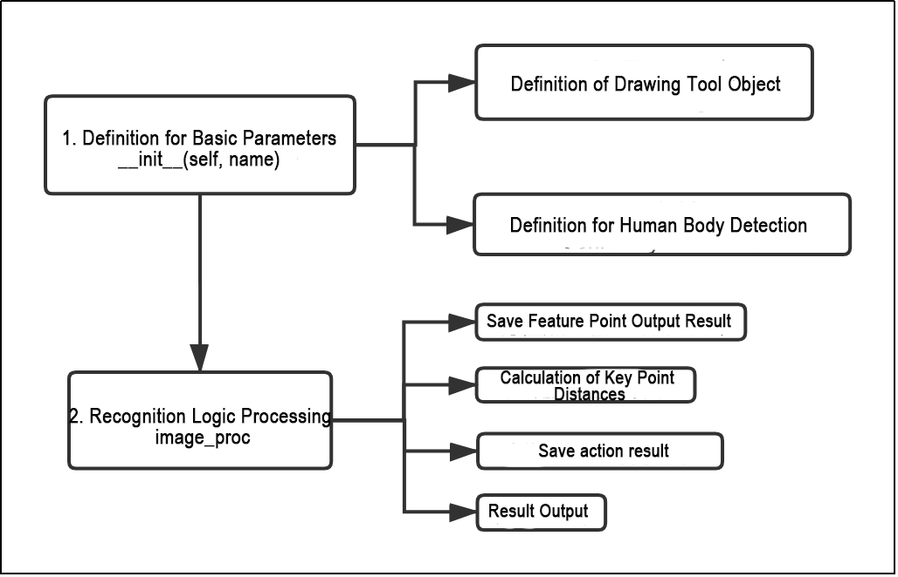

The initialization function `__init__(self.name)` defines the relevant parameters, including the definition of the image tool object `self.drawing`, which is used to draw the detected feature points, as well as the body detection object `self.body_detector`. After that, logical recognition is performed on the detected feature points. The output results are processed by applying conditions based on the distances between key points. The detected actions are stored, and the final output is sent to the car, enabling it to perform the corresponding movement.

**1. Functions**

`main`:


Starts the body motion control node.

`get_joint_landmarks`:

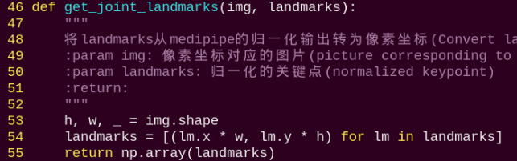

Converts the detected information into pixel coordinates.

`joint_distance`:


Calculates the distances between joints based on pixel coordinates.

**2. Class**


This class represents the body control node.

`init`: Initializes the parameters required for body control, subscribes to the camera image topic, initializes the servos, chassis, buzzer, motors, and finally starts the `main` function within the class.

`get_node_state`:


Sets the current initialization state of the node.

`shutdown`:


Callback function for program exit, used to terminate detection.

`image_callback`:


Image topic callback function, processes images and places them into a queue.

`move`:


Motion strategy function, controls the robot's movement according to the detected body actions.

`buzzer_warn`:


Buzzer control function, triggers buzzer alerts.

`image_proc`:

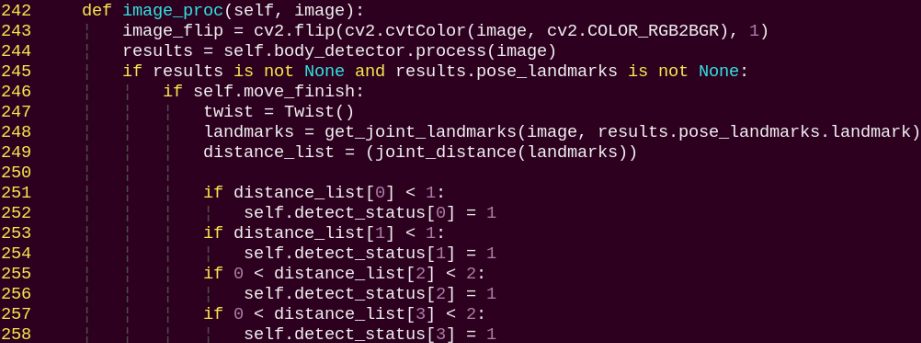

Body recognition function, uses the model to draw human keypoints and performs movements according to the detected posture.

`main`:


The main function within the `BodyControlNode` class, responsible for feeding images into the recognition function and displaying the returned frames.

### 8.3.10 Body Gesture Control with RGB Fusion

The depth camera is fused with RGB, allowing the system to perform both color recognition and body-gesture control. Based on the section [8.3.9 Body Gesture Control](#anchor_8_3_9) in this document, this session incorporates color recognition to determine the control target. Only when a person wearing a specified color is detected, which can be set through color calibration, their body gestures can be used to control the robot.

If a person wearing the specified color is not detected, the robot cannot be controlled. This allows precise targeting of the person who can control the robot.

* **Program Introduction**

First, the MediaPipe human pose estimation model is imported, and the camera feed is accessed by subscribing to the relevant topic messages.

Next, based on the constructed model, the key points of the human torso in the camera feed are detected, and lines are drawn between the key points to visualize the torso and determine the body posture. The center of the body is calculated based on all key points.

Finally, if the detected posture is "hands on hips," the system uses the clothing color to identify the control target, and the robot enters control mode. When the person performs specific gestures, the robot responds accordingly.

* **Operation Steps**

> [!NOTE]
>
> **When entering commands, be sure to use correct case and spacing. You can use the Tab key to auto-complete keywords.**

1. Power on the robot and connect it to a remote control tool like VNC. For detail informations, please refer to [1.4 Development Environment Setup and Configuration](https://wiki.hiwonder.com/projects/LanderPi/en/latest/docs/1_LanderPi_User_Manual.html#development-environment-setup-and-configuration).

2. Click the terminal icon  in the system desktop to open a ROS2 command-line window.

3. Enter the command to disable the app auto-start service.

```
~/.stop_ros.sh
```

4. Enter the following command and press **Enter** to start the feature.

```
ros2 launch example body_and_rgb_control.launch.py
```

5)  To exit this feature, press the **Esc** key in the image window to close the camera feed.

6)  To exit the feature, press **Ctrl + C** in the terminal. If the program does not close successfully, try pressing **Ctrl + C** again.

* **Project Outcome**

After starting the feature, stand within the camera's field of view. When a person is detected, the camera feed will display the torso key points, lines connecting the points, and the body's center point.

Step 1: Adjust the camera slightly higher and maintain a certain distance so that the full body can be captured.

Step 2: When the person to be controlled appears in the camera feed, pose with hands on hips. If the buzzer beeps briefly once, the robot completes the calibration of the body center and clothing color and enters control mode.


Step 3: From the robot's first-person perspective, performing specific gestures causes the robot to move accordingly. Raise the left arm to control the robot moving to the right, and raise the right arm to control the robot moving to the left.

Raise the left leg to control the robot moving forward, and raise the right leg to control the robot moving backward.


Step 4: If a person wearing a different color enters the camera's field of view, they will not be able to control the robot.


* **Program Brief Analysis**

The program file of the feature is located at:

`~/ros2_ws/src/example/example/body_control/include/body_and_rgb_control.py`


> [!NOTE]
>
> **Before modifying the program, be sure to back up the original factory program. Do not modify the source code files directly. Incorrect parameter changes may cause the robot to behave abnormally and become irreparable!**

Based on the effects of the feature, the process logic has been outlined as shown in the diagram below:


The camera captures the live feed to detect the body's key points. First, the system checks for a hands-on-hips pose. Then, it verifies the person by clothing color to ensure the same individual is being tracked. If confirmed, it monitors specific body gestures, such as raising the left arm, right arm, left leg, or right leg, to make the robot move accordingly. If the person does not match, the system resumes key point detection.

The flowchart below outlines the logic of the program based on this file.


As shown in the figure above, the program first initializes the `BodyControlNode` class, setting default parameters, including the definition of the drawing tool object, the body detection object, and the initialization of pose states and counting parameters. The program then processes the incoming images. It first detects and outputs key body landmarks, calculates joint angles (e.g., for the arms) to calibrate the "hands-on-hips" pose, and performs color matching on the detected key points to determine whether the person has been previously calibrated. Finally, it monitors demonstration actions to control the robot's movement, such as raising arms or legs.

**1. Functions**

`main`:


Starts the RGB-based body gesture control node.

`get_body_center`:


Obtains the currently detected body contour.

`get_joint_landmarks`:


Converts the detected information into pixel coordinates.

`get_dif`:


Compares the clothing color on the detected body contour.

`joint_angle`:


Calculates the angles between detected body joints.

`joint_distance`:


Calculates the distances between joints based on pixel coordinates.

**2. Class**


This class represents the body control node.

`init`: Initializes the parameters required for body control, subscribes to the camera image topic, initializes the servos, chassis, buzzer, motors, and finally starts the main function within the class.

`get_node_state`:


Sets the current initialization state of the node.

`shutdown`:


Callback function for program exit, used to terminate detection.

`image_callback`:


Image topic callback function, processes images and places them into a queue.

`move`:

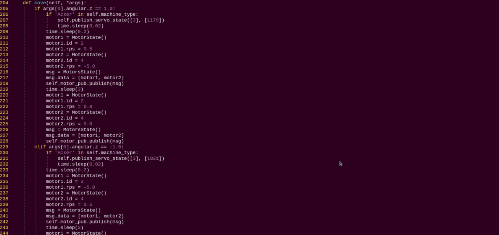

Motion strategy function, controls the robot's movement according to the detected body actions.

`buzzer_warn`:


Buzzer control function, triggers buzzer alerts.

`image_proc`:


Body recognition function that calls the model to detect and draw key points of the human body, then performs color recognition by reading the color information from different body contours. Finally, it determines the detected color and executes corresponding movements based on the recognized body posture.

`main`:


The main function within the `BodyControlNode` class, responsible for feeding images into the recognition function and displaying the returned frames.

### 8.3.11 Human Pose Detection

In this program, human pose estimation model from the MediaPipe machine learning framework is used to detect human poses. When the robot detects a person has fallen, it will trigger an alert and perform a left-right twisting motion.

* **Program Introduction**

First, the MediaPipe human pose estimation model is imported, and the camera feed is accessed by subscribing to the relevant topic messages.

Next, the image is flipped and processed to detect human body information within the frame. Based on the connections between human keypoints, the system calculates the body height to determine body movements.

Finally, if a **fall** is detected, the robot will trigger an alert and move forward and backward.

* **Operation Steps**

> [!NOTE]
>
> **When entering commands, be sure to use correct case and spacing. You can use the Tab key to auto-complete keywords.**

1. Power on the robot and connect it to a remote control tool like VNC. For detail informations, please refer to [1.4 Development Environment Setup and Configuration](https://wiki.hiwonder.com/projects/LanderPi/en/latest/docs/1_LanderPi_User_Manual.html#development-environment-setup-and-configuration).

2. Click the terminal icon  in the system desktop to open a ROS2 command-line window.

3. Enter the command to disable the app auto-start service.

```
~/.stop_ros.sh
```

4. Enter the following command and press **Enter** to start the feature.

```
ros2 launch example fall_down_detect.launch.py
```

5)  To exit this feature, press the **Esc** key in the image window to close the camera feed.

6)  To exit the feature, press **Ctrl + C** in the terminal. If the program does not close successfully, try pressing **Ctrl + C** again.

* **Project Outcome**

After starting the feature, make sure you are fully within the camera's field of view. When you are detected, the keypoints of your body will be marked on the live feed.

When the robot recognizes a fall posture, it will continuously sound an alert and repeatedly move forward and backward as a warning.


* **Program Brief Analysis**

The program file of the feature is located at:

`~/ros2_ws/src/example/example/body_control/include/fall_down_detect.py`


> [!NOTE]
>
> **Before modifying the program, be sure to back up the original factory program. Do not modify the source code files directly. Incorrect parameter changes may cause the robot to behave abnormally and become irreparable!**

Based on the effects of the feature, the process logic has been outlined as shown in the diagram below:


The camera captures images, and the robot identifies the keypoints of the human body. By determining whether the current posture is a fall, the robot will continuously sound the buzzer with a beep and move backward if a fall is detected. Otherwise, the buzzer will only emit a single beep.

The flowchart below outlines the logic of the program based on this file.


**1. Functions**

`main`:


Starts the body motion control node.

`get_joint_landmarks`:


Converts the detected information into pixel coordinates.

`height_cal`:


Calculates the body height based on the detected information.

**2. Class**


It is the fall detection node.

`init`: Initializes the parameters required for body control, subscribes to the camera image topic, initializes the chassis, buzzer, motors, and finally starts the main function within the class.

`get_node_state`:


Sets the current initialization state of the node.

`shutdown`:


Callback function for program exit, used to terminate detection.

`image_callback`:


Image topic callback function, processes images and places them into a queue.

`move`:


Motion strategy function, controls the robot's movement according to the detected body height.

`buzzer_warn`:


Buzzer control function, triggers buzzer alerts.

`image_proc`:


Body recognition function, uses the model to draw human keypoints and performs movements according to the detected body height.

`main`:


The main function within the `FallDownDetectNode` class, responsible for feeding images into the recognition function and displaying the returned frames.

## 8.4 Autonomous Driving

<p id="anchor_8_4_1"></p>

### 8.4.1 Map Layout and Course Props Installation

* **Overview**

This document is prepared for the autonomous driving feature of Hiwonder's robots. Before executing the autonomous driving feature, ensure that the hardwares installed on the robot, including depth camera and chassis motors, meet the required specifications and are functioning properly, and that the battery is fully charged.

* **Field Setup and Notes**

Before starting the autonomous driving feature, the environment needs to be set up properly. The detailed setup steps are as follows.

**1. Setup Steps**

(1) Map Layout

First, lay out the map on a flat and spacious surface, ensuring that the surrounding lighting is sufficient, as shown below.


Place the robot at the starting point. During movement, the robot will follow the yellow line around the perimeter of the map for line following, and it can adjust its posture in real-time according to the lane markings.

(2) Traffic Signs Placement

For the autonomous driving feature, a total of four traffic signs need to be placed: two for going straight, one for right turn, and one for stop. The specific placement and the initial position of the robot can be referred to in the diagram below. Note: placement must be accurate!


Go straight: instructs the robot to move forward.


Turn right: instructs the robot to turn right.


Stop: instructs the robot to enter a stop state.


The traffic signs provide guidance to the robot during its drive. Upon recognizing a traffic sign, the robot will perform the corresponding action. Additionally, when approaching a pedestrian crosswalk, the robot will slow down.

(3) Traffic Light Placement

In the autonomous driving feature, one traffic light needs to be placed at the specified position shown in the figure.

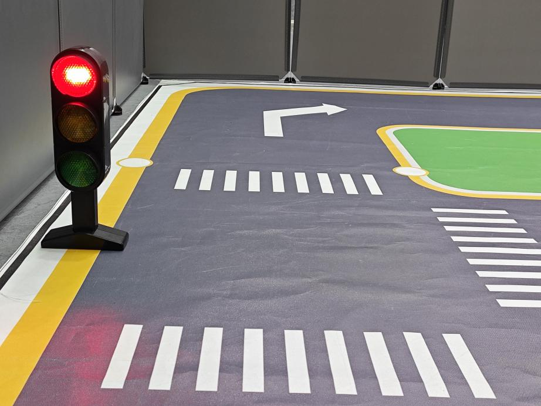

The traffic light simulates real-world traffic signals. When the vehicle detects the traffic light, it will follow the stop at red, go at green rule.

Once all required items are placed, the scene should look like the figure below. You can use it as a reference to set up the environment.


> [!NOTE]
>
> * **Ensure the area is well-lit with normal ambient lighting. Avoid strong direct light or colored lighting, as these may affect overall recognition performance.**
>
> * **During setup and use, take care of the course markers. If any parts of the map, traffic signs, or traffic light become damaged or unusable, please contact customer support to purchase replacements to avoid affecting recognition performance.**

### 8.4.2 Autonomous Driving

* **Lane Keeping**

This lesson focuses on controlling the car to move forward while keeping it within the lane.

**1. Preparation**

(1) Before starting, lay out the map on a flat surface, ensuring it is smooth with no wrinkles and that the road is free of obstacles. For detailed instructions on map setup, refer to [8.4.1 Map Layout and Course Props Installation](#anchor_8_4_1) in this document. Since this lesson only covers basic lane-following, there is no need to place traffic lights or signs.

(2) When performing this activity, make sure the environment is well-lit, but avoid direct light hitting the camera to prevent misrecognition.

(3) Adjust the color thresholds in advance to correctly detect the yellow lines, preventing misdetection during the lesson. For guidance on setting color thresholds, see [7. ROS+OpenCV Course](https://wiki.hiwonder.com/projects/LanderPi/en/latest/docs/7_ROS%2BOpenCV.html).

(4) It is recommended to position the robot in the center of the lane for easier detection.

**2. Working Principle**

Lane keeping can be divided into three main parts: capturing real-time images, image processing, and result comparison.

First, real-time images are captured using the camera.

Next, the images are processed. This includes color detection, converting the detected images into a suitable color space, applying erosion and dilation, and performing binarization.

Finally, the processed images are analyzed. The region of interest (ROI) is extracted, contours are identified, and comparisons are made to determine the car's position relative to the lane.

Based on the comparison results, the forward direction is adjusted to keep the robot centered in the lane.

**3. Operation Steps**

> [!NOTE]
>
> **When entering commands, be sure to use correct case and spacing. You can use the Tab key to auto-complete keywords.**

Power on the robot and connect it to a remote control tool like VNC. For detail informations, please refer to [1.4 Development Environment Setup and Configuration](https://wiki.hiwonder.com/projects/LanderPi/en/latest/docs/1_LanderPi_User_Manual.html#development-environment-setup-and-configuration).
 **Starting the Model:**

1)  Click the terminal icon  in the system desktop to open a command-line window.

2)  Enter the following command and press **Enter** to stop the app auto-start service.

```
~/.stop_ros.sh
```

3)  In the terminal, enter the following command and press **Enter**:

```
ros2 launch example self_driving.launch.py only_line_follow:=true
```

4)  To close the program, select the corresponding terminal window and press **Ctrl + C**.


**4. Function Outcome**

After starting the feature, place the robot on the road of the map. The robot will detect the yellow lane markings at the edges of the road, adjust its position, and maintain itself in the center of the lane.


**5. Program Brief Analysis**

The source code for this program is located at:

`~/ros2_ws/src/example/example/self_driving/lane_detect.py`


**Function:**

`image_callback`:


Image callback function used to read data from the camera node.

**Class:**

`LaneDetector`:


`init`: Initializes required parameters and sets the ROI for detection.

`set_roi`:


Sets the region of interest (ROI) for detection.

`get_area_max_contour`:


Retrieves the largest contour from a list of contours obtained via OpenCV.

`add_horizontal_line`:


Adds horizontal lines for detection based on the image width, height, and ROI.

`add_vertical_line_far`:


Adds vertical detection lines in the far area of the image based on the ROI.

`get_binary`:


Performs color recognition in the specified color space and generates a binary image.

`add_vertical_line_near`:


Adds vertical detection lines in the near area of the image based on ROI and image dimensions.

`__call__`:


The class's callback function performs color recognition, draws detected yellow lines using OpenCV, and outputs the processed image, the line angles, and the pixel coordinates (X) of each ROI contour.

* **Traffic Sign Detection**

This lesson focuses on recognizing traffic signs through programmed commands.

**1. Preparation**

(1) Before starting, make sure to lay out the map properly, ensuring it is flat without wrinkles and that the road is clear of obstacles. For detailed instructions on map setup, refer to the section [8.4.1 Map Layout and Course Props Installation](#anchor_8_4_1) in this document.

(2) The traffic sign detection model used in this lesson is a YOLOv11-trained model. For more information on YOLOv11, you can refer to [8.1 Machine Learning Basics](#anchor_8_1) in this document.

(3) When performing this feature, make sure the environment is well-lit, but avoid direct light hitting the camera to prevent misrecognition.

**2. Working Principle**

First, capture the real-time video from the camera and perform image processing operations such as erosion and dilation.

Next, use YOLOv11 to run the model and compare the processed image with the target objects.

Finally, based on the comparison results, execute the corresponding traffic sign actions.

**3. Operation Steps**

> [!NOTE]
>
> * **The following steps only enable traffic sign detection in the camera feed and will not trigger the corresponding robot actions. To directly experience the autonomous driving feature, you can skip this lesson and refer to the section [Comprehensive Application of Autonomous Driving](#anchor_c_a_o_a_d) in this document.**
>
> * **When entering commands, be sure to use correct case and spacing. You can use the Tab key to auto-complete keywords.**

(1) Power on the robot and connect it to a remote control tool like VNC.

(2) Click the terminal icon  in the system desktop to open a command-line window.

(3) Enter the following command and press **Enter** to stop the app auto-start service.

```
~/.stop_ros.sh
```

(4) Open a terminal and switch to the corresponding directory:

```
cd ~/ros2_ws/src/yolov11_detect/yolov11_detect
```

(5) Edit the program file.

```
vim yolov11_detect_demo.py
```

(6) Modify the parameter to best_traffic, then save and exit the editor.

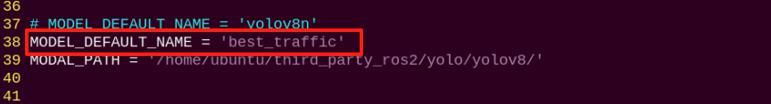

(7) Open a new terminal and enter the command to start the application.

```
ros2 launch yolov11_detect yolov11_detect_demo.launch.py model:="traffic_signs_640s_7_1"
```

(8) Place the traffic sign in front of the camera. The system will detect the sign and highlight it on the display. To exit this feature, press **Ctrl + C** in the terminal. If the program does not close successfully, try pressing **Ctrl + C** again.

> [!NOTE]
>
> **If the model fails to detect traffic signs, lower the confidence threshold. If the model misidentifies traffic signs, increase the confidence threshold.**

(9) Enter the command to navigate to the program directory:

```
cd /home/ubuntu/ros2_ws/src/example/example/self_driving
```

(10) Enter the command to open the program:

```
vim self_driving.launch.py
```

(11) The value highlighted in red represents the confidence threshold, which can be adjusted to fine-tune the object detection performance.


**4. Function Outcome**

After launching the feature, place the robot on the map's road. When the robot detects a traffic sign, it will highlight the detected sign and display the label with the highest confidence based on the trained model.


* **Traffic Light Recognition**

This feature allows the robot to recognize traffic lights through command execution using the camera.

**1. Preparation**

(1) Before starting, make sure to lay out the map properly, ensuring it is flat without wrinkles and that the road is clear of obstacles. For detailed instructions on map setup, refer to the section [8.4.1 Map Layout and Course Props Installation](#anchor_8_4_1) in this document.

(2) The traffic sign detection model used in this lesson is a YOLOv11-trained model. For more information on YOLOv11, you can refer to section [8.1 Machine Learning Basics](#anchor_8_1).

(3) When performing this feature, make sure the environment is well-lit, but avoid direct light hitting the camera to prevent misrecognition.

**2. Working Principle**

First, capture the real-time video from the camera and perform image processing operations such as erosion and dilation.

Next, use YOLOv11 to run the model and compare the processed image with the target objects.

Finally, based on the comparison results, execute the corresponding traffic sign actions.

**3. Operation Steps**

The following steps only enable traffic light detection in the camera feed and will not trigger the corresponding robot actions. To directly experience the autonomous driving feature, you can skip this lesson and refer to the section [Comprehensive Application of Autonomous Driving](#anchor_c_a_o_a_d) in this document.

> [!NOTE]
>
> **When entering commands, be sure to use correct case and spacing. You can use the Tab key to auto-complete keywords.**

(1) Power on the robot and connect it to a remote control tool like VNC.

(2) Click the terminal icon  in the system desktop to open a command-line window.

(3) Enter the following command and press Enter to stop the app auto-start service.

```
~/.stop_ros.sh
```

(4) Open a terminal and switch to the corresponding directory:

```
cd ~/ros2_ws/src/yolov11_detect/yolov11_detect
```

(5) Edit the program file: 

```
vim yolov11_detect_demo.py
```

(6) Modify the parameter to `best_traffic`, then save and exit the editor.


(7) Open a new terminal and enter the command to start the application.

```
ros2 launch yolov11_detect yolov11_detect_demo.launch.py model:="traffic\_ signs_640s_7_1"
```

(8) Place the traffic sign in front of the camera. The system will detect the sign and highlight it on the display. To exit this feature, press **Ctrl + C** in the terminal. If the program does not close successfully, try pressing **Ctrl + C** again.

> [!NOTE]
>
> **If the model fails to detect traffic signs, lower the confidence threshold. If the model misidentifies traffic signs, increase the confidence threshold.**

(9) Enter the command to navigate to the program directory:

```
cd /home/ubuntu/ros2_ws/src/example/example/self_driving
```

(10) Enter the command to open the program:

```
vim self_driving.launch.py
```

(11) The value highlighted in red represents the confidence threshold, which can be adjusted to fine-tune the object detection performance.


**4. Function Outcome**

Once the feature is started, place the robot on the map's road. When the robot detects a traffic light, it will identify the light's color and highlight red and green signals accordingly.


* **Turing Decision Making**

This section demonstrates how to detect and recognize turn signs through command instructions.

**1. Preparation**

(1) Before starting, make sure to lay out the map properly, ensuring it is flat without wrinkles and that the road is clear of obstacles. For detailed instructions on map setup, refer to the section [8.4.1 Map Layout and Course Props Installation](#anchor_8_4_1) in this document.

(2) The traffic sign detection model used in this lesson is a YOLOv11-trained model. For more information on YOLOv11, you can refer to [8.1 Machine Learning Basics](#anchor_8_1).

(3) When performing this feature, make sure the environment is well-lit, but avoid direct light hitting the camera to prevent misrecognition.

**2. Working Principle**

First, capture the real-time video from the camera and perform image processing operations such as erosion and dilation.

Next, use YOLOv8 to run the model and compare the processed image with the target objects.

Finally, based on the comparison results, the robot identifies the turn sign and proceeds in the indicated direction.

**3. Operation Steps**

> [!NOTE]
>
> * **The following steps only enable turn signs detection in the camera feed and will not trigger the corresponding robot actions. To directly experience the autonomous driving feature, you can skip this lesson and refer to the section [Comprehensive Application of Autonomous Driving](#anchor_c_a_o_a_d) in this document.**
>
> * **When entering commands, be sure to use correct case and spacing. You can use the Tab key to auto-complete keywords.**

(1) Power on the robot and connect it to a remote control tool like VNC.

(2) Click the terminal icon  in the system desktop to open a command-line window.

(3) Enter the following command and press Enter to stop the app auto-start service.

```
~/.stop_ros.sh
```

(4) Open a terminal and switch to the corresponding directory: 

```
cd ~/ros2_ws/src/yolov11_detect/yolov11_detect
```

(5) Edit the program file:

```
vim yolov11_detect_demo.py
```

(6) Modify the parameter to `best_traffic`, then save and exit the editor.


(7) Open a new terminal and enter the command to start the application.

```
ros2 launch yolov11_detect yolov11_detect_demo.launch.py model:="traffic\_ signs_640s_7_1"
```

(8) Place the traffic sign in front of the camera. The system will detect the sign and highlight it on the display. To exit this feature, press **Ctrl + C** in the terminal. If the program does not close successfully, try pressing **Ctrl + C** again.

> [!NOTE]
>
> **If the model fails to detect traffic signs, lower the confidence threshold. If the model misidentifies traffic signs, increase the confidence threshold.**

(9) Enter the command to navigate to the program directory:

```
cd /home/ubuntu/ros2_ws/src/example/example/self_driving
```

(10) Enter the command to open the program:

```
vim self_driving.launch.py
```

(11) The value highlighted in red represents the confidence threshold, which can be adjusted to fine-tune the object detection performance.


**4. Function Outcome**

After starting the feature, place the robot on the map road. When the robot approaches a turn sign, it will adjust its direction of travel according to the sign's instruction.


* **Autonomous Parking**

This section demonstrates how to detect and recognize parking signs through command instructions.

**1. Preparation**

(1) Before starting, make sure to lay out the map properly, ensuring it is flat without wrinkles and that the road is clear of obstacles. For detailed instructions on map setup, refer to the section [8.4.1Map Layout and Course Props Installation](#anchor_8_4_1) in this document.

(2) The traffic sign detection model used in this lesson is a YOLOv11-trained model. For more information on YOLOv11, you can refer to [8.1 Machine Learning Basics](#anchor_8_1).

(3) When performing this feature, make sure the environment is well-lit, but avoid direct light hitting the camera to prevent misrecognition.

**2. Project Process**

First, capture the real-time video from the camera and perform image processing operations such as erosion and dilation.

Next, use YOLOv11 to run the model and compare the processed image with the target objects.

Finally, based on the comparison results, the robot recognizes the parking sign and automatically parks in the designated spot.

**3. Operation Steps**

> [!NOTE]
>
> * **The following steps only enable parking signs detection in the camera feed and will not trigger the corresponding robot actions. To directly experience the autonomous driving feature, you can skip this lesson and refer to the section [Comprehensive Application of Autonomous Driving](#anchor_c_a_o_a_d) in this document.**
>
> * **When entering commands, be sure to use correct case and spacing. You can use the Tab key to auto-complete keywords.**

(1) Power on the robot and connect it to a remote control tool like VNC.

(2) Click the terminal icon  in the system desktop to open a command-line window.

(3) Enter the following command and press **Enter** to stop the app auto-start service.

```
~/.stop_ros.sh
```

(4) Open a terminal and switch to the corresponding directory: 

```
cd ~/ros2_ws/src/yolov11_detect/yolov11_detect
```

(5) Edit the program file:

```
vim yolov11_detect_demo.py
```

(6) Modify the parameter to `best_traffic`, then save and exit the editor.


(7) Open a new terminal and enter the command to start the application.

```
ros2 launch yolov11_detect yolov11_detect_demo.launch.py model:="traffic\_ signs_640s_7_1"
```

(8) Place the traffic sign in front of the camera. The system will detect the sign and highlight it on the display. To exit this feature, press **Ctrl + C** in the terminal. If the program does not close successfully, try pressing **Ctrl + C** again.

> [!NOTE]
>
> **If the model fails to detect traffic signs, lower the confidence threshold. If the model misidentifies traffic signs, increase the confidence threshold.**

(9) Enter the command to navigate to the program directory:

```
cd /home/ubuntu/ros2_ws/src/example/example/self_driving
```

(10) Enter the command to open the program:

```
vim self_driving.launch.py
```

(11) The value highlighted in red represents the confidence threshold, which can be adjusted to fine-tune the object detection performance.


**4. Function Outcome**

After starting the feature, place the robot on the roadway of the map. When the robot reaches the parking sign, it will follow the sign's instructions and automatically park in the designated spot.

<p id="anchor_parameter_adjustment"></p>

**5. Parameter Adjustment**

If the robot does not park in the desired position after detecting the parking sign, you can fine-tune the parameters in the program source code.

(1) Click the terminal icon  in the system desktop to open a ROS2 command-line window.

(2) Enter the following command to navigate to the directory where the program is located:

```
cd ros2_ws/src/example/example/self_driving/
```

(3) Open the source code of the feature:

```
vim self_driving.py
```

(4) Press the **i** key to enter edit mode, then locate the highlighted code.

By modifying the parameters inside the red box, you can control where the robot begins the parking operation. Decreasing the parameter value will make the robot stop closer to the crosswalk, while increasing it will make the robot stop farther from the crosswalk. After editing, press **Esc**, type the command `:wq`, and press **Enter** to save and exit.


You can modify the parking function to adjust the robot's parking position. In this process, the robot is first set to move along the negative Y-axis to its right side at a linear velocity of 0.2 m/s for (0.38/2) seconds, moving to the left side of the parking spot. By changing the velocity and time values, you can fine-tune the robot's stopping position.


<p id="anchor_c_a_o_a_d"></p>

* **Comprehensive Application of Autonomous Driving**

This section demonstrates the comprehensive autonomous driving functionality of the robot through commands. It integrates multiple features, including lane keeping, traffic sign detection, traffic light recognition, turning decision making, and autonomous parking.

**1. Preparation**

**(1) Map Preparation**

The map should be laid on a flat surface, ensuring it is smooth without wrinkles, and that the road is clear of any obstacles. All road signs and traffic lights must be placed at the designated positions on the map, facing clockwise along the route. The positions of the road signs and the starting point are shown in the figure below.


**(2) Color Threshold Setting**

Since lighting conditions affect color recognition, you need to adjust the thresholds for black, white, red, green, blue, and yellow before starting, following the instructions in [7. ROS + OpenCV Course](https://wiki.hiwonder.com/projects/LanderPi/en/latest/docs/7_ROS%2BOpenCV.html).

If the robot fails to recognize colors correctly during operation, you should re-adjust the color thresholds in the problematic area of the map.

**2. Project Process**


The robot is currently capable of performing the following actions:

(1) Following the outer yellow line of the map.

(2) Slowing down when crossing a crosswalk.

(3) Turning when a turn sign is detected.

(4) Parking when a stop sign is detected.

(5) Stopping at red lights.

(6) Slowing down when a streetlight is detected.

First, load the YOLOv11-trained model file along with the required libraries, and obtain the real-time video feed from the camera. The input image is pre-processed using erosion, dilation, and other operations.

Next, detect the target color line in the image, and extract key information such as the size and center point of the detected region. Then, apply the YOLOv11 model to compare the processed image with the target dataset.

Finally, calculate the offset of the target center point, and adjust the robot's heading accordingly to keep it aligned in the middle of the road. During navigation, the robot also executes specific actions based on the detected traffic signs.

The source code for this program is located at:

`/home/ubuntu/ros2_ws/src/example/example/self_driving/self_driving.py`

<p id="operation_steps_17"></p>

**3. Operation Steps**

> [!NOTE]
>
> **When entering commands, be sure to use correct case and spacing. You can use the Tab key to auto-complete keywords.**

Power on the robot and connect it to a remote control tool like VNC. For detail informations, please refer to [1.4 Development Environment Setup and Configuration](https://wiki.hiwonder.com/projects/LanderPi/en/latest/docs/1_LanderPi_User_Manual.html#development-environment-setup-and-configuration).

(1) Click the terminal icon  in the system desktop to open a command-line window.

(2) Enter the following command and press **Enter** to stop the app auto-start service.

```
~/.stop_ros.sh
```

(3) In the terminal, enter the following command and press **Ente**r:

```
ros2 launch example self_driving.launch.py
```

(4) To close the program, select the corresponding terminal window and press **Ctrl + C**.


**4. Function Outcome**

**① Lane Keeping**

After the program is started, the robot follows the yellow line at the edge of the road. Depending on whether the yellow line is straight or curved, it will move forward or turn accordingly to stay within the lane.

**② Traffic Light Recognition**

When encountering a traffic light, the robot will stop if the light is red and move forward if the light is green. When crossing a crosswalk, the robot will automatically reduce its speed and proceed slowly.

**③ Turn Signs and Parking Signs**

While moving forward, if the robot detects a traffic sign, it will take the corresponding action. If a right-turn sign is detected, the robot will turn right and continue moving forward. If a parking sign is detected, the robot will perform parallel parking.

Following these rules, the robot continuously navigates around the map in a loop.

**5. Program Brief Analysis**

The source code for this program is located at:

`~/ros2_ws/src/example/example/self_driving/self_driving.py`


**Functions:**


Launches the autonomous driving class.

**Class:**


`init`: Initializes required parameters, identifies the current robot type, sets the line-following color to yellow, starts chassis control, servo control, and image acquisition. Also sets up three services including enter, exit, and start, and connects to the `YOLOv11` node.

`init_process`:


Initializes the robot arm and starts the `main` function.

`param_init`:


Initializes parameters for position recognition and other required operations.

`get_node_state`:


Retrieves the current state of the node.

`send_request`:


Publishes a service request.

`enter_srv_callback`:


Service callback for entering autonomous driving mode, starts image acquisition, YOLOv11 recognition, and initializes speed.

`exit_srv_callback`:


Service callback for exiting autonomous driving mode, stops image acquisition and YOLOv11 recognition, resets speed, and restores parameters.

`set_running_srv_callback`:


Service callback for starting autonomous driving by setting the `start` parameter to `True`.

`Shutdown`:


Callback executed when the program is closed, used to stop any ongoing processes.

`image_callback`:


Image callback function, enqueues received images while discarding outdated frames.

`park_action`:


Parking logic, executes different parking strategies depending on the chassis type.

`get_object_callback`:


Callback for YOLOv11 results, retrieves the current recognized classes.

`main`:


Main function of the class, executes different line-following strategies based on the chassis type.

* **FAQ**

1\. The robot performs poorly during line-following, moving in a wobbly manner.

Adjust the color thresholds according to the actual lighting environment. For detailed instructions, refer to [7. ROS + OpenCV Course](https://wiki.hiwonder.com/projects/LanderPi/en/latest/docs/7_ROS%2BOpenCV.html).

2\. The robot's turning radius is too large or too small.

\(1\) Check whether the robotic arm offset is properly calibrated. For calibration steps, see [9.1 Robotic Arm Basic Control](https://wiki.hiwonder.com/projects/LanderPi/en/latest/docs/9_Robotic_Arm_Basic_Control.html#robotic-arm-basic-control).

\(2\) Modify the line-following processing code:

Enter the command to navigate to the program directory:

```
cd ~/ros2_ws/src/example/example/self_driving/
```

Enter the command to open the program:

```
vim self_driving.py
```

The highlighted value represents the lane center point. Decreasing the value makes the robot turn earlier, while increasing it delays the turn.


3\. Parking position is inaccurate.

You can modify the parking function or adjust the starting point of the parking operation. For details, see [Parameter Adjustment](#anchor_parameter_adjustment) in the section **Autonomous Parking**.

4. Traffic sign recognition is inaccurate.

Adjust the detection confidence level. For details, see [Operation Steps](#operation_steps_17) in the section **Traffic Sign Detection**.