# 9. Robotic Arm Control

## 9.1 Robotic Arm Basic Control

<p id="anchor_9_1_1"></p>

### 9.1.1 Basic Control

* **Introduction to Robotic Arm**

LanderPi is a 6-degree-of-freedom robotic arm, composed of intelligent bus servos and metal sheet components. It can easily move to any position within its reachable workspace. It features six degrees of freedom—X-axis translation, Y-axis translation, Z-axis translation, and rotation around the X, Y, and Z axes—enabling it to perform extension, rotation, and lifting movements.


The following figure illustrates the specifications of the robotic arm:

| **Item** | **Description** | **Item** | **Description** |
|:--:|:--:|:--:|:--:|
| Servo Model: | HX-06L × 6 (1 × Pan-Tilt, 2 × Body, 1 × Wrist, 1 × Gripper) | Servo Precision | 0.3° |
| Arm Material | Anodized Aluminum Alloy | Control Methods | UART serial command |
| Degrees of Freedom | 6 DOF | Communication Baud Rate | 115200 |
| Arm Payload | 100 g (for gripping and handling) | Servo Memory | User settings retained after power-off |
| Arm Reach | 410mm | Readback Function | Support angle readback |
| Effective Gripping Range | Radius ≤ 23 cm | Servo Protection | Stall protection and over-temperature protection |
| Camera Model | Aurora930 Depth Camera | Parameter Feedback | Temperature, voltage and position |
| Resolution | 640x400 | Frame Rate | 15FPS |
| Connection | USB (Driver-free) | System Support | Windows, Linux |

> [!NOTE]
> - **The robotic arm is fully calibrated before shipment, requiring no additional adjustment by the user.**
>
> - **This manual is provided to assist you in restoring the arm to its calibrated state after any modifications.**
>
> - **The robotic arm consists of six degrees of freedom (DOF). The first joint controls the arm's horizontal rotation and requires special attention during adjustment. Ensure that the arm faces the front of the platform, minimizing any lateral deviation."**
>
> - **Refer to the side and top diagrams in this document to check servo alignment.**

* **Intelligent Bus Servos and Precautions**

The servos are the primary control components of the robotic arm. LanderPi employs HX-06L bus serial servos, which are controlled via serial commands at a baud rate of 115200. You can send corresponding commands to the servo based on the communication protocol provided by Hiwonder, which can control the rotation of the or read servo information. Ensure that all servo parameters and IDs are set before operating the servos.

The servo features a half-duplex UART asynchronous interface, which can send and receive signals. During operation, you can send different commands via the serial port based on each servo's ID, enabling individual control of each servo. This servo can be used in multiple scenarios and is primarily intended for joint design in various types of biomimetic robots.


**1. Structure and Specifications**

The following figure illustrates the structural dimensions of the HX-06L bus servo:


|     Working voltage     |                    DC 6-8.4V                     |
| :---------------------: | :----------------------------------------------: |
|     Rotation Speed      |              0.2sec/60°（DC 7.4V）               |
|    Rotational Torque    |                6kg.cm（DC 7.4V）                 |
|  Maximum Static Torque  |                6kg.cm（DC 7.4V）                 |
|     Rotation Range      |                     0~ 240°                      |
|     No-load Current     |                      300mA                       |
|      Stall Current      |                       1.3A                       |
|     Servo Cccuracy      |                       0.3°                       |
|   Control Angle Range   |        0-1000, corresponding to 0°~ 240°         |
|     Control Methods     |               UART Serial Command                |
| Communication Baud Rate |                      115200                      |
|         Memory          |   User settings are preserved when powered off   |
|        Servo ID         |     0~253 for user setting, ID 1 is default      |
|    Readback function    |              Support angle readback              |
|       Protection        | Stall protection and over-temperature protection |
|   Parameter feedback    |        Temperature, voltage and position         |
|      Working mode       |            Servo mode and motor mode             |
|        Gear type        |                    Metal Gear                    |
|    Servo wire length    |      200mm, optional wire lengths available      |
|     Connector Model     |                     5264-3P                      |
|         Weight          |                      36.3g                       |
|   Product Dimensions    |             35.19 x 26.19 x 27.20mm              |
|       Application       |         All kinds of bionic robot joints         |

**2. key Features**

(1) Serial Bus Interface:

The control board provides an I/O connection for the serial servos, which are connected in series using a three-pin interface. It minimizes serial port usage and results in cleaner, more elegant wiring.

(2) ID Recognition and Bus Communication:

Each servo can be assigned an ID for identification. The default servo ID is 1, which can be modified. The controller communicates with the servos using a one-wire interface at a baud rate of 115200. You can assign a unique ID to each servo. Commands from the controller include this ID, ensuring that only the matching servo executes the command.

(3) High-Precision Potentiometer:

The servo is equipped with an imported high-precision potentiometer for angle feedback. This ensures excellent accuracy and linearity,

resulting in more stable robot operation and significantly extending the servo's lifespan.

(4) Position, Temperature, and Voltage Feedback:

Position, temperature, and voltage feedback enable real-time monitoring to protect the servo.

(5) Two Operating Modes:

Servo Mode and Gear Motor Mode:

① **Servo Mode**: In servo mode, rotation can be precisely controlled within a 240° range.

② **Gear Motor Mode**: Allows continuous 360° rotation with adjustable direction and speed.

(6) Metal Gear

High-precision gear engagement minimizes noise generated by gear friction.

(7) Metal Housing:

The green anodized metal enclosure offers strong heat dissipation and a visually striking design.

**3. Install Description**

For servo horn installation, refer to the image below. Align it with the red cross before securing.


The port distribution and instruction refer to the following picture and table.


| **Pin (from left to right)** | **Instruction** |
|:--:|:--:|
| SIG | Signal terminal for half-duplex UART asynchronous serial interface |
| VIN | Power Input |
| GND | Ground |

* **PC Interface Overview**

**1. Introduction to PC Software**

The host computer communicates with the robot, sending commands to it and receiving feedback data in return. Typically, the host computer is a PC, where dedicated software, the PC software, is used to control the robot.

The host computer communicates with the robot, sending commands to it and receiving feedback data in return. The host computer connects to the robot via a USB interface, and the host computer software communicates with the robot through this interface. This enables effective coordination between the host computer and the robot.

This section introduces the interface and functions of the host computer software for controlling LanderPi.

**2. Start PC Software**

**(1) Launch via Desktop Icon**

① Click the terminal icon  in the system desktop to open a command-line window. Before adjusting servo alignment and arm position, turn off the app's auto-start feature:

```
~/.stop_ros.sh
```

② Double-click the Arm icon on the desktop to launch it.


**(2) Launch via Command Line**

① Click the terminal icon  in the system desktop to open a command-line window. Before adjusting servo alignment and arm position, turn off the app's auto-start feature:

```
~/.stop_ros.sh
```

2)  Enter the following command to navigate to the host computer software directory:

```
cd software/arm_pc
```

3)  Enter the following command to launch the host computer software:

```
python3 main.py
```

> [!NOTE]
>
> **When servo-related nodes such as mapping or navigation are active, the host computer software or servo tools cannot be opened because the USB interface is occupied.**

**(3) PC Software Interface Layout**

The host computer interface in **General Mode** is shown in the figure below:


All servos are fully calibrated before the robot leaves the factory, so no further adjustments are required. **If you encounter a problem and need to use this tool, you must do so under the guidance of a professional technician, otherwise it may cause the robotic arm to malfunction.**

The main interface of the host computer is shown in the figure below, and different functional areas have been selected with boxes of different colors:


**①：Servo Control Area**

The servo control area displays the icons of the selected servos. By adjusting the corresponding slider values, you can directly control the position of each servo.

| **Icon** | **Function** |
|:---|:---|
|  | Indicates the servo ID number, for example, 1 is the servo's ID here. |
|  | Adjust the servo position, with a range from 0 to 1000. |
|  | Adjust the servo deviation, with a range from -125 to 125. |
|  | After setting the robot's X, Y, Z and pitch pose information, execute the action. |

**②: Action Details List**

This section displays the details of the current action group, including the execution time for each action and the values of all involved servos.


| **Icon** | **Function** |
|----|----|
|  | Indicates the action group number. |
|  | Indicates the execution time for the corresponding action. |
|  | Displays the servo's value in the current action. You can double-click a value  to directly modify it. |

**③: Action Group Settings Area**

<table class="docutils-nobg" border="1">
<colgroup>
<col style="width: 34%" />
<col style="width: 65%" />
</colgroup>
<thead>
<tr>
<th><strong>Icon</strong></th>
<th><strong>Function</strong></th>
</tr>
</thead>
<tbody>
<tr>
<td></td>
<td>Displays the time required to run a single action, click  to modify.</td>
</tr>
<tr>
<td></td>
<td>Shows the total duration required for the action group to run.</td>
</tr>
<tr>
<td></td>
<td>Clicking this will relax the robot's joints, allowing you to manually move the robot to pose or design movements.</td>
</tr>
<tr>
<td></td>
<td>Read the current servo angle values from the robot's physical pose. Must be used in conjunction with the "Manual" button.</td>
</tr>
<tr>
<td></td>
<td>Adds the current servo values from the servo control area as an action to the last row of the action details list.</td>
</tr>
<tr>
<td></td>
<td><p>Delete Action: Removes the selected action from the action details list.</p>
<p>Delete All: Removes all actions from the action details list.</p></td>
</tr>
<tr>
<td></td>
<td><p>Replace the selected values in the Action Details List.</p>
<p>The servo values are updated with the current values from the control area, and the action duration is taken from the <strong>"Action Time"</strong> setting.</p></td>
</tr>
<tr>
<td></td>
<td><p>Insert a new action above the selected action.</p>
<p>The inserted action will use the servo values from the Servo Control Area and the duration set in <strong>"Duration(ms)"</strong>.</p></td>
</tr>
<tr>
<td></td>
<td>Swap the selected action with the action in the previous row.</td>
</tr>
<tr>
<td></td>
<td>Swap the selected action with the action in the next row.</td>
</tr>
<tr>
<td>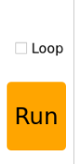</td>
<td><p>Clicks to run the actions in Action Details List once.</p>
<p>If "Loop" is checked, the robot will repeat the sequence.</p></td>
</tr>
<tr>
<td></td>
<td>Click and select the action group to load its data into the action details list.</td>
</tr>
<tr>
<td></td>
<td>Save the actions currently in the Action Details List to a specified location.</td>
</tr>
<tr>
<td></td>
<td>After opening an action group, clicking the "Integrate file" button and then opening another action group file allows you to merge the two action groups into a new one.</td>
</tr>
<tr>
<td></td>
<td>Saved action groups are viewable within the host computer interface.</td>
</tr>
<tr>
<td></td>
<td>Pressing this button refreshes the action group selection list.</td>
</tr>
<tr>
<td></td>
<td>Execute the selected action group once.</td>
</tr>
<tr>
<td></td>
<td>This will overwrite the previously selected action group with the contents from the action details table.</td>
</tr>
<tr>
<td></td>
<td>Stops the currently running action group.</td>
</tr>
<tr>
<td></td>
<td>Exit the current host computer operation interface.</td>
</tr>
</tbody>
</table>

**④: Deviation Setting Area (For Reference)**

| **Icon** | **Function** |
|:--:|:--:|
|  | Click to automatically read the saved deviation values. |
|  | Click to upload the adjusted deviation values from the host computer to the robot. |
|  | Click to reset all servo in the Servo Control Area to position 500. |

* **Action Playback Tutorial**

**1. Introduction to Action Playback**

You can use the same method to call action groups edited and saved in subsequent lessons.

The robot comes preloaded with action groups, with the action group files stored at:

`ubuntu/software/arm_pc/ActionGroups`. You can access and run the built-in action groups through the host computer software or via terminal commands.

Operation steps are shown as following.

> [!NOTE]
>
> **Only action files stored in `ubuntu/software/arm_pc/ActionGroups` can be executed.**


The following section explains how to call the built-in action groups in the software to make the robotic arm perform the corresponding actions.

**2. Operation Steps**

① Double-click the desktop icon  to open the host computer editing interface, illustrated below:


② Click **Open action file**.


③ Next, select the action group you want to execute, and then click **Open**.


④ The action details list now shows the execution time and servo values for every action in the selected action group.

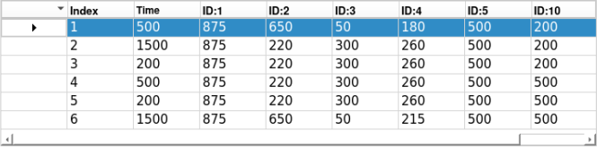

⑤ Select action number **1**, click **Run** to play all actions in the action details list, and check **Loop** if you want to repeat the action group.


After clicking **Run**, the actions will execute in a loop according to the content of the action group.

* **Action Editing**

**1. Overview of Action Editing**

Action editing involves adjusting the angles of the relevant servos to achieve a target action, with multiple actions combined into an action group.

In this section, an action group for the robotic arm to "grasp the block on the left" will be used for demonstration.

**2. Implement the Action**

**(1) Action Design**

① Double-click the host computer icon  on the system desktop to open the host computer editing interface in **General Mode**.


② Click **Reset servo** to move the servo to the central position.


③ Slide the sliders for each servo to bend the robotic arm toward the left. Adjust the values as follows:

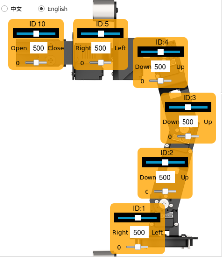

④ Click Add action to add the current action to the action group details list.

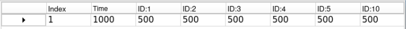

⑤ Now, to align the robotic arm with the block, adjust the servo angles as shown below:


⑥ Set the time to 2000 ms and click **Add action** to create Action 2.


⑦ Add a transition action with a duration of 200 ms and click **Add action** to create Action 3.


⑧ Then, start the gripping motion. In this step, adjust the slider of Servo 10, set the **Duration** to 500 ms, and click **Add action**.


⑨ Next, add a transition action, set the **Duration** to 200 ms, and click **Add action** to create Action 5.


⑩ Then, lift the block to the specified height, set the **Duration** to 2000 ms, and click **Add action** to generate Action 6.


The action group grasping the front-side block is now fully edited. The complete action details list is shown below:


⑪ Next, demonstrate the overall effect of the entire action group. Select action No. 1 and click the **Run** button. If you want to execute this action group in a loop, check the **Loop** option.


**(2) Save Edited Action**

> [!NOTE]
>
> **Do not use the space bar when naming an action group, as this may cause unsuccessful saving during later debugging. It is recommended to use an underscore "-" instead of a space bar.**

For facilitating the consequent debugging and management convenience, it is advisable to save this action. Click the **Save action file** button and select the following path: **ubuntu/software/arm_pc/ActionGroups**.


For example, you can name the action group **pick_up** and click **Save** to store it.


* **Action File Integration**

**1. Introduction to Action File Integration**

Action File Integration involves linking two action group files end-to-end to create a new action group file. This allows merging of action group files and enables the robotic arm to be controlled according to the combined sequence of actions.

**2. Operation Steps**

① Double-click the host computer icon  on the system desktop to open the host computer editing interface in **General Mode**.


② Click-on **Integrate file** button：


③ In the popup window, choose **place_left.d6a** and double-click to open.


④ Now, the action details list shows the parameters for this action group.


⑤ Click **Integrate file** again, select **place_right.d6a**, and double-click to open, and you will see the second action group file linked in.


⑥ Select action No. 1 and click **Run** to run the new series of action groups in real time.


⑦ To save the integrated action group for future debugging, click **Save action file**.


⑧ Assign a name to the chained action file, for example **Left_right**.

> [!NOTE]
>
> **The name must be in English and cannot contain spaces. It is recommended to use underscores instead of spaces.**


* **Action File Import and Export**

**1. Introduction **

This section explains how to export action group files from the host computer and import them to other similar devices, allowing action files to be used across multiple robots.

**2. Export Action**

**This section uses the "pick.d6a" action group file as an example to demonstrate exporting and importing.**

① Click to open the command terminal and enter the command to copy the file to the path

```
cp /home/ubuntu/software/arm_pc/ActionGroups/pick.d6a /home/ubuntu/shared/
```

② If you use MobaXterm for remote connection, please refer to the [4.2.3 SSH Connection](#anchor_ssh_connection) in the **1. LanderPi User Manual** for connection tutorial.

③ You can export the action file by dragging it directly to the computer desktop.


**3. Import Action**

Importing and exporting actions are similar: simply drag and drop the action group file to the corresponding path.

① Before starting, you need to bend the antenna to prevent the robotic arm from colliding with the antenna during movement.

② Drag or copy the **pick.d6a** action group file to the system desktop.


③ Then drag or copy and paste the **pick.d6a** file to the following path.


④ Double-click the host computer icon  on the system desktop to open the host computer editing interface in General Mode.


⑤ Click the **Open action file** button and select the path as shown in the figure below to find the imported action file in the opened interface.


⑥ Next, select the action group you want to execute, and then click **Open**.


Or you can directly click the drop-down button in the action group selection bar and select the imported action file in the option box.


⑦ Click the **Run** button to execute the action group.


* **Robotic Arm Position and Pose in Three-Dimensional Space**

1)  Double-click the icon  to open the ROS1 command line terminal. First, disable the app's automatic startup service:

```
~/.stop_ros.sh
```

2)  Click the Arm icon on the desktop to start the host computer.


3)  The robotic arm reaches a target position and pose in three-dimensional space.


(1) X, Y, Z: These parameters represent the three-dimensional coordinate position of the robotic arm's end effector.

X: Position in the forward-backward direction on the horizontal plane.

Y: Position in the left-right direction on the horizontal plane.

Z: Position in the vertical direction.

(2) Pitch: This is the pitch angle of the robotic arm's end effector, representing its rotation in the vertical plane. The pitch angle allows the end effector to tilt upward or downward. A pitch of -90.0° indicates the end effector is tilted 90° upward,while a pitch of 0.0° means the end effector is parallel to the ground.

(3) Pitch_min and pitch_max: Indicate the minimum and maximum limits of the robotic arm's pitch angle, set to -180° and 180°, respectively.

4)  Adjust the X, Y, Z, and pitch values, and click "Run" to position the robotic arm at the desired location and pose in three-dimensional space.


### 9.1.2 Robotic Arm Deviation Adjustment (Optional)

Over time, the servo angles on the robotic arm may drift due to usage. If any joint fails to reach its intended position, you can manually adjust the servo offsets following the instructions in this document.

> [!NOTE]
>
> **The robotic arm's deviations are pre-calibrated before shipment. Therefore, no adjustment is needed during initial use. If significant deviations affect normal operation, you can adjust them according to the instructions in this document.**

* **Introduction to the Robotic Arm**

LanderPi is a 6-degree-of-freedom robotic arm, composed of intelligent bus servos and metal sheet components. It can easily move to any position within its reachable workspace. It features six degrees of freedom—X-axis translation, Y-axis translation, Z-axis translation, and rotation around the X, Y, and Z axes—enabling it to perform extension, rotation, and lifting movements. Additionally, it features an Aurora930 depth camera, enabling the robotic arm to perform tasks including hand-tracking, color block recognition and sorting, color block tracking, line-following with obstacle clearing, garbage classification, and point-to-point navigation and transport.


It consists of a 6-DOF robotic arm composed of intelligent bus servos and metal sheet components.


The 6-DOF robotic arm consists of six intelligent bus servos HX-06L × 6, with 2 for the pan-tilt unit, 2 for the main body, and 1 for the wrist.

The bus servos use serial communication, connecting multiple servos to the control system via a single bus. They can be connected in series through a single I/O port, providing higher precision, which accounts for their slightly higher price. The interface layout and descriptions are as follows:


| **Pin (from left to right)** |                       **Instruction**                        |
| :--------------------------: | :----------------------------------------------------------: |
|             SIG              | Signal terminal for half-duplex UART asynchronous serial interface |
|             VIN              |                         Power Input                          |
|             GND              |                            Ground                            |

* **Calibration Steps**

<p id="anchor_calibration_standards"></p>

**1. Calibration Standards**

Before adjusting the servo deviations, it is necessary to identify and understand the function of each servo on the robotic arm, specifically its corresponding ID number, which will be used later during the adjustment process.


As shown in the figure above, No. 1 is the pan-tilt servo, No. 2, 3, and 4 are the robotic arm joint servos, No. 5 is the wrist servo, and No. 10 is the claw servo. When the robotic arm is in use, a total of 6 servos are controlled. Similarly, these 6 servos will deviate due to use, so they need to be adjusted according to the neutral position standard of the robot arm.

When adjusting the servo deviation, you can refer to the standard diagram of servo deviation adjustment for adjustment. The robotic arm can be considered free of deviations only when both of the following criteria are simultaneously met:


Criteria 1: In the neutral position of the robotic arm, servos 1, 2, 3, 4, and 5 on the robot arm should be aligned horizontally and vertically relative to the chassis. As shown in the figure, several servos are on the middle steering wheel, that is, the screws in the middle of the steering wheel indicate that the connecting wires can pass vertically through these servos.


Criteria 2: The gripper on the robotic arm should maintain an open distance of 2–3 cm, which represents the neutral position standard for the gripper servo. You can measure this distance by comparing it to the width of your own index and middle fingers; if they fit exactly, the standard is met.

<p id="anchor_calibration_steps"></p>

**2. Calibration Steps：**

Now, based on your understanding of the adjustment standards, you can proceed to adjust the robotic arm deviations according to these criteria. Taking the deviation adjustment of servo 3 on the LanderPi robotic arm as an example, the figure below shows that servo 3 has a deviation, causing the positions of servos 4, 5, and 10 to shift. Therefore, adjustment is required through the robot's host computer software.


The operation steps are shown as following.

(1) Connect to the robot, then click the icon  in the left taskbar to open the ROS2 terminal.

(2) In the terminal, enter the following command to stop the auto-start service:

```
~/.stop_ros.sh
```

(3) Next, double-click the **Arm** icon on the desktop to open the robotic arm host computer software interface, as shown in the figure below.


For the interface and related features of the "Arm" software, please refer to section [9.1.1 Basic Control](#anchor_9_1_1) for details.

(4) Click the **Reset servo**  button, and you will notice that servo No. 3 has a deviation.


(5) Click the **Read deviation** button to obtain the current deviation values of the servos installed on the robotic arm.


(6) After the **success!** dialog pop-up appears, click **OK**.


(7) Check the deviation value of servo ID 3 in the figure below. As shown in the figure below, each servo has a corresponding ID. The top slider represents the current position, the number in the middle shows the position value, and the bottom slider indicates the servo's set deviation value.


(8) As shown in the figure above, the deviation value of Servo 3 is –18. When such a deviation occurs, adjust it in the opposite direction until it meets the standard specified in **Criteria 1** of [1. Calibration Standards](#anchor_calibration_standards).


At this point, the deviation value of Servo 3 has been adjusted to **10**, and the robotic arm state has been set to **Criteria 1** under [1. Calibration Standards](#anchor_calibration_standards). This completes the deviation adjustment state setting for Servo 3.
The next step is to save the current value to the robot's local computer. Afterward, when the robot is restarted, it will read the saved data for servo control. The same method applies to other servos with different ID numbers.

(9) Click **Download deviation**.


(10) After the **success!** dialog appears, click **OK** to close the window. The deviation adjustment of servo 3 is now complete.


(11) When it is necessary to return the robotic arm to its initial state, select **camera** within the action group range.


(12) Select **init**.

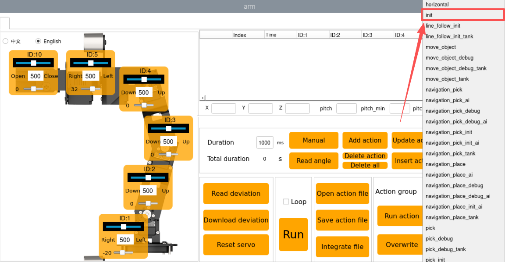

(13) Then click **Run action** to have the robotic arm perform the **init** action group.


After clicking on the button, the status of the mobile robot is shown in the figure below:


After completing the above steps, servo 3 on the mobile robot arm has been fully adjusted. If any of the other bus servos on the robot show deviations that do not meet the criteria, you will need to repeat [2. Calibration Steps](#anchor_calibration_steps) to adjust the corresponding servo deviations. During adjustment, always move the bottom slider and then click **Download deviation** for the changes to take effect. The slider's location is indicated by the green box in the figure below.


* **FAQ**

**Q1. When adjusting the gripper position, why does the gripper on the robotic arm not respond when the adjustment exceeds a certain value?**

**A:** The gripper on the robotic arm has a mechanical limit. Specifically, the gripper corresponds to servo 10. If the position set through the host computer exceeds 700, the gripper reaches its mechanical limit and cannot close further. Continuing to force it may damage the servo. To resolve this, simply adjust the position in the opposite direction.


It is recommended to keep servo 10 within the range \[200, 700\] during adjustment.

**Q2. Why does the software freeze after clicking Read deviation?**

**A:** The bus servos use serial communication. If the auto-start service is not disabled after the robot starts, message transmission may be blocked, causing the software to freeze. Disable the auto-start service to fix this. See [2. Calibration Steps](#anchor_calibration_steps) for instructions.

## 9.2 Robotic Arm Vision Application

### 9.2.1 2D Vision

* **Application Overview**

A robot arm is a mechanical device that simulates the movement of a human arm. It is widely used in fields such as industry, healthcare, and space exploration. Here are some common application scenarios of robot arms:

1\. **Industrial Automation:** Robot arms are extensively used in industrial production for tasks such as material handling, assembly, welding, and painting, significantly improving production efficiency and quality.

2\. **Medical Assistance:** Robot arms can be applied in operating rooms, providing surgeons with higher precision and reducing errors or complications during surgical procedures.

3\. **Electronics Repair:** In compact or high-risk environments, robot arms can perform maintenance tasks on electronic devices while minimizing risks to human operators.

4\. **Space Exploration:** Robot arms play a crucial role in planetary exploration tasks such as surface inspection and sample collection.

In summary, robot arms have a wide range of applications, and with continuous technological advancements, their use will become even more widespread. This document will focus on the applications of the robot arm mounted on the LanderPi mobile platform, showcasing various functions of a vision-enabled robot arm.


The diagram above illustrates the structure of the Robot Arm Vision Applications, including: hand tracking, color block recognition and sorting, color block tracking, line following with obstacle removal, waste classification, fix-point navigation and transportation. The following sections will be organized according to this structure.

* **Hand Tracking**

**1. Program Introduction**

The applications of hand tracking are listed below:

1\. Virtual Reality (VR): Hand tracking can be applied in VR games, allowing players to control character movements, attacks, and other actions through gestures.

2\. Medical Rehabilitation: Hand tracking can be used in rehabilitation training to help patients restore hand functionality.

3\. Education: In the education field, hand tracking enables students to engage in interactive learning through gestures.

4\. Smart Homes: With hand tracking, you can control household devices through simple gestures, such as switching decices on/off, adjusting settings.

5\. Industrial Production: In industrial environments, hand tracking allows workers to control robots via gestures, improving efficiency and safety.

For this experiment, the hand feature detection algorithm is based on MediaPipe, an open-source framework for multimedia machine learning applications. MediaPipe is cross-platform and can run on mobile devices, workstations, and servers, with support for mobile GPU acceleration. MediaPipe is compatible with inference engines such as TensorFlow and TensorFlow Lite, allowing seamless integration with models from both platforms. Additionally, it offers GPU acceleration on mobile and embedded platforms.

In practice, the process involves building a hand recognition model and subscribing to the camera topic to receive image data. The images are preprocessed such as flipping, and hand features are detected. Based on the connections between key hand landmarks, the center position of the hand is calculated. Finally, the robot arm is controlled to follow the vertical movement of the hand's center point. The source code for this program is located at: `/home/ubuntu/ros2_ws/src/example/example/hand_track/hand_track_node.py`

**2. Operation Steps**

> [!NOTE]
>
> **When entering commands, be sure to use correct case and spacing. You can use the Tab key to auto-complete keywords.**

(1) Power on LanderPi and connect it to the remote control software VNC. For detail informations, please refer to [1.4 Development Environment Setup and Configuration](https://wiki.hiwonder.com/projects/LanderPi/en/latest/docs/1_LanderPi_User_Manual.html#development-environment-setup-and-configuration) in the user manual.

(2) Click the terminal icon  in the system desktop to open a command-line window.

(3) Enter the command to disable the app auto-start service.

```
~/.stop_ros.sh
```

(4) Entering the following command to start the feature:

```
ros2 launch example hand_track_node.launch.py
```

(5) To exit the feature, press **Ctrl + C** in the terminal. If the shutdown fails, you can open a new terminal and enter the command to terminate all currently running ROS processes.

```
~/.stop_ros.sh
```

**3. Program Outcome**

After starting this feature, the robot arm will slowly lift upward. Place your hand in front of the arm's camera, and move it up and down. The arm will follow your hand's vertical movement.

> [!NOTE]
>
> * **Displaying the video feed in this feature may cause the program to lag, so it is not recommended to enable video feedback during execution.**
>
> * **If you need to view the video feed, open a new terminal and enter the command: rqt_image_view.**

**4. Program Brief Analysis**

**(1) launch File Analysis**


File Path: `~/ros2_ws/src/example/example/hand_track/hand_track_node.launch.py`


**Reading Package Paths**

Retrieve the paths for the following packages: **peripherals**, **controller**, and **kinematics**.


**Launching Other Files**

`depth_camera_launch`: Starts the depth camera.

`controller_launch`: Starts the chassis control, servo control, and related nodes.

`kinematics_launch`: Starts the kinematics algorithms.


**Starting Nodes**

`hand_detect_node`: Launches the hand detection node.

`hand_track_node`: Launches the hand tracking node.


**(2) Source Code Analysis**


File Path: `~/ros2_ws/src/example/example/hand_track/hand_track_node.py`


**Main Function**


The main function is used to invoke the hand recognition class and start the node.

**`HandTrackNode` Class**

`init_process`:


Initializes the actions and starts the `main` function, while publishing the current node's initialization status.

`send_request`:


Publishes the detected hand position to the kinematics node and receives the corresponding servo angles as feedback.

`get_hand_callback`:


Retrieves the current results from hand detection.

`main`:


Based on the hand recognition results, a PID controller adjusts the pan-tilt servos, while another PID controller determines the desired height of the robot arm and sends it to the kinematics node to calculate the servo angles. Finally, the current servo parameters are published to complete the hand-tracking operation.

* **Color Block Recognition and Sorting**

**1. Program Introduction**

With the continuous development of automation technology, production lines in manufacturing enterprises are increasingly moving toward automated and intelligent operations. As a result, production lines are gradually equipped with a large number of automated devices. In particular, when performing material color recognition and sorting, vision systems are required for image acquisition, data analysis, and accurate identification and localization of samples by color. To improve production efficiency, Zheng Motion Technology provides an effective visual solution for color recognition, positioning, and sorting.

The vision-based method offers high-speed detection, reliability, and efficiency, enabling non-contact, non-destructive inspection. This makes it highly applicable across various industries and gives it broad market potential.

The process of this experiment is as follows: First, subscribe to the topic published by the color recognition node to obtain detected color information and image data.

Call the pre-defined action group to bring the robotic arm into the ready posture.

Based on the acquired color information, match the corresponding sorting action and execute the action group to sort colored blocks into designated areas.

From the robot's perspective, the arm performs color block sorting after recognizing the color. Before starting, make sure the three colored blocks required for the experiment are prepared. The source code for this program is located at: `/home/ubuntu/ros2_ws/src/example/example/color_sorting/color_sorting_node.py`

**2. Operation Steps**

> [!NOTE]
>
> **When entering commands, be sure to use correct case and spacing. You can use the Tab key to auto-complete keywords.**

(1) Power on LanderPi and connect it to the remote control software VNC. For detail informations, please refer to [1.4 Development Environment Setup and Configuration](https://wiki.hiwonder.com/projects/LanderPi/en/latest/docs/1_LanderPi_User_Manual.html#development-environment-setup-and-configuration) in the user manual.

(2) Click the terminal icon  in the system desktop to open a command-line window.

(3) Enter the command to disable the app auto-start service.

```
~/.stop_ros.sh
```

(4) Entering the following command to start the feature:

```
ros2 launch example color_sorting_node.launch.py debug:=true
```

(5) Before the pick-and-place operation, the robot arm enters a calibration stage. During this stage, it performs a downward grasping motion with its gripper fully open. At this time, the **color block** should be placed in the **center of the gripper**.


(6) The arm then lifts up and enters the ready-to-recognize state. Once the calibration and recognition are successful, the red frame in the image turns yellow, indicating the recognition area. Only the colored block placed within this yellow area will be detected and picked up by the robot arm.


(7) To exit the feature, press **Ctrl + C** in the terminal. If the shutdown fails, you can open a new terminal and enter the command to terminate all currently running ROS processes.

```
~/.stop_ros.sh
```

**3. Program Outcome**

After starting the feature, the robot arm will rotate to its left and enter the ready-to-sort state. Place the colored blocks to be sorted within the yellow box shown in the camera feed. Once a block is recognized, the arm will pick it up and move it to the corresponding area:

Red blocks are placed directly in front of the robot. Green blocks are placed to the front-left of the robot. Blue blocks are placed to the front-right of the robot.

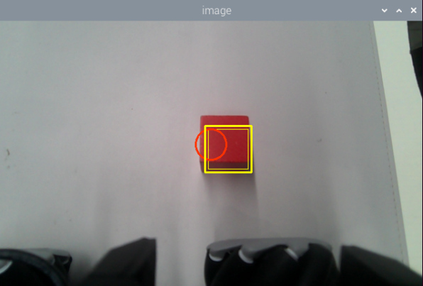

**4. Program Brief Analysis**

**(1) launch File Analysis**


File Path:

`~/ros2_ws/src/example/example/color_sorting/color_sorting_node.launch.py`


- **Launching Other Files**


`color_detect_launch`: Starts the color detection node.

`controller_launch`: Starts the chassis and servo control nodes.

- **Starting Nodes**


`color_sorting_node`: Starts the color sorting node.

**(2) Source Code Analysis**


File Path: `~/ros2_ws/src/example/example/color_sorting/color_sorting_node.py`

**① Main Function**


The main function calls the Color Sorting class to start the node.

**② ColorSortingNode**

`init_process`:


Initializes the robot arm movements and starts the `pick` function and `main` function in separate threads, then publishes the current node state.

`get_node_state`:


Works with `init_process` to initialize the node state.

`shutdown`:

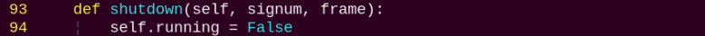

Callback function to close the program, sets `running` to `False` to stop execution.

`send_request`:


Publishes the detected hand position to the kinematics node and receives the corresponding servo angles as feedback.

`start_srv_callback`:


Reads the ROI parameters, sets the target color to pick, publishes the color info to the color detection node, and starts the sorting process.

`stop_srv_callback`:


Stops the current program and publishes empty data to the color detection node to halt recognition.

`get_color_callback`:


Retrieves the currently detected color from the color detection node.

`pick`:


Executes the pick action using the action group, and places the object in one of the three designated locations based on the recognized color.

`main`:


Determines whether to start sorting based on the target color and ROI.

`image_callback`:


Receives camera data and puts it into a queue for further processing.

* **Color Block Tracking**

**1. Program Introduction**

First-Person Vision (FPV) refers to using the robot's perspective as the primary viewpoint to perform color block tracking.

Before starting, prepare the colored blocks required for the experiment.

First, subscribe to the topic published by the color recognition node to obtain detected color information.

Once the target color is detected, obtain the center position of the target object in the image.

Finally, inverse kinematics is employed to calculate the angles necessary to align the center of the screen with the center of the target image. Then publish the corresponding topic message, control servo rotation, and ensure the robotic arm follows the movement of the target.

The source code for this program is located at: `/home/ubuntu/ros2_ws/src/example/example/color_track/color_track_node.py`

<p id="operation_steps_5"></p>

**2. Operation Steps**

> [!NOTE]
>
> **When entering commands, be sure to use correct case and spacing. You can use the Tab key to auto-complete keywords.**

(1) Power on LanderPi and connect it to the remote control software VNC. For detail informations, please refer to [1.4 Development Environment Setup and Configuration](https://wiki.hiwonder.com/projects/LanderPi/en/latest/docs/1_LanderPi_User_Manual.html#development-environment-setup-and-configuration) in the user manual.

(2) Click the terminal icon  in the system desktop to open a command-line window.

(3) Enter the command to disable the app auto-start service.

```
~/.stop_ros.sh
```

(4) Entering the following command to start the feature:

```
ros2 launch example color_track_node.launch.py
```

(5) To exit the feature, press **Ctrl + C** in the terminal. If the shutdown fails, you can open a new terminal and enter the command to terminate all currently running ROS processes.

```
~/.stop_ros.sh
```

**3. Program Outcome**

After launching the feature, place a red block within the field of view of the robotic arm's camera. The live video feed will highlight the detected target color, and the robotic arm will continuously follow the movement of the red block.


**4. Program Brief Analysis**

**(1) launch File Analysis**


File Path: `~/ros2_ws/src/example/example/color_track/color_track_node.launch.py`


**① Launching Other Files**


`color_detect_launch`: Starts the color detection node.

`controller_launch`: Starts the chassis and servo control nodes.

`kinematics_launch`: Launches the kinematics algorithm, which calculates the required servo angles for the robotic arm based on the recognized information.

**② Starting Nodes**


`color_track_node`: Starts the color sorting node.

**(2) Source Code Analysis**


File Path: `~/ros2_ws/src/example/example/color_track/color_track_node.py`

**① Main Function**


The main function calls the color tracking class to start the node.

**② ColorTrackNode**

`init_process`:


Initializes the robot arm movements and starts the `pick` function and `main` function in separate threads, then publishes the current node state.

`init_action`:


Initialize all robot actions, returning the robot arm to the grasping position.

`get_node_state`:


Works with `init_process` to initialize the node state.

`shutdown`:


Callback function to close the program, sets `running` to `False` to stop execution.

`send_request`:


Publishes the detected hand position to the kinematics node and receives the corresponding servo angles as feedback.

`set_color_srv_callback`:


Used to set the target color for recognition via a service call.

`start_srv_callback`:


Reads the ROI parameters, sets the target color to pick, publishes the color info to the color detection node, and starts the sorting process.

`stop_srv_callback`:


Stops the current program and publishes empty data to the color detection node to halt recognition.

`get_color_callback`:

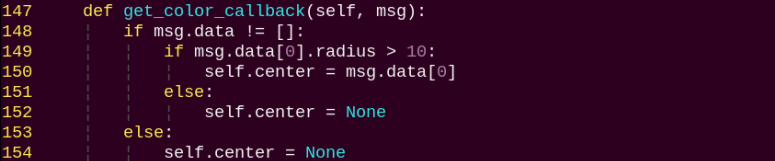

Retrieves the currently detected color from the color detection node.

`run`:


After being called, it adjusts the robot arm's position and orientation using a PID controller based on the target's center point and distance.

**5. Feature Extension**

By default, the program is set to recognize red. You can modify the code to change the target color to green or blue. In this example, we will change the recognition color to green. The steps are as follows:

(1) Power on the robot and connect it to the remote control software VNC. For detail informations, please refer to [1.4 Development Environment Setup and Configuration](https://wiki.hiwonder.com/projects/LanderPi/en/latest/docs/1_LanderPi_User_Manual.html#development-environment-setup-and-configuration) in the user manual.

(2) Click the terminal icon  in the system desktop to open a command-line window.

(3) Enter the following command and press **Enter** to go to the startup program directory.

```
cd /home/ubuntu/ros2_ws/src/example/example/color_track/
```

(4) Next, open the program file with the following command.

```
vim color_track_node.py
```

(5) Press the **i** key to enter edit mode, and change the value assigned to the `request.data` parameter to `green`.


(6) After editing, press **ESC**, type `:wq`, and press **Enter** to save and exit.


(7) Then, follow the steps in [2. Operation Steps](#operation_steps_5) to run the feature.

* **Line Following with Obstacle Removal**

**1. Program Introduction**

Line-following with obstacle removal allows the robot to automatically clear colored block obstacles while following a black line.

Before starting, make sure the black line is properly laid out. Place the robot at the start of the line and ensure there are no other objects of the same color nearby to avoid interference. Place colored block obstacles along the black line.

First, subscribe to the topics published by the color recognition node and the radar node to obtain color information, camera images, and radar data.

Next, identify the center position of the line in the image and calculate its deviation from the image center. Update the PID controller data to correct the robot's trajectory.

Finally, when colored block obstacles are detected on the path, call the obstacle removal action group to have the robot arm clear them from the line.

The source code for this program is located at: `/home/ubuntu/ros2_ws/src/example/example/line_follow_clean/line_follow_clean_node.py`

<p id="operation_steps_6"></p>

**2. Operation Steps**

> [!NOTE]
>
> **When entering commands, be sure to use correct case and spacing. You can use the Tab key to auto-complete keywords.**

(1) Power on LanderPi and connect it to the remote control software VNC. For detail informations, please refer to [1.4 Development Environment Setup and Configuration](https://wiki.hiwonder.com/projects/LanderPi/en/latest/docs/1_LanderPi_User_Manual.html#development-environment-setup-and-configuration) in the user manual.

(2) Click the terminal icon  in the system desktop to open a command-line window.

(3) Enter the command to disable the app auto-start service.

```
~/.stop_ros.sh
```

(4) Entering the following command to start the feature:

```
ros2 launch example line_follow_clean_node.launch.py
```

(5) The image interface of the camera launched by the program is shown below.


(6) To exit the feature, press **Ctrl + C** in the terminal.

If the shutdown fails, you can open a new terminal and enter the command to terminate all currently running ROS processes.

```
~/.stop_ros.sh
```

**3. Program Outcome**

After starting the feature, the robot will follow the detected black line. When it encounters a colored block obstacle along the way, it will stop, pick up the obstacle, place it to the left side of the robot, and then continue moving forward.

**4. Program Brief Analysis**

**(1) launch File Analysis**


File Path: `~/ros2_ws/src/example/example/line_follow_clean/line_follow_clean_node.launch.py`

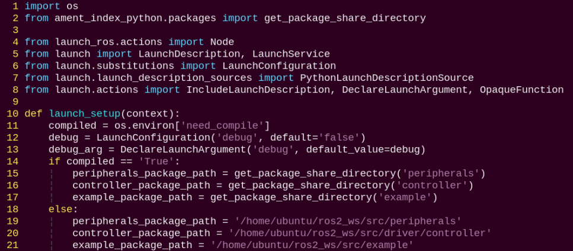

**① Launching Other Files**


`color_detect_launch`: Starts the color detection node.

`controller_launch`: Starts the chassis and servo control nodes.

`lidar_launch`: Starts the Lidar.

**② Starting Nodes**


`line_follow_clean_node` is responsible for enabling the robot to follow lines and remove obstacles.

**(2) Source Code Analysis**


File Path: `~/ros2_ws/src/example/example/line_follow_clean/line_follow_clean_node.py`

**① Main Function**


`line_follow_clean_node` is used to start the node for line following with obstacle removal.

**② LineFollowCleanNode**

`init_process`:


Initializes the robot arm movements and starts the `pick` function and `main` function in separate threads, then publishes the current node state.

`get_node_state`:


Works with `init_process` to initialize the node state.

`shutdown`:


Callback function to close the program, sets `running` to `False` to stop execution.

`send_request`:


Publishes the detected hand position to the kinematics node and receives the corresponding servo angles as feedback.

`start_srv_callback`:


Reads the ROI parameters, sets the target color to pick, publishes the color info to the color detection node, and starts the sorting process.

`stop_srv_callback`:


Stops the current program and publishes empty data to the color detection node to halt recognition.

`get_color_callback`:


Retrieves the currently detected color from the color detection node.

`pick`:


Executes the pick-and-clear action sequence.

`main`:


Determines whether to start sorting based on the target color and ROI.

`image_callback`:


Used to read image data and place it into a queue for convenient access.

`lidar_callback`:


Used to read Lidar data, process it according to the model, and calculate the closest detected position.

**5. Pick Calibration**

By default, the program's recognition and pick-up area is located in the center of the image and no adjustment is needed. However, due to differences in camera parameters, the robotic arm may fail to pick up the color blocks. You can adjust the area position via program commands. The specific steps are as follows:

(1) Power on the robot and connect it to the remote control software VNC. For detail informations, please refer to [1.4 Development Environment Setup and Configuration](https://wiki.hiwonder.com/projects/LanderPi/en/latest/docs/1_LanderPi_User_Manual.html#development-environment-setup-and-configuration) in the user manual.

(2) Click the terminal icon  in the system desktop to open a command-line window.

(3) Enter the command to disable the app auto-start service.

```
~/.stop_ros.sh
```

(4) Enter the command to start the test program:

```
ros2 launch example line_follow_clean_node.launch.py debug:=true
```

(5) This feature will pause the line-following function while keeping the color block picking function active. The program waits for the robot arm to move to the picking position, places the color block in the center of the gripper, then waits for the arm to reset. It marks the recognized bounding box position, and finally waits for the arm to perform the picking action, marking the picking position.

(6) Run the program following the steps outlined in [2. Operation Steps](#operation_steps_6).

* **Waste Classification**

**1. Program Introduction**

Waste classification allows the robot to recognize waste cards placed in front of its camera and transport them to designated trash category areas.

Before starting, make sure to print the waste cards in advance. Sample images of the waste cards can be found in the same directory as this document.

First, subscribe to the topic published by the YOLOv8 object detection node to obtain information and images of the detected waste cards.

Next, match the detected card information to determine the corresponding waste category.

Finally, execute the corresponding classification action group based on the waste category to complete the waste sorting task.

The source code for this program is located at: `/home/ubuntu/ros2_ws/src/example/example/garbage_classification/garbage_classification.py`

**2. Operation Steps**

> [!NOTE]
>
> **When entering commands, be sure to use correct case and spacing. You can use the Tab key to auto-complete keywords.**

(1) Power on the robot and connect it to a remote control tool like VNC.

For detail informations, please refer to [1.4 Development Environment Setup and Configuration](https://wiki.hiwonder.com/projects/LanderPi/en/latest/docs/1_LanderPi_User_Manual.html#development-environment-setup-and-configuration) in the user manual.

(2) Click the terminal icon  in the system desktop to open a command-line window.

(3) Enter the command to disable the app auto-start service.

```
~/.stop_ros.sh
```

(4) Open a terminal and enter the following command to launch the waste classification feature, then press **Enter**:

```
ros2 launch example garbage_classification.launch.py debug:=true
```

(5) Before the pick-and-place operation, the robot arm enters a calibration stage. During this stage, it performs a downward grasping motion with its gripper fully open. At this time, the waste block should be placed in the center of the gripper.


(6) The robot arm will then lift up, entering the ready-to-recognize state. On the remote interface, a red bounding box will appear on the software screen indicating the calibration recognition area.


The program uses colored bounding boxes to indicate detected objects. Next to each object name is a number between 0 and 1 representing the confidence score. For example, **oralliquidBotte 0.91** means the model is 91% confident that the detected object belongs to the oralliquidBotte category. Better lighting conditions generally result in higher recognition accuracy.

(7) Once the calibration and recognition are successful, the red frame in the image turns yellow, indicating the recognition area. Only the block with waste card placed within this yellow area will be detected and picked up by the robot arm.


(8) To exit the feature, press **Ctrl + C** in the terminal.

If the shutdown fails, you can open a new terminal and enter the command to terminate all currently running ROS processes.

```
~/.stop_ros.sh
```

**3. Program Outcome**

After starting the feature, the robot will detect the waste cards in the camera view. Place the waste card inside the yellow box on the screen, and the robotic arm will pick it up and transport it to the corresponding waste category area.

**4. Program Brief Analysis**

**(1) launch File Analysis**


File Path:

`~/ros2_ws/src/example/example/garbage_classification/garbage_classification.launch.py`


**① Launching Other Files**


`depth_camera_launch`: Starts the depth camera node.

`controller_launch`: Starts the chassis and servo control nodes.

**② Starting Nodes**

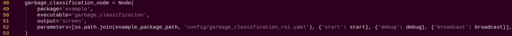

`garbage_classification_node`: Starts the waste classification node.

**(2) Source Code Analysis**


File Path:

`~/ros2_ws/src/example/example/garbage_classification/garbage_classification.py`

**① Main Function**


The main function calls the waste classification class to start the node.

**② GarbageClassificationNode**

`init_process`:


Initializes the robot arm movements and starts the `pick` function and `main` function in separate threads, then publishes the current node state.

`get_node_state`:


Works with `init_process` to initialize the node state.

`play`:

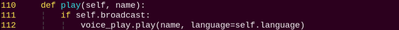

Announces the corresponding waste category via voice.

`shutdown`:


Callback function to close the program, sets `running` to `False` to stop execution.

`send_request`:


Publishes the detected hand position to the kinematics node and receives the corresponding servo angles as feedback.

**start_srv_callback:**


Starts the YOLOv8 recognition for waste classification and provides feedback on the current program status.

`stop_srv_callback`:


Stops the current program and halts YOLOv8 recognition.

`image_callback`:


Used to read image data and place it into a queue for convenient access.

`pick`:


Triggers the corresponding action group based on the recognized category.

`main`:


Determines whether to start sorting based on the target color and ROI.

`get_object_callback`:


Used to read the recognition results from YOLOv8.


* **Fix-Point Navigation and Transportation**

**1. Program Introduction**

First, subscribe to the camera node's published topic to obtain the image feed.

Next, activate the navigation service to acquire the target destination's coordinates.

Finally, upon reaching the destination and identifying the target color block, the servo control node publishes topic messages to control the robotic arm to perform the pick-and-place operation.

**2. Operation Steps**

> [!NOTE]
>
> **When entering commands, be sure to use correct case and spacing. You can use the Tab key to auto-complete keywords.**

(1) Before starting, complete the Lidar mapping of the area where navigation and transport will be performed, and prepare the color blocks. Use red markers within the area to indicate the placement locations. For more information on Lidar mapping, please refer to [6.1 Mapping Instruction](https://wiki.hiwonder.com/projects/LanderPi/en/latest/docs/6_Mapping_Navigation_Course.html#mapping-instruction).

(2) Power on LanderPi and connect it to the remote control software VNC. For detail informations, please refer to [1.4 Development Environment Setup and Configuration](https://wiki.hiwonder.com/projects/LanderPi/en/latest/docs/1_LanderPi_User_Manual.html#development-environment-setup-and-configuration) in the user manual.

(3) Click the terminal icon  in the system desktop to open a command-line window.

(4) Enter the command to disable the app auto-start service.

```
~/.stop_ros.sh
```

(5) Enter the command to first perform the robot arm pick calibration:

```
ros2 launch example automatic_pick.launch.py debug:=true
```


(6) Press **Ctrl + C** in the terminal to exit the pick calibration. Then, start the navigation and transport feature with:

```
ros2 launch example navigation_transport.launch.py map:=map_01
```

> [!NOTE]
>
> **By default, the robot will place the picked color block at the next waypoint. If you want it to place the block at a specific target color location, add `place_without_color:=false`.**

(7) To exit the feature, press **Ctrl+C** in the terminal.

If the shutdown fails, you can open a new terminal and enter the command to terminate all currently running ROS processes.

```
~/.stop_ros.sh
```

**3. Program Outcome**

After opening RViz, check whether the robot's position on the map matches its actual position. If it doesn't, adjust it manually using the 2D Pose Estimate tool in RViz.

RViz provides four main tools in the menu bar: 2D Pose Estimate, 2D Goal Pose, Publish Point, and Nav2 Goal.


**2D Pose Estimate** sets the robot's initial position. **2D Goal Pose** sets a single target point for the robot, suitable for basic navigation tasks without considering obstacle avoidance or path planning. **Publish Point** sets multiple target points for the robot. **Nav2 Goal** sets more complex navigation goals, such as specifying a target point, a target orientation, or a target area.

To set a target point, click **2D Goal Pose** in the menu bar, then click once on the desired location in the map interface. The robot will automatically generate a path and move to the selected point.


When the robot reaches a location with a **red block**, it will automatically pick up the block. After navigating to the next location, the robot will automatically place the block, completing the transport task.

> [!NOTE]
>
> **After starting the program, only one pick-and-place action can be completed. To perform another pick-and-place, the feature must be restarted.**

**4. Program Brief Analysis**

**(1) launch File Analysis**


File Path: `~/ros2_ws/src/example/example/navigation_transport/navigation_transport.launch.py`


**① Launching Other Files**


`automatic_pick_launch`: Aligns with the target color and picks up objects.

`navigation_launch`: Starts the navigation system.

`bringup_launch`: Initializes the robot's actions.

**② Starting Nodes**


`navigation_transport_node`: Starts the navigation and transport node.

`rviz_node`: Launches the RViz visualization tool.

**(2) Source Code Analysis**


File Path: `~/ros2_ws/src/example/example/navigation_transport/navigation_transport.py`

**① Main Function**


The main function calls the navigation transport class to start the node.

**② NavigationTransport**

`get_node_state`:


Works with `init_process` to initialize the node state.

`send_request`:


Sends detected information to a specified service.

`start_pick_srv_callback`:


Sets navigation points in RViz and starts picking objects according to the points.

`start_place_srv_callback`:


Sets navigation points in RViz and starts placing objects according to the points.

`goal_callback`:


Navigation node callback that switches between pick and place modes based on the currently set navigation points.

### 9.2.2 3D Vision

> [!NOTE]
>
> **Ackermann chassis does not support anti-fall, bridge crossing, or object-tracking features.**

* **Fall Prevention**

**1. Program Introduction**

During operation, a mobile robot may encounter steps or ground depressions. Without proper detection and handling, the robot risks falling. On flat ground, distance measurements in two adjacent areas remain continuous and stable.

However, when the robot approaches a step or depression, the depth values captured by the sensor will show a sudden drop. Therefore, ensuring motion safety during autonomous navigation is critical. By using a depth camera, the robot can collect depth information from the scene and determine whether the forward path is safe.

**2. Operation Steps**

> [!NOTE]
>
> **When entering commands, be sure to use correct case and spacing. You can use the Tab key to auto-complete keywords.**

(1) Power on the robot and connect it to the remote control software VNC. For detail informations, please refer to [1.4 Development Environment Setup and Configuration](https://wiki.hiwonder.com/projects/LanderPi/en/latest/docs/1_LanderPi_User_Manual.html#development-environment-setup-and-configuration) in the user manual.

(2) Click the terminal icon  in the system desktop to open a command-line window.

(3) Enter the command to disable the app auto-start service.

```
~/.stop_ros.sh
```

(4) Entering the following command to start the fall prevention feature.

```
ros2 launch example prevent_falling.launch.py debug:=true
```

(5) To exit the feature, press **Ctrl + C** in the terminal. If the program does not close successfully, try pressing **Ctrl + C** again.

**3. Program Outcome**

After starting this feature, the robot will move forward autonomously. When it encounters terrain in front that is either too high or too low, the robot will automatically turn in place, then recheck whether the ground ahead is flat. If the terrain is level, the robot will continue moving forward. Otherwise, it will keep turning in place until it detects a flat surface ahead.

> [!NOTE]
>
> **When using this function for the first time, or if the robot's placement has been changed or its position is altered, you must run the command `ros2 launch example prevent_falling.launch.py debug:=true` to calibrate the ground and obtain a safe baseline. After calibration, simply running `ros2 launch example prevent_falling.launch.py` will allow the robot to operate normally with the previously established safe reference.**

**4. Program Brief Analysis**

**(1) launch File Analysis**


File Path: `~/ros2_ws/src/example/example/rgbd_function/prevent_falling.launch.py`

**① Launching Other Files**


`depth_camera_launch`: Starts the camera.

`controller_launch`: Starts the chassis and servo control nodes.

**② Starting Nodes**


`prevent_falling_node`: Starts the fall prevention node.

**(2) Python Program Analysis**


This section provides a program-level analysis of the fall-prevention function. The program source code can be found at: `~/ros2_ws/src/example/example/rgbd_function/prevent_falling_node.py`

**① System Structure**

In the ROS2 node program, the main components include:


Depth Camera Subscription: Subscribes to the `/ascamera/camera_publisher/depth0/image_raw` topic to obtain depth images.

Motion Control Publisher: Publishes velocity commands to `/controller/cmd_vel` to control the chassis movement.

Servo Control: Sends commands to `/servo_controller` to adjust the robot's posture.

**② Detection Mechanism**

ROI (Region of Interest) Setup:


Three ROIs are defined to monitor the ground distance in the left, center, and right areas ahead of the robot.

**③ Distance Calculation:**


For each ROI region:

Extracts depth values.

Filters out invalid values including zeros and excessively large readings.

Computes the average depth distance in meters.

**④ Fall-Prevention Strategy**


Fall-Prevention Principle:

Reference Height: `self.plane_high` stores the baseline depth distance of flat ground.

Fall Detection: If the distance in any ROI differs from the baseline by more than 2 cm, the system considers it a fall risk.

Evasion Action: When a risk is detected, the robot immediately performs an in-place rotation with an angular velocity of 0.8 rad/s.

Safe Forward Motion: When no risk is detected, the robot continues moving forward at 0.2 m/s.

**⑤ Adaptive Calibration (Debug Mode)**


In debug mode, the program automatically calibrates the ground height as the baseline value. The calibrated parameter is stored in the path of `/home/ubuntu/ros2_ws/src/example/config/plane_distance.yaml`. When `debug` is set to `true`, calibration will be performed.

* **Bridge Crossing**

**1. Program Introduction**

Crossing a single-plank bridge requires the integration of balance control and environmental perception.

First, in order to maintain balance, the robot must have precise posture control capabilities, including accurate control of its center of gravity and joint angles of its legs. This relies on the robot's dynamic model and control algorithms, such as PID control or fuzzy control. In addition, environmental perception plays a crucial role. The robot needs to sense environmental information in real time, including the width, height, and inclination of the plank bridge, so that posture adjustments can be made accordingly. Finally, extensive experiments and tuning are required to enable the robot to successfully cross the single-plank bridge.

**2. Operation Steps**

> [!NOTE]
>
> **When entering commands, be sure to use correct case and spacing. You can use the Tab key to auto-complete keywords.**

(1) Power on the robot and connect it to the remote control software VNC. For detail informations, please refer to [1.4 Development Environment Setup and Configuration](https://wiki.hiwonder.com/projects/LanderPi/en/latest/docs/1_LanderPi_User_Manual.html#development-environment-setup-and-configuration) in the user manual.

(2) Click the terminal icon  in the system desktop to open a command-line window.

(3) Enter the command to disable the app auto-start service.

```
~/.stop_ros.sh
```

(4) Entering the following command to start the bridge crossing feature.

```
ros2 launch example cross_bridge.launch.py debug:=true
```

> [!NOTE]
>
> **Ackermann chassis does not support this feature.**

(5) To exit the feature, press **Ctrl + C** in the terminal. If the program does not close successfully, try pressing **Ctrl + C** again.

**3. Program Outcome**

Once the props are set up, start the program. The robot will automatically adjust its posture to keep itself balanced while moving across the "single-plank bridge" without falling off.

> [!NOTE]
>
> **When starting the bridge crossing feature for the first time or whenever the robot's position has changed, you must run the command `ros2 launch example cross_bridge.launch.py debug:=true`. This step calibrates the robot to the current bridge and establishes a reference state for detection. After calibration, simply run `ros2 launch example cross_bridge.launch.py`. The robot will then perform the bridge crossing task based on the previously calibrated reference.**

**4. Program Brief Analysis**

**(1) launch File Analysis**


File Path: `~/ros2_ws/src/example/example/rgbd_function/cross_bridge.launch.py`

**① Launching Other Files**


`depth_camera_launch`: Starts the camera.

`controller_launch`: Starts the chassis and servo control nodes.

**② Starting Nodes**


**(2) Python Program Analysis**


This section analyzes the program logic behind the bridge crossing feature. The source code can be found at `~/ros2_ws/src/example/example/rgbd_function/cross_bridge_node.py`

**Depth Perception**

The node subscribes to the topic `/ascamera/camera_publisher/depth0/image_raw` to continuously acquire depth data from the front view.

**Three-Point Detection Strategy**

The algorithm defines three key Regions of Interest (ROIs).


**Reference Distance Calibration (Debug Mode)**

In debug mode, during the first 50 frames the program automatically calibrates the plane height `self.plane_high`.


The reference distance is then stored in the configuration file as the safety plane: `/home/ubuntu/ros2_ws/src/example/config/plane_distance.yaml`.


**Core Algorithm for Bridge Crossing**


Algorithm Logic:

Distance Deviation Detection

The algorithm compares the distance of the three detection points with the reference plane `self.plane_high`.

If the difference exceeds 2 cm, the region is treated as a potential cliff or obstacle.

Obstacle Avoidance and Steering Strategy

If a drop-off is detected on the left, the robot turns right with negative z-axis angular velocity.

If a drop-off is detected on the right, the robot turns left with positive z-axis angular velocity.

The turning angle is further adjusted based on the center region:

If the center also indicates danger, the robot performs large steering (±1.0 rad/s).

If the center is safe, the robot performs minor correction (±0.2 rad/s).

Emergency Stop Mechanism


If all three left, center, and right regions detect drop-off risks, the robot immediately stops moving.

**Real-Time Adjustment and Fault Tolerance**

Dynamically adjusts the detection area positions, and the left and right ROIs are shifted accordingly in non-debug mode.

Handles `NaN` invalid values to ensure stable execution.

Uses a queue to buffer image frames and prevent processing delays.

* **Object Tracking**

**1. Program Introduction**

The object tracking experiment demonstrates how to achieve vision-based object tracking combined with robotic motion control. It integrates image processing, point cloud processing, PID control, robot motion control, as well as visualization and interactive features. This function can be used to guide the robot to automatically track and approach a specific object.

**2. Operation Steps**

> [!NOTE]
>
> **When entering commands, be sure to use correct case and spacing. You can use the Tab key to auto-complete keywords.**

(1) Power on the robot and connect it to the remote control software VNC. For detail informations, please refer to [1.4 Development Environment Setup and Configuration](https://wiki.hiwonder.com/projects/LanderPi/en/latest/docs/1_LanderPi_User_Manual.html#development-environment-setup-and-configuration) in the user manual.

(2) Click the terminal icon  in the system desktop to open a command-line window.

(3) Enter the command to disable the app auto-start service.

```
~/.stop_ros.sh
```

(4) Entering the following command to start the object tracking feature.

```
ros2 launch example track_object.launch.py
```

> [!NOTE]
>
> **Ackermann chassis does not support this feature.**

(5) To exit the feature, press **Ctrl + C** in the terminal. If the program does not close successfully, try pressing **Ctrl + C** again.

**3. Program Outcome**

Once the feature is started, the camera tracks the object and controls the robot's movement accordingly.

**4. Program Brief Analysis**

**(1) launch File Analysis**


File Path: `~/ros2_ws/src/example/example/rgbd_function/track_object.launch.py`

**① Launching Other Files**


`depth_camera_launch`: Starts the camera.

`controller_launch`: Starts the chassis and servo control nodes.

**② Starting Nodes**


`track_object_node`: Starts the object tracking node.

**(2) Python Program Analysis**

This section provides a program-level analysis of the fall-prevention function. The program source code can be found at: `~/ros2_ws/src/example/example/rgbd_function/track_object_node.py`


**Data Acquisition and Synchronization**


The program subscribes to the RGB image, depth image, and camera parameters, and uses a time synchronizer to ensure all three data streams are aligned.

**Point Cloud Generation and Processing**


Fuse RGB and depth images to generate an RGBD image.

Use the camera's intrinsic parameters to convert the RGBD image into a 3D point cloud.

Crop the point cloud with a predefined Region of Interest (ROI) to retain only the relevant area.

**Ground Removal**


Apply the RANSAC algorithm to detect and remove the largest plane, typically the ground, keeping only the object's point cloud.

**Object Recognition and Localization**


Identify the point in the cloud with the maximum Z-coordinate, which is the object closest to the camera.

Mark this point as the target point and display in yellow.

**PID Control and Motion Planning**


X-axis control (forward/backward movement):

A PID controller adjusts the robot's distance to the target.

The target distance is set to 0.4 m using `self.stop_distance`.

Y-axis control (lateral movement or steering):


The Mecanum chassis robots moves sideways directly.

The Tank or Ackerman chassis robots adjusts direction through steering.

**Real-Time Control Output**


The calculated control commands are published to the chassis control topic, enabling real-time object tracking.

* **Object Tracking and Grasping**

**1. Program Introduction**

This experiment combines depth vision and robotic control to identify and track objects of a specific color, and then perform precise grasping actions. Using a depth camera, the system captures both image and depth data. A color-tracking algorithm locates the target object, and the robot arm executes the manipulation task. The functions include detecting objects of a specific color in the image using the OpenCV library, calculating the object's exact position in 3D space with depth data, and applying a PID controller to adjust the robot arm's movement for accurate tracking and approach. This method can be applied in automated production lines to achieve precise pick-and-place operations, such as in service robotics and industrial automation.

**2. Operation Steps**

> [!NOTE]
>
> **When entering commands, be sure to use correct case and spacing. You can use the Tab key to auto-complete keywords.**

(1) Power on the robot and connect it to the remote control software VNC. For detail informations, please refer to [1.4 Development Environment Setup and Configuration](https://wiki.hiwonder.com/projects/LanderPi/en/latest/docs/1_LanderPi_User_Manual.html#development-environment-setup-and-configuration) in the user manual.

(2) Click the terminal icon  in the system desktop to open a command-line window.

(3) Enter the command to disable the app auto-start service.

```
~/.stop_ros.sh
```

(4) Entering the following command to start the object tracking and grasping feature.

```
ros2 launch example track_and_grab.launch.py
```

(5) To exit the feature, press **Ctrl + C** in the terminal. If the program does not close successfully, try pressing **Ctrl + C** again.

**3. Program Outcome**

Once the feature is started, the system detects objects such as cylinders, cubes, and spheres in the camera view. The robot arm then tracks the detected object and performs a grasp once it is identified.

**4. Program Brief Analysis**

**(1) launch File Analysis**


File Path: `~/ros2_ws/src/example/example/rgbd_function/track_and_grab.launch.py`

**① Launching Other Files**


`depth_camera_launch`: Starts the camera.

`controller_launch`: Starts the chassis and servo control nodes.

`kinematics_launch`: Launches the kinematics node, which calculates the required servo angles from 3D coordinates.

**② Starting Nodes**


`track_object_node`: Starts the object tracking and grasping node.

**(2) Python Program Analysis**

This section provides a program-level analysis of the fall-prevention function. The program source code can be found at: `~/ros2_ws/src/example/example/rgbd_function/track_and_grab.py`


The program is primarily composed of two core classes:

`ColorTracker`: Responsible for color tracking and vision processing.

`TrackAndGrabNode`: A ROS2 node managing the overall control workflow.

**Vision Tracking (`ColorTracker` Class)**

Color Detection and Tracking


Target Localization and Servo Control

Uses a PID controller to adjust the camera's yaw and pitch angles, keeping the target centered in the image.

Calculates deviations when the target moves away from the center and adjusts the servo angles accordingly.

**Depth Information Processing**

Coordinate Conversion


3D Position Calculation

Acquires the target's distance using the depth camera.

Converts pixel coordinates to 3D world coordinates using the camera's intrinsic parameters.

**Grasping Workflow**

Trigger Conditions


Execution:


**Coordinate System Conversion**

Hand-Eye Calibration:


Coordinate Transformation Workflow:


Camera frame → End-effector frame

End-effector frame → World frame

World frame → Robot arm joint angles

**Main Execution Flow**

Initialization: Set initial servo positions and wait for target color assignment.

Image Synchronization: Align RGB images, depth images, and camera parameters.

Target Tracking:

Detect the object with the target color.

Apply PID control to servo angles to maintain the target at the image center.

Position Calculation:

Obtain the target's pixel coordinates and depth.

Convert to 3D world coordinates.

Execution:

Trigger the grasp once the target has been stably tracked for 2 seconds.

Execute the full pick-and-place motion sequence.

Reset: After grasping, reset the system state to prepare for the next tracking task.

* **Object Classification**

**1. Program Introduction**

Object classification has wide applications in industry, such as part sorting on production lines and cargo classification in logistics warehouses. These applications require fast and accurate object recognition and classification to improve production efficiency and automation.

On production lines, robots can use machine vision and image processing to identify different types of parts and sort them according to predefined classification criteria. This improves efficiency and accuracy while reducing manual intervention and errors.

In addition, object classification has many other industrial applications, such as quality inspection, defect detection, and automated assembly. All these applications rely on rapid and precise recognition and classification to ensure stable production processes and high product quality.

This section simulates industrial object classification by enabling the robot to recognize objects of different shapes and colors in the current environment.

<p id="operation_steps_14"></p>

**2. Operation Steps**

> [!NOTE]
>
> **When entering commands, be sure to use correct case and spacing. You can use the Tab key to auto-complete keywords.**

(1) Power on the robot and connect it to the remote control software VNC. For detail informations, please refer to [1.4 Development Environment Setup and Configuration](https://wiki.hiwonder.com/projects/LanderPi/en/latest/docs/1_LanderPi_User_Manual.html#development-environment-setup-and-configuration) in the user manual.

(2) Click the terminal icon  in the system desktop to open a command-line window.

(3) Enter the command to disable the app auto-start service.

```
~/.stop_ros.sh
```

(4) Entering the following command to start the object classification feature.

```
ros2 launch example object_classification.launch.py
```

(5) To exit the feature, press **Ctrl + C** in the terminal. If the program does not close successfully, try pressing **Ctrl + C** again.

**3. Program Outcome**

Place the objects to be recognized—such as **cubes**, **spheres**, and **cylinders**, including their colors—within the camera's view. The camera will detect and grasp the objects one by one, prioritizing those closest to the center of the camera frame. After a successful grasp, each object will be placed in its designated location according to its category.

**4. Program Brief Analysis**

**(1) launch File Analysis**


File Path: `~/ros2_ws/src/example/example/rgbd_function/track_and_grab.launch.py`

**① Launching Other Files**


`depth_camera_launch`: Starts the camera.

`controller_launch`: Starts the chassis and servo control nodes.

`kinematics_launch`: Launches the kinematics node, which calculates the required servo angles from 3D coordinates.

**② Starting Nodes**


`object_classification_node`: Starts the object classification node.

**(2) Python Program Analysis**

This section provides a program-level analysis of the object classification function. The program source code can be found at: `~/ros2_ws/src/example/example/rgbd_function/object_classification.py`

The flowchart below outlines the logic of the program based on this file.


**Sensor Input**

Uses a depth camera to capture both RGB and depth images simultaneously.

Synchronizes RGB images, depth images, and camera parameters using ROS2 message filters.


**Core Algorithm for Shape Recognition**

Plane Detection and Object Extraction


Shape Classification Algorithm


The program identifies different shapes based on the following features:

Sphere Detection:

The depth standard deviation is greater than 53.0, indicating a large variation in depth across the spherical surface.

Number of contour corners ≥ 4.

Cube Detection:

The depth standard deviation is greater than 41.0, indicating that the surface has a certain degree of depth variation.

Does not meet sphere criteria.

Cylinder Detection:

Aspect ratio close to 1 with error less than 0.2.

The standard deviation of the distances from the contour points to the minimum enclosing circle is less than 5, indicating a high degree of circularity.

Horizontal Cylinder:

Significant difference in width and height.

**Grasping Pose Calculation**

Computes the optimal grasp angle for each object.


Target Selection Strategy


Detects objects that are stable before attempting grasping.


Robot Arm Control and Sorting


Sphere is placed in Position 1.

Cylinder is placed in Position 2.

Cube is placed in Position 3.

**Program Workflow**

Initialization: Move the robot arm to the observation position.

Image Acquisition: Synchronously capture RGB and depth images.

Preprocessing: Extract ROI and filter depth images.

Shape Recognition: Extract contours, compute features, classify shapes.

Target Selection: Choose the nearest target shape.

Pose Calculation: Compute a collision-free grasp angle.

Stability Detection: Ensure the object is stationary.

Grasp Execution: Control the robot arm to perform pick-and-place.

Classification and Placement: Place each object in the designated location according to its shape.

Convert pixel coordinates to world coordinates.

Class:

**`ObjectClassificationNode`:**


`Init`:


Initializes parameters required for object classification and calls the servo control, chassis control, camera node, and kinematics node. Provides services: `start`, `stop`, `set_shape`, `set_color`, which use RGB and depth images with synchronized timestamps to ensure real-time recognition.

`init_process`:


Initializes robot arm pose, shape, and color, then calls the main function.

`get_node_state`:


Initializes the node state.

`send_request`:


Publishes a service request.

`set_shape_srv_callback`:


Sets the target shape, allowing the robot to recognize a specific shape by providing it as a string input.

`start_srv_callback`:


Starts the object classification service.

`exit_srv_callback`:


Stops the object classification service and clears parameters.

`multi_callback`:


Reads depth and RGB images, synchronizes them, and pushes them into a queue.

`shape_recognition`:


This function performs shape recognition. It first determines whether to process an object based on the contour area. The object contours are drawn using OpenCV to obtain their width, height, and angle. Then, the standard deviation of points on the contour is calculated to classify the shape of each object.

`main`:


This is the main function for object classification. It processes the camera data by first identifying object shapes using depth information, then comparing the contours' colors in the RGB image to determine if they match the target color. The detected contours are sorted based on their height, and the objects are subsequently grasped and classified according to this order.

**5. Grasp Calibration**

By default, the program parameters are configured for the Mecanum chassis, and the detection and grasping area is centered in the camera view. If you are using an Ackerman or tracked chassis, the robot arm may fail to grasp the color blocks during operation. You can adjust the grasping area using the program by following these steps:

(1) Power on the robot and connect it to a remote control tool like VNC.

(2) Click the terminal icon  in the system desktop to open a command-line window.

(3) Enter the command to disable the app auto-start service.

```
~/.stop_ros.sh
```

(4) Enter the command to switch to the corresponding directory.

```
cd ros2_ws/src/example/example/rgbd_function/utils
```

(5) To begin grasp calibration, enter the following command:

```
python3 plane_fit_node.py
```

Place a color block in the center of the robotic gripper when the arm reaches the grasping position. Wait for the arm to reset and attempt a grasp again to complete the calibration.

(6) After calibration, follow the steps in section [2. Operation Steps](#operation_steps_14) to operate the feature again.