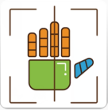
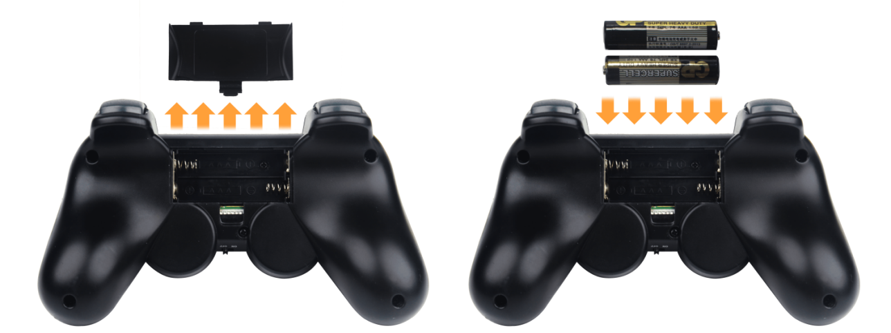
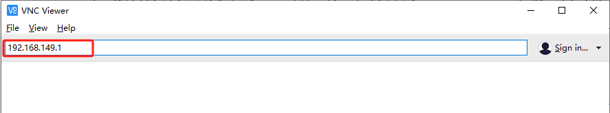
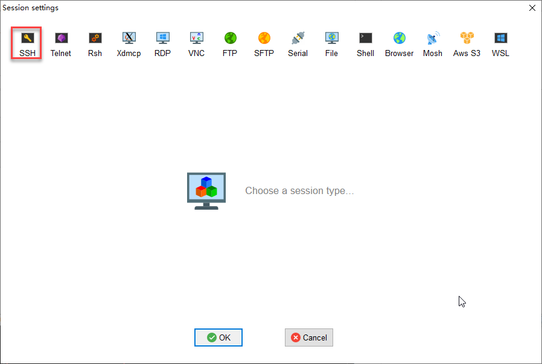
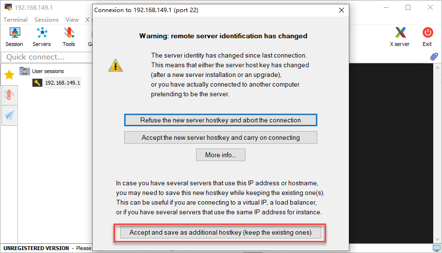
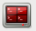
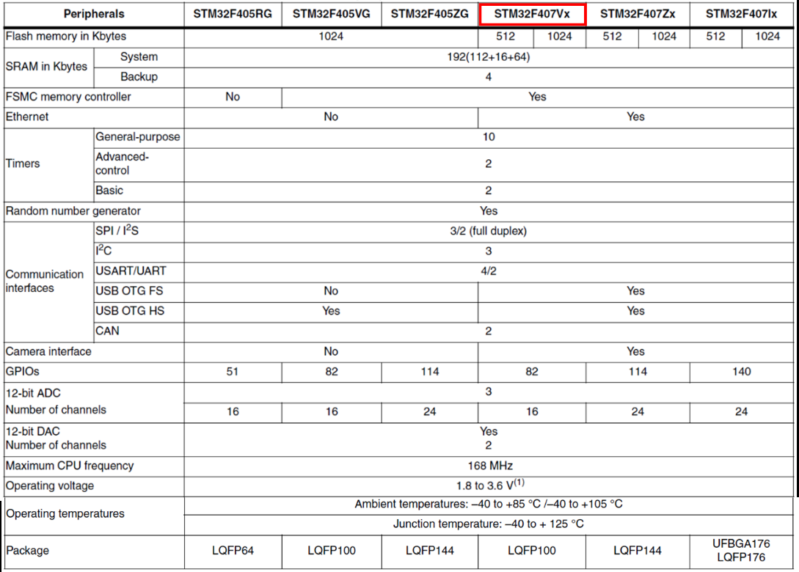
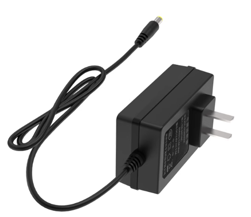
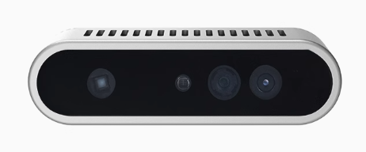

# LanderPi User Manual

## 1. Product Overview

LanderPi is a ROS 2-powered robot built on the Raspberry Pi 5 platform. It is available with a Mecanum chassis, an Ackerman chassis, or a Tank chassis, and comes equipped with advanced hardware including a TOF Lidar and a 3D depth camera. With these hardwares, LanderPi supports intelligent applications such as mapping navigation, path planning, image recognition, vision tracking, and human–robot interaction.


The following packing list uses the Mecanum chassis version as an example. The same accessories also apply to the Ackerman and Tank chassis versions.


## 2. Accessories Installation and Startup Preparation

### 2.1 Assembly Instructions


Wiring for the Mecanum chassis:


Wiring for the Ackerman chassis:


> Wiring for the Tank chassis:


### 2.2 Wiring Instruction

The diagram below shows the port numbers on the Raspberry Pi controller for the Advanced kit. Please follow the table for wiring. If your kit does not include certain modules, you may skip the corresponding ports.


| **No.** |                    **Name**                     |
|:-------:|:-----------------------------------------------:|
|    1    |                   Lidar port                    |
|    2    |           Monocular/Depth camera port           |
|    3    |      STM32 controller communication cable       |
|    4    | WonderEcho Pro/USB wireless controller receiver |

## 3. Getting Started

### 3.1 Charging Instructions

Since the robot must be powered off during transportation and the battery cannot be fully charged, you need to connect the battery cable to charge the battery before first use. Charging the battery from 7.0 V to about 8.4 V takes approximately one hour.

### 3.1.1 Battery Safety Guidelines

(1) Always use the dedicated charger included with the kit to charge the robot. Turn off the robot while charging. Do not operate the robot and charge the battery at the same time.

(2) When the charger is connected to the battery but not plugged into a power outlet, the indicator light shows green. During charging, the indicator light turns red. When fully charged, it will return to green.

(3) Disconnect the charging cable promptly after charging to avoid overcharging and battery damage.

(4) To ensure stable robot performance, recharge the battery when its voltage drops below 7.0 V, indicated by a beeping buzzer on the expansion board.

(5) If the robot will not be used for an extended period, fully charge the battery and disconnect the battery cable from the power line.

(6) Store the battery in a cool, dry place to prevent reduced lifespan due to overheating or moisture. Do not hit, throw, or step on the battery.

(7) Do not use the battery in environments with strong static electricity or magnetic fields, as this may damage its safety protection circuitry.

(8) Do not plug the battery directly into a wall socket. Do not short-circuit the battery terminals with metal objects.

(9) Over-discharging may prevent the battery from recharging and could render it unusable. For long-term storage, fully charge the battery first.

(10) Do not attempt to modify, solder, or alter the battery or charger in any way.

(11) Keep batteries away from high temperatures and liquids to avoid overheating, fire hazards, or moisture-related damage.

> [!NOTE]
>
> **Hiwonder is not responsible for any damage, economic loss, or safety incidents resulting from improper use of the product that does not follow the instructions outlined in this manual.**

#### 3.1.2 Charging Instructions

Charging Steps:

(1) Make sure the device's power switch is set to OFF.

(2) Take out the battery's DC connector from the side of the robot and plug in the charger. 

> [!NOTE]
>
> **For the tracked base, you need to remove the bottom screws and detach the bracket before charging.**


(3) Check the indicator light on the charger to monitor the charging status. The indicator shows red while charging and turns green when charging is complete.


> [!NOTE]
>
> **After charging is complete, unplug the charger promptly to prevent overcharging.**

### 3.2 First Startup and Test

In this section, you will learn about the startup sequence of the robotic arm and verify the functionality of each module. After completing this step, you can proceed to the following chapters to explore app control and wireless controller control.

If you need to connect to the robot using remote development tools, or wish to further explore advanced functions and review sample programs, please refer to the section "[**4. Development Environment Setup and Configuration**](#development-environment-setup-and-configuration)" in this document.

#### 3.2.1 Before Powering On

(1) To ensure stable operation, recharge the battery promptly when its voltage drops below 7.0 V.

(2) Do not place the robot near the edge of a table to avoid accidental falls and damage.

(3) Always operate the robot on a flat, stable surface.

(4) Do not stack robotic arms, as this may cause stalling on startup, potentially damaging the servos.

(5) Avoid running the robotic arm under high-load conditions for extended periods. Prolonged overload can shorten servo lifespan or cause permanent damage.

(6) Maintain a safe distance from the robot before powering on to prevent accidental contact with moving parts.

(7) Before performing functionality tests, ensure that all wiring is connected correctly, the wireless controller receiver is properly plugged in, system sound on the top-right corner of the desktop is enabled, and the robot is fully charged.

#### 3.2.2 Startup Status and Test

(1) Place the robot on a flat, smooth surface and switch it on from the power button on the right side.


(2) The blue LED1 at the lower right of the expansion board on the Raspberry Pi will light up and start blinking. At this stage, only the network configuration service is running, the ROS system and other services are still starting up. Wait until the buzzer emits a short beep — this indicates the system has finished booting.


> [!NOTE]
>
> **If the buzzer does not beep, hardware such as the IMU, buzzer, or buttons may be malfunctioning. This is rare during normal use. If it occurs, please contact customer support.**

(3) By default, the device is configured in AP direct-connect mode. After startup, a Wi-Fi hotspot beginning with "HW" will appear. To connect via mobile app or remote desktop, enter the default password: **hiwonder**.


> [!NOTE]
>
> **If the hotspot does not appear after startup, follow these troubleshooting steps:**

(1) Verify all steps in [3.2 Startup Status and Test](#first-startup-and-test) have been followed.

(2) If LED1 stays solid blue instead of blinking, the system may be in LAN mode. Long-press the KEY1 button on the expansion board for 5–10 seconds. If LED1 starts blinking, the HW Wi-Fi hotspot has been re-enabled.

(3) If LED1 does not blink after pressing KEY1, the system may not detect the SD card. Remove and reinsert the SD card.

(4) If LED1 still stays solid after reinserting, the SD card may be faulty or the system image may not have been written properly. Replace the SD card or re-flash the image.

(5) If the issue persists after replacing the SD card and re-flashing, the Raspberry Pi core board may be defective. Please contact customer support.

The following table outlines how to test each hardware module.

<table class="docutils-nobg" border="1">
<colgroup>
<col style="width: 26%" />
<col style="width: 35%" />
<col style="width: 37%" />
</colgroup>
<thead>
<tr>
<th style="text-align: center;"><strong>Module</strong></th>
<th style="text-align: center;"><strong>Test Step</strong></th>
<th style="text-align: center;"><strong>Expected Result</strong></th>
</tr>
</thead>
<tbody>
<tr>
<td style="text-align: center;">Expansion Board LED</td>
<td style="text-align: center;">Observe LED status</td>
<td style="text-align: left;">In factory default AP mode, LED1 stays on, and LED2 blinks once per second.</td>
</tr>
<tr>
<td style="text-align: center;">Buzzer</td>
<td style="text-align: center;">Listen for short beep</td>
<td style="text-align: left;">A short beep indicates the onboard hardware of the expansion board is working.</td>
</tr>
<tr>
<td style="text-align: center;">Lidar</td>
<td style="text-align: center;">Observe rotation</td>
<td style="text-align: left;">After a few seconds, the Lidar should begin rotating.</td>
</tr>
<tr>
<td style="text-align: center;">Depth Camera/Monocular Camera</td>
<td style="text-align: left;"><p>1) Open the app and connect to the robot.</p>
<p>2) Open the "Robot Control" function to view the live feed from the camera.</p>
<p>3) Swipe the screen to control the pan-tilt servo, monocular camera only.</p></td>
<td style="text-align: left;">The live video feed is displayed, and the joints move accordingly.</td>
</tr>
<tr>
<td style="text-align: center;">Encoder Motors + STM32 controller</td>
<td style="text-align: left;">Control via wireless controller or Robot Control in the app</td>
<td style="text-align: left;">The robot moves normally.</td>
</tr>
</tbody>
</table>

> [!NOTE]
>
> * **If the buzzer does not beep, hardware such as the IMU sensor and buzzer may be malfunctioning. This is rare during normal use. If it occurs, please contact customer support.**
>
> * **If the device hotspot is not found, check whether LED1 on the expansion board is steady on and LED2 blinks once per second.**

### 3.3 App Installation and Connection

To control the robot with the **WonderPi** app, you can download the app from the App Store or the Hiwonder official website. This section explains how to get the app installation package.

> [!NOTE]
>
> * **Please grant all permissions requested during installation to ensure the app functions properly.**
>
> * **Turn on your phone's GPS and Wi-Fi before opening the app.**

#### 3.3.1 App Installation

**Method 1: App Store**

(1) Android devices: Locate the installation package in the directory of [App Installation Package](https://play.google.com/store/apps/details?id=com.Wonder.Pi) and import it to your phone to install.

(2) iOS devices: Search for **[WonderPi](https://apps.apple.com/cn/app/wonderpi/id1477946178)** in the App Store, and download the app.


**Method 2: Hiwonder Official Website**

(1) Visit the Hiwonder tutorials website: <https://www.hiwonder.net/app-software>


(2) Navigate to the software download page.


(3) Locate **WonderPi** and choose the installation package suitable for your device.


Download Options in Different Scenarios:

<table class="docutils-nobg" border="1">
<colgroup>
<col style="width: 12%" />
<col style="width: 15%" />
<col style="width: 28%" />
<col style="width: 42%" />
</colgroup>
<thead>
<tr>
<th style="text-align: center;"><strong>Device</strong></th>
<th style="text-align: center;"><strong>System</strong></th>
<th style="text-align: center;"><strong>Operation</strong></th>
<th style="text-align: center;"><strong>Result</strong></th>
</tr>
</thead>
<tbody>
<tr>
<td style="text-align: center;">PC</td>
<td style="text-align: center;">Android</td>
<td>Click "Android Download."</td>
<td>The browser automatically downloads the installation package. Once the download is complete, transfer it to your phone for installation.</td>
</tr>
<tr>
<td rowspan="3" style="text-align: center;">Mobile</td>
<td rowspan="2" style="text-align: center;">Android</td>
<td>Click "Android Download."</td>
<td rowspan="2">The installation package is downloaded automatically. After the download is complete, install it directly on your phone.</td>
</tr>
<tr>
<td>Scan the QR code.</td>
</tr>
<tr>
<td style="text-align: center;">iOS</td>
<td>Click "iOS Download."</td>
<td>Redirects to the App Store for direct installation.</td>
</tr>
</tbody>
</table>

#### 3.3.2 Connection Modes

After installing the app, you can proceed to connect the robot. The robot supports two network modes:

(1) AP Mode (Direct Connection): The controller creates a hotspot that your phone can connect to directly, but no Internet access in this mode.

(2) STA Mode (LAN Connection): The controller connects to a specified Wi-Fi network, and Internet access is available in this mode.

**By default, the robot starts in AP direct connection mode. Regardless of whether the user chooses AP direct connection or STA LAN mode, the robot's features remain the same.**

> [!NOTE]
>
> **We recommend starting with the AP direct connection mode to quickly explore and experience the robot's functions. You can switch to LAN mode later based on your specific needs.**

#### 3.3.3 Connecting in AP Mode (Must Read)

The following demonstration uses an Android device and the Mecanum chassis version as an example. The same procedure also applies to iOS devices.

(1) Open the **WonderPi** and select **Advanced** \> **LanderPi(M1)**.


**For the Ackerman chassis and Tank chassis versions, select LanderPi (A1) or LanderPi (T1), respectively.**

(2) Tap the **+** button in the bottom-right corner and choose **Direct Connection Mode**.


> [!NOTE]
>
> **If you want to use LAN mode for connection, refer to the section LAN Mode Connection (optional).**

(3) Tap **Go to connect device hotspots**, which will take you to the Wi-Fi settings page to connect the hotspot generated by the robot.


(4) The hotspot starts with **HW** and connect to it by entering the password: **hiwonder**.


For iOS users: Make sure the Wi-Fi icon  appears in the status bar before switching back to the app, or the device might not be detected. If the app doesn't detect the device right away, tap the refresh icon  in the upper-right corner.

(5) Tap the corresponding robot icon in the app, and enter the mode selection screen.


**If a message pops up saying "Network is unavailable, continue?", tap "Keep Connection" to proceed.**

(6) If a message appears saying **Whether to switch and enter the searched product interface?** it means the wrong product was selected in Step 1. Tap **CONFIRM** to automatically switch to the correct version's mode selection screen.


(7) The mode selection interface is shown below.


To learn how to use each mode in detail, refer to section [3.4.2 Overview of App Modes](#overview-of-app-modes).

#### 3.3.4 LAN Mode Connection (Optional)

(1) First, connect your phone to a 5G Wi-Fi network. For example, connect to "**Hiwomder_5G**." If you are using a dual-band router with separate SSIDs, the 2.4G and 5G networks will have different names, for example, "**Hiwonder**" for 2.4G and "**Hiwonder_5G**" for 5G.


(2) Open the **WonderPi** and select **Advanced** \> **LanderPi(M1)**.


**For the Ackerman chassis and Tank chassis versions, select LanderPi (A1) or LanderPi (T1), respectively.**

(3) Tap the **+** button in the bottom-right corner and choose **LAN Mode**.


(4) The app will prompt you to enter the Wi-Fi password for the network you're connected to. Make sure you enter the correct password, a wrong password will prevent the connection. After entering the password, tap **OK**.


(5) Tap **Go to connect device hotspots** to switch to the Wi-Fi settings.


(6) In the Wi-Fi list, find the hotspot starting with **HW**, and connect to it using the password: **hiwonder**. After connecting, tap the **Back** button to return to the app.


(7) You will see that the app has started connecting to the robot.


(8) After a few seconds, the robot's icon and name will appear on the main screen. The LED1 indicator on the expansion board will stay on.


(9) Long-press the corresponding icon of your robot in the app to view its assigned IP address and Device ID.


(10) You can search for this IP in the remote desktop tool and establish a connection. For detailed instructions, refer to section [4. Development Environment Setup and Configuration](#development-environment-setup-and-configuration).

(11) If you want to switch back to direct connection mode, long-press the robot icon and select **Set to direct connection mode**. The blue indicator light will start blinking, indicating that the switch was successful.


### 3.4 App Control

You can control the robot via the **WonderPi** app and explore its AI vision features. This section explains the operation of each function within the app. For demonstration, the instructions are shown using Android. The process is the same for iOS devices.

#### 3.4.1 Preparation

(1) First, power on the robot. For details on startup status, refer to section [3.2 First Startup and Test](#first-startup-and-test).

(2) Next, install the WonderPi mobile app and connect the robot. For step-by-step instructions, see section [3.3 App Installation and Connection](#app-installation-and-connection).

#### 3.4.2 Overview of App Modes

The app provides six modes, including Robot Control, Lidar, Object Tracking, Line Following, Finger Recognition, and AR.


The table below offers a detailed overview of each mode.

| **Icon** | **Mode** | **Description** |
|:--:|:--:|----|
|  | Robot Control | Control the robot's movement. |
|  | Lidar | Includes three modes: obstacle avoidance, following, and sentry. |
|  | Object Tracking | Select an object by color, and the robot will track it. |
|  | Line Following | Set a line and define its color as the target. The robot follows the line. |
|  | Finger Recognition | Control the robot to move forward, backward, left/right turn, and strafing by tracing hand gestures. Strafing is only available with the Mecanum chassis version. |
|  | AR | Display predefined 3D images on tags within the camera view. |


#### 3.4.3 Robot Control

Tap **Robot Control** on the mode selection screen to enter the control interface. The interface layout differs slightly between the Mecanum/Tank versions and the Ackerman version. The Robot Control interface for Mecanum & Tracked versions is shown below:


① Left panel from top to bottom: Motion control via gravity sensor, forward/backward movement, and speed adjustment.

② Center panel: Live video feed, drag to adjust the pan-tilt angle.

③ Right panel from top to bottom: Steering controls and pan-tilt rotation.

④ Top menu bar from left to right: Robot arm control, screenshot, toggle navigation bar, full-screen mode, which is mainly used with a wireless controller.

**The Robot Control interface for Ackerman version version is shown below:**


① Left panel from top to bottom: Forward/backward movement and speed adjustment.

② Center panel: Live video feed, drag to adjust the pan-tilt angle.

③ Right panel from top to bottom: Steering controls and pan-tilt rotation.

④ Top menu bar from left to right: Robot arm control, screenshot, toggle navigation bar, full-screen mode, which is mainly used with a wireless controller.

**The interface to control the robot arm is shown in the image below:**

Tap the robot arm control icon  to open the control panel for each servo of the robot arm, then you can control the arm's joints and adjust its movement posture.


| **Icon** | **Function** |
|:--:|:---|
|  | Controls the gripper for picking up and holding objects. |
|  | Moves the wrist joint left and right. |
|  | Moves Joint 4 forward and backward. |
|  | Moves Joint 3 forward and backward. |
|  | Moves Joint 5 forward and backward. |
|  | Control the base servo of the robot arm to rotate it left or right. |

2\) Tap the full-screen icon  to display the live video feed in full screen. This is especially useful when using a wireless controller to control the robot, as it allows you to monitor the real-time camera view.


#### 3.4.4 Lidar

> [!NOTE]
>
> * **Before stating the feature, ensure to place the robot on a spacious surface with enough room to move freely.**
>
> * **In LiDAR Obstacle Avoidance and LiDAR Following modes, the detection range is a 90° fan-shaped area in front of the robot.**
>
> * **The LiDAR Guard mode is not supported when using the Ackerman chassis.**

- **Interface Overview**

Tap **Lidar** on the mode selection screen to enter the control interface. The **Lidar** mode includes three features: Avoid obstacle, Lidar following, and Lidar guarding. This interface is divided into two sections:

(1) The left panel is for enabling or disabling the different features.

(2) The right panel displays the live video feed from the camera.


- **Function**

| **Icon** | **Function** |
|:--:|----|
|  | Enable/disable the Avoid obstacle feature. |
|  | Enable/disable the Lidar following feature. |
|  | Enable/disable the Lidar guarding feature. |
|  | Display the current camera feed. |

- **Operating Steps and Effects**

(1) Avoid obstacle

The robot continuously moves forward. When an obstacle is detected, it automatically changes direction to avoid it.

(2) Lidar following

When an obstacle is detected, the robot adjusts its position to maintain a safe distance from the object.

(3) Lidar guarding

When an obstacle is detected, the robot turns to face the object.


#### 3.4.5 Object Tracking

> [!NOTE]
>
> * **Place the target object on the same surface as the robot and move it in a horizontal direction, which ensures a smoother tracking experience.**
>
> * **Choose an appropriate color range for target extraction. If the range is too wide, unwanted colors may be included. If the range is too narrow, the target may be lost. Also, avoid having objects with similar colors to the target in the camera's view.**

- **Interface Overview**

Tap **Object Tracking** on the mode selection screen to enter the control interface. This interface is divided into two sections:

(1) The left panel contains the mode switch and color extraction tools.

(2) The right panel displays the live video feed from the camera.


- **Function**

| **Icon** | **Function** |
|:--:|----|
|  | Enabling and disabling the feature |
|  | Adjust the color threshold range of 0.05–1.00. |
|  | Extract a color from a selected area in the video feed. |
|  | After tapping **Pick**, the button changes to **OK**, then tap it to confirm the extracted color. |
|  | Display the extracted color. |
|  | Display the current camera feed. |

- **Operating Steps and Effects**

(1) Tap the **Pick** button, then drag the red circle in the video feed to the target object to select its color.


(2) Tap the **OK** button, and the selected color will be displayed in the **Selected color** area.

(3) Tap the **Start** button to activate the feature. Move the target object, and the robot will follow accordingly.


#### 3.4.6 Line Following

> [!NOTE]
>
> * **Before starting this feature, lay out the tracking path with tape and place the robot on the track.**
>
> * **Choose an appropriate color range for target extraction. If the range is too wide, unwanted colors may be included. If the range is too narrow, the target may be lost. Also, avoid having objects with similar colors to the target in the camera's view.**
>
> * **After the feature starts, please ensure there is no other object containing the recognition color except the target object within the camera view, otherwise the recognition result will be affected.**

- **Interface Overview**

Tap **Line Following** on the mode selection screen to enter the control interface. This interface is divided into two sections:

(1) The left panel contains the mode switch and color extraction tools.

(2) The right panel displays the live video feed from the camera.


- **Function**

| **Icon** | **Function** |
|:--:|----|
|  | Enabling and disabling the feature |
|  | Adjust the color threshold range of 0.05–1.00. |
|  | Extract a color from a selected area in the video feed. |
|  | After tapping the **Pick** button, it changes to **OK**. Use it to confirm the extracted color. |
|  | Display the extracted color. |
|  | Display the current camera feed. |

- **Operating Steps and Effects**

(1) In this section, red tape is used as an example. After clicking the **Pick** button, drag the red circle in the live feed to the track to select its color.


(2) Tap the **OK** button, and the selected color will be displayed in the **Selected color** area.

(3) Tap **Start** to begin the feature, and the robot will follow the colored line automatically.


#### 3.4.7 Finger Recognition

> [!NOTE]
>
> * **This feature only supports the right hand.** 
>
> * **During recognition, make sure the entire palm is visible in the camera view.**
>
> * **Avoid moving your hand too quickly.**

- **Interface Overview**

Tap **Finger Recognition** on the mode selection screen to enter the control interface. This interface is divided into two sections:

(1) The left side of the interface contains the feature switch along with gesture control instructions.

(2) The right panel displays the live video feed from the camera.


- **Function**

| **Icon** | **Function** |
|:--:|----|
|  | Enable/disable Gesture Control |
|  | Display the real-time camera feed. Keep your hand open with the palm facing the camera to draw a trajectory. When you make a fist, the robot will turn right. Draw a trajectory in the forward, backward, left, or right direction, and the robot will move accordingly. |

- **Operating Steps and Effects**

(1) Raise your right hand, make a fist, and place it at the center of the camera's field of view, then open your fingers. When you hear a beep, move your hand to draw a trajectory.


(2) Move your open hand in one of the four directions for a short distance, including up, down, left, or right.


(3) Make a fist again. When you hear the beep, the robot will move in the direction of the drawn trajectory.


#### 3.4.8 AR

- **Interface Overview**

Tap **AR** on the mode selection screen to enter the control interface. This interface is divided into two sections:

(1) The left panel displays the live video feed from the camera.

(2) The right panel allows selection of 3D models.


- **Function**

| **Icon** | **Function** |
|:--:|----|
|  | Display the current camera feed. |
|  | Select a 3D model to display on the marker. |

- **Operating Steps and Effects**

Place any of the provided tags within the camera's view, then tap a 3D model from the selection panel, for example, **Bicycle**. The selected 3D model will appear over the tag in the live camera feed.


### 3.5 Wireless Controller Control

#### 3.5.1 Note

(1) Before powering on the device, make sure the wireless controller receiver is properly inserted. This can be ignored if the receiver was pre-inserted at the factory.

(2) Pay attention to battery polarity when placing the batteries.



(3) Each time the robot is powered on, the app auto-start service will launch which includes the wireless controller control service. If this service has not been closed, no additional actions are needed—simply connect and control.

(4) Since signals from wireless controller can interfere with each other, it is recommended not to use this function when multiple robots are in the same area, to avoid misconnection or unintended control.

(5) After turning on the wireless controller, if it does not connect to the robot within 30 seconds, or remains unused for 5 minutes after connection, it will enter sleep mode automatically. To wake up the wireless controller and exit sleep mode, press the "**START**" button.

#### 3.5.2 Device Connection

After the robot powers on, slide the wireless controller switch to the **ON** position. At this point, the red and green LED indicators on the wireless controller will start flashing simultaneously.

Wait a few seconds for the robot and wireless controller to pair automatically. Once pairing is successful, the green LED will remain solid while the red LED turns off.


#### 3.5.3 Button Instruction

The following table describes the functions of the controller buttons and joysticks from the robot's first-person perspective:

> [!NOTE]
>
> **Lightly pushing the joysticks in any direction allows low-speed movement.**

| **Button** | **Function** | **Description** |
|:--:|:--:|:--:|
| START | Stop and reset the robot. | Press |
| Left joystick up | Move forward. | Push |
| Left joystick down | Move backward. | Push |
| Left joystick left | Move left, only for Mecanum chassis. | Push |
| Left joystick right | Move right, only for Mecanum chassis. | Push |
| Right joystick left | Turn left, only controls front wheels on Ackerman chassis | Push |
| Right Joystick Right | Turn right, only controls front wheels on Ackerman chassis | Push |

## 4. Development Environment Setup and Configuration

### 4.1 Remote Control Tool Introduction and Installation

In the following chapters, the VNC remote connection tool will be used to access the robot's system desktop. This software allows you to control the robot remotely, providing a graphical interface similar to a standard Windows desktop.

(1) Locate the tutorial folder at: [Graphical Remote Desktop Access Tool](https://drive.google.com/drive/folders/1fhc_T1hWVYkGNC2kKfUT02sUPmmheskh?usp=sharing) to install it. Double-click the file **VNC-Viewer-6.17.731-Windows** in this folder. In the pop-up dialog, select **English** as the installation language and click **OK**.


(2) On the next screen, click **Next**.


(3) Agree to the license agreement, then click **Next**. Keep the default installation path, and click **Next**.


(4) Click **Install** to begin installation.


(5) Wait for the installation to complete. Once the installation complete screen appears, click **Finish** to complete the setup.


(6) After installation, launch VNC Viewer by clicking its desktop icon .

### 4.2 Connecting to the Remote Device

#### 4.2.1 AP Mode Connection

**AP Mode (Direct Connection): The controller creates a hotspot that your phone can connect to directly, but cannot access external networks.**

(1) The robot is set to AP mode by default. After powering it on, it will generate a Wi-Fi hotspot starting with **HW**. On your computer, search for and connect to the hotspot as shown in the figure by entering the password **hiwonder**.


(2) Launch the VNC Viewer application that you installed earlier. In VNC Viewer, enter the Raspberry Pi IP address, for example: **192.168.149.1** in AP mode, and press **Enter**. If a warning about an unsecure connection appears, click **Continue**.



(3) Wait for the login window to appear, then follow the steps in order: **enter the username** → **enter the password** → **check Remember password** → **click OK.**

**Username：pi**

**Password：raspberrypi**


(4) Once connected, the Raspberry Pi remote desktop will be displayed as shown below.


#### 4.2.2 LAN Mode Connection

**STA Mode (LAN Connection): The controller connects to a specified Wi-Fi network, and Internet access is available in this mode.**

> [!NOTE]
>
> * **If you want to configure the robot to use LAN Mode via your smartphone, make sure to enable the location service on your phone beforehand.**
>
> * **You cannot switch to LAN mode through the system's default network settings, as shown in the figure below. Since the Wi-Fi has been specially configured, you will need to follow the network setup instructions provided later in this document.**

Configuration steps:

(1) Use the VNC remote connection tool to access the Raspberry Pi desktop.

(2) Click the icon  in the system desktop to open a command-line window.

(3) Enter the following command and press Enter to go to the configuration directory.

```
cd wifi_manager
```


(4) Then enter the following command and press Enter to open the configuration file:

```
gedit wifi_conf.py
```


(5) In the editor, set the value of `WIFI_MODE` to `2`. `1` means AP mode, where the robot creates its own Wi-Fi hotspot. `2` means LAN Mode, where the robot connects to your local network.


(6) Next, modify `WIFI_STA_SSID` and `WIFI_STA_PASSWORD` with your router's Wi-Fi name and password. Make sure the values are enclosed in single quotes ''.

> [!NOTE]
>
> **The robot also supports connecting to 5G Wi-Fi networks.**


(7) Once finished, press **Ctrl + S** to save, then click the close button in the top-right corner.

(8) Back in the terminal, restart the Wi-Fi service with the following command:

```
sudo systemctl restart wifi.service
```


> [!NOTE]
>
> **After entering this command, the robot will no longer create a hotspot starting with "HW" and will automatically connect to the configured Wi-Fi network.**

(9) Now, reconnect to the robot through your router's Wi-Fi network.

(10) To switch back to AP mode, edit the same configuration file again, set WIFI_MODE = 1, and restart the Wi-Fi service as shown above.

#### 4.2.3 SSH Connection

Unlike VNC remote tools, MobaXterm does not display the robot's desktop，but provides only a command-line interface. This allows for faster command execution and reduces the CPU and memory load compared to a full VNC session.

(1) Locate the installer in the folder: [SSH Remote Client](https://drive.google.com/drive/folders/1DOpylpXI3wY_snOMAvQIaH_1q-pbffUB?usp=sharing), and open the installer and follow the prompts to complete a one-click installation.

(2) Connect the Raspberry Pi 5 to the network by following the sections [4.2.1 AP Mode Connection](#ap-mode-connection) or [4.2.2 LAN Mode Connection](#lan-mode-connection) in this manual to get the corresponding IP address.

- **Creating a New Session and Connecting**

Taking the AP mode as an example, the same steps also apply to LAN mode, but you need to replace the IP address accordingly.

(1) On the main interface, click **Session** in the upper-right corner to create a new session. In the session window, enter the Raspberry Pi 5 controller's recorded IP address **192.168.149.1** and then click **OK**.





If a window like the one below appears, click the third option.



(2) You will be prompted to enter your username and password. The default credentials for a fresh Raspberry Pi installation are:

Username: **pi**

Password: **raspberrypi**

If you've configured your own credentials, use those instead. Note: In Linux systems, when you type the password, no characters will be displayed on the screen for security reasons.

(3) If the password is correct, you'll successfully log in and see the system interface as shown below:


### 4.3 Switching Robot Configurations

The LanderPi series robots support multiple chassis configurations: Mecanum chassis, Ackerman chassis, and Tank chassis. To switch between different robot configurations, follow these steps:

(1) Connect to the robot using the VNC remote desktop tool. Refer to section [4.2 Connecting to the Remote Device](#connecting-to-the-remote-device) for detailed instructions.

(2) Double-click the Tool icon  to launch the robot system configuration tool, then click **Execute**.


(3) In the interface, select the desired chassis type from the Robot Type option, as highlighted in the figure below:


① LanderPi_Mecanum – Mecanum chassis

② LanderPi_Tank – Tank chassis

③ LanderPi_Acker – Ackerman chassis

(4) After selection, click **Save** \> **Apply** \> **Quit** to activate the new chassis configuration.


(5) Wait until the robot's buzzer emits a short beep, indicating the chassis switch has been completed. Open the terminal again  to view the ROS2 environment.


### 4.4 System Command-Line Terminals

There are two types of command-line terminals in the system:

**ROS2 Environment Terminal**: This terminal provides access to robot-related features and functions. It will be frequently used in the following lessons. The following figure illustrates the icon styles.


**System Terminal**: This is the default terminal of the operating system, containing system-level files of the robot. It can be found on the taskbar at the top of the system interface, which is rarely used. See the red box in the image.


> [!NOTE]
>
> **In the upcoming lessons, carefully follow the instructions regarding which terminal to use for each step. Using the wrong terminal may prevent certain robot functions from starting properly.**


## 5. Mapping and Navigation

### 5.1 Mapping

This section provides a quick way to experience the robot's mapping and navigation features.

The available mapping methods are quick mapping and manual mapping. Manual mapping requires controlling the robot using either a wireless controller or a keyboard. For a single-robot environment, using a controller is recommended for convenience. In a multi-robot environment, it is recommended to use a keyboard to avoid signal interference. Since signals from wireless controller can interfere with each other, it is recommended not to use this function when multiple robots are in the same area, to avoid misconnection or unintended control.

After mapping is completed, the generated map will be saved. You can then enable the autonomous navigation feature to test navigation using the created map. Please note that the autonomous navigation feature will always use the most recently created map. Any newly created map will overwrite the previous map, regardless of the mapping method used.

Manual mapping uses the slam_toolbox algorithm. The Slam Toolbox package combines data from the Lidar using LaserScan messages and applies a TF transformation from the odom frame to the base_link frame, creating a 2D spatial map. This package allows full serialization of SLAM map data and pose graphs, enabling reloading for continuous mapping, localization, merging, or other operations. Slam Toolbox can operate in both synchronous mode to process all valid sensor measurements even if delayed, and asynchronous mode to process valid sensor measurements whenever possible.

For more details on the mapping algorithm, starting mapping and navigation via commands, and saving multiple maps, refer to the file [6.1 Mapping Tutorial](#).

> [!NOTE]
>
> **The wireless controller receiver is pre-installed on the robot's STM32 controller at the factory for signal reception.**

For instructions on using the controller, see section [3.5 Wireless Controller Control](#wireless-controller-control), and details will not be repeated here.

After the robot is powered on, the system desktop icons correspond to the following functions:

| Icon | Function |
|:--:|:--:|
|  | Manual Mapping |
|  | Quick Mapping |

> [!NOTE]
>
> **This mode requires a pre-prepared enclosed space on a flat surface. If obstacles are placed, their height must exceed the Lidar's horizontal level.**

(1) Place the robot in the area where mapping will take place.

(2) Double-click the manual mapping (SLAM) icon on the desktop.


(3) Click **Execute** to start the program.


(4) Multiple terminals will launch and run automatically, so it might take some time for the interface to fully load.


(5) When the display interface appears, the system has started successfully.


(6) You can now control the robot for mapping using the wireless controller. Function descriptions for each button are listed below:

> [!NOTE]
>
> **Keep the controller within a reasonable distance to avoid disconnection.**

<table class="docutils-nobg" border="1">
<colgroup>
<col style="width: 26%" />
<col style="width: 34%" />
<col style="width: 39%" />
</colgroup>
<thead>
<tr>
<th style="text-align: center;"><strong>Button/Joystick</strong></th>
<th style="text-align: center;"><strong>Operation</strong></th>
<th style="text-align: center;"><strong>Function</strong></th>
</tr>
</thead>
<tbody>
<tr>
<td style="text-align: center;">START</td>
<td style="text-align: center;">Press</td>
<td>Exit sleep mode.</td>
</tr>
<tr>
<td rowspan="2" style="text-align: center;">Left joystick</td>
<td style="text-align: center;">Push forward or backward.</td>
<td>Move the robot forward or backward.</td>
</tr>
<tr>
<td style="text-align: center;">Push left or right</td>
<td>Move the robot left or right, only for Mecanum chassis.</td>
</tr>
<tr>
<td style="text-align: center;">Right joystick</td>
<td style="text-align: center;">Push left</td>
<td>Turn the robot left.</td>
</tr>
</tbody>
</table>

Keyboard control is also available, but it is not recommended. Instructions for using the keyboard will be covered in a later section. To use keyboard control, connect via the remote desktop and switch the terminal to keyboard control mode.


For detailed instructions of remote desktop connection, please refer to the section [4.2 Connecting to the Remote Device](#connecting-to-the-remote-device).

The following table outlines the keyboard controls:

| **Button** | **Function** | **Description** |
|:--:|:--:|:--:|
| W | Move forward | Short press to switch to forward state, then the robot will keep moving forward. |
| S | Move backward | Short press to switch to backward state, then the robot will keep moving backward. |
| A | Turn left | Long press to interrupt forward or backward state and rotate counterclockwise in place. |
| D | Turn right | Long press to interrupt forward or backward state and rotate clockwise in place. |

When pressing **W** or **S**, the robot will continuously move forward or backward. When pressing **A** or **D**, the robot will interrupt the current forward or backward action and rotate in place. Releasing **A** or **D** will stop the rotation, and the robot will remain stationary.

> [!NOTE]
>
> **Keyboard control does not support lateral movement.**

(7) The constructed map will appear as shown below.


(8) Click the **Save Map** button on the left to save the generated map.


(9) Exit the rviz interface in the order shown below.


(10) Finally, close all open software windows and terminals as highlighted in the red box.


### 5.2 Navigation

> [!NOTE]
>
> **When starting navigation, the system will load the most recently saved map, whether it was created manually or through autonomous mapping. If both methods have been used, only the latest saved map will be kept.**
>
> **For instructions on saving multiple maps, please refer to [5. Mapping & Navigation Course](#mapping-and-navigation).**

(1) To begin, power on the robot, tap the touchscreen, and select the **navigation** icon from the Quick Navigation menu.


(2) A terminal window will open and the program will start running, and wait for the navigation interface to appear.


(3) In the software menu bar, **2D Pose Estimate** is used to set the robot's initial position, **2D Nav Goal** is used to set a single target point, and **Publish Point** is used to set multiple target points.


(4) Click the icons  to adjust the robot's initial position on the map so it matches its actual location.


(5) Click the icon , then click on the map to set a target point. If you click and drag, you can also define the robot's orientation after it reaches the target.


(6) Click the lower-left icon  to enable multi-point navigation. Then, click the icon  once for each target point you want to set. Click and drag to define the robot's orientation at each point. Repeat this process to add multiple target points.

> [!NOTE]
>
> **Before setting each target point, be sure to click Publish Point.**


(7) Once all target points are set, click **Start Nav Through Navigation** in the lower-left corner to begin. During navigation, the robot will automatically avoid obstacles along the way.


## 6. Introduction to ROS

The ROS robot control system consists of two main parts: the chassis and the ROS main controller. The chassis is built on an STM32 controller, which handles motion control and sensor data acquisition, while the ROS controller, based on Raspberry Pi 5, runs the ROS system along with functional algorithms.

### 6.1 ROS Controller Hardware Connection

The standard connection requires a power cable and a USB serial cable, with communication to the ROS controller established through the onboard USB serial port. The STM32 requires an 8.4V power supply. The ROS controller can be powered directly by connecting to the STM32's power output port through its supply interface.

### 6.2 ROS Serial Communication

Serial communication is a commonly used method in microcontroller development and robotics for transmitting output data. In this system, serial communication is used between the Raspberry Pi 5 as the upper controller and the STM32 as the lower controller.

To standardize communication across software tools and different products, Hiwonder has defined a protocol called the RRC Communication Protocol, which uses hexadecimal data transmission. Future products will also follow this protocol for programming and communication between upper and lower controllers.

For details on the communication protocol and parsing, refer to:  [3. RRCLite Program Analysis]()  and see the document [RRC Lite and Host Computer Communication Protocol]().

## 7. STM32 Source Code

### 7.1 Overview

The STM32 controller serves as the low-level motion controller for the robot. It runs the pre-installed STM32 firmware, which comes preloaded on the robot chassis and is ready to use out of the box. For most ROS development purposes, updating the STM32 firmware is not necessary. However, users who wish to perform low-level STM32 development can update or debug the STM32 code as needed.

The STM32 controller supports ISP updates via the USB serial interface and can also be updated or debugged through the SWD interface. As the robot's low-level driver board, the STM32 is responsible for motor PID control, encoder and IMU data acquisition, RGB headlight control, and supports multiple control methods, including PS2 wireless controller, app via Bluetooth, and RC transmitter. It communicates with the ROS-based chassis driver node via serial interface, receiving target velocity vectors from the ROS core and sending back real-time speed calculated from odometry, IMU data, and battery voltage information. To better support these functions, the STM32 runs software built on the FreeRTOS embedded operating system.

The STM32 code for the STM32 controller can be found in the folder at [4. STM32 Controller Course](). For a detailed explanation of the implementation principles and code analysis, refer to [3. RosRobot Controller Program Analysis](). This section provides only a general overview.

### 7.2 Control Process

The robot supports multiple control methods, all based on adjusting the robot's target velocity. The target velocity is processed through inverse kinematics to calculate the desired motor speeds, which serve as inputs to the motor PID controllers. After PID computation, PWM control signals are output via the STM32 timers to the motor drivers. The motor drivers then control the motor rotation, while encoders collect the real-time motor speed and feed it back to the PID controllers, forming a closed-loop speed control system. The STM32 motor control flow for the robot is shown below.


> [!NOTE]
>
> **Different robot types have variations. The robots with Mecanum chassis require four motors, while the robots with Tank chassis and Ackerman chassis require two motors, with Ackerman front wheels also using a servo for steering.**

### 7.3 Program Framework

The low-level firmware is built on FreeRTOS. Unlike interrupt-driven systems, tasks in RTOS are executed in a time-sliced manner, with higher-priority tasks running before lower-priority ones, while interrupts always have higher priority than RTOS tasks. Robot task allocation is as follows:


Robot_Task: Main robot task responsible for overall control, kinematics processing, IMU data collection, and data transmission. Miscellaneous Task: Handles lower-frequency operations such as battery management, IMU calibration, and buzzer control.

### 7.4 Program Brief Analysis

For a more detailed explanation of the STM32 code, refer directly to the source files, which contain comprehensive comments. The source files are located in the tutorial package under [4. STM32 Controller Course]().

### 7.5 Project Compilation

The STM32 controller installed on the robot requires the corresponding hex firmware to operate properly. This firmware is preloaded before the robot leaves the factory, so the following steps are provided for informational purposes.

The compiler generates target files based on the processor architecture and instruction set. Additionally, the compiler can optimize the code to produce a more efficient and stable executable. The compilation process is as follows:

Open Keil5 and configure the hex file generation settings:

(1) In the menu bar, click **Project**, then select **Options for File 'app.c'**.


(2) Click the **Output** tab, check the three options shown in red, and click **OK**.


(3) In the menu bar, click **Project** and select **Build Target** from the dropdown to compile the project.


Alternatively, click the build icon on the toolbar to start compilation.


Once compilation completes successfully, the **Build Output** window at the bottom of the interface will display a success message.


> [!NOTE]
>
> **If the Build Output window shows Error(s) after compilation, double-click the error to jump to the corresponding line, fix the issue, and recompile. Warning(s) can be ignored.**

### 7.6 USB Programming

After compiling the project, the generated hex file can be flashed to the STM32 controller. The following hardware and software are required for this process.

- **Hardware and Software Requirements**

Software: ATK-XISP, included in [07 Firmware Download Software](https://drive.google.com/drive/folders/1UrpM_oS8g299VhCZZQ-JrD4rsge4ApjE?usp=sharing).


**Hardware: Type-C cable and STM32 controller.**

(1) Use a Typc-C cable to connect your computer to STM32 controller.


- **Programming Steps**

The following steps illustrate the procedure, using the program **RosRobotControllerM4-ros** as an example:

(1) Hardware Connection

Connect the Type-C cable to the STM32 controller's Type-C port on UART1, which is marked in red in the figure, and to the computer's USB port.


\(2\) Basic Settings

Open the ATK-XISP software, select the correct serial port in the software, for example here it is recognized as COM22 starting with USB, and then set the baud rate to 115200.


In the software interface, check the options: Run After Programming, Verify, and Full Chip Erase Before Programming.


Select **DTR Low Reset, RTS High Enter BootLoader**.


(3) Firmware Download

In ATK-XISP, click the button in the red frame to select the hex file to flash.


Click Start Programming to write the hex file to the STM32 controller.


The process is flashing.


Once complete, a confirmation message will appear in the sidebar as shown in the image.


> [!NOTE]
>
> **The STM32 controller is preloaded with firmware at the factory. If needed, you can flash the provided file RosRobotControllerLite20250722.hex in source code.**

## 8. Hardware Introduction

This chapter introduces the robot's hardware, including the electronic control system, Raspberry Pi 5 controller, Lidar, depth camera, and other sensors.

### 8.1 Electronic Control System 

The robot's electronic control system uses an STM32 controller as the low-level motion controller, connected to multiple DC geared motors with encoders. It also features a built-in IMU sensor with accelerometer and gyroscope, enabling chassis motion control and sensor data acquisition.

#### 8.1.1 STM32 Robot Controller 

The STM32 robot motion controller is an open-source controller specifically designed for robotics development. It is compact and elegantly designed. A single board can control various chassis types, including Mecanum chassis, Ackerman chassis, differential drive, and Tank chassis.

The controller uses the STM32F407VET6 as its main processor, based on ARM Cortex-M4 core, running at 168 MHz, with 512 KB of on-chip Flash and 192 KB of SRAM, and it includes an FPU and DSP instructions. The system block diagram of the STM32F40x/41x series is shown below.


The controller features an onboard IMU sensor, supports up to four encoder-equipped DC motors, has two 5V power outputs with a maximum current of 5A, and provides rich onboard resources and expansion interfaces. It is highly suitable for ROS-based robot development and can be paired with a Raspberry Pi series ROS controller to build a ROS robot.

The front panel layout of the controller is shown in the figure below:


| **No.** | **Function** |
|:--:|:--:|
| \(1\) | First set of PWM servo ports x 2: for controlling high-current, high-torque servos. |
| \(2\) | First PWM servo power selection pins: use jumper to choose between main power and 5V for servo supply. |
| \(3\) | Second set of PWM servo ports x 2: for controlling high-current, high-torque servos. |
| \(4\) | Second PWM servo power selection pins: use jumper to choose between main power and 5V for servo supply. |
| \(5\) | I2C expansion port: for modules with I2C communication. |
| \(6\) | Bus servo ports x 2: for controlling robot arm movement with bus servos. |
| \(7\) | Four motor encoder ports x 4: can drive up to four motors simultaneously. The wiring depends on robot type, please refer to corresponding tutorials. |
| \(8\) | RGB LEDs x 2: programmable color lighting. |
| \(9\) | User indicator LED: customizable LED. |
| \(10\) | User buttons x 2: for custom functions or combined key operations. |
| \(11\) | Reset button: resets the controller. |
| \(12\) | Power switch: main power switch for the controller. |
| \(13\) | Power input: DC 5V to 12.6V, supports both battery and external power supply. |
| \(14\) | 5V 5A output: dedicated power supply for Raspberry Pi, Jetson Nano, or similar controllers. |
| \(15\) | USB serial port 1 / firmware download: for program uploading or serial communication. |
| \(16\) | Buzzer: for user alerts or notifications. |
| \(17\) | On-board power indicator LED: shows if voltages are normal. |
| \(18\) | GPIO expansion and SWD debug port: for external modules and debugging. |
| \(19\) | STM32F407VET6 main controller: 168MHz ARM Cortex-M4, 512KB Flash, 192KB RAM, 82 general-purpose IO pins. |
| \(20\) | QMI8658 IMU sensor: provides current orientation of the controller. |

The microcontroller manages components such as the buzzer, robot arm, servo pan-tilt, buttons, motor encoder ports, QMI8658 accelerometer and gyroscope, USB serial port, display port, I2C port, RGB LEDs, standard LEDs, and GPIO expansion ports.

The controller provides the circuit schematic and features an SWD debug port. It supports USB serial programming for STM32 firmware updates and enables secondary development. On-board resources and peripheral example code are provided to facilitate learning and usage.

For details on the STM32F407VET6 processor's internal resources and peripherals, refer to the diagram below and the datasheet available at [STM32F407VET6 Main Controller Datasheet]().



#### 8.1.2 Power Supply

The robot uses a dedicated 7.4V 2200mAh lithium battery.




Battery Specifications:

<table class="docutils-nobg" border="1">
<colgroup>
<col style="width: 24%" />
<col style="width: 24%" />
<col style="width: 24%" />
<col style="width: 25%" />
</colgroup>
<thead>
<tr>
<th style="text-align: center;">Capacity</th>
<th style="text-align: center;">7.4V 2200mAh</th>
<th style="text-align: center;">Charging Voltage</th>
<th style="text-align: center;">8.4V</th>
</tr>
</thead>
<tbody>
<tr>
<td style="text-align: center;">Discharge Current</td>
<td style="text-align: center;">≤10A</td>
<td style="text-align: center;">Discharge Connector</td>
<td style="text-align: center;">SM connector with reverse-polarity protection</td>
</tr>
<tr>
<td style="text-align: center;">Safety Features</td>
<td colspan="3">Overcharge protection, overcurrent protection, over-discharge protection, short-circuit protection</td>
</tr>
</tbody>
</table>

The robot must be charged using the supplied dedicated charger. The charger indicator lights function as follows: red light indicates charging, green light indicates fully charged or no battery connected.


> [!NOTE]
>
> **Do not charge the robot while it is powered on. Charging should only be done when the robot is turned off.**

#### 8.1.3 Hall Encoder DC Geared Motor

The JGA27-310R20 is a micro high-precision DC geared motor with an AB-phase Hall encoder for speed feedback, rated at 7.4V.


For more details:


(1) The voltage between VCC and GND depends on the microcontroller supply, typically 3.3V or 5V.

(2) The square wave frequency on A and B outputs depends on the motor speed and the number of pole pairs on the magnetic disk.

(3) The voltage between M1 and M2 is determined by the motor's rated voltage.

| Motor | JGA27-310R20 | Stall current | ≤1.4A |
|:---|:--:|----|:--:|
| Rated Voltage | 7.4V | Rated Current | ≤0.65A |
| Motor Type | Permanent magnet brushed | Gear Ratio | 1:20 |
| Output Shaft | 3 mm D-shaped eccentric shaft | Encoder Type | AB incremental Hall encoder |
| Stall Torque | ≥1.0 kg·cm | Encoder Supply Voltage | 3.3–5 V |
| Rated Torque | 0.4 kg·cm | Magnetic Pole Count | 13 |
| Rated Speed | 9000 rpm | Connector Type | PH 2.0 6-pin |
| Reduced Speed After Gearbox | 450 ± 10 rpm | Function | Built-in pull-up and signal shaping, allowing direct pulse reading by the microcontroller. |
| Rated Power | 4.8W | Motor Weight | ≈ 70 g |

#### 8.1.4 Bus Servos

LanderPi is a 6-DOF robotic arm composed of 6 HX-06L intelligent bus servos connected via metal brackets.


These bus servos use a serial bus for communication, enabling multiple servos to be controlled from a single I/O port while providing higher precision than standard digital servos. The interface layout and specifications are shown in the table below:

| Product | HX-06L intelligent bus servo | Control Methods | UART serial command |
|----|----|----|----|
| Brand | Hiwonder | Communication baud rate | 115200 |
| Weight | 36.3g | Memory | Servo settings are automatically saved when power off |
| Product Dimensions | 35.19 x 26.19 x 27.20mm | Servo ID | 0~253 for user setting, ID 1 is default |
| Working voltage | Rated 7.4 V, range 6–8.4 V | Readback function | Support angle readback |
| Rotation speed | 0.2 sec/60° at 7.4 V | Protection | Stall protection and over-temperature protection |
| Stall Torque | 6kg.cm 7.4V | Parameter feedback | Temperature, voltage and position |
| Rotation range | 0-1000, corresponding to 0°~240° | Working mode | Servo mode and motor mode |
| No-load current | 300mA | Gear type | Metal Gear |
| Stall current | 1.3A | Connector model | 5264-3P |
| Servo accuracy | 0.3° | Control angle range | 0-1000, corresponding to 0°-240° |

#### 8.1.5 PS2 Wireless Controller

The robot is equipped with a USB controller receiver, allowing the PS2 wireless controller to control the chassis movement.


| **Button** | **Function** | **Description** |
|:--:|:--:|:--:|
| START | Stop and reset the robot, wake up the controller connection. | Short press START |
| Left joystick left | Move forward | Long press |
| Left joystick right | Move backward | Long press |
| Right joystick left | Turn left, and strafe left for Mecanum chassis only. | Long press |
| Right Joystick right | Turn right, and strafe right for Mecanum chassis only. | Long press |

### 8.2 Raspberry Pi 5 Controller


The robot uses a Raspberry Pi 5 as its ROS controller, which is a compact yet powerful computer capable of running mainstream deep learning frameworks, providing sufficient computing power for most AI projects.

The official Raspberry Pi operating system is installed on the controller, and a ROS2 environment is set up within Docker.

For basic courses on the ROS controller, refer to [5. ROS Controller]().

### 8.3 Depth Camera



The Aurora930, part of the Deptrum® Aurora 930 series, uses 3D structured light technology to capture the three-dimensional structure of objects and spaces. By fusing RGB images from the color camera with depth data, it provides efficient and convenient 3D perception capabilities.

Please refer to the tutorials under the directory of [5. Camera Basic Course]().


The parameters of the camera are listed in the table below:

<table class="docutils-nobg" border="1">
<colgroup>
<col style="width: 18%" />
<col style="width: 27%" />
<col style="width: 53%" />
</colgroup>
<thead>
<tr>
<th style="text-align: center;">Category</th>
<th style="text-align: center;">Parameter</th>
<th style="text-align: center;">Specification</th>
</tr>
</thead>
<tbody>
<tr>
<td rowspan="12" style="text-align: center;">Module Parameters</td>
<td>Overall Dimensions</td>
<td>76.5*20.7*21.8 (mm)</td>
</tr>
<tr>
<td>Baseline</td>
<td>40mm</td>
</tr>
<tr>
<td>Interface</td>
<td>USB 2.0 Wafer Connector</td>
</tr>
<tr>
<td>Depth Accuracy</td>
<td>8mm@1m</td>
</tr>
<tr>
<td>Depth Precision</td>
<td><a href="mailto:3mm@0.5m">3mm@0.5m</a>，7mm@1m</td>
</tr>
<tr>
<td>Operating Range</td>
<td>30 – 300 cm</td>
</tr>
<tr>
<td>Operating Temperature</td>
<td>-10℃~55℃</td>
</tr>
<tr>
<td>Operating Humidity</td>
<td>0% – 95%, non-condensing</td>
</tr>
<tr>
<td>Operating Illumination</td>
<td>3~80000Lux</td>
</tr>
<tr>
<td>Power Supply</td>
<td>5 V ± 10%, 1.5 A</td>
</tr>
<tr>
<td>Power Consumption</td>
<td>Average Power Consumption &lt; 1.6W</td>
</tr>
<tr>
<td>Safety Features</td>
<td>Class 1 Laser Safety</td>
</tr>
<tr>
<td rowspan="6" style="text-align: center;">Imaging Performance</td>
<td>Depth Data Format</td>
<td>Raw 16</td>
</tr>
<tr>
<td>Depth Resolution / Frame Rate</td>
<td><p>640 × 400 (320 × 240)</p>
<p>/ 5–15 fps / H71° × V46°</p></td>
</tr>
<tr>
<td>RGB Data Format</td>
<td>NV12</td>
</tr>
<tr>
<td>RGB Resolution / Frame Rate</td>
<td><p>640 × 400 (320 × 240)</p>
<p>/ 5–15 fps / H71° × V46°</p></td>
</tr>
<tr>
<td>Infrared Data Format</td>
<td>Raw 8</td>
</tr>
<tr>
<td>Infrared Resolution / Frame Rate</td>
<td><p>640 × 400 (320 × 240)</p>
<p>/ 5–15 fps / H71° × V46°</p></td>
</tr>
<tr>
<td style="text-align: center;">System Compatibility</td>
<td>System Compatibility</td>
<td>Linux\ARMv8\ROS\Windows\Android</td>
</tr>
</tbody>
</table>

> [!NOTE]
>
> **3D Camera products may show slight individual differences. The specifications provided are theoretical values for reference only. Please refer to the actual performance as the final standard.**

### 8.4 Lidar

Lidar is a remote sensing technology that detects target positions, velocities, and other properties by emitting laser beams. It features high measurement resolution, strong penetration, strong anti-interference capability, and resistance to stealth objects.

Based on measurement principles, Lidar can be categorized into three types, including triangulation Lidar, time-of-flight pulse Lidar, and coherent Lidar. The Lidar equipped on the robot is a time-of-flight pulse Lidar.


The robot is equipped with the MS200 Lidar, which connects to external systems through a connector for both power supply and data transmission. Detailed interface definitions and specifications are provided in the table below.


| Pin | Signal | Properties | Description |
|:--:|:--:|:--:|:--:|
| 1 | Tx | UART data transmit | Tx (transmit from device, 0–3.3 V) |
| 2 | Rx | UART data receive | Rx |
| 3 | GND | Power input ground | GND |
| 4 | VCC | Power input ground | DC 5 V (4.5–5.5 V) |

**Electrical Specifications**

Before use, ensure the Lidar is operated within the specified power and environmental conditions. Design or provide an appropriate external power supply based on the Oradar MS200 voltage range and startup peak current to guarantee normal operation.

|         Item          |  Min  | Typical |  Max  |     Notes      |
| :-------------------: | :---: | :-----: | :---: | :------------: |
|   Operating Voltage   | 4.5V  |  5.0V   | 5.5V  |   DC supply    |
|    Voltage Ripple     |   -   |    -    | 100mV |                |
|    Startup Current    |   -   |    -    | 400mA |                |
|   Operating Current   | 180mA |  230mA  | 280mA |                |
| Operating Temperature | -10℃  |   25℃   |  50℃  |                |
|  Storage Temperature  |  20℃  |   25℃   |  70℃  |                |
|  Operating Humidity   |   0   |   30%   |  80%  | Non-condensing |

**Specifications**

| Model | MS200 |
|:--:|:--:|
| Type | Short-range |
| Measurement Principle | TOF (Time-of-Flight) distance measurement, suitable for indoor and outdoor. |
| Scan Angle | 360° |
| Angular Resolution | 0.8° |
| Measurement Frequency | 4500 times per second |
| Scan Rate | 7-15Hz |
| Dimensions | 37.7 x 37.5 x 33mm |
| Weight | 40g |
| Measurement Accuracy | 3–12 m: ±20 mm |
| Light Source | 905 nm laser |
| Measurement Radius | White object: 13.4 m, Black object: 13.4 m |
| Minimum Measurement Distance | 0.1m |
| Ambient Light Tolerance | 30,000 Lux |
| Power Supply | DC5V±0.5V |
| Temperature Range | Operating: -10°–50°, Storage: -30°–70° |
| Drive | Built-in brushless motor |
| Windows Support | Includes Windows control software |
| ROS Support | ROS1 / ROS2 |
| Communication Interface | Standard UART |

## 9. System Software Architecture

Before starting this section, you need to connect to the robot using VNC remote desktop software. For detailed instructions, please refer to "[**4. Development Environment Setup and Configuration**](#development-environment-setup-and-configuration)" in this document.

### 9.1 Introduction to Configuration Files

#### 9.1.1 Overview of the Main Directory and Functional Files

The robot's system home directory contains the essential files required during startup.

To view these files, click the terminal icon  at the top of the Raspberry Pi desktop, open the command-line terminal, and enter the following command under the pi user's **home** directory, then press Enter:

```
ls
```


The following table lists the main directories in the system.

| Directory Name | Function |
|:--:|:--:|
| wifi_manager | Wi-Fi management tool |
| software | Directory for installed software |
| ros2_ws | Workspace containing all feature functionalities |
| third_party_ros2 | Directory for additional ROS2 packages, such as trained YOLOv8 models |
| Music | Music files |
| Pictures | Directory storing images |
| Public | User-defined folder |
| Templates | User-defined template folder |
| Videos | Video storage |
| Downloads | Downloaded files |
| Bookshelf | Directory containing official system documentation |

#### 9.1.2 ROS2 Directory Structure

- **Introduction to File Directory**

When using the robot's functions, all operations are executed within the ROS2 environment.

(1) To open the ROS2 environment, double-click the desktop icon  to launch the terminal. Enter the command below and press Enter to view the directories under the ROS2 environment.

```
ls
```


(2) Folder descriptions:

| Directory Name | Function |
|:--:|:--:|
| software | Stores related software |
| ros2_ws | Workspace containing all feature functionalities |
| third_party_ros2 | Directory for additional ROS2 packages, such as trained YOLOv8 models |
| Share | Shared folder with the Raspberry Pi system |

(3) Enter the following commands sequentially, pressing Enter after each one, to navigate to the robot's package directory and list its contents:

```
cd ros2_ws
ls
```


(4) Folder descriptions:

| **Directory/File Name** | **Description** |
|:--:|:--:|
| build | Build space which stores cache files generated during compilation |
| command | Contains command files for implementing various functions, making them easy to locate. |
| devel | Contains compiled target files and executables |
| logs | Folder for storing log files |
| src | Source code folder for function packages |

(5) Next, enter the following commands sequentially, pressing **Enter** after each, to navigate into the robot's package directory and list the contents of the src folder:

```
cd src
ls
```


(6) Folder descriptions:

| Directory Name | **Type Description** | **Function** |
|:--:|:--:|:--:|
| app | App feature directory | Gesture control, Lidar, line tracking, etc. |
| interfaces | Communication interface files | ROS message and service communication files |
| simulations | Directory for simulation files | Gazebo, MoveIt, URDF, etc. |
| xf_mic_asr_offline_msgs | Microphone interface files | Microphone ROS messages and service files |
| bringup | System services | Launches app, wireless controller control, etc. |
| driver | Driver files | Kinematics, communication between Raspberry Pi 5 and STM32 |
| navigation | Navigation features | Waypoint publishing, RViz navigation, etc. |
| slam | Mapping features | SLAM algorithms, map saving |
| yolov8_detect | Yolov8 related features | Model training and recognition with machine learning |
| calibration | Calibration parameters | IMU, linear velocity, angular velocity calibration |
| example | Example projects | Creative demos: gesture control, posture control, color tracking, etc. |
| peripherals | Peripheral setup | Different Lidar models, wireless controller control, keyboard control, etc. |
| xf_mic_asr_offline | Voice control features | Voice-controlled functions |

- **Function File Structure:**

Taking **/ros2_ws/src/app** as an example, the feature files are organized as follows:

(1) Enter the command to navigate into the feature file directory. You will see two subdirectories: **launch** and **scripts**.

```
cd app

ls
```


(2) **launch** directory Contains launch files for starting different features.


The corresponding **launch** and **scripts** directories in other packages serve similar purposes.

### 9.2 Enabling and Disabling the Auto-Start Service

Since the robot platform is configured to start the mobile app service by default, you need to manually disable the auto-start service when developing or learning with the robot. Otherwise, the hardware will remain occupied, preventing you from accessing the corresponding functions.

(1) Click the desktop icon  to open the terminal, enter the following command and press Enter to disable the auto-start service.

```
~/.stop_ros.sh
```


(2) After finishing your learning session, remember to re-enable the auto-start service. Otherwise, you will not be able to control the robot via the app or wireless controller.

(3) Click the desktop icon  to open the terminal on Raspberry Pi, and enter the following command and press **Enter** to enable the auto-start service.

```
sudo systemctl restart start_app_node.service
```


## 10. Image Flashing

> [!NOTE]
>
> * **For the Raspberry Pi controller, you must install the operating system on an SD card before use. The system image and required software tools can be found in the Software Tools and System Image directory.**
>
> * **Burning the image will format the SD card. If the SD card contains any data, please back it up beforehand.**
>
> * **This section provides a general procedure. The image file names shown in this guide are only examples, please use the actual image files provided.**

###  10.1 Preparation

####  10.1.1 Hardware Requirements

You will need a card reader, an SD card with capacity larger than the extracted image file, and a computer running Windows 10 or Windows 11.

####  10.1.2 Software Requirements

(1) You will need to install an SD card formatting tool named SD Card Formatter and an image writing tool Win32DiskImager. This section uses these two tools as examples.

(2) The image file in the package is compressed. To extract it, open the file with the "Application" (**.part01**) suffix. Click **Browse** to extract the image file to a directory without Chinese characters in its path. After extraction, you will get an image file with the **.img** extension.


###  10.2 SD Card Formatting

> [!NOTE]
>
> **If the SD card is blank, formatting is not required.**

(1) Insert the SD card into the card reader and connect the reader to the computer.

(2) Open the SD card formatting tool SD Card Formatter, select the SD card drive under **Select card**, and click **Format** to format the SD card.


(3) If the prompt shown below appears, click **Yes** to continue. Wait for the formatting process to complete.


(4) Once finished, click **OK** and then close the window.


###  10.3 Image Flashing

(1) Open the image writing tool Win32DiskImager and follow these steps: 

① Click the folder icon  to select the image file. The image file is located in the same directory as this document. You need to download and extract it yourself. The screenshot below is for reference only—please use the actual image file. 

② Under **Device**, select the drive letter of your SD card. 

③ Leave **MD5 Hash** unchecked. This option verifies the image, but since it greatly increases the writing time, it is not recommended. 

④ Click **Write** to start writing the image to the SD card.


> [!NOTE]
>
> * **The image file path must not contain Chinese characters.**
>
> * **Please use the actual image file name as provided.**

(2) If prompted the figure below, click **Yes** to continue.


Writing the image may take a while, so allow the process to complete without interruption.


(3) Once you see **Write Successful**, the image has been written successfully. If an error occurs, disable firewall software, reinsert the SD card, and repeat the steps in this section.


(4) Once the burn is complete, a format prompt may appear—choose **Cancel** to avoid erasing the image. Do not choose **Format Disk**, otherwise the newly written image will be erased.


(5) Once burning is complete, safely eject the SD card, remove it from the card reader, and insert it into the Raspberry Pi controller to power it on.


